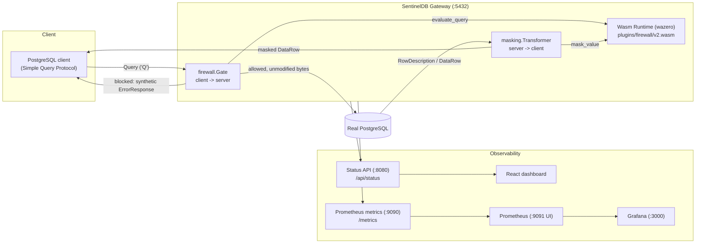

# SentinelDB

A PostgreSQL wire-protocol gateway that sits between your clients and PostgreSQL to enforce a query firewall and mask PII in query results, using sandboxed WebAssembly for the decision/masking logic.

## The problem SentinelDB solves

Applications and analysts often connect straight to a production PostgreSQL instance with no independent layer that can (a) block obviously dangerous statements before they reach the database and (b) prevent raw PII (like email addresses) from leaving the database in query results, without modifying the application or the database itself. SentinelDB is a transparent TCP proxy that a client connects to instead of PostgreSQL directly: it inspects each Simple Query Protocol message against a configurable blocklist, forwards allowed queries unchanged, and rewrites specific columns in the returned rows (e.g. `email`) before they reach the client — all while exposing what it's doing via Prometheus metrics and a small status API/dashboard.

## Architecture



## Current V1 capabilities

- Transparent TCP proxy for the PostgreSQL **Simple Query Protocol** (single `'Q'` message).
- Query firewall: blocks queries containing configured phrases (case/space-insensitive), evaluated inside a sandboxed Wasm plugin.
- Response PII masking: masks configured columns (currently `email`) by exact, case-insensitive column-name match against `RowDescription` — no regex, no schema discovery, no AI-based classification.
- Fail-closed on any parse/protocol/plugin error: the connection is closed with an explanatory error rather than silently passing through unvalidated or unmasked data.
- Prometheus metrics for connections, blocked queries, masked cells, masking errors, and masking plugin duration.
- Read-only JSON status API consumed by a small React dashboard.
- Config-driven blocked phrases and masked columns (`config.yaml`), with listen/upstream/API/metrics addresses overridable via environment variables for containerized deployment.

## V1 limitations (be aware of these before using this anywhere real)

- **Simple Query Protocol only.** The Extended Query Protocol (Parse/Bind/Describe/Execute/Close/Flush/Sync) is explicitly **rejected**, not supported — clients/drivers that default to it (e.g. `pgx`, `psycopg`'s prepared-statement mode) must be configured to use simple-protocol execution, or they will get a `FATAL` error.
- **No TLS.** `SSLRequest`/`GSSENCRequest` are rejected (`'N'`) so traffic always stays plaintext and inspectable by the gateway. This means SentinelDB is a **plaintext development-mode tool as shipped** — do not expose it to an untrusted network without adding your own TLS termination in front of it.
- **No COPY protocol support.** `COPY` streams are not parsed or masked; connections attempting COPY fail closed.
- **UTF-8 is assumed.** Masking logic operates on `[]rune`; other encodings are not validated or supported.
- **Experimental — not production-ready.** This is a V1 MVP: it has not had a security audit, has not been load-tested, and has no high-availability story. Treat it as a prototype/demo, not a compliance control.
- No automatic PII/data classification: you must explicitly list which columns to mask.
- No claim of GDPR/KVKK or any other regulatory compliance. Masking one column type (email) is not a compliance program.

## Quick start (Docker Compose)

Prerequisites: Docker Desktop (or Docker Engine + Compose v2).

```powershell
docker compose up -d --build
```

This starts five services: `postgres`, `sentineldb`, `prometheus`, `grafana`, `dashboard`. Wait for `sentineldb` and `postgres` to report healthy:

```powershell
docker compose ps
```

## Reproducible masking demo

The scripted version of this (recommended) is [scripts/e2e-demo.ps1](scripts/e2e-demo.ps1):

```powershell
pwsh scripts/e2e-demo.ps1          # leaves the stack running afterwards
pwsh scripts/e2e-demo.ps1 -Cleanup # stops the stack (docker compose down) when done
```

It creates a one-row demo table, then runs the **same** `SELECT` (via `psql -c`, which uses libpq's `PQexec` — i.e. genuinely the Simple Query Protocol) against both the real database and the gateway, and asserts:

- direct PostgreSQL (host port `5433`) returns `john@example.com`
- SentinelDB (host port `5432`) returns `jo****@example.com`

The exact manual commands it automates, if you want to run them by hand:

```powershell
# 1. one-row demo table, straight into the real database
docker compose exec -T postgres psql -U sentineldb_demo -d sentineldb_demo `
  -c "CREATE TABLE e2e_demo_users (id serial primary key, email text); INSERT INTO e2e_demo_users (email) VALUES ('john@example.com');"

# 2. direct query, bypassing SentinelDB (host port 5433)
docker run --rm -e PGPASSWORD=demo_only_change_me postgres:16-alpine `
  psql -h host.docker.internal -p 5433 -U sentineldb_demo -d sentineldb_demo -c "SELECT email FROM e2e_demo_users;"
# -> john@example.com

# 3. same query, through SentinelDB (host port 5432)
docker run --rm -e PGPASSWORD=demo_only_change_me postgres:16-alpine `
  psql -h host.docker.internal -p 5432 -U sentineldb_demo -d sentineldb_demo -c "SELECT email FROM e2e_demo_users;"
# -> jo****@example.com
```

## Service and port table

| Service | Container port | Host port | Purpose |
|---|---|---|---|
| `postgres` | 5432 | **5433** | Direct access to the real database (demo/verification only) |
| `sentineldb` | 5432 | **5432** | PostgreSQL gateway (Simple Query Protocol) |
| `sentineldb` | 8080 | **8080** | Read-only status API (`/api/status`) |
| `sentineldb` | 9090 | **9090** | Prometheus metrics (`/metrics`) |
| `prometheus` | 9090 | **9091** | Prometheus UI (shifted so it doesn't clash with the gateway's own 9090) |
| `grafana` | 3000 | **3000** | Grafana UI |
| `dashboard` | 8080 | **5173** | React monitoring dashboard |

All credentials in `docker-compose.yml` (PostgreSQL: `sentineldb_demo` / `demo_only_change_me`; Grafana: `admin` / `admin_demo_only`) are **demo-only**. Do not reuse them anywhere real.

## Configuration

SentinelDB reads `config.yaml` at startup (see the file itself for inline documentation of every field):

```yaml
firewall:
  blocked_phrases: ["DROP TABLE", "DROP DATABASE", "DELETE FROM", "TRUNCATE"]
wasm:
  plugin_path: "plugins/firewall/v2.wasm"
logging:
  log_full_queries: false   # dev-only; logs full SQL text when true
masking:
  enabled: true
  columns: ["email"]
```

In Docker Compose, `config.yaml` and `plugins/firewall/v2.wasm` are bind-mounted read-only into the `sentineldb` container so you can iterate on policy/masking without rebuilding the image.

Network addresses default to local (non-Docker) values and can be overridden with environment variables — this is how Compose points the gateway at PostgreSQL by service name instead of `localhost`:

| Env var | Default | Compose value |
|---|---|---|
| `SENTINELDB_LISTEN_ADDR` | `localhost:5432` | `0.0.0.0:5432` |
| `SENTINELDB_TARGET_ADDR` | `localhost:5433` | `postgres:5432` |
| `SENTINELDB_METRICS_ADDR` | `:9090` | `:9090` |
| `SENTINELDB_API_ADDR` | `:8080` | `:8080` |

## Metrics

Exposed on `/metrics` (Prometheus text format):

- `sentineldb_connections_total` — total accepted TCP connections
- `sentineldb_blocked_queries_total` — queries blocked by the firewall policy
- `sentineldb_masked_cells_total` — DataRow cells whose value was changed by masking
- `sentineldb_masking_errors_total` — connections closed fail-closed due to a masking/protocol error
- `sentineldb_masking_plugin_duration_seconds` — histogram of a single `mask_value` Wasm call's duration

The same values (plus the active firewall rule list) are available as JSON from `GET /api/status`.

## Opening the dashboards

- **React dashboard**: http://localhost:5173 (or run `npm run dev` in `dashboard/` for local development, see below)
- **Prometheus**: http://localhost:9091 — check **Status > Targets**, the `sentineldb` job should show as `UP`
- **Grafana**: http://localhost:3000 (`admin` / `admin_demo_only`) — the **Prometheus** datasource and **SentinelDB Overview** dashboard are provisioned automatically, no manual setup needed

## Running Go tests

```powershell
gofmt -l .
go build ./...
go vet ./...
go test ./...
```

(`go test -race` requires a cgo-capable toolchain; if `CGO_ENABLED=0` or no C compiler is installed, that flag will fail with a cgo error unrelated to test correctness.)

## Rebuilding the Wasm plugin

The firewall/masking logic in `plugins/firewall` is compiled to `plugins/firewall/v2.wasm` and checked into git. After changing anything under `plugins/firewall/`, rebuild it:

```powershell
pwsh scripts/build-wasm-plugins.ps1
```

## Repository structure

```
cmd/gateway/          gateway binary entrypoint (main.go)
internal/
  api/                 read-only JSON status API + CORS
  config/              config.yaml loader
  firewall/             client -> server Gate (policy enforcement)
  masking/             server -> client Transformer (PII masking)
  metrics/             Prometheus metric definitions + Snapshot
  protocol/            PostgreSQL wire-protocol decoder/encoder
  sqlmatch/            blocked-phrase matching helpers
  wasm/                wazero-hosted runtime, Policy, Masker
  wasmproto/           shared host<->guest JSON envelope
plugins/firewall/      Wasm guest source + compiled v2.wasm
dashboard/             React (Vite) monitoring dashboard
deploy/
  prometheus/          prometheus.yml (scrape config)
  grafana/             datasource + dashboard provisioning
scripts/               PowerShell helper scripts (build wasm, E2E demo)
config.yaml             gateway runtime configuration
Dockerfile              gateway production image
docker-compose.yml     postgres + sentineldb + prometheus + grafana + dashboard
```

## Security warning

SentinelDB V1 is an **experimental prototype**. It has not undergone a third-party security review. It does not encrypt traffic, has a narrow (Simple Query Protocol-only) attack surface by rejecting everything else, and its masking is a literal exact-column-name rule, not data discovery. Do not point it at a production database or treat it as a substitute for database-level access controls, encryption at rest/in transit, or a compliance program.

## Roadmap

- Extended Query Protocol support (Parse/Bind/Describe/Execute) with correct error/resync semantics
- TLS termination between client and gateway
- Additional masking types beyond email (phone numbers, national IDs, free-text redaction)
- COPY protocol support
- Performance benchmarking
- CI/CD pipeline and containerized/orchestrated deployment (Kubernetes) — none of this exists yet

## License status

No `LICENSE` file is currently present in this repository. Until one is added, the code is **not licensed for reuse** by default (all rights reserved). Add a `LICENSE` file before treating this as open source.
