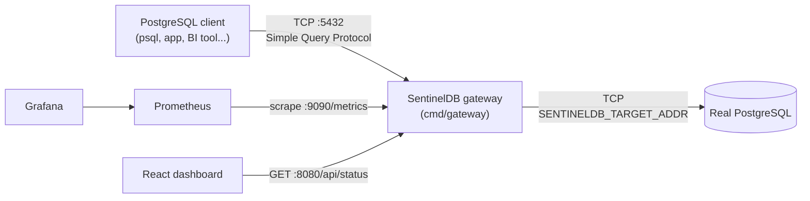
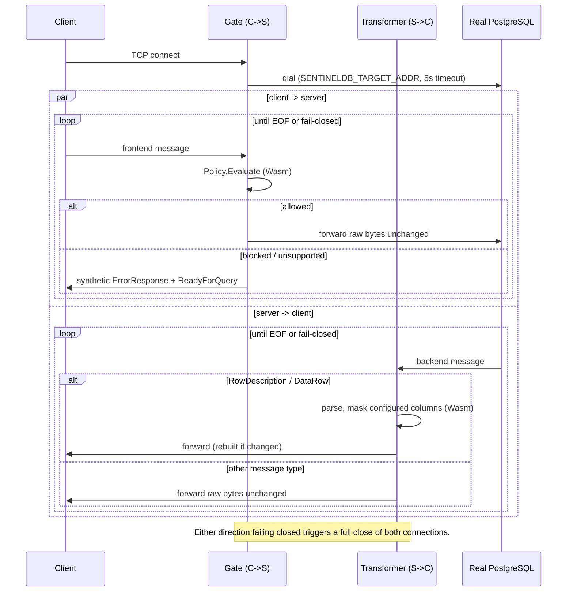
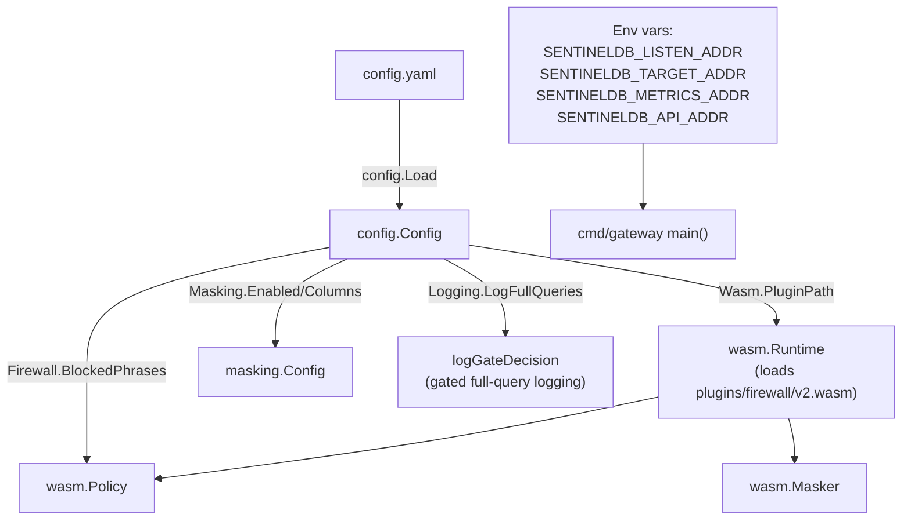
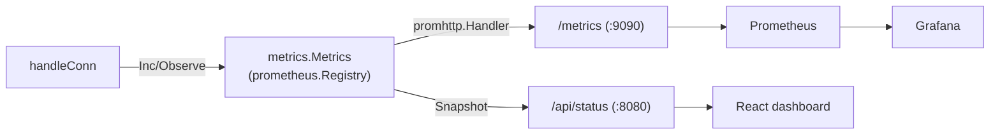

# Architecture

This document describes how SentinelDB is put together: the system
context, each component's responsibility, how a request/response flows
through the gateway, and where the fail-closed boundaries are. For exact
wire-protocol details see [postgresql-protocol.md](postgresql-protocol.md);
for the Wasm plugin contract see [plugin-api.md](plugin-api.md).

## System context

SentinelDB is a single Go binary (`cmd/gateway`) that sits between a
PostgreSQL client and a real PostgreSQL server. The client is configured
to connect to SentinelDB's listen address instead of PostgreSQL
directly; SentinelDB then dials the real PostgreSQL server itself.

Everything else in the repository (Prometheus, Grafana, the React
dashboard, the demo Postgres instance) is observability/demo tooling
around this one proxy process; none of it is required for the gateway
itself to run.

## Component responsibilities

| Package | Responsibility |
|---|---|
| `cmd/gateway` | Process entrypoint: loads config, wires everything together, accepts TCP connections, dispatches each connection to the default Simple Query path or (opt-in, `protocol.extended_query_enabled: true`) the Extended Query path, runs the metrics/API HTTP servers, handles graceful shutdown. |
| `internal/protocol` | Stateful PostgreSQL wire-protocol decoder (`Decoder`), message type tables, `RowDescription`/`DataRow` parsing and rebuilding, synthetic message builders (`ErrorResponse`, `ReadyForQuery`), the per-connection `TxState`, `SerializedWriter` for safe concurrent writes to one client connection, and (opt-in Extended Query path) `State`/`ResponseSequencer`/`BackendCorrelator`. |
| `internal/firewall` | `Gate`: the active client→server router. Applies a `Policy` to each frontend message, enforces V1 protocol scope (rejects TLS negotiation; rejects the Extended Query Protocol unless opted in), and writes synthetic `ErrorResponse`/`ReadyForQuery` for blocked queries. `Gate.RunExtended`/`ExtendedFrontend` are the opt-in Extended Query steady-state frontend. |
| `internal/masking` | `Transformer`: the active server→client router. Tracks the current result set's column layout from `RowDescription`, masks configured columns in `DataRow` via a `Masker`, and forwards everything else unchanged. |
| `internal/wasm` | Host-side runtime (`Runtime`, via [wazero](https://github.com/tetratelabs/wazero)) that loads and calls the single compiled Wasm plugin; `Policy` and `Masker` adapters that implement the `firewall.Policy` / `masking.Masker` interfaces on top of it. |
| `internal/wasmproto` | The versioned JSON request/response envelope shared by the host (`internal/wasm`) and the guest plugin (`plugins/firewall`) — the only dependency-free contract between them. |
| `plugins/firewall` | The Wasm guest module itself (compiled to `plugins/firewall/v2.wasm`, `GOOS=wasip1 GOARCH=wasm`): implements `evaluate_query` (blocked-phrase matching via `internal/sqlmatch`) and `mask_value` (email masking). |
| `internal/sqlmatch` | Pure text-matching helper shared by the native fallback policy and the Wasm plugin, so "blocked phrase" logic is defined once. |
| `internal/config` | Loads and validates `config.yaml`. |
| `internal/metrics` | Prometheus metric definitions and a `Snapshot()` helper used by both `/metrics` and `/api/status`. |
| `internal/api` | The read-only `/api/status` JSON handler (plus permissive CORS, since the payload contains no secrets) consumed by the dashboard. |
| `dashboard/` | Small Vite/React app that polls `/api/status` and renders live counters and the active firewall rule list. |

## Connection lifecycle

Each accepted TCP connection is handled by its own `handleConn`
goroutine in `cmd/gateway/main.go`:

Both directions run concurrently as independent goroutines
(`gate.Run` and `transformer.Run`) sharing one `*protocol.TxState` so
that a query blocked mid-transaction gets a synthetic `ReadyForQuery`
with the *correct* transaction status byte, not a hardcoded `'I'` (idle).
All writes back to the client — real backend bytes, masked `DataRow`s,
and synthetic firewall responses alike — go through one
`protocol.SerializedWriter` per connection so the two directions can
never interleave partial PostgreSQL messages on the wire.

On shutdown (`SIGINT`/`SIGTERM`), the listener stops accepting new
connections, all tracked client/upstream `net.Conn`s are force-closed
(unblocking any in-flight `Read`), and the metrics/API HTTP servers are
given a 5-second grace period to shut down cleanly.

## Configuration flow

`config.yaml` is read once at startup (`config.Load`, `cmd/gateway/main.go`);
there is no hot-reload. Network addresses are the one exception, sourced
from environment variables with local (non-Docker) defaults — this is
how Docker Compose points the gateway at `postgres:5432` and makes it
listen on `0.0.0.0:5432` inside the container without changing any code.
`masking.enabled=true` with an empty `masking.columns` list is rejected
at load time (`MaskingConfig.validate`) rather than silently masking
nothing.

## Observability flow

Both `/metrics` (Prometheus text format, for Prometheus/Grafana) and
`/api/status` (JSON, for the dashboard) are read from the *same*
underlying `prometheus.Registry` via `Metrics.Snapshot()` — there are not
two independently-tracked counters that could drift apart.

Logging is deliberately restrictive by default: `logGateDecision` and
`logMessage` (`cmd/gateway/main.go`) never log `DataRow` contents or
cell values, and only log full SQL query text when
`logging.log_full_queries: true` is explicitly set in `config.yaml` (off
by default, intended for local debugging only). Errors from the Wasm
runtime also never include the plugin's raw stdout/stderr, the request
query, or cell values — only operation name, byte counts, and
timeout/cancellation state.

## Fail-closed boundaries

SentinelDB's guiding rule is: **when in doubt, close the connection with
an explanatory error rather than forward data that hasn't been
evaluated or masked.** The fail-closed points are:

| Component | Trigger | Behavior |
|---|---|---|
| `protocol.Decoder` | Malformed/oversized message length | Enters `phasePassthrough` and calls `onError`; does **not** silently keep parsing or forwarding without inspection. |
| `firewall.Gate` | `SSLRequest`/`GSSENCRequest` | Responds `'N'` directly, never forwarded to the real server (keeps traffic plaintext and inspectable — see [threat-model.md](threat-model.md)). |
| `firewall.Gate` | Extended Query Protocol message (Parse/Bind/Describe/Execute/Close/Flush/Sync) when `protocol.extended_query_enabled` is `false` (default) | Rejected with `ErrorResponse` (`0A000`) and the connection is closed (`ErrUnsupportedProtocol`) rather than passed through unchecked. |
| `firewall.ExtendedFrontend` | Simple Query (`'Q'`), COPY, or any other non-Extended-Query message on an opt-in Extended Query connection | Rejected fail-closed — an opt-in connection is Extended-Query-only for its whole lifetime, no mixed-protocol fallback. |
| `gateway.RunStartupHandoff` / `gateway.ExtendedRuntime` | Malformed startup/auth frame, unsupported authentication code, malformed steady-state frame, backend protocol violation, or masking failure (opt-in path) | Connection closed fail-closed with a fixed, safe error category — never a raw auth/SQL/Bind/DataRow/server-field value. |
| `firewall.Gate` | Decoder parse failure | `ErrorResponse` (`08P01`) + close (`ErrDecodeFailed`), instead of falling back to raw passthrough. |
| `wasm.Runtime` | Plugin timeout (2s default), invalid/unexpected JSON, wrong protocol version, unknown op, `error` field set | Call fails; `wasm.Policy` fail-closes to `Block`, `wasm.Masker`/`masking.Transformer` fail-closes the connection. |
| `wasm.Runtime.Mask` | Response missing `value`/`changed`, invalid UTF-8, oversized value (>64 KiB), or `changed`/`value` inconsistent with the input | Rejected before it ever reaches the client. |
| `masking.Transformer` | Binary-format (`FormatCode != 0`) column configured for masking | Fail-closed rather than mask binary data as if it were text. |
| `masking.Transformer` | `COPY` protocol messages (`CopyInResponse`/`CopyOutResponse`/`CopyBothResponse`) | Fail-closed; COPY streams are not parsed or masked in V1. |
| `masking.Transformer` | `DataRow` field count mismatch vs. the last `RowDescription` | Fail-closed rather than mask cells against a stale/wrong schema. |

In every fail-closed case the client receives a real PostgreSQL
`ErrorResponse` (so `libpq`-based clients handle it as a normal error,
not a dropped connection) before the socket is closed.
