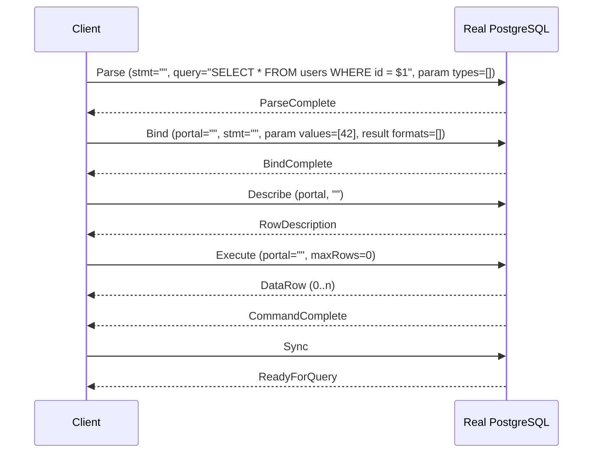
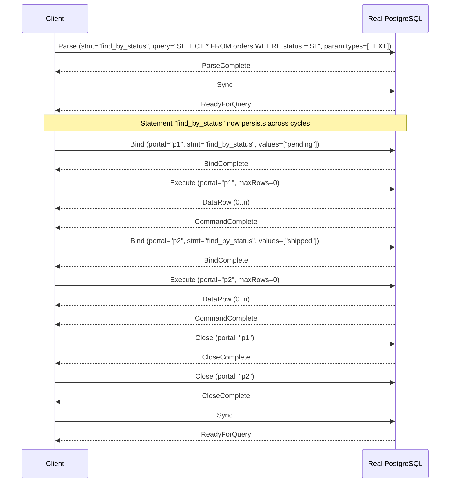
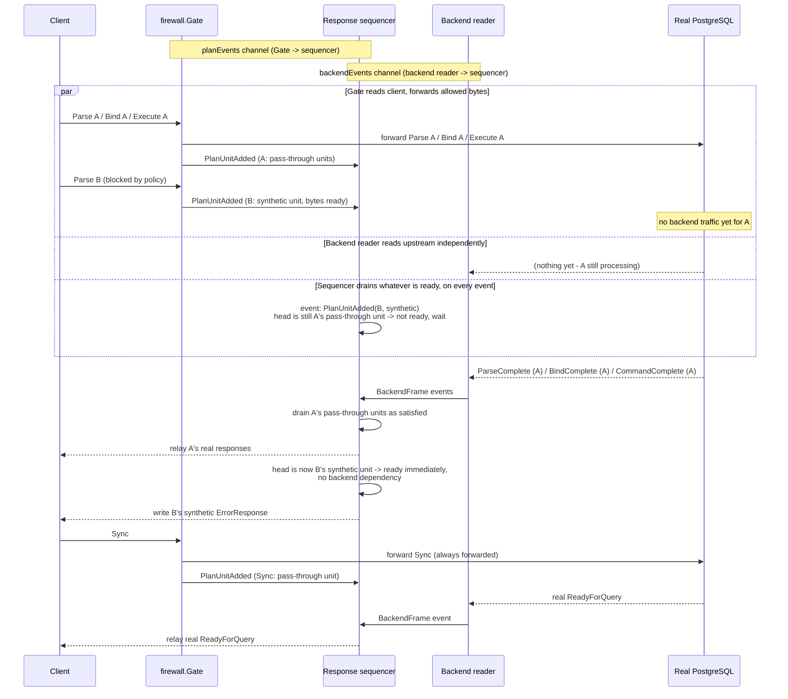
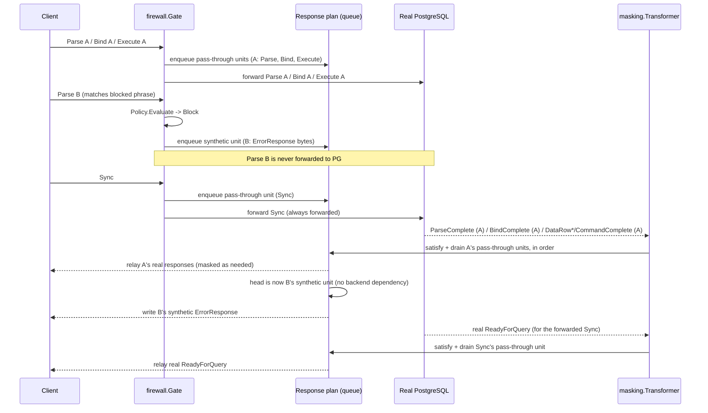

# Extended Query Protocol Support

## Status

**Draft.** This revision corrects four **implementation-blocking state and
concurrency gaps** found during a **third** review pass, on top of
corrections from the first review pass (prepared-statement `Close`
cascading to portals, portal transaction-scoping, `Execute` response
shape, mixed Simple/Extended Query state invalidation, client-response
ordering, upstream-`ErrorResponse` cleanup, and duplicate-name registry
safety) and the second review pass (corrected transaction-end detection,
real-error precedence over synthetic errors, explicit cycle IDs, and
no-response/asynchronous message handling). The four third-pass
corrections: (1) the passive "reuse `masking.Transformer`'s backend loop
as the drain path" design was replaced with an explicit **event-driven
response sequencer**, because a loop that only wakes on backend traffic
can never notice a synthetic unit enqueued while the backend socket is
idle (the blocked-first case); (2) the client-facing discard-until-`Sync`
transition was corrected to begin the instant a block/rejection decision
is accepted and its synthetic unit is *submitted*, not when that unit's
bytes are eventually *written* — the two can now be arbitrarily far apart
in time once a sequencer/queue sits between them; (3) the object-
generation model's "failed generation leaves the old one untouched" rule
was corrected to apply to **named** objects only — PostgreSQL destroys the
previous **unnamed** statement/portal early, as a side effect of merely
*processing* a new unnamed `Parse`/`Bind`, regardless of whether that new
one succeeds, so a failed unnamed replacement must **not** restore the old
one; and (4) Simple Query's invalidation of the unnamed statement/portal
was moved from "at that query's real `ReadyForQuery`" to "atomically,
immediately before forwarding the `Query` bytes," since the real server
destroys its own unnamed objects at the same early point, and waiting for
`ReadyForQuery` is too late for a client that pipelines further Extended
Query messages without waiting for it. Each correction is marked inline
where it applies. **Still not approved for implementation.**

**Stage 8 update: an opt-in LIVE implementation now exists in
`cmd/gateway`.** `internal/protocol` (parsing, connection-state model,
correlation, response sequencer), `internal/gateway.ExtendedRuntime`
(event-driven runtime, including upstream forwarding via
`RegisterAndForwardFrontendOperation`/`ForwardFlush`/`ForwardTerminate`),
`firewall.Gate.RunExtended`/`firewall.ExtendedFrontend` (Parse-time policy
evaluation, local rejection, discard-until-`Sync`), and opt-in Extended
Query **response masking** inside `ExtendedRuntime`
(`internal/masking.ExtendedTracker`,
`gateway.NewExtendedRuntimeWithMasking`) are now wired into the live
connection path by `cmd/gateway/main.go`'s `runExtendedConnection`, gated
behind a new, explicit, **default-false** configuration flag,
`protocol.extended_query_enabled` (`config.yaml`,
`internal/config.ProtocolConfig`). A new
`internal/gateway.RunStartupHandoff` owns the plaintext startup/
authentication phase for opt-in connections (SSLRequest/GSSENCRequest
rejection, CancelRequest, the full authentication sub-protocol, relay of
backend startup messages up to and including the first real
`ReadyForQuery`) before handing exclusive transport ownership to
`ExtendedRuntime`/`ExtendedFrontend` — see `docs/postgresql-protocol.md`'s
"Opt-in Extended Query frontend bridge", "Opt-in Extended Query response
masking", and "Opt-in Extended Query gateway wiring" sections for the
precise, current, live behavior.

**When the flag is false (the default), nothing changes.**
`runSimpleConnection` is the same `firewall.Gate.Run`/
`masking.Transformer.Run` path as before this stage, byte-for-byte and
log-for-log identical to the pre-stage-8 `handleConn`: every Extended
Query Protocol frontend message
(`Parse`/`Bind`/`Describe`/`Execute`/`Close`/`Flush`/`Sync`) is still
rejected with a `FATAL` `ErrorResponse` and the connection is closed
(`internal/firewall/gate.go`'s `rejectExtendedProtocol`,
`ErrUnsupportedProtocol`).

**What remains unimplemented even with the flag enabled:** mixed Simple/
Extended Query routing on one connection (an opt-in connection is
Extended-only for its entire lifetime — Simple Query's `'Q'` is rejected
by `ExtendedFrontend` exactly like every other unsupported message), TLS,
`COPY`, and a real driver compatibility test stage (planned as separate,
later work). See `docs/design/0001-extended-query-review-checklist.md`
and this document's [Non-goals](#non-goals) for the full list still
outstanding.

## Context

**What SentinelDB supports today.** SentinelDB is a PostgreSQL wire-protocol
gateway that parses and evaluates exactly one query-execution path: the
Simple Query Protocol's single `Query` (`'Q'`) frontend message
(`internal/protocol/decoder.go`, `internal/firewall/gate.go`). Every other
frontend message that could carry or execute SQL — `Parse`, `Bind`,
`Describe`, `Execute`, `Close`, `Flush`, `Sync` — is recognized only well
enough to be rejected outright
(`internal/firewall/gate.go:213`, `isExtendedProtocolMessage`), because
letting any of them through unevaluated would bypass the firewall policy
entirely (see `docs/postgresql-protocol.md`'s "Rejected frontend messages:
Extended Query Protocol" section, and `docs/threat-model.md`'s "Unprotected
paths").

**Why rejecting Extended Query limits compatibility.** Nearly every modern
PostgreSQL driver and ORM defaults to the Extended Query Protocol for
parameterized queries, because it is the only wire-level mechanism that
supports typed, positional bind parameters without client-side SQL string
interpolation. `pgx` (Go), `psycopg` (Python, prepared-statement mode),
`node-postgres`'s parameterized `query()` calls, JDBC's `PreparedStatement`,
and Npgsql (.NET) all use `Parse`/`Bind`/`Execute` for any query with `$1`,
`$2`, ... placeholders. A gateway that hard-rejects this leaves only
drivers/usages that are explicitly configured for simple-protocol
execution — a real, currently-documented compatibility gap
(`README.md`'s "V1 limitations", `docs/postgresql-protocol.md`'s "Practical
impact").

**Why this affects protocol state, policy evaluation, and masking — not
just "a few new message tags."** The Simple Query Protocol is stateless
across messages: one `Query` message is a complete, self-contained request
containing its own SQL text, and the response (`RowDescription` + zero or
more `DataRow` + `CommandComplete` + `ReadyForQuery`) is fully determined by
that one message. Everything SentinelDB does today — `firewall.Gate`'s
per-message `Policy.Evaluate` call, `masking.Transformer`'s per-result-set
`RowDescription`/`DataRow` tracking — assumes this one-message-in,
one-response-out shape.

Extended Query breaks that assumption in three separate ways that compound:

1. **SQL text and execution are different messages, separated in time and
   potentially by other, unrelated messages.** `Parse` carries SQL text but
   does not execute anything; `Execute` executes but carries no SQL text at
   all — only a portal name. A gateway that evaluates policy per-message
   the way `firewall.Gate.handle` does today would either have nothing to
   evaluate (`Execute`) or would need to remember a decision made
   message(s) earlier and apply it to a later, textually-unrelated message
   (`Execute`) referencing state (a portal) that itself refers to other
   state (a prepared statement) that may have been created in a *previous*
   Sync cycle, or even a previous logical "request" the driver considers
   done.
2. **State outlives a single request/response cycle and is named,
   reusable, and replaceable.** Prepared statements and portals are
   explicit, named (or unnamed-and-implicitly-replaced) server-side
   objects that persist until explicitly closed, replaced, or the
   connection ends. SentinelDB must track this state per connection for as
   long as the client does, not just for the duration of one message
   exchange — a fundamentally different lifetime model than anything
   `internal/protocol`, `internal/firewall`, or `internal/masking` handles
   today.
3. **Error recovery is a multi-message protocol contract, not a
   single-message fail-closed response.** Today, when `firewall.Gate`
   blocks a `Query`, it writes one synthetic `ErrorResponse` +
   `ReadyForQuery` pair and the cycle is over — the *next* message the
   client sends is a fresh, independent `Query`. In Extended Query, if
   SentinelDB blocks a `Parse` locally (never forwarding it to the real
   server), the client is protocol-entitled to keep sending `Bind`,
   `Describe`, `Execute`, and more, *without waiting for a response to
   each*, until it sends `Sync` — exactly mirroring what a real PostgreSQL
   backend does after any error mid-cycle (see
   [Local rejection state machine](#local-rejection-state-machine)).
   SentinelDB must reproduce this exact recovery contract while never
   letting the *real* upstream PostgreSQL connection see messages
   referencing objects (a blocked `Parse`'s statement, a `Bind` built on
   it) it was never told about.

None of this is addressed by recognizing seven more message tags — it
requires a per-connection state machine, a policy-evaluation timing
decision, and a masking-metadata correlation strategy that do not exist in
the codebase today.

## Goals

- Support normal Extended Query flows (`Parse`/`Bind`/`Describe`/`Execute`/
  `Close`/`Flush`/`Sync`) without weakening SentinelDB's existing
  fail-closed behavior in any dimension already covered for Simple Query.
- Preserve existing Simple Query behavior exactly as documented today —
  this is strictly additive.
- Inspect the SQL text carried by `Parse` messages against the same
  firewall policy (native or Wasm) that `Query` messages already go
  through, so Extended Query cannot be used to bypass the firewall.
- Track prepared statements and portals per connection, correctly modeling
  named vs. unnamed lifetime and replacement semantics.
- Preserve PostgreSQL-compatible error and transaction semantics,
  specifically the "discard until `Sync`" recovery contract and accurate
  `ReadyForQuery` transaction-status reporting.
- Support result masking (`masking.Transformer`) safely across the
  Extended Query flow, including cases where result format (text/binary)
  is decided by `Bind` rather than being implicit as it is in Simple Query.
- Provide an implementation plan decomposed into small, independently
  reviewable, individually buildable/testable PRs (see
  [Implementation decomposition](#implementation-decomposition)) rather
  than one large change.

## Non-goals

Explicitly out of scope for this design and the milestone it recommends:

- TLS termination.
- `COPY` protocol support (Extended Query's interaction with `COPY` is
  analyzed only to confirm the existing rejection boundary holds — see
  [COPY behavior](#copy-behavior) — no COPY implementation is proposed).
- A real SQL AST parser or SQL-aware semantic analysis. Policy evaluation
  remains `internal/sqlmatch`-based substring matching, exactly as
  documented as a limitation today (`docs/threat-model.md`'s "Known bypass
  limitations").
- Catalog-backed column lineage (resolving `SELECT expr AS alias` back to
  a real source column) — the existing alias-based masking limitation is
  unchanged by this design (see [Response masking implications](#response-masking-implications)).
- Any redesign of the Wasm host/guest ABI (`internal/wasmproto`) beyond
  what is strictly required to pass a policy decision through the
  existing `evaluate_query` operation; no new Wasm operations, no protocol
  version bump, are proposed here.
- Wasm module instance pooling (already flagged as a *performance*
  recommendation in `docs/audit-v0.1.md`'s V2 recommendations —
  independent of this design and not required by it).
- Zero-copy rewrites of `internal/protocol` parsing/rebuilding.
- Authentication redesign, RBAC, or any authorization model beyond what
  the real PostgreSQL server already enforces.
- Kubernetes or any orchestrated-deployment work.
- Any claim that SentinelDB becomes production-ready as a result of this
  work. Extended Query support, once implemented, remains subject to the
  same "experimental, not a production security boundary" status as
  everything else (`SECURITY.md`, `docs/threat-model.md`).

## Existing SentinelDB architecture

This section describes **only what exists in the codebase today** — no
planned behavior is described here as current.

- **Frontend messages are decoded** by `internal/protocol.Decoder`, one
  instance per direction per connection (`NewClientDecoder`,
  `NewServerDecoder` in `internal/protocol/decoder.go`). The client-side
  decoder starts in `phaseStartup` (expects `StartupMessage`/`SSLRequest`/
  `GSSENCRequest`/`CancelRequest`), then moves to `phaseNormal`
  (tag+length framing for every subsequent message). `Decoder.Write` is
  fed directly by `firewall.Gate.Run`'s and `masking.Transformer.Run`'s own
  read loops (`internal/firewall/gate.go:110-127`,
  `internal/masking/transformer.go:92-109`) — there is no separate
  passthrough/observer component in the current design.
- **Policy decisions occur** in `firewall.Gate.handle`
  (`internal/firewall/gate.go:146-207`), called once per fully-decoded
  frontend message. Today, the *only* message type that reaches
  `Policy.Evaluate` is `Query` (`'Q'`); every other frontend message
  either bypasses policy evaluation entirely and is forwarded unchanged
  (e.g. `Terminate`, `PasswordMessage`), is handled specially without
  evaluation (`SSLRequest`/`GSSENCRequest`, answered `'N'` directly), or is
  outright rejected without evaluation
  (`isExtendedProtocolMessage`/`rejectExtendedProtocol`,
  `internal/firewall/gate.go:176-178, 209-233`).
- **Backend responses are transformed** by `masking.Transformer.handle`
  (`internal/masking/transformer.go:111-141`), called once per fully
  decoded backend message from the real PostgreSQL server. It tracks
  exactly one active result set's column layout at a time
  (`t.fields`/`t.maskColIdx`, cleared on `CommandComplete`,
  `ErrorResponse`, or `ReadyForQuery` via `clearResultSet`,
  `internal/masking/transformer.go:239-242`) — there is no notion today of
  multiple concurrently-open, independently-addressable result sets
  (portals), because Simple Query never has more than one pending result
  set at a time.
- **Transaction state is tracked** by a single shared
  `*protocol.TxState` per connection (`internal/protocol/txstate.go`),
  constructed once in `cmd/gateway/main.go:handleConn` (line ~292) and
  passed to both `firewall.Gate` (`gate.SetTxState`, read via
  `readyForQueryStatus`, `internal/firewall/gate.go:98-103`) and
  `masking.Transformer` (constructor parameter, updated on every real
  backend `ReadyForQuery`, `internal/masking/transformer.go:132-135`).
  This is direction-agnostic infrastructure and needs no structural change
  for Extended Query — only more call sites feeding it (see
  [Local rejection state machine](#local-rejection-state-machine)).
- **Serialized client writes are enforced** by a single
  `*protocol.SerializedWriter` per connection
  (`internal/protocol/writer.go`), constructed once in `handleConn` (line
  ~286) and used as the sole write path to the client by both `Gate`
  (synthetic `ErrorResponse`/`ReadyForQuery`, the `'N'` SSL-rejection byte)
  and `Transformer` (forwarded/masked backend bytes). Any Extended Query
  work that needs to write synthetic messages to the client (a blocked
  `Parse`'s `ErrorResponse`, for example) must go through this same
  `clientWriter` — no new writer should be introduced.
- **Unsupported Extended Query messages are currently rejected** as
  follows: `Gate.handle` checks `isExtendedProtocolMessage(m.Type)` for
  every frontend message; if true (`Parse`/`Bind`/`Describe`/`Execute`/
  `Close`/`Flush`/`Sync`), `rejectExtendedProtocol` writes a single
  `ErrorResponse` (SQLSTATE `0A000`, "feature not supported") to the
  client via `g.respond` and sets `g.err = ErrUnsupportedProtocol`
  (`internal/firewall/gate.go:223-233`). `Gate.Run` then returns that
  error; `cmd/gateway/main.go:handleConn`'s goroutine sees
  `firewall.IsFailClosed(runErr)` is true and force-closes the upstream
  `target` connection immediately (rather than waiting for a half-close to
  be noticed), which in turn unblocks `masking.Transformer.Run`'s blocked
  read on the other goroutine (`cmd/gateway/main.go:handleConn`, the two
  `go func()` blocks around lines 325-357 in the pre-audit numbering /
  equivalent block in current `main.go`). **No partial Extended Query
  message is ever forwarded to the real server today** — rejection always
  happens before the first byte of the offending message reaches
  `target`.

Also directly relevant:

- `internal/wasm.Runtime`/`internal/wasm.Policy`/`internal/wasm.Masker`
  wrap the single loaded `plugins/firewall/v2.wasm` module via the
  versioned `internal/wasmproto.Envelope`/`Result` JSON contract. Today,
  `wasm.Policy.Evaluate` is only ever called with `m.Query` from a `Query`
  message (`internal/wasm/policy.go:40-66`). Reusing this exact call path
  for `Parse`'s SQL text requires no Wasm-side change — `Parse`'s query
  string is just another string to hand to `evaluate_query` — but the
  *host*-side call site changes (see [Policy evaluation design](#policy-evaluation-design)).
- `docs/architecture.md`'s "Fail-closed boundaries" table and
  `docs/postgresql-protocol.md`'s "Rejected frontend messages: Extended
  Query Protocol" section are the current, accurate descriptions of
  today's rejection behavior and are the baseline this design must not
  regress.
- `docs/audit-v0.1.md` (the just-completed V0.1 internal audit) confirms
  the current rejection path has no known correctness or fail-open gaps;
  this design must preserve every invariant that audit confirmed for the
  paths that remain unchanged (Simple Query, SSL/GSS rejection, malformed
  message handling).

## PostgreSQL Extended Query model

This section restates the protocol model as documented in the official
PostgreSQL documentation
([Protocol Overview](https://www.postgresql.org/docs/current/protocol-overview.html),
[Protocol Flow](https://www.postgresql.org/docs/current/protocol-flow.html),
[Message Formats](https://www.postgresql.org/docs/current/protocol-message-formats.html)),
in plain technical language, as the shared reference point for the rest of
this document.

**Prepared statements.** A `Parse` message compiles a SQL string (which may
contain `$1`, `$2`, ... parameter placeholders) into a *prepared statement*
on the server, identified by a name supplied in the same message. Parsing
happens once; the resulting statement can be executed multiple times
(via different portals) with different parameter values, without
re-sending or re-parsing the SQL text.

**Portals.** A `Bind` message instantiates a prepared statement into a
*portal*: it supplies concrete parameter values (and format codes) for the
statement's placeholders and the desired result-column format codes,
producing a portal identified by its own (separate) name. A portal is
essentially "a prepared statement plus a specific set of parameter values,
ready to execute." `Execute` runs a named portal, optionally limited to a
maximum row count per call.

### Correcting portal lifetime semantics

**Named versus unnamed objects — and statements versus portals have
*different* lifetimes.** This is a distinction the first draft of this
document got wrong (conflating the two) and is corrected here:

- A **named prepared statement** persists until an explicit `Close`
  message or the end of the session — it is **not** affected by
  transaction boundaries. A client can `Parse` a named statement once and
  `Bind`/`Execute` it across many separate transactions later in the same
  session.
- A **named portal**, by contrast, persists only until an explicit `Close`
  message **or the end of the current transaction, whichever comes
  first** — portals are transaction-scoped. A portal bound inside a
  transaction does not survive that transaction ending (by `COMMIT`,
  `ROLLBACK`, or the implicit transaction `Sync` closes), whether or not
  it was ever explicitly `Close`d.
- An **unnamed portal** is additionally replaced by the next `Bind`
  message specifying the unnamed portal as destination (no `Close`
  needed), on top of the transaction-scoping above.
- An **unnamed statement** is replaced by the next `Parse` message
  specifying the unnamed statement as destination (no `Close` needed),
  and is *not* transaction-scoped (matching named statements in this one
  respect — only unnamed *portals* and named *portals* are
  transaction-scoped; no statement, named or unnamed, is).
- **A Simple Query (`'Q'`) message destroys both the unnamed prepared
  statement and the unnamed portal** as a side effect of the real server
  processing it — this is a *cross-protocol* interaction between Simple
  Query and Extended Query on the same connection, addressed in full in
  [Mixed Simple/Extended Query state handling](#mixed-simpleextended-query-state-handling)
  below, since the first draft of this document incorrectly claimed
  mixing the two protocols "requires no special handling."
- Issuing `Parse`/`Bind` with a name that is already in use as a *named*
  (not unnamed) object, without first `Close`-ing it, is a protocol error
  from the real server — see
  [Object generations: safely handling duplicate names](#object-generations-safely-handling-duplicate-names)
  for how SentinelDB's own tracking handles this without needing to
  pre-judge the outcome.

This lifetime asymmetry (statements: session-scoped, unaffected by
transactions; portals: transaction-scoped regardless of naming, plus
unnamed objects additionally replaced on demand) is a core piece of state
SentinelDB's own tracking must model correctly (see
[Proposed connection state](#proposed-connection-state)).

**How SentinelDB learns a transaction ended, from backend protocol
evidence — corrected in this revision.** SentinelDB has no direct
visibility into the real server's internal transaction manager — it can
only observe wire-protocol messages. The prior revision of this document
relied on a **transition** in the tracked transaction-status byte
(`'T'|'E' → 'I'`) as the sole detector of "a transaction just ended." **This
is insufficient and is corrected here: it misses the ordinary case of an
implicit Extended Query transaction that opens and closes entirely within
one `Sync`-delimited cycle.**

**Why a transition alone is not sufficient.** `ReadyForQuery` is only ever
sent in response to `Sync` (in Extended Query) — never mid-cycle. When a
client sends `Parse`/`Bind`/`Execute` with no explicit `BEGIN`, the real
server opens an *implicit* transaction for the duration of that cycle and
**closes it as part of processing `Sync` itself, before `Sync`'s
`ReadyForQuery` is emitted.** There is no earlier `ReadyForQuery` at which
a `'T'` status could have been observed for that implicit transaction —
the transaction was opened and closed entirely between two consecutive
`ReadyForQuery` messages, both of which report `'I'`. If the connection
was already idle (`'I'`) before this cycle began (the common case — no
transaction was left open from before), the observed status sequence is
**`I → I`**, not `T → I`. A detector that only fires on a `'T'|'E' → 'I'`
transition would **silently miss this case and never invalidate the
portals created during that implicit transaction** — a real, exploitable
correctness gap (a portal that should be transaction-scoped-and-gone would
incorrectly appear to survive in SentinelDB's registry).

**Corrected rule: trigger on the reported status value, not on a
transition.** Whenever a real `ReadyForQuery` reports status `'I'` (idle)
— **regardless of what the immediately preceding tracked status was** —
every currently-open portal registry entry (named and unnamed alike) is
invalidated. Conversely, whenever a real `ReadyForQuery` reports `'T'` (in
transaction) or `'E'` (failed transaction), **no invalidation occurs**: an
explicit transaction is still active (or still needs an explicit
`ROLLBACK`/`COMMIT` to end), and any portals bound since it began remain
valid. This is simpler than the transition-based rule it replaces — it
requires only the *current* `ReadyForQuery`'s status byte, not a
comparison against the previous one — and it correctly covers the `I → I`
case the transition-based rule missed, because the check is "is this
report `'I'`?", not "did this report change *to* `'I'`?". SentinelDB does
not need to parse `CommandComplete` tags (`"COMMIT"`/`"ROLLBACK"`) or
otherwise special-case *how* a transaction ended; the reported status
value alone is sufficient, protocol-generic evidence. Named prepared
statements are **never** affected by any `ReadyForQuery` status, regardless
of value — only portals are transaction-scoped.

**Consequence for the connection-state model:** because invalidation no
longer depends on tracking a *previous* status for comparison, there is no
need for a separate per-portal "transaction epoch" counter (as the prior
revision proposed) — every real `ReadyForQuery` reporting `'I'` simply
clears the entire portal registry outright, unconditionally, in one step
(see [Proposed connection state](#proposed-connection-state)).

**Concrete lifecycle scenarios this must cover** (see also the
[Test matrix](#test-matrix) for the corresponding test entries):

1. **Ordinary implicit Extended Query cycle (`I → I`).** Client sends
   `Parse`/`Bind`/`Execute`/`Sync` with no explicit `BEGIN`, starting from
   an already-idle connection. The real server opens and closes the
   implicit transaction entirely within this cycle; the `Sync`-triggered
   `ReadyForQuery` reports `'I'`, matching the `'I'` status already in
   effect beforehand. **This is the case the prior revision's
   transition-based rule missed** — the corrected rule still invalidates
   correctly here because it triggers on the reported value (`'I'`), not
   on a change.
2. **Entering an explicit transaction (`I → T`).** Client issues `BEGIN`
   (via either protocol) then further `Parse`/`Bind`/`Execute`/`Sync`
   within it. The `ReadyForQuery` following `BEGIN`'s cycle reports `'T'`
   — no invalidation; the transaction, and any portals bound so far, stay
   open.
3. **Remaining in an explicit transaction across multiple cycles
   (`T → T`).** Client pipelines further `Sync`-delimited cycles inside the
   same still-open explicit transaction. Each `ReadyForQuery` reports
   `'T'` — no invalidation on any of them; portals bound in earlier cycles
   of the same transaction remain valid for use in later cycles of that
   transaction.
4. **Ending an explicit transaction (`T → I`).** Client issues `COMMIT` or
   `ROLLBACK` to end the explicit transaction. The `ReadyForQuery`
   following its completion reports `'I'` — invalidation fires; every
   portal bound since the transaction began (across however many cycles)
   is invalidated at this single point.
5. **Remaining in a failed explicit transaction across multiple cycles
   (`E → E`).** A statement inside the transaction errors, putting the
   connection in `'E'` (failed) status; the client keeps sending further
   cycles (which the real server will itself reject until `ROLLBACK`, per
   [Clarifying real upstream ErrorResponse cleanup](#clarifying-real-upstream-errorresponse-cleanup)),
   each `ReadyForQuery` still reporting `'E'` — no invalidation while still
   `'E'`.
6. **Recovering from a failed transaction (`E → I`).** The client issues
   `ROLLBACK` (the only statement accepted in `'E'` status besides
   `COMMIT`/`ROLLBACK` themselves). The `ReadyForQuery` following its
   completion reports `'I'` — invalidation fires, exactly as for the
   `T → I` case; *cause* (commit vs. rollback vs. failure-recovery
   rollback) never changes what SentinelDB does — only the reported value
   matters.
7. **Portal invalidation fires on every `ReadyForQuery(I)`,
   unconditionally.** Scenarios 1, 4, and 6 above all invalidate, purely
   because the reported status is `'I'` — there is exactly one rule, not
   one rule per cause.
8. **Named prepared statements survive every `ReadyForQuery`, regardless
   of reported status.** Unlike portals, no scenario above ever
   invalidates a statement registry entry; statements are session-scoped,
   full stop.
9. **Portal references after transaction end.** Any
   `Bind`/`Describe`/`Execute`/`Close` referencing a portal name that was
   invalidated by a `ReadyForQuery(I)` must be treated exactly like a
   reference to a nonexistent object — fail closed (§
   [Failure and fail-closed invariants](#failure-and-fail-closed-invariants)),
   never silently resolved against stale cached shape/format metadata.

**Parse versus Bind versus Execute.** `Parse` is the *only* message that
carries SQL text; it does not execute anything and returns no rows.
`Parse` may optionally declare explicit parameter type OIDs (a count and a
list); a declared count of zero means "let the server infer every
parameter's type from context" — the real server resolves this during
parsing and reports the final types via `ParameterDescription` (in
response to a later `Describe` of the statement). `Bind` supplies the
actual parameter *values* (and their wire format: text or binary) for a
specific execution and requests the result-column wire format(s) it wants
back; it carries no SQL text at all — only two names (the source statement,
the destination portal) plus parameter/result format/value arrays.
`Execute` carries neither SQL text nor parameter values — only a portal
name and an optional maximum-row-count limit. This is why a `Bind` or
`Execute` message alone gives SentinelDB nothing new to run a text-based
policy match against; any policy decision tied to SQL content must be made
when `Parse` is seen, and remembered (see
[Policy evaluation design](#policy-evaluation-design)).

**Describe (statement vs. portal).** `Describe` takes a type byte (`'S'`
for statement, `'P'` for portal) and a name. `Describe` of a *statement*
returns `ParameterDescription` (the parameter type OIDs, resolved if they
weren't explicit in `Parse`) followed by `RowDescription` (or `NoData` if
the statement returns no rows) — and, per the protocol documentation, the
format codes in that `RowDescription` are always reported as text, because
no `Bind` (which is what actually chooses result format) has necessarily
happened yet. `Describe` of a *portal* returns only `RowDescription` (or
`NoData`) — and *this* `RowDescription`'s format codes correctly reflect
the result-format-codes that the `Bind` which created that portal actually
requested. This distinction matters a great deal for masking correctness
(see [Response masking implications](#response-masking-implications)):
`RowDescription` from a statement-level `Describe` cannot be used to learn
the *actual wire format* of a later `Execute`'s `DataRow`s — only
portal-level `Describe`, or independent tracking of the creating `Bind`'s
result-format-codes, can.

### Correcting Execute response semantics

The first draft of this document's backend message table incorrectly
implied `RowDescription` could appear as part of `Execute`'s own output
("precedes `DataRow`s during `Execute` in rarer cases per protocol
nuance"). This is wrong and is corrected here:

- **`Execute` never issues `RowDescription`.** Per the official message-format
  documentation, `RowDescription` is emitted *exclusively* in response to
  `Describe` (of a statement or a portal). `Execute`'s own response is
  always exactly: zero or more `DataRow` messages, followed by **exactly
  one** of `CommandComplete`, `EmptyQueryResponse` (only for a portal bound
  from an empty-string `Parse`), `PortalSuspended` (only if a nonzero
  maximum row count was reached with more rows available), or
  `ErrorResponse`. There is no fifth possible terminator and no
  `RowDescription` anywhere in that list.
- **Consequence: `Execute`'s result *shape* (column names/types) and
  *wire format* (text/binary per column) must already be known before
  `Execute` is processed** — they come from whichever `Describe`
  (statement- or portal-level) SentinelDB has previously observed for that
  portal or its underlying statement (shape), combined with the creating
  `Bind`'s result-format-codes (wire format, per
  [Response masking implications](#response-masking-implications)). There
  is no mechanism by which `Execute` itself supplies or refreshes this
  information.
- **If no `Describe` was ever observed, the shape remains unknown when
  `Execute`'s `DataRow`s start arriving.** This is not a transient state
  that resolves itself during `Execute` processing — `Execute` will never
  emit a `RowDescription` to resolve it. The only two options are: know
  the shape already (from an earlier `Describe`), or don't know it at all
  for the lifetime of that portal. The explicitly documented fail-closed
  rule in [Response masking implications](#response-masking-implications)
  (fail closed for `DataRow`s on a shape-unknown portal when masking is
  enabled) exists specifically because there is no "wait a little longer,
  the shape might still arrive" option — it will not.
- This correction changes the [Backend message table](#backend-message-table)'s
  `RowDescription` row (a `RowDescription` with no corresponding pending
  `Describe` at the queue head is unconditionally unexpected ordering,
  never a normal part of `Execute`'s output) and reinforces, rather than
  changes, the masking design already described.

**Close.** `Close` (type byte `'S'` or `'P'`, plus a name) explicitly
destroys a named statement or portal, freeing the corresponding server-side
resources; it responds with `CloseComplete`. **Correction to this
document's first draft:** closing a statement does **not** leave its
portals usable — the official protocol documentation is explicit that
**closing a prepared statement implicitly closes any open portals that
were constructed from that statement.** Closing a *portal*, conversely,
has no effect on the statement it was built from (a statement can have
zero, one, or several portals open against it at any time, and closing
one or all of them does not touch the statement itself). SentinelDB's own
bookkeeping must model this cascade: **closing a statement removes both
the statement's own registry entry and every portal registry entry
referencing it**, but closing a portal only ever removes that one portal
entry. See
[Proposed connection state](#proposed-connection-state) for exactly when
(on which backend acknowledgement) this cascade is actually committed
locally, and
[Correcting prepared-statement Close semantics](#correcting-prepared-statement-close-semantics)
for the full analysis.

### Correcting prepared-statement Close semantics

This is deliberately analyzed in full, matching the depth given to the
blocked-`Parse` scenario elsewhere in this document, because it was wrong
in the first draft and is easy to get subtly wrong again during
implementation.

1. **What the official protocol documentation actually says.** Closing a
   prepared statement implicitly closes any portals that were
   constructed from it. This is not an optional cleanup detail — it is a
   direct consequence of the real server's own resource ownership model
   (a portal holds an execution plan derived from its statement; the
   statement cannot be freed while a derived portal still references it,
   so the server frees both together rather than leaving a dangling
   portal). A later `Bind`/`Describe`/`Execute`/`Close` referencing one of
   those now-implicitly-closed portals is therefore a reference to a
   nonexistent object at the real server, exactly as if the client had
   explicitly `Close`d that portal itself.
2. **When SentinelDB must apply the cascade locally.** Following this
   document's existing "do not commit state until the backend
   acknowledges it" principle (§
   [Proposed connection state](#proposed-connection-state)), the cascade
   is **not** applied the moment the client's `Close` (of a statement) is
   forwarded — it is applied only when the corresponding `CloseComplete`
   is popped off the pending-operation queue, confirming the real server
   actually performed the close. At that point, SentinelDB removes: (a)
   the statement's own registry entry, and (b) **every portal registry
   entry currently referencing that statement**, in the same local
   operation. This is a multi-object commit triggered by a single backend
   acknowledgement — different from every other pending-operation
   correlation in this design, which is normally one acknowledgement to
   one registry entry, and must be called out explicitly wherever the
   pending-operation queue's commit logic is implemented.
3. **Why the cascade must be conditioned on `CloseComplete`, not on
   sending `Close`.** The real server could, in principle, reject a
   `Close` referencing a name it doesn't recognize — though per the
   protocol documentation this is explicitly *not* an error (closing a
   nonexistent name is a no-op at the real server) — so in practice
   `CloseComplete` is not expected to fail. The cascade is still gated on
   `CloseComplete` rather than on forwarding, purely for consistency with
   every other "commit only on backend evidence" rule in this design, and
   to avoid a class of bugs where a future protocol nuance or a
   real-server error path this document hasn't anticipated could leave
   SentinelDB's registry disagreeing with the real server's actual state.
4. **What happens to a portal already `Execute`-ing (or suspended) when
   its underlying statement is closed.** The protocol does not forbid
   `Close`-ing a statement while a portal built from it is mid-execution
   or suspended; per the cascade rule, that portal is destroyed as part of
   the same `CloseComplete`. Any *later* reference to that portal
   (a further `Execute` to resume a suspended portal, for example) must be
   treated exactly like a reference to an unknown portal — fail closed
   (§ [Failure and fail-closed invariants](#failure-and-fail-closed-invariants)) —
   this is a real, if unusual, client behavior (arguably a client bug) that
   SentinelDB must not crash or desynchronize on.
5. **What must never happen:** SentinelDB must never assume, guess, or
   optimistically pre-apply the cascade before `CloseComplete` — for
   example, forwarding a later `Bind`/`Execute` for one of the
   soon-to-be-cascaded portals *before* `CloseComplete` arrives, on the
   theory that "the `Close` was already sent so it's probably fine," would
   risk racing the real server's own processing order. Pipelining means a
   client *could* legally send `Close` (statement), then immediately
   `Bind`/`Execute` referencing one of that statement's portals, all
   before seeing any acknowledgement — but this is exactly the kind of
   sequence a well-behaved client would not do intentionally, since the
   real server processes messages for one connection strictly in arrival
   order and would itself see the portal as already-gone by the time it
   processes the later `Bind`/`Execute`. SentinelDB's job is to relay this
   faithfully, not to pre-empt or reorder it: forward the later messages
   in order (they are not yet locally known to be invalid, since the
   registry hasn't cascaded yet — see the [object-generation model](#object-generations-safely-handling-duplicate-names)
   for how pending references are tracked without ambiguity) and let the
   real server's own ordering and error responses be the final word,
   relayed to the client via the
   [response-plan queue](#client-response-ordering-model) like any other
   backend outcome.

**Sync as a recovery boundary.** `Sync` has two jobs: it closes an
implicitly-started transaction if one was opened only for the extended
message sequence (transactional semantics unaffected if the client is
already inside an explicit `BEGIN`), and it is *the* resynchronization
point after an error. Per the protocol documentation: if any message in an
extended-query sequence causes an error, the backend emits `ErrorResponse`
and then **silently discards every subsequent frontend message without
processing or acknowledging it**, until it receives `Sync` — at which
point it emits `ReadyForQuery` and resumes normal processing. Well-behaved
clients are expected to rely on exactly this: after sending a batch of
`Parse`/`Bind`/`Describe`/`Execute` messages, keep sending without waiting
for each individual response, and treat receipt of the (eventual)
`ReadyForQuery` as "the whole batch is done, whether or not something
failed partway through." This is the exact contract SentinelDB must
reproduce when it, rather than the real server, is the one that detects a
problem (a blocked query) partway through a batch — see
[Local rejection state machine](#local-rejection-state-machine).

**Flush.** `Flush` asks the backend to deliver any response data it has
buffered so far, without the side effects of `Sync` (no implicit
transaction closure, no `ReadyForQuery`). It exists purely so a client
using pipelining can force early delivery of, e.g., a `RowDescription`
without ending its whole batch. `Flush` has no corresponding
acknowledgement message of its own.

**PortalSuspended.** If `Execute` specifies a maximum row count greater
than zero and the portal has more rows available than that limit, the
server sends the rows up to the limit, then `PortalSuspended` instead of
`CommandComplete` — the portal remains open, positioned where it left off,
and a later `Execute` on the same portal continues fetching from that
point. A limit of zero means "no limit, return everything," which always
ends in `CommandComplete` (or `EmptyQueryResponse` for an empty query
string, only reachable via `Parse` with an empty statement).

**Pipelining and response correlation.** Because request and response are
decoupled (nothing requires waiting for one message's response before
sending the next), a client may have several `Parse`/`Bind`/`Execute`
triples in flight before seeing any acknowledgement. The protocol
guarantees responses arrive **in the same order the corresponding
requests were sent** — there is no explicit request/response ID to
correlate by; correlation is purely positional/FIFO. This is why any
component (including SentinelDB) that needs to track "which pending
operation does this acknowledgement belong to" must maintain an ordered
queue of pending operations, not a keyed lookup by name alone (a name can
be reused/replaced while an older operation on the same name is still
in flight in a pipelined sequence) — see
[Proposed connection state](#proposed-connection-state).

### Sequence diagram 1: basic unnamed Parse/Bind/Execute/Sync flow



### Sequence diagram 2: named prepared statement reused with multiple portals



## Frontend message table

| Message | Tag | Important fields | Validation rules | State read | State change requested | Forwarded immediately? | Policy action | Failure behavior |
|---|---|---|---|---|---|---|---|---|
| `Parse` | `P` | statement name, query string, parameter type OID count + list | Name not currently in use as an *open, uncommitted* named statement from an earlier `Parse` in the same pipeline still awaiting `ParseComplete`; if named and already a *committed* (backend-acknowledged) statement exists under that name, this is a real-server error, not one SentinelDB should preempt (see below) | Statement registry (existence check for named-statement conflict, best-effort/advisory only — see [Proposed connection state](#proposed-connection-state)) | Registers a *pending* statement entry (uncommitted) with the SQL text, declared parameter type OIDs, and a placeholder for the policy decision | **No** — held until the policy decision is available | `Policy.Evaluate` on the query string, exactly as `Query` messages are evaluated today | If blocked: synthesize `ErrorResponse`, enter [discard-until-`Sync`](#local-rejection-state-machine), do not forward. If allowed: forward raw bytes, mark pending statement "forwarded, awaiting `ParseComplete`" |
| `Bind` | `B` | portal name, source statement name, parameter format codes, parameter values, result format codes | Referenced statement name must resolve to a *committed* (backend-acknowledged) or currently-pending-but-not-yet-blocked statement known to SentinelDB; portal name replacement rules for unnamed portals | Statement registry (lookup by name) | Registers a *pending* portal entry referencing the statement, storing result-format-codes and (only as much parameter metadata as needed, never full parameter values — see [Policy evaluation design](#policy-evaluation-design)) | **Only if the referenced statement is known-allowed and already forwarded/committed or validly pending** — otherwise treated as referencing a blocked/unknown object and discarded, not forwarded | None (no SQL text present) — parameter *values* are explicitly not logged or evaluated in the initial milestone | If the referenced statement was blocked or is unknown: synthesize `ErrorResponse` (only if not already in discard mode — see state machine), enter/remain in discard-until-`Sync`. Otherwise forward and mark pending |
| `Describe` | `D` | type byte (`'S'`/`'P'`), name | Referenced statement/portal must be known (committed or validly pending) | Statement or portal registry (lookup by name) | None on its own; correlates with the next `ParameterDescription`/`RowDescription`/`NoData` to update SentinelDB's cached shape metadata for that statement/portal (see [Response masking implications](#response-masking-implications)) | Forwarded if the referenced object is known and not blocked; otherwise discarded like `Bind` | None | If unknown/blocked: synthesize `ErrorResponse` if not already discarding, enter discard mode |
| `Execute` | `E` | portal name, maximum row count | Referenced portal must be known (committed or validly pending); no SQL text is present to validate | Portal registry (lookup by name), portal's suspension/exhaustion status | Marks the portal's execution as pending (backend response correlation, esp. for `PortalSuspended` continuation) | Forwarded only if the referenced portal is known-allowed; otherwise discarded | None (no SQL text) | If unknown/blocked portal: synthesize `ErrorResponse` if not already discarding, enter discard mode |
| `Close` | `C` | type byte (`'S'`/`'P'`), name | Referenced statement/portal name should exist in SentinelDB's registry for correct bookkeeping, but per protocol, closing a nonexistent name is *not* an error at the real server (it is a no-op there) | Statement or portal registry | Marks the entry (and, **if closing a statement, every portal registry entry currently referencing it**) pending removal, cascade applied only on the matching `CloseComplete`, not immediately — see [Correcting prepared-statement Close semantics](#correcting-prepared-statement-close-semantics) | Forwarded unconditionally (closing is always safe to pass through; the real server tolerates closing a nonexistent name) | None | Backend `CloseComplete` removes the pending-removal entry (and, for a statement close, cascades to remove its dependent portal entries in the same step); no local failure path distinct from a generic decode/ordering error |
| `Flush` | `H` | none | None | None | None | Forwarded unconditionally *if not currently in discard-until-`Sync` mode*; silently absorbed (not forwarded) while discarding, matching the "no messages processed until `Sync`" contract | None | None (no acknowledgement message exists for `Flush`) |
| `Sync` | `S` | none | None | Discard-until-`Sync` flag (this message clears it for the current cycle ID); the frontend cycle ID increments immediately after, so the next frontend message belongs to a new cycle | Ends the current cycle: closes any implicit transaction (subject to the corrected rule in [Correcting portal lifetime semantics](#correcting-portal-lifetime-semantics) — invalidation is keyed on the real `ReadyForQuery`'s reported status, not on this message), resets discard mode for the next cycle (committed-object registries persist; only *pending, unforwarded* entries created after a block in this cycle are discarded) | **Always forwarded to the real server**, whether or not anything was blocked earlier in the cycle (see [Local rejection state machine](#local-rejection-state-machine) for why) | None (already evaluated whatever preceded it) | Real server's own `ReadyForQuery` is relayed to the client unchanged (FIFO-matched by cycle ID, § [Explicit pipeline-cycle identities](#explicit-pipeline-cycle-identities)); this is the sole source of truth for post-cycle transaction status |
| `Terminate` | `X` | none | None | None | Immediately ends the connection from the client's side | Forwarded immediately regardless of discard-mode state, then the connection is closed on both sides without waiting for further backend traffic | None | N/A — this is the terminal state for the connection |

## Backend message table

| Message | Tag | Acknowledges | Correlation | State committed? | Needed by response transformer? | Failure behavior for unexpected ordering |
|---|---|---|---|---|---|---|
| `ParseComplete` | `1` | `Parse` | Head of the pending-operation queue (FIFO, see [Proposed connection state](#proposed-connection-state)) must be a pending `Parse` | **Yes** — this is the point the statement moves from "pending" to "committed" in SentinelDB's registry | No (no row data involved) | If the queue head isn't a pending `Parse`: protocol desynchronization — fail closed, close both connections (matches today's "no synthetic message may use incorrect state" invariant) |
| `BindComplete` | `2` | `Bind` | Head of the pending-operation queue must be a pending `Bind` | **Yes** — portal moves from "pending" to "committed" | No | Same fail-closed handling as above |
| `CloseComplete` | `3` | `Close` | Head of the pending-operation queue must be a pending `Close` | **Yes** — statement/portal entry is actually removed from the registry now, not when `Close` was sent. **If the closed object was a statement, every portal registry entry referencing it is removed in this same step** (§ [Correcting prepared-statement Close semantics](#correcting-prepared-statement-close-semantics)) — closing a portal removes only that one portal entry | No | Same fail-closed handling as above |
| `ParameterDescription` | `t` | `Describe` (statement) | Head of the pending-operation queue must be a pending `Describe` of type `'S'` | Updates cached parameter type OIDs for that statement | No (not row data) | Same fail-closed handling |
| `RowDescription` | `T` | `Describe` (statement or portal) **only** | Head of the pending-operation queue must be a pending `Describe` | **Yes, for masking purposes** — updates the cached column-name/type list (and, if from a portal-level `Describe`, the actual per-column wire format) used to decide which columns to mask | **Yes** — this is the primary metadata source for `masking.Transformer`'s per-portal column tracking | **Correction to this document's first draft:** `Execute` never produces `RowDescription` — it is emitted *only* in response to `Describe`. A `RowDescription` with no corresponding pending `Describe` at the queue head is always unexpected ordering: fail closed. See [Correcting Execute response semantics](#correcting-execute-response-semantics) |
| `NoData` | `n` | `Describe` (statement or portal) whose result has no columns | Head of the pending-operation queue must be a pending `Describe` | Yes — records "no columns" for that statement/portal, distinct from "unknown" | Yes — tells the transformer this portal will never need masking | Same fail-closed handling |
| `DataRow` | `D` | `Execute` (the currently-executing portal) | Correlated to whichever portal is currently marked "executing" (there is at most one at a time per connection, since PostgreSQL processes a connection's messages serially even under pipelining) | N/A (not a state-committing message on its own) | **Yes** — this is exactly what `masking.Transformer` already masks; the column/format metadata used comes from the executing portal's cached shape (§ [Response masking implications](#response-masking-implications)) | If no portal is marked executing: fail closed |
| `CommandComplete` | `C` | `Execute` that ran to completion | Marks the currently-executing portal as no longer executing | N/A | Yes — triggers the same `clearResultSet`-equivalent behavior, scoped to that portal | If no portal is marked executing: fail closed |
| `EmptyQueryResponse` | `I` | `Execute` of a portal from an empty-string `Parse` | Marks the currently-executing portal as no longer executing | N/A | No | Same fail-closed handling |
| `PortalSuspended` | `s` | `Execute` that hit its row-count limit with more rows available | Marks the portal "suspended" (not exhausted); a later `Execute` on the same portal resumes | Yes — portal's suspension state | Yes — the transformer must expect more `DataRow`s for this same portal on a later `Execute`, without re-receiving `RowDescription` | If no portal is marked executing: fail closed |
| `ErrorResponse` | `E` | Any pending operation | Whatever operation the real server was processing when it failed | Triggers the *real* server's own discard-until-`Sync` mode on the SentinelDB↔PostgreSQL leg — SentinelDB must track this independently of its own client-facing discard state (see [Local rejection state machine](#local-rejection-state-machine)) | Yes — clears whatever result-set tracking was active, same as today's `clearResultSet` | N/A — this message itself signals an error, it does not represent unexpected ordering |
| `ReadyForQuery` | `Z` | `Sync` | Matched FIFO to the **oldest** still-outstanding `Sync` unit — not assumed to be "the current cycle," since more than one cycle's `Sync` can be outstanding under pipelining (§ [Explicit pipeline-cycle identities](#explicit-pipeline-cycle-identities)) | Updates the shared `*protocol.TxState`, exactly as today (`internal/masking/transformer.go:132-135`); also the trigger for portal-registry invalidation if the reported status is `'I'` (§ [Correcting portal lifetime semantics](#correcting-portal-lifetime-semantics)); releases **only that matched cycle's** pending-operation/response-plan tracking, not all cycles' | Yes — same as today, this is the resync signal relayed to the client | N/A — this is itself the resync point |
| `NoticeResponse`, `ParameterStatus` (post-startup), `NotificationResponse` | `N`, `S`, `A` | Nothing — asynchronous, can arrive at any time | Not correlated to the pending-operation queue at all; explicitly recognized as a distinct, always-valid category **before** any ordering check (§ [Frontend no-response messages and asynchronous backend messages](#frontend-no-response-messages-and-asynchronous-backend-messages)) | No — relayed without touching any registry, cycle, or discard state | No — relayed as-is (not row data, no masking applies) | N/A — never treated as unexpected ordering, by design |

**Not every backend message requires pending-operation correlation.** The
three asynchronous message types in the row above are the explicit
exception to the "correlate to the pending-operation head" pattern the
rest of this table follows — see
[Frontend no-response messages and asynchronous backend messages](#frontend-no-response-messages-and-asynchronous-backend-messages)
for why, and for the authentication/startup-phase messages that are
entirely out of scope for this table because they occur before any
Extended Query state exists.

## Proposed connection state

A per-connection Extended Query state model is needed, conceptually
distinct from (and additional to) the existing `protocol.TxState`.
Evaluated structures:

- **Frontend cycle ID** — a monotonically increasing, per-connection
  integer identifying one `Sync`-delimited segment of frontend traffic.
  See [Explicit pipeline-cycle identities](#explicit-pipeline-cycle-identities)
  immediately below for the full design — this is a **new structure**
  introduced in this revision, added because a single connection-wide
  discard boolean is not sufficient once a client pipelines multiple
  `Sync`-delimited cycles without waiting for any `ReadyForQuery` between
  them.
- **Prepared statement registry** — keyed by statement name (`""` for the
  unnamed slot). Because a name alone is not a safe key across pipelined,
  possibly-conflicting operations (§
  [Object generations](#object-generations-safely-handling-duplicate-names)
  below), each entry is actually identified by a `(name, generation)`
  pair, where `generation` is a per-name, monotonically increasing counter
  assigned locally by SentinelDB. Per entry: statement name, generation,
  original SQL text, declared parameter type OIDs (as sent in `Parse`,
  before resolution), policy decision metadata (verdict, reason,
  evaluation duration — mirroring what `firewall.Gate` already logs for
  `Query`, never the parameter values), and a creation status of one of:
  `pending` (forwarded, awaiting `ParseComplete`), `committed`
  (acknowledged by the real server), or `blocked` (evaluated locally and
  never forwarded). **The unnamed slot (`""`) additionally carries a
  "current" pointer**, distinct from any individual generation's status,
  identifying which generation later frontend messages naming `""`
  resolve against — this pointer moves at *forward* time for the unnamed
  slot specifically, not at acknowledgement time, per
  [Object generations](#object-generations-safely-handling-duplicate-names)'s
  unnamed-statement rules. Named slots have no such pointer — a named
  entry's resolvability is simply "does a `committed` entry for this name
  exist," unaffected by any later, still-pending duplicate attempt.
- **Portal registry** — keyed by `(name, generation)` on the same
  principle (`""` for the unnamed slot, with the same "current pointer"
  concept as the unnamed statement, moved at `Bind`-forward time). Per
  entry: portal name, generation, a reference to the **specific
  `(statement name, statement generation)`** it was bound from (not just
  a name — see [Object generations](#object-generations-safely-handling-duplicate-names)),
  parameter format codes, **not** the parameter values themselves (see
  [Policy evaluation design](#policy-evaluation-design)), result format
  codes, creation status (`pending`/`committed`/`blocked`, same meaning as
  for statements), and execution status (`not started` / `executing` /
  `suspended` / `exhausted`). **Correction to the prior revision:** no
  per-portal "transaction epoch" tag is needed. Because invalidation is
  now keyed on the *reported value* of a real `ReadyForQuery` (`'I'`), not
  on a transition (§ [Correcting portal lifetime semantics](#correcting-portal-lifetime-semantics)),
  the entire portal registry is simply cleared outright, unconditionally,
  every time a real `ReadyForQuery` reports `'I'` — there is nothing to
  tag per portal and no per-entry comparison to make.
- **Pending-operation queue** — an ordered (FIFO) list of "operation kind +
  target `(name, generation)` **+ cycle ID**" entries for every frontend
  message forwarded to the real server whose backend acknowledgement has
  not yet arrived. This is what makes pipelining correlation possible:
  `ParseComplete`, `BindComplete`, `CloseComplete`, `ParameterDescription`,
  `RowDescription`, and `NoData` are all correlated by *popping the queue
  head*, not by re-parsing the acknowledgement message for a name (most of
  these acknowledgements carry no name at all — correlation is positional
  by design in the real protocol). Tagging queue entries with generation
  (not just name) is what lets two pipelined operations against the same
  name be correlated unambiguously (§
  [Object generations](#object-generations-safely-handling-duplicate-names)).
  **Tagging queue entries with cycle ID additionally** is what lets a real
  `ErrorResponse` abandon only the entries belonging to the *same* cycle as
  the failing operation, leaving entries from a different, already-queued
  later cycle completely untouched (§ [Explicit pipeline-cycle identities](#explicit-pipeline-cycle-identities)).
- **Client-facing extended-cycle error state** ("discard-until-`Sync`") —
  a boolean associated with the *current* cycle ID, set when SentinelDB
  itself blocks/rejects something locally, cleared specifically when that
  cycle's `Sync` is processed (at which point the next frontend message
  belongs to the next cycle ID and starts with a clear flag). While set,
  subsequent frontend messages in the same cycle (other than `Sync` and
  `Terminate`) are not forwarded, not evaluated, and do not themselves
  generate a second `ErrorResponse`. Because `firewall.Gate` processes
  frontend bytes strictly sequentially (one cycle's messages, then that
  cycle's `Sync`, then the next cycle's messages — never interleaved), a
  single boolean recomputed per cycle is sufficient *here*, unlike the
  server-facing state below. This is distinct from, and tracked
  independently of, the **server-facing** discard state below.
- **Server-facing extended-cycle error state** ("server-discard-until-
  `Sync`") — unlike the client-facing flag, this **must** be tracked
  per-cycle-ID, not as a single connection-wide boolean: because multiple
  cycles can be forwarded to the real server before any of their
  `ReadyForQuery`s come back (full pipelining across `Sync` boundaries),
  a real `ErrorResponse` for cycle *K* must only mark cycle *K* as
  server-discarding — cycle *K+1*'s already-forwarded, still-pending
  operations must be completely unaffected, since the real server itself
  will only discard messages up through cycle *K*'s own `Sync` and then
  resume normal processing for cycle *K+1* (per the official protocol
  documentation's `Sync`-scoped discard behavior). Set for cycle *K* the
  moment a *real* `ErrorResponse` (not one SentinelDB synthesized itself)
  is observed for a pending operation tagged cycle *K*; cleared for cycle
  *K* only when the real `ReadyForQuery` matching cycle *K*'s `Sync`
  arrives. See
  [Clarifying real upstream ErrorResponse cleanup](#clarifying-real-upstream-errorresponse-cleanup)
  for why this cannot be the same flag as the client-facing one and what
  it does to the pending-operation queue.
- **Response-plan queue** — a new, previously-unmodeled per-connection
  structure that orders *client-visible output* (both real backend bytes
  relayed by `masking.Transformer` and synthetic bytes produced by
  `firewall.Gate`) into a single, strictly-ordered sequence, **with every
  unit tagged by cycle ID**. See
  [Client-response ordering model](#client-response-ordering-model) for
  the full design — this is a **new coordination layer**, not something
  that exists in the codebase today, and it changes which component is
  responsible for writing to the client during Extended Query cycles.
- **Current transaction status** — unchanged, reuses the existing
  `*protocol.TxState` (§ [Existing SentinelDB architecture](#existing-sentineldb-architecture)),
  but is now also the trigger source for portal invalidation: **every**
  real `ReadyForQuery` reporting `'I'` clears the entire portal registry
  outright (§ [Correcting portal lifetime semantics](#correcting-portal-lifetime-semantics)) —
  no per-portal tagging is needed for this, per the correction above.
- **Active `RowDescription`/result metadata** — extended from today's
  single `t.fields`/`t.maskColIdx` pair (which assumes one active result
  set) to per-portal shape metadata: column names/types (from whichever
  `Describe` was last observed for that portal or its underlying
  statement) plus the actual per-column wire format (from the *creating*
  `Bind`'s result-format-codes, which is authoritative over a
  statement-level `Describe`'s always-text report — see
  [Response masking implications](#response-masking-implications)).
- **Protocol mode and COPY rejection state** — the existing fail-closed
  handling of `CopyInResponse`/`CopyOutResponse`/`CopyBothResponse` in
  `masking.Transformer.handle` (`internal/masking/transformer.go:124-128`)
  is direction- and mode-agnostic already (it triggers on the backend
  message type, not on which frontend protocol requested it) and needs no
  structural change — see [COPY behavior](#copy-behavior).

### Explicit pipeline-cycle identities

**The gap this corrects.** Earlier revisions of this document repeatedly
referred to "the same cycle" and "the current cycle" without ever defining
an explicit cycle identity, and modeled discard state as a single
connection-wide boolean (client-facing and server-facing). That is
insufficient the moment a client pipelines **multiple `Sync`-delimited
segments without waiting for any `ReadyForQuery` between them** — a
perfectly legal pattern the protocol's pipelining model explicitly allows
(§ [PostgreSQL Extended Query model](#postgresql-extended-query-model)'s
"Pipelining and response correlation"). With more than one cycle
outstanding simultaneously, "the current cycle" is ambiguous: which cycle
does a given pending operation, response-plan unit, or discard flag belong
to? A single boolean cannot answer that.

**Design.**

- **Frontend cycle ID.** A per-connection, monotonically increasing
  integer, starting at `0` (or `1`) when the connection begins accepting
  Extended Query messages. Every frontend message `firewall.Gate`
  processes is stamped with the cycle ID in effect *at the time it is
  processed*.
- **`Sync` closes the current cycle and opens the next one.** Processing a
  `Sync` message is the last thing that happens under the current cycle
  ID; the *next* frontend message (whatever it is) is stamped with
  `current + 1`. This applies whether the cycle ID's `Sync` was actually
  forwarded or the entire cycle was locally discarded — either way, `Sync`
  is the unambiguous boundary.
- **Every pending-operation-queue entry and every response-plan unit
  carries its cycle ID**, in addition to the `(kind, name, generation)`
  tagging already described. This is what makes the remaining rules below
  precise rather than informal.
- **The `Sync` itself is always the final response-plan unit for its own
  cycle.** No unit for a later cycle can exist "inside" an earlier cycle's
  span — `Sync` is a hard boundary by construction, since it is processed
  strictly after everything else in its cycle and strictly before anything
  in the next one.
- **Real `ReadyForQuery` messages match outstanding `Sync` units
  FIFO, not "the current cycle."** Because multiple cycles' `Sync`
  messages can all be forwarded before any of their `ReadyForQuery`s
  return, SentinelDB maintains an ordered list of "cycle IDs whose `Sync`
  has been forwarded and is awaiting its real `ReadyForQuery`." Each
  incoming real `ReadyForQuery` is matched to the **oldest** entry in that
  list and pops it — this relies on, and is guaranteed by, the real
  server's own response-ordering guarantee (responses are delivered in the
  exact order their requests were sent), the same guarantee the base
  pending-operation queue already relies on.
- **A real `ErrorResponse` abandons only later pending-operation-queue
  entries (and later response-plan units) tagged with the *same* cycle
  ID** as the operation that failed. Entries tagged with a different
  (later, already-queued) cycle ID are completely untouched and continue
  to be processed/awaited normally — matching the real server's own
  `Sync`-scoped discard behavior (it only discards up through the failing
  cycle's own `Sync`, then resumes normal processing for whatever comes
  after, which is by construction the next cycle's traffic).
- **A local (client-facing) rejection discards later frontend messages
  only until that specific cycle's `Sync`.** Frontend processing is
  sequential (no concurrency ambiguity here, unlike the backend/response
  side), so this is naturally scoped correctly by processing order, but is
  stated explicitly here for symmetry with the server-facing rule above
  and because it is now expressed in terms of the same cycle-ID concept.
- **Later cycles may already be queued (forwarded to the real server) and
  must remain unaffected** by an earlier cycle's local block or real
  error — this is the direct consequence of both discard mechanisms being
  scoped by cycle ID rather than being global.
- **Per-cycle state is released only after its matching real
  `ReadyForQuery`.** A cycle's pending-operation entries, response-plan
  units, and discard-state bookkeeping are only cleared once the real
  `ReadyForQuery` matching that specific cycle's `Sync` has been observed
  and relayed (FIFO-matched, per above) — never eagerly, and never merely
  because a *later* cycle's `ReadyForQuery` happened to arrive first for
  some other reason (it cannot, given the server's ordering guarantee, but
  the release rule is stated in terms of "this cycle's own match," not "the
  next `ReadyForQuery` we happen to see," to keep the design robust to
  being read/implemented in isolation).

**Resource-exhaustion consequence** (expanded on in
[Security analysis](#security-analysis)): unbounded cycle pipelining — a
client that keeps sending `Sync`-delimited cycles without ever reading a
`ReadyForQuery` — means an unbounded number of cycle IDs can be
simultaneously outstanding, each retaining its own pending-operation
entries and response-plan units until its match arrives. This is a
**distinct** resource-exhaustion vector from registry size or per-cycle
pending-operation-queue depth, and needs its own recommended limit (a cap
on the number of simultaneously outstanding, unacknowledged cycles).

**State should not be committed when the frontend message arrives.**
Analysis: a `Parse`, `Bind`, or `Close` that SentinelDB decides to forward
is *not yet* guaranteed to succeed at the real server — the real server
could still reject it (e.g. a genuine SQL syntax error in an
allowed-by-policy `Parse`, or a named-statement-already-exists conflict).
If SentinelDB committed registry state optimistically at forward-time and
the real server then errors, the registry would describe objects that
don't actually exist upstream, corrupting all subsequent correlation.
Therefore: **registry entries are created in a `pending` state (as a new
generation, never overwriting an existing committed generation for the
same name) when the frontend message is forwarded, and only promoted to
`committed` when the corresponding backend acknowledgement
(`ParseComplete`/`BindComplete`/`CloseComplete`) is popped off the
pending-operation queue in the correct position.** If an `ErrorResponse`
arrives instead of the expected acknowledgement, the pending generation is
discarded (never committed) and **any previously committed generation for
that same name is completely unaffected** — see
[Object generations](#object-generations-safely-handling-duplicate-names).

**Named-versus-unnamed exception to the rule above.** The "don't commit
until backend evidence" principle governs a generation's own
`pending`/`committed`/`blocked` *status*, and that part is unconditional
for both named and unnamed objects alike. What is *not* uniform is
**resolvability** — i.e., which generation a later frontend message naming
the same name resolves against. For a **named** slot, resolvability
follows status exactly (a name resolves to its `committed` generation, if
any; a `pending` duplicate doesn't change that). For the **unnamed** slot,
resolvability is governed by the separate "current pointer" described
above, which moves at *forward* time, **not** at acknowledgement time —
this is a deliberate, narrow exception to the general rule, required
because the real server itself destroys the previous unnamed object at
that same forward-adjacent moment (§ [Object generations](#object-generations-safely-handling-duplicate-names)'s
unnamed-statement and unnamed-portal sections), not because the general
principle is wrong.

**Pipelining implication.** Because multiple operations can be pending
(forwarded, unacknowledged) simultaneously, the pending-operation queue
must support multiple in-flight entries, and a later message referencing
an object that is only `pending` (not yet `committed`) must still be
treated as *provisionally valid* for forwarding purposes (the client is
allowed to pipeline `Parse` → `Bind` → `Execute` for the same object
without waiting for `ParseComplete` first) — SentinelDB tracks this as
"referenced `(name, generation)` exists in `pending` or `committed` state,
i.e. not `blocked` and not entirely unknown," and defers the final
correctness judgment to the real server's own acknowledgement stream,
which SentinelDB relays transparently in this case.

### Mixed Simple/Extended Query state handling

The first draft of this document incorrectly claimed that mixing Simple
Query and Extended Query on the same connection "requires no special
handling beyond shared `TxState` and `SerializedWriter`." This is wrong:
**forwarding a Simple Query (`'Q'`) message to the real server destroys
the server's unnamed prepared statement and unnamed portal** as a side
effect of how the real server processes Simple Query internally (it
always uses, and thus replaces, the unnamed statement/portal slots
regardless of what Extended Query state existed before it). Named
statements and named portals are **not** affected by a Simple Query.

**Design — corrected in this revision.** The previous revision applied
this document's general "commit only on backend evidence" principle here
too literally: it deferred invalidating the unnamed-statement/unnamed-
portal slots until the Simple Query's real `ReadyForQuery` was observed.
**This is too late** for a client that pipelines a Simple Query followed
immediately by Extended Query messages without waiting for
`ReadyForQuery` — real PostgreSQL destroys/reuses its unnamed objects as
part of *beginning* Simple Query processing (mirroring exactly how a new
unnamed `Parse`/`Bind` destroys the previous unnamed object early, per
[Object generations](#object-generations-safely-handling-duplicate-names)),
not at the end of it, and not conditioned on the query's own success.
Waiting for `ReadyForQuery` would leave a window where SentinelDB still
considers the pre-Simple-Query unnamed objects valid while the real server
has already discarded them.

**Corrected rule:**

1. **First, evaluate the Simple Query using the existing policy path**
   (unchanged — `firewall.Gate`'s existing `Query`-handling, evaluated
   exactly as today).
2. **If the Simple Query is blocked locally** (policy verdict `Block`,
   never forwarded to the real server): **do not invalidate anything.**
   The real server never saw this `Query`, so its own unnamed-object state
   — and therefore SentinelDB's local view of it — is completely
   unaffected. This mirrors exactly the "blocked, never forwarded" carve-
   out already established for unnamed `Parse`/`Bind` in
   [Object generations](#object-generations-safely-handling-duplicate-names).
3. **If the Simple Query is allowed:** **atomically invalidate the local
   current unnamed-statement and current unnamed-portal slots immediately
   before forwarding the `Query` bytes upstream** — not after, and not
   waiting for any response. This models the real server's own behavior
   precisely: it destroys/reuses the unnamed objects as an early side
   effect of *beginning* to process the query, regardless of whether the
   query text later turns out to be valid, executes successfully, or
   itself returns `ErrorResponse`. SentinelDB's local invalidation must
   therefore not wait for `ReadyForQuery`, or even for the query's own
   `CommandComplete`/`ErrorResponse` — it happens at the same moment the
   bytes are handed to the real server, exactly like the unnamed
   `Parse`/`Bind` forward-time rule.
4. **Do not wait for `ReadyForQuery` to make the invalidation visible to
   later frontend-message resolution.** Any `Bind`/`Describe`/`Execute`/
   `Close` referencing the (now-invalidated) unnamed name that arrives
   *after* the allowed `Query` was forwarded — even if it arrives well
   before that `Query`'s own `ReadyForQuery` — resolves against whatever
   *new* unnamed object a later `Parse`/`Bind` creates, or is treated as
   unknown (fail closed) if nothing has re-created it yet.
5. **Named statement and portal registry entries are left completely
   untouched**, whether the Simple Query is allowed or blocked.
6. **In-flight response-correlation snapshots must not depend on the
   mutable current unnamed slots.** A pass-through unit or pending-
   operation-queue entry that was already forwarded *before* this Simple
   Query (referencing whatever the unnamed statement/portal was at the
   time it was created) captured its own `(name, generation)` snapshot at
   that time (§ [Object generations](#object-generations-safely-handling-duplicate-names)) —
   invalidating the *current* pointer does not retroactively invalidate
   an already-in-flight correlation for an *older* generation; that
   generation's own response is still correctly delivered when its
   backend acknowledgement arrives, exactly as the existing "portals
   reference a specific `(statement name, statement generation)` pair,
   captured immutably" rule already guarantees for unnamed-statement
   replacement generally.

### Object generations: safely handling duplicate names

The first draft of this document left this as an **open question**
("Should a named-statement name conflict be detected and rejected locally
by SentinelDB... or should SentinelDB always forward and let the real
server's own error response be relayed?") without a mechanism that would
make either answer safe. That is an implementation hazard, not a genuinely
open design choice, and is resolved here.

**The hazard, stated precisely.** A registry keyed only by name is
unsafe the moment a name can have more than one "candidate" state at once
— which pipelining makes routine, not exceptional. Consider: a named
statement `"s1"` is already `committed` (successfully `Parse`d and
acknowledged earlier). The client, whether by design or by bug, sends
another `Parse` naming `"s1"` again, without a preceding `Close`, and
pipelines a `Bind`/`Execute` against `"s1"` right behind it, all before any
acknowledgement comes back. If SentinelDB's registry is keyed only by
name and the *first* thing it does upon forwarding the new `Parse` is
overwrite (or mark-pending-over) the existing `"s1"` entry, then: if the
real server rejects the duplicate `Parse` (which it will, per protocol —
a live named statement cannot be silently replaced), SentinelDB's local
registry has already lost track of the *old*, still-actually-live `"s1"`
that the real server did **not** touch — a subsequent legitimate `Bind`
against the original `"s1"` would then be incorrectly treated as
referencing something SentinelDB believes is only `pending` (or worse,
gone), when the real server still considers it fully valid and committed.
This is exactly the kind of local-state-vs-upstream-state divergence this
entire design otherwise goes to great lengths to prevent.

**Chosen mechanism: per-name generation counters — with genuinely
different lifecycle rules for named versus unnamed objects.** Every
registry entry (statement or portal) is identified by a `(name,
generation)` pair, not by name alone. `generation` is a monotonically
increasing integer, scoped to that name, assigned **locally by
SentinelDB** (it is never part of the wire protocol) each time a `Parse`
(for statements) or `Bind` (for portals) is processed for that name —
whether the name is brand new or already has an existing committed or
pending generation. **Corrected in this revision:** an earlier version of
this design applied the *named*-object failure rule ("a failed new
generation leaves the previous committed generation untouched") uniformly
to the unnamed slot as well. This is wrong — PostgreSQL's real server
processes unnamed replacement differently from named-object conflicts, and
the two must be modeled separately, not as one shared rule.

- **The pending-operation queue is tagged by `(name, generation)`, not
  just `name`.** This is what makes the two in-flight operations on the
  same name correlate unambiguously (§ [Proposed connection state](#proposed-connection-state)):
  the queue entry for a new `Parse` says "generation 2 of `s1`," fully
  distinct from any queue entry that might still reference "generation 1
  of `s1`." This tagging applies uniformly to named and unnamed alike —
  what differs between them is described below.
- **Portals reference a specific `(statement name, statement generation)`
  pair, captured at `Bind` time, immutably.** A portal built from unnamed
  generation 3 keeps referencing generation 3 specifically, regardless of
  what the unnamed slot's *current* generation later becomes. A historical
  generation — named or unnamed — that is no longer the current resolvable
  object for its name may still be retained internally, immutably, for as
  long as any portal entry still references it specifically (it is not
  presented to the client, not resolvable by name for new frontend
  messages, and not "the current slot" — it exists purely so an
  already-bound portal keeps working); once no portal references it, it
  can be discarded.

#### Named statement/portal: failed duplicate leaves the old object untouched

Real PostgreSQL rejects a `Parse`/`Bind` for a name that already has a
live, named object, **without ever touching the existing one** — the
conflict check happens before any destruction, so a rejected duplicate
simply never gets to replace anything.

- Creating a new generation never overwrites an existing one: SentinelDB
  computes `generation = (highest generation seen for N so far) + 1` and
  creates a **new, separate** registry entry for `(N, generation)` in
  `pending` state, forwarded to the real server. Any existing `committed`
  entry for `(N, older-generation)` is left completely untouched, in
  memory, unchanged, for as long as it remains referenced — and, unlike
  the unnamed case below, **remains fully resolvable by name** for any
  frontend message that arrives while the new generation is still pending.
- **On success** (`ParseComplete`/`BindComplete` observed for the new
  generation), it is promoted to `committed` and becomes the (only) live
  object for that name — the real server's own conflict check guarantees
  this only happens when there *was* no pre-existing live object to
  conflict with.
- **On failure** (a real `ErrorResponse` instead of the expected
  acknowledgement), the new generation's pending entry is simply
  discarded — **the old committed generation for that name, if any, is
  completely unaffected** and remains the current, resolvable object.
  This is the common case in practice: a `Parse` for an already-committed
  named statement, sent without a preceding `Close`, is rejected by the
  real server exactly as protocol-documented, and this mechanism
  guarantees SentinelDB's local view never diverges from the real
  server's — it does not need to have pre-judged whether the duplicate
  would succeed or fail.

#### Unnamed prepared statement: forwarding a new one immediately retires the old one

Real PostgreSQL processes a new unnamed `Parse` differently: **it destroys
the previous unnamed prepared statement as an early side effect of
beginning to process the new one — before parsing or semantic analysis of
the new SQL text completes, and regardless of whether that parsing
ultimately succeeds.** There is no conflict check to fail before
destruction, because there is nothing to conflict with — the unnamed slot
is always silently reusable, and reuse itself is what destroys the
previous occupant.

- **The unnamed slot has a distinct "current" pointer**, separate from
  any individual generation's `pending`/`committed` status. This pointer
  identifies which generation later frontend messages naming `""` resolve
  against.
- **The moment `firewall.Gate` forwards an *allowed* new unnamed `Parse`**
  (policy evaluation passed, so the bytes are actually sent upstream) —
  **not** when `ParseComplete` is later observed — the current pointer
  moves to the new (not-yet-acknowledged) generation, and **the
  previously-current generation immediately stops being resolvable** for
  any later frontend message naming `""`. This must happen at forward
  time, synchronously, because the real server will have already begun
  destroying the old one by the time it even starts parsing the new SQL —
  waiting for `ParseComplete` to move the pointer would leave a window
  where SentinelDB still considers the old generation valid/resolvable
  while the real server no longer does, reopening exactly the
  "operating against the wrong prepared statement" hazard this whole
  generation mechanism exists to close.
- **If the new unnamed `Parse` is instead locally *blocked*** (never
  forwarded), none of the above applies: the real server never saw it, so
  its own unnamed slot — and therefore whatever SentinelDB's current
  pointer was already tracking — is completely unaffected.
- **If `ParseComplete` arrives** for the new generation, it is promoted to
  `committed` and remains the current generation (already true by virtue
  of the pointer having moved at forward time).
- **If a real `ErrorResponse` arrives instead**, the new generation's
  pending entry is discarded — but **the unnamed slot's current pointer is
  *not* reverted to the previous generation.** It becomes empty (resolves
  to "unknown" for any later frontend message naming `""`) until a further
  `Parse` creates a new one. This is the specific point where unnamed
  semantics diverge from named ones: a failed named duplicate restores
  nothing because nothing was ever disturbed; a failed unnamed replacement
  cannot "restore" the old generation, because the real server already
  destroyed it regardless of the new `Parse`'s outcome.
- **Historical generations** (the old, no-longer-current unnamed
  generation, and any earlier ones before it) may still be retained
  internally, immutably, for as long as a portal entry captured a
  reference to one of them at `Bind` time (per the portals rule above) —
  but they are never "the current unnamed slot" again, and are never
  resolvable by a bare `""` reference once superseded.

#### Unnamed portal: forwarding a new one immediately retires the old one

The same shape of rule applies to the unnamed portal, driven by `Bind`
instead of `Parse`: processing a new unnamed `Bind` **silently replaces
the previous unnamed portal** as an early side effect of beginning to
process the new one, before all parameter conversion/planning steps have
necessarily succeeded.

- The unnamed portal slot has its own "current" pointer, analogous to the
  unnamed statement's.
- The moment `firewall.Gate` forwards an *allowed* new unnamed `Bind`, the
  current pointer moves to the new (not-yet-acknowledged) portal
  generation, and the previously-current unnamed portal generation
  immediately stops being resolvable for any later frontend message
  naming `""` (as a portal).
- If the new unnamed `Bind` is locally blocked (never forwarded), the
  previous unnamed portal is unaffected, for the same reason as above.
- If `BindComplete` arrives, the new generation is promoted to `committed`
  and remains current.
- If a real `ErrorResponse` arrives instead, the new generation is
  discarded and the unnamed portal slot becomes empty — the prior portal
  generation is **not** restored, for the same reason as the unnamed
  statement case: the real server already destroyed it regardless of this
  `Bind`'s own outcome.

**This corrected, two-track mechanism satisfies every requirement this
correction asks for:**

- A failed duplicate **named** `Parse`/`Bind` leaves the old committed
  named statement/portal intact — by construction, since named conflicts
  are rejected before any destruction occurs.
- A failed **unnamed** `Parse`/`Bind` does **not** restore the previous
  unnamed statement/portal — the slot is simply empty afterward, matching
  the real server's own destroy-early behavior.
- Pending pipelined operations can be correlated without ambiguous name
  lookup — the pending-operation queue's `(name, generation)` tagging
  removes the ambiguity a name-only queue would have, for both named and
  unnamed alike.
- Local state always matches the most recently observed upstream reality
  — named objects because nothing is ever promoted to `committed` except
  by an actual backend acknowledgement, and unnamed objects because the
  current pointer moves at the same moment (forwarding) the real server
  itself commits to destroying the old one, rather than lagging behind it
  until an acknowledgement arrives.

**Resolution of the previously open question.** SentinelDB does **not**
need to detect and pre-reject a named-statement/portal name conflict
locally — it can always simply forward the operation (as a new
generation) and let the real server's own acknowledgement or
`ErrorResponse` decide the outcome, because the generation mechanism above
makes that deference completely safe regardless of which way the real
server rules. This removes the open question from
[Open questions](#open-questions): it is resolved, not merely deferred.

## Policy evaluation design

**When policy evaluation occurs:** exactly once, at `Parse` time, against
the SQL template string exactly as sent (before parameter substitution) —
using the same `Policy.Evaluate` call path `Query` messages already use
today (`internal/firewall/policy.go`, `internal/wasm/policy.go`). This
decision is cached on the statement's registry entry and is **not**
re-evaluated on subsequent `Bind`/`Execute` of portals built from that
statement, nor on repeated executions of the same named statement across
multiple `Sync` cycles.

**Rationale for "SQL template only" (not template+parameter metadata, not
template+parameter values), for this initial milestone:**

- `Bind` carries parameter *values*, not SQL — evaluating them would
  require SentinelDB to understand each parameter's *type* (from
  `ParameterDescription`, itself possibly not yet resolved if the client
  never issued a statement-level `Describe`) and *format* (text or binary,
  per-parameter, from `Bind`'s own format-code array) well enough to
  safely decode and meaningfully compare a value — a materially larger
  scope than the current `internal/sqlmatch` substring approach, and one
  that risks false confidence (a value-aware check that *looks* more
  precise but still can't reason about how the value is actually used in
  the query, e.g. whether it lands inside a string literal, an identifier,
  or a numeric context).
- Evaluating "template + parameter metadata" (types only, no values) adds
  complexity without adding real protection: the existing policy is
  phrase-based, not type-based, so parameter *types* alone don't change
  any `MatchAny` outcome.
- Committing to SQL-template-only evaluation is also what keeps this
  milestone's policy behavior a **strict, well-understood superset** of
  today's Simple Query behavior: identical matching logic
  (`internal/sqlmatch.MatchAny`), identical bypass limitations already
  documented in `docs/threat-model.md` (comments/string-literal matches,
  no real SQL awareness) — no new, undocumented bypass surface is
  introduced, and no new, undocumented over-blocking surface either.

**This is an explicit, documented limitation, not an oversight:** a
malicious statement that is *itself* benign-looking SQL but whose blocked
behavior only manifests through parameter values (which is not how the
existing keyword-based policy is designed to catch anything anyway, since
it has never inspected values) is out of scope, exactly as it is out of
scope for Simple Query today. A future milestone could revisit
value-aware or type-aware evaluation; it is listed under
[Open questions](#open-questions) and is explicitly **not** committed to
here.

**Bind parameter values are never logged, never included in metric labels,
and never passed to `Policy.Evaluate`.** This mirrors the existing
sensitive-logging policy for `Query` text
(`docs/threat-model.md`'s "Sensitive logging policy") and is a hard
invariant, not a tuning knob.

### The critical scenario: `Parse` blocked, then `Bind`/`Execute`/`Sync` continue

This is deliberately analyzed in full, not hand-waved:

1. Client sends `Parse` (named or unnamed) with SQL matching a blocked
   phrase.
2. `firewall.Gate`'s Extended-Query handling (the proposed successor to
   today's blanket `isExtendedProtocolMessage` rejection) evaluates the
   query text via `Policy.Evaluate`, gets `Block`.
3. **Corrected in this revision:** SentinelDB does **not** wait for the
   synthetic `ErrorResponse` bytes to actually become client-visible before
   entering discard mode — see
   [Correcting the local discard transition trigger](#correcting-the-local-discard-transition-trigger)
   for why that would be too late once the sequencer (§
   [Event-driven response sequencer](#event-driven-response-sequencer))
   can hold a synthetic unit queued behind still-unfinished earlier
   pass-through units. Instead, the moment `firewall.Gate` *decides* to
   block: it marks the statement registry entry `blocked` (not `pending`,
   not `committed`), **does not forward** the `Parse` message to the real
   PostgreSQL server at all, submits the synthetic unit (pre-built
   `ErrorResponse` bytes) to the sequencer via `PlanUnitAdded`, and sets
   the connection's discard-until-`Sync` flag for the current cycle —
   **all as one atomic frontend-side decision**, not gated on when the
   sequencer eventually drains and writes those bytes.
4. The client — per the PostgreSQL protocol's own documented recovery
   contract, which real drivers already implement for *real* server-side
   errors — is expected to keep sending `Bind`, `Describe`, `Execute` (and
   possibly further `Parse`s) referencing this now-`blocked` statement (or
   anything downstream of it) without waiting for individual responses,
   until it sends `Sync`.
5. **PostgreSQL itself never received the blocked `Parse`.** If SentinelDB
   were to forward a later `Bind` referencing that statement name, the
   real server would either error on an unknown statement name (if the
   name was never used before) or — worse — silently succeed against an
   *unrelated, pre-existing* statement that happens to share the name,
   which would be a serious correctness/security bug (executing
   parameters against the wrong prepared statement). Therefore: **every
   frontend message after the block, up to and not including the client's
   `Sync`, must be silently discarded by SentinelDB — not evaluated, not
   forwarded, not given an individual error response** (only the first
   blocking event generates an `ErrorResponse`; this exactly matches how a
   real backend behaves after an error mid-cycle — it emits exactly one
   `ErrorResponse` and then silence until `Sync`).
6. When the client's `Sync` eventually arrives, SentinelDB forwards it to
   the real PostgreSQL server — **always**, whether or not anything was
   actually forwarded to the real server during this cycle (see the
   `Sync` row in the [Frontend message table](#frontend-message-table),
   and the rationale in
   [Local rejection state machine](#local-rejection-state-machine)) — and
   relays the real server's resulting `ReadyForQuery` to the client
   unchanged. This is the mechanism by which the upstream connection never
   becomes desynchronized: SentinelDB never sends the real server anything
   it doesn't already have complete, valid context for, and it always
   gives the real server exactly the same number of `Sync` messages the
   client sent, so the real server's own transaction/cycle bookkeeping
   stays perfectly aligned with the client's.
7. **Mixed/pipelined case:** if some *earlier* operations in the same cycle
   were legitimately forwarded (allowed `Parse`/`Bind`/`Execute` for
   statement/portal "A") before the block occurred (on statement/portal
   "B"), those earlier operations' real backend responses are still
   relayed to the client — but *not* merely by an informal "interleaved in
   original order" assumption. The precise mechanism is the
   [response-plan queue](#client-response-ordering-model): "A"'s operations
   already occupy pass-through units earlier in the queue than "B"'s
   synthetic unit, so they are guaranteed (by construction, not by timing
   luck) to be fully drained to the client before "B"'s `ErrorResponse` is
   written, regardless of the real network's actual delivery timing. The
   discard-until-`Sync` state only suppresses *forwarding of further
   frontend messages* (and thus prevents new pass-through units from being
   created); it does not touch already-enqueued pass-through units for
   already-forwarded operations. The final `Sync` (forwarded, as above)
   correctly closes out "A"'s legitimately-open cycle at the real server,
   occupies the last unit in the response plan, and the real server's
   single resulting `ReadyForQuery` still correctly represents "the whole
   client-visible cycle, including the locally aborted part, is now
   resynchronized" — relayed to the client last, per the queue's ordering
   guarantee.

## Local rejection state machine

Explicit answers:

- **Does SentinelDB enter discard-until-`Sync`?** Yes — **corrected in
  this revision:** atomically at the moment the local block/rejection
  *decision* is accepted and its synthetic response unit is submitted to
  the sequencer (a blocked `Parse`, or a `Bind`/`Describe`/`Execute`
  referencing an unknown or `blocked` statement/portal), **not** when the
  `ErrorResponse` bytes actually become client-visible. See
  [Correcting the local discard transition trigger](#correcting-the-local-discard-transition-trigger)
  for the full analysis of why the two are different once a synthetic unit
  can be queued behind still-unfinished earlier pass-through units.
- **Which subsequent frontend messages are ignored?** All of `Parse`,
  `Bind`, `Describe`, `Execute`, `Close`, `Flush` — evaluated against
  nothing, forwarded to nowhere, and generating no further response —
  until `Sync` is received. `Terminate` is the sole exception (always
  honored immediately, see below).
- **Is `Sync` forwarded to PostgreSQL, or handled locally?** **Always
  forwarded to PostgreSQL**, regardless of whether anything was legitimately
  forwarded earlier in the cycle. Rationale: PostgreSQL treats a `Sync`
  with no pending work as a valid, well-defined no-op cycle boundary
  (closes any implicit transaction, if one was even opened; emits
  `ReadyForQuery` reflecting current — possibly unchanged — transaction
  status). This lets the real server remain the single source of truth for
  transaction status after every cycle, including cycles where SentinelDB
  blocked everything locally, and avoids SentinelDB needing to
  independently (and riskily) guess whether an implicit transaction should
  be considered closed.
- **How is `ReadyForQuery` produced?** By relaying the real server's own
  `ReadyForQuery`, received in response to the forwarded `Sync` — not
  synthesized locally. (This differs from today's Simple Query blocked-path,
  which *does* synthesize `ReadyForQuery` locally, because Simple Query has
  no `Sync`/server-round-trip step to piggyback on; Extended Query's design
  can and should prefer the real server's answer when a round trip is
  happening anyway.)
- **Which tracked transaction status is used?** None needs to be
  guessed — see above; the real server's answer is authoritative. The
  shared `*protocol.TxState` is still updated from this real
  `ReadyForQuery`, exactly as today, so it remains correct for any *future*
  Simple Query blocked-path use later in the same connection.
- **How is the upstream connection kept synchronized?** By construction:
  SentinelDB never forwards a frontend message referencing an object the
  real server doesn't know about, and always forwards exactly the `Sync`
  messages the client sent, in the same order. The real server's
  perspective of the session is therefore always a strict (possibly
  smaller) subset of the client's perspective, never a divergent one.
- **How are pipelined messages handled?** The pending-operation queue
  (§ [Proposed connection state](#proposed-connection-state)) continues to
  track already-forwarded, not-yet-acknowledged operations from *before*
  the block independently of the discard flag; messages arriving *after*
  the block are never added to that queue (they're discarded, not
  forwarded, so there is nothing to correlate).
- **What happens if `Terminate` arrives before `Sync`?** `Terminate` is
  always honored immediately, in discard mode or not: forwarded to the
  real server if a connection exists, and the SentinelDB connection is
  closed without waiting for `Sync` or any further backend traffic — this
  matches `Terminate`'s existing protocol meaning (the client is ending
  the session unconditionally) and requires no special-casing beyond "the
  discard-until-`Sync` flag does not suppress `Terminate` forwarding."

**Note:** the bullet above, "How is `ReadyForQuery` produced," describes
*what* is written to the client (the real server's own `ReadyForQuery`),
but not *when*, relative to other still-in-flight output for earlier
operations in the same pipelined cycle. That timing question — and why a
mutex alone does not answer it — is addressed in full in
[Client-response ordering model](#client-response-ordering-model) below.

### Correcting the local discard transition trigger

**The gap this corrects.** Earlier text in this document sometimes phrased
the client-facing discard-until-`Sync` transition as happening "when
SentinelDB writes a synthetic `ErrorResponse`" — conflating *deciding* to
block with the `ErrorResponse` bytes actually becoming *client-visible*.
Once the [event-driven response sequencer](#event-driven-response-sequencer)
exists, these two moments are no longer the same instant: a synthetic
unit for a blocked operation can sit queued behind one or more earlier,
still-unfinished pass-through units (operation "A" from an earlier part of
the same pipelined cycle) for an arbitrary amount of time before the
sequencer actually drains and writes it. If discard-mode entry were gated
on the *write* rather than the *decision*, `firewall.Gate` would keep
evaluating and potentially forwarding further frontend messages — `Bind`/
`Execute`/further `Parse`s referencing the blocked statement or anything
downstream of it — during that window, which is exactly the bypass this
whole mechanism exists to prevent (§ [The critical scenario](#the-critical-scenario-parse-blocked-then-bindexecutesync-continue)).

**Corrected rule.** Client-facing discard-until-`Sync` begins **atomically
at the moment `firewall.Gate` accepts the local block/rejection decision
and submits the corresponding synthetic unit to the sequencer** — not when
that unit is later drained and its bytes become client-visible. Concretely,
within the same synchronous step in `Gate`'s frontend-message-processing
loop: mark the object `blocked` in the registry, submit the synthetic unit
via `PlanUnitAdded`, and set the discard flag for the current cycle — none
of this depends on, or waits for, the sequencer's eventual drain of that
unit. From that point on, for the remainder of the same cycle:

- Every subsequent `Parse`, `Bind`, `Describe`, `Execute`, `Close`, or
  `Flush` is discarded immediately by `Gate` — evaluated against nothing,
  forwarded to nowhere — regardless of whether the earlier synthetic
  unit's `ErrorResponse` has reached the client yet.
- `Sync` is still forwarded (unconditionally, per the existing rule) and
  still closes out the cycle.
- `Terminate` is still honored immediately, exactly as already specified.
- **The synthetic unit itself can remain queued, for ordering purposes,
  even though frontend discard is already active** — the discard flag
  governs what `Gate` does with *further incoming frontend bytes*; it has
  no bearing on when the sequencer gets around to draining a unit that was
  already fully decided and submitted. These are two independent
  mechanisms (frontend decision-time gating vs. client-visible-output
  ordering) that happen to be triggered by the same event, not one
  mechanism standing in for the other.

**Scenario this specifically must cover:** allowed operation "A" is still
pending (forwarded, awaiting its backend acknowledgement); `Parse` "B" is
evaluated, blocked, and its synthetic unit is submitted and queued behind
A's still-outstanding pass-through units; **before** B's `ErrorResponse`
has become client-visible (the sequencer is still draining A), the client
sends `Bind`/`Execute` "C" referencing B's (blocked) statement. Because
discard-until-`Sync` was entered the instant B was blocked — not deferred
until B's bytes were written — `Gate` discards C immediately: C is never
evaluated, never forwarded, and never creates any response-plan unit of
its own, regardless of A's or B's current drain state.

### Client-response ordering model

**The gap in the first draft of this document:** it said SentinelDB
"writes a synthetic `ErrorResponse` to the client" the moment a `Parse` is
blocked, while separately acknowledging that earlier, legitimately
forwarded pipelined operations (statement/portal "A") might still have
real backend responses in flight. It then asserted this was fine because
`protocol.SerializedWriter` prevents "byte interleaving." **This is not
sufficient, and treating it as sufficient is the actual bug this
correction fixes.** `SerializedWriter` (`internal/protocol/writer.go`) is
a mutex around a single `Write` call — it guarantees that no two `Write`
calls' *bytes* get spliced together mid-message. It guarantees nothing
about which of two *independent* goroutines' calls happens *first*. In the
existing architecture, `firewall.Gate`'s goroutine (frontend-processing)
and `masking.Transformer`'s goroutine (backend-processing) each
independently decide when to call `clientWriter.Write(...)`. If `Gate`'s
goroutine blocks `Parse` B and calls `Write` with B's synthetic
`ErrorResponse` before `Transformer`'s goroutine has finished relaying
A's still-arriving `DataRow`s/`CommandComplete`, the client would receive
B's error **before** A's real results — a genuine reordering bug, not a
byte-corruption bug, and one a mutex cannot prevent because a mutex only
serializes *access*, not *intent order*.

**Chosen design: a unified response-plan queue.** A single per-connection,
strictly FIFO **response plan** is introduced, containing **response
units** of two kinds:

- A **pass-through unit**, created whenever `firewall.Gate` forwards a
  frontend message **that has a corresponding backend acknowledgement to
  wait for** — `Parse`, `Bind`, `Describe`, `Execute`, `Close`, and `Sync`
  (see [Frontend no-response messages and asynchronous backend messages](#frontend-no-response-messages-and-asynchronous-backend-messages)
  for the two forwarded frontend messages, `Flush` and `Terminate`, that
  do **not** fit this rule and create no unit at all). It records which
  pending operation (by `(kind, name, generation, cycle ID)`, §
  [Proposed connection state](#proposed-connection-state)) it corresponds
  to, and therefore which backend message(s) will eventually satisfy it
  (e.g. a `Parse` pass-through unit is satisfied by `ParseComplete`; an
  `Execute` pass-through unit is satisfied by zero or more `DataRow`s
  followed by exactly one of
  `CommandComplete`/`EmptyQueryResponse`/`PortalSuspended`/`ErrorResponse`,
  per [Correcting Execute response semantics](#correcting-execute-response-semantics)).
  A pass-through unit carries **no bytes of its own** — its content is
  whatever the real server eventually sends.
- A **synthetic unit**, created whenever `firewall.Gate` blocks/rejects a
  frontend message locally. It carries the **exact, already-fully-built**
  bytes to send (the synthetic `ErrorResponse`) and depends on nothing
  from the backend.

**Who writes to the client — corrected in this revision.** `firewall.Gate`'s
goroutine **no longer calls `clientWriter.Write` directly for synthetic
bytes** — this is unchanged from the prior revision. What is corrected
here is *which* component drains the response plan and writes to the
client: the prior revision proposed reusing `masking.Transformer`'s
existing backend-message-processing loop as "the sole drain path," on the
reasoning that it already processes backend messages in arrival order.
**This is incomplete and is corrected below** (§
[Event-driven response sequencer](#event-driven-response-sequencer)): a
loop whose only wake-up source is "a backend frame arrived" can never
notice a *synthetic* unit that was enqueued while no backend frame is
arriving — which is exactly the blocked-first case (a locally blocked
`Parse` with no earlier pipelined operation at all) this whole mechanism
exists to handle correctly. The corrected design introduces a dedicated
**response sequencer** goroutine, woken by *either* of two independent
event sources (new response-plan units from `firewall.Gate`, or decoded
backend frames from a dedicated backend reader), so a synthetic unit can
always be drained and written the moment it becomes the queue head,
regardless of whether any backend traffic is happening at all.
`protocol.SerializedWriter` remains in place underneath this — it is still
the mechanism that guarantees a single `Write` call's bytes aren't spliced
with another concurrent write — but with this design there is only ever
**one** logical writer (the sequencer) issuing ordered `Write` calls during
an Extended Query cycle, so the byte-level guarantee and the semantic-order
guarantee now both hold, for different reasons, at different layers.

**Why the draining order itself is correct (explicit argument, not just
assertion — unaffected by which component does the draining).** The
response plan is populated strictly in the order `firewall.Gate` processes
frontend messages (single-threaded within `Gate.Run`'s read loop, exactly
as today). Draining is strictly head-first, and a unit is only popped once
fully satisfied (a pass-through unit needs its terminating backend
message; a synthetic unit needs nothing and is popped immediately). Since
blocked operations are *never* forwarded to the real server, the backend
message stream contains bytes correlated **only** with pass-through units
— there is no possible backend traffic that could satisfy a *later* unit
before an *earlier* one, because pass-through units are satisfied strictly
in the order their corresponding requests were forwarded (the real
server's own response-ordering guarantee, § [PostgreSQL Extended Query model](#postgresql-extended-query-model)'s
"Pipelining and response correlation"). Therefore client-visible output
order is *exactly* the frontend processing order, with synthetic units
substituting silently for what would otherwise have been a pass-through
unit's (blocked, never-sent) output — which is precisely the guarantee
required. **This argument is about ordering alone; it says nothing about
*timeliness* — the event-driven sequencer design below is what guarantees
a ready unit is drained promptly, not just correctly-ordered whenever it
eventually gets drained.**

### Event-driven response sequencer

**The gap this corrects.** The prior revision's "who writes to the client"
design named `masking.Transformer`'s existing backend-message-processing
loop as the sole drain path, because it already processes backend messages
in arrival order. This is incomplete: that loop's only source of
wake-ups is its blocking `Read()` call on the upstream PostgreSQL socket
(`internal/masking/transformer.go:Run`, today's equivalent). If
`firewall.Gate` enqueues a synthetic unit (a locally blocked `Parse`, with
no earlier pipelined operation at all — the "blocked-first" case) while
the backend socket has no data to deliver, a loop that only wakes up on
backend `Read()` returning has **no way to notice the new unit** — it is
still blocked inside `Read()`, waiting on the real PostgreSQL server,
which owes it nothing, because the blocked operation was never forwarded
upstream in the first place. The client would never see the blocked
`Parse`'s `ErrorResponse` until *something else* (unrelated backend
traffic, or the client's own `Sync`, which itself might never come if the
client is correctly waiting for a response first) happened to unblock that
`Read()` — a real, protocol-visible hang.

**Corrected design: three cooperating components, not two.**

1. **Backend reader** (replaces the read/decode half of today's
   `masking.Transformer.Run`). Continuously reads bytes from the upstream
   PostgreSQL socket and decodes them into backend `protocol.Message`
   frames (reusing `protocol.NewServerDecoder`, unchanged). For each
   decoded frame, it enqueues a `BackendFrame` event for the sequencer (see
   "Event types" below) and immediately resumes reading — it never waits
   for the sequencer to consume the event before reading the next frame.
   When its `Read()` returns an error (upstream closed, or force-closed
   during shutdown), it enqueues a terminal `BackendClosed` event and
   exits.
2. **`firewall.Gate`** (unchanged responsibility: read the client socket,
   decode frontend messages, evaluate policy, forward allowed raw bytes
   upstream — all exactly as today). The one addition: for every frontend
   message that creates a response-plan unit (§ [Client-response ordering model](#client-response-ordering-model)),
   `Gate` enqueues a `PlanUnitAdded` event for the sequencer — a
   pass-through marker for a forwarded operation, or a synthetic unit
   carrying pre-built bytes for a locally blocked/rejected one — instead of
   writing anything to the client itself or touching the response-plan
   queue directly. When `Gate.Run` ends (client EOF, decode failure, fail-
   closed rejection), it enqueues a terminal `GateClosed` event and exits.
3. **Response sequencer** (new). A single goroutine per connection that
   owns the response-plan queue and the pending-operation queue
   **exclusively** — no other goroutine ever reads or mutates either
   structure. It waits on *both* event sources at once (a `select` over two
   channels, in Go terms) and, after processing **any** event from
   **either** source, immediately attempts to drain every currently-ready
   unit at the queue head in a tight loop before waiting again. It is the
   **only** component that calls `clientWriter.Write` for Extended-Query-
   cycle traffic.

**Event types:**

- `PlanUnitAdded{cycleID, unit}` — from `Gate` to the sequencer. `unit` is
  either a pass-through marker (`kind`, `name`, `generation`) or a
  synthetic unit (pre-built bytes ready to write), per
  [Client-response ordering model](#client-response-ordering-model).
- `GateClosed{err}` — from `Gate` to the sequencer, terminal, sent exactly
  once when `Gate.Run` returns.
- `BackendFrame{message}` — from the backend reader to the sequencer, one
  per decoded backend `protocol.Message`.
- `BackendClosed{err}` — from the backend reader to the sequencer,
  terminal, sent exactly once when its `Read()` loop ends.

**Channel ownership.** Two event sources, each with a single writer and a
single reader:

- `planEvents`: written only by `Gate`, read only by the sequencer.
- `backendEvents`: written only by the backend reader, read only by the
  sequencer.

Neither `Gate` nor the backend reader ever reads from a channel the other
writes to, and neither ever touches the response-plan or pending-operation
queues directly — those are sequencer-private state, eliminating any need
for a separate mutex around them (unlike `protocol.SerializedWriter`, which
protects the client *socket*, not this in-memory state).

**Queue ownership.** The response-plan queue and the pending-operation
queue are both owned exclusively by the sequencer goroutine. This is a
refinement of, not a change to, the ownership already described in
[Proposed connection state](#proposed-connection-state) — that section
described *what* these structures contain; this section fixes *which
goroutine* is allowed to touch them, closing the gap where the prior
revision implied `masking.Transformer`'s loop would do so despite that
loop's only wake-up condition being backend socket traffic.

**Backpressure behavior.** Two independent concerns, kept separate on
purpose:

- **The backend reader must never be slowed down by a stalled client
  write.** If the sequencer's `clientWriter.Write` call is currently
  blocked (a slow or non-reading client), the backend reader must keep
  reading and decoding upstream frames regardless — otherwise a slow
  client could eventually stall the gateway's reads from the *real
  PostgreSQL server*, which (via ordinary TCP flow control) could stall
  the real server's own writes, a head-of-line-blocking hazard distinct
  from anything client-facing. Concretely: the backend reader appends each
  decoded frame to its own internal, unbounded-until-capped queue and
  signals the sequencer via a coalescing, non-blocking notification (e.g.
  a capacity-1 "wake" channel — multiple pending signals collapse to one,
  since the sequencer always drains everything ready on each wake-up
  rather than one event at a time) — the backend reader's `Read()` call is
  the *only* place it ever blocks.
- **`Gate` must never be slowed down by a stalled client write either**,
  for the same reason applied to the client-facing side: a slow client
  must not stop `Gate` from continuing to read and evaluate *further*
  pipelined frontend messages (which is necessary to keep making policy
  decisions and, per [Security analysis](#security-analysis), to enforce
  the recommended pending-operation and outstanding-cycle caps in the
  first place — `Gate` cannot enforce a cap it can no longer see the far
  side of if it stalls). The same non-blocking, coalescing-notification
  pattern applies to `planEvents`.
- **The actual bound on unconsumed work is the existing, already-
  recommended caps** — per-cycle pending-operation depth and outstanding
  cycle count (§ [Security analysis](#security-analysis)) — not an
  unbounded channel. Once a cap is reached, `Gate` deliberately stops
  accepting further pipelined work (a real backpressure point, chosen
  deliberately, as opposed to an accidental deadlock from a blocked
  channel send).

**What happens when either socket fails:**

- **Client socket fails** (`Gate.Run`'s read returns an error, or the
  sequencer's write to `clientWriter` fails): whichever side detects it
  triggers the same force-close coordination `cmd/gateway/main.go`'s
  `handleConn` already performs today (closing both tracked `net.Conn`s
  for the connection) — this unblocks the backend reader's `Read()`
  (upstream socket force-closed) and `Gate.Run`'s read (client socket
  force-closed) if either was still blocked. Both then send their terminal
  events and exit; the sequencer, seeing both `GateClosed` and
  `BackendClosed`, stops looping and exits.
- **Backend socket fails while a synthetic unit is at the head or still
  pending:** the backend reader's `Read()` returns an error; it sends
  `BackendClosed` and exits. A synthetic unit at the head is **not**
  backend-dependent, so it is still drained and written normally — the
  backend's disconnection does not by itself suppress a synthetic unit
  that was already fully known. If the sequencer subsequently reaches a
  **pass-through** unit that can never now be satisfied (its terminating
  backend message will never arrive), it fails closed exactly as any other
  unrecoverable mid-response disconnection is already handled today (a
  final `FATAL` `ErrorResponse` if one hasn't already been sent for this
  connection, then close) — this is a generalization of, not a departure
  from, today's existing disconnect handling.
- **Client disconnects while both event sources are still active:**
  `Gate.Run`'s read returns `io.EOF`; `Gate` sends `GateClosed` (nil error)
  and exits normally (today's existing graceful-shutdown path). The
  sequencer may still have pass-through units awaiting backend traffic;
  once it next attempts to write to the (now-closed) client socket, that
  write fails, which is treated identically to the "client socket fails"
  case above — there is no special-casing needed beyond "a write error is
  itself the failure signal."

**Shutdown and cancellation ownership.** No new cancellation primitive is
required. The sequencer never blocks on a socket — only on its `select`
over `planEvents`/`backendEvents` — so it terminates automatically once
*both* channels are closed, which happens as a direct consequence of
`Gate.Run` and the backend reader's `Run` both exiting. Both of those, in
turn, are unblocked by the existing shutdown mechanism unchanged:
`cmd/gateway/main.go`'s `activeConns.closeAll()` (invoked on `SIGINT`/
`SIGTERM`, per `docs/audit-v0.1.md`'s confirmed-safe connection-shutdown
behavior) force-closes both tracked `net.Conn`s, unblocking whichever of
`Gate.Run`'s client-read or the backend reader's upstream-read was still
blocked. The per-connection `sync.WaitGroup` in `handleConn` extends from
today's two tracked goroutines (`gate.Run`, `transformer.Run`) to three
(`gate.Run`, the backend reader's `Run`, the sequencer's `Run`) for
Extended-Query-capable connections — no goroutine is left un-joined, and
no goroutine can block forever independent of the two socket-close events
that already terminate the connection today.

### Mermaid diagram: event-driven sequencer components



**Test scenarios required:**

- **Blocked-first with no backend traffic:** a `Parse` is blocked as the
  very first operation in a cycle, with the upstream socket completely
  idle (no prior operations, nothing for the backend reader to deliver).
  Confirm the synthetic unit's `ErrorResponse` is written promptly, purely
  from the `PlanUnitAdded` event, without waiting for any backend frame or
  for the client's own `Sync`.
- **Synthetic unit enqueued while backend `Read()` is blocked:** an earlier
  operation is forwarded and its backend response is deliberately delayed
  (test double/fake upstream that withholds a reply); confirm the
  sequencer still notices and drains a synthetic unit enqueued for a later
  blocked operation only once it becomes the head (i.e., only after the
  earlier pass-through unit resolves) — this confirms ordering is
  preserved *and* liveness holds once it's the synthetic unit's turn.
- **Synthetic unit behind an unfinished pass-through unit:** confirms the
  synthetic unit is correctly held (not drained early) until the earlier
  pass-through unit is satisfied, even though the `PlanUnitAdded` event for
  the synthetic unit arrives well before that satisfaction.
- **Backend disconnect while a synthetic unit is pending:** the upstream
  connection is closed while a synthetic unit sits at (or behind) the
  queue head; confirm the synthetic unit is still drained/written
  normally, and any later pass-through unit that can no longer be
  satisfied triggers fail-closed connection termination rather than
  hanging.
- **Client disconnect while both event sources are active:** the client
  socket closes while the backend reader is still delivering frames for
  in-flight pass-through units; confirm the sequencer's next write attempt
  fails cleanly, triggering full connection teardown, with no goroutine
  left blocked.
- **Shutdown without goroutine leaks:** a `SIGTERM`-triggered shutdown
  occurs mid-cycle (pending pass-through and/or synthetic units still
  queued); confirm `Gate.Run`, the backend reader's `Run`, and the
  sequencer's `Run` all terminate and are all joined by `handleConn`'s
  `sync.WaitGroup`, with no dangling goroutine and no write attempted after
  either socket is closed.

**Worked example**, matching the scenario named in this correction: allowed
`Parse`/`Bind`/`Execute` "A" forwarded upstream, blocked `Parse` "B"
handled locally, `Sync` received later. The response plan, in insertion
order, is: `[A-Parse(pass-through), A-Bind(pass-through),
A-Execute(pass-through), B-Parse(synthetic), Sync(pass-through)]`. Draining
proceeds: A's three pass-through units are satisfied and popped in order
as their real backend acknowledgements/`DataRow`s/`CommandComplete`
arrive; B's synthetic unit is then immediately popped (its bytes were
already known); `Sync`'s pass-through unit waits for and relays the real
`ReadyForQuery` last. The client observes A's real output, then B's
`ErrorResponse`, then the real `ReadyForQuery` — in exactly that order,
regardless of the real network timing of A's backend responses relative
to when B was blocked. **This worked example assumes A succeeds — see the
next subsection for what changes when A itself fails.**

### Real-error precedence over later synthetic errors

**The gap this corrects.** The worked example above only covers the case
where A's forwarded operations all succeed. It leaves open — and the prior
revision of this document did not address — what happens when A's own
pass-through unit resolves with a **real** `ErrorResponse` instead of its
normal success terminator, while B's synthetic unit (already enqueued,
since blocking B was a synchronous frontend decision made independently of
whether A would later succeed or fail) is still waiting in the queue
behind it. In genuine PostgreSQL behavior, a real error on A causes the
real server to discard every later command in the same cycle until
`Sync` — which means, from the client's perspective (if it were talking to
PostgreSQL directly, with no gateway in between), **B would never produce
an error of its own at all**, because the server would never even attempt
to process whatever B represents. A design that lets SentinelDB emit B's
*synthetic* `ErrorResponse` regardless of A's outcome would show the
client something a real PostgreSQL server would never show: two errors in
one cycle where the real protocol only ever produces (at most) one.

**Corrected rule.** When a pass-through unit resolves with a real
`ErrorResponse`, it is the **first visible failure for that cycle**
(identified by cycle ID, § [Explicit pipeline-cycle identities](#explicit-pipeline-cycle-identities)).
From that point on, for the remainder of the same cycle:

- The real `ErrorResponse` itself **is** relayed to the client (in its
  correct position — the client needs to see *some* error to know the
  cycle failed and correctly attribute it to the operation that actually
  caused it).
- **Every later unit in the same cycle, up to but not including that
  cycle's `Sync` unit, is marked skipped** — this includes both later
  pass-through units (already covered by
  [Clarifying real upstream ErrorResponse cleanup](#clarifying-real-upstream-errorresponse-cleanup)'s
  "abandon pending operations" rule) **and later synthetic units**, which
  is the specific gap this correction closes: a synthetic unit is only
  ever written if **no earlier unit in the same cycle has already
  failed**.
- Skipped units — whether pass-through (abandoned, no real backend
  acknowledgement will ever come) or synthetic (locally built bytes that
  are now suppressed) — produce **no client-visible bytes at all**. This
  matches real PostgreSQL's own behavior exactly: a client talking to the
  real server directly never sees per-message "this one was skipped"
  notifications, only silence until `ReadyForQuery`.
- The cycle's `Sync` unit is **never** skipped — it remains active
  regardless of an earlier real failure in the same cycle, and still
  relays the real `ReadyForQuery` once it arrives (per the "always forward
  `Sync`" rule, unchanged).

**Worked example (real-error precedence):** allowed `Parse`/`Bind`/
`Execute` "A" forwarded upstream, blocked `Parse` "B" queued locally
(synthetic unit already enqueued, chronologically after A's units), `Sync`
received later. Response plan, insertion order: `[A-Parse(pass-through),
A-Bind(pass-through), A-Execute(pass-through), B-Parse(synthetic),
Sync(pass-through)]` — identical to the earlier worked example so far.
Now suppose A's `Execute` resolves with a **real** `ErrorResponse`
(instead of `CommandComplete`) rather than succeeding. Draining: A's
`Parse`/`Bind` pass-through units are satisfied and popped normally (they
did succeed); A's `Execute` pass-through unit resolves via the real
`ErrorResponse`, which is relayed to the client, and the cycle is marked
failed; B's synthetic unit, now at the head, is checked against the
cycle's failed state — since the cycle already failed, **B's bytes are
never written**, and the unit is popped as skipped; `Sync`'s pass-through
unit still waits for and relays the real `ReadyForQuery` last, exactly as
before. The client observes: A's `Parse`/`Bind` acknowledgements
(non-visible, or whatever `masking.Transformer` already forwards for
them), A's real `ErrorResponse`, then the real `ReadyForQuery` — **no**
second error for B.

### Sequence diagram: real-error precedence suppressing a later synthetic error

```mermaid
sequenceDiagram
    participant C as Client
    participant G as firewall.Gate
    participant RP as Response plan (queue)
    participant PG as Real PostgreSQL
    participant T as masking.Transformer

    C->>G: Parse A / Bind A / Execute A
    G->>RP: enqueue pass-through units (A: Parse, Bind, Execute)
    G->>PG: forward Parse A / Bind A / Execute A

    C->>G: Parse B (matches blocked phrase)
    G->>G: Policy.Evaluate -> Block
    G->>RP: enqueue synthetic unit (B: ErrorResponse bytes)
    Note over G,PG: Parse B is never forwarded to PG

    C->>G: Sync
    G->>RP: enqueue pass-through unit (Sync)
    G->>PG: forward Sync (always forwarded)

    PG-->>T: ParseComplete (A) / BindComplete (A)
    T->>RP: satisfy + drain A's Parse/Bind pass-through units
    RP-->>C: relay A's real acknowledgements

    PG-->>T: real ErrorResponse (A's Execute failed)
    T->>RP: satisfy A's Execute pass-through unit with a real error;<br/>mark this cycle as failed
    RP-->>C: relay A's real ErrorResponse (first visible failure)

    RP->>RP: head is now B's synthetic unit;<br/>cycle already failed -> suppress
    Note over RP,C: B's synthetic ErrorResponse bytes are never written

    PG-->>T: real ReadyForQuery (for the forwarded Sync)
    T->>RP: satisfy + drain Sync's pass-through unit
    RP-->>C: relay real ReadyForQuery
```

### Sequence diagram: response-plan ordering with a mixed pipeline



**Explicit invariants:**

- A synthetic unit's bytes are never written to the client before every
  earlier unit in the response plan has been fully drained.
- A pass-through unit is never popped before its terminating backend
  message has actually been observed and relayed — there is no timeout or
  best-effort skip for a pass-through unit while backend traffic for it is
  still possible.
- Exactly one component drains the response plan and calls
  `clientWriter.Write` during an Extended Query cycle; `firewall.Gate`
  never writes client-bound bytes directly once this mechanism is in
  place.
- The response plan's total unit count for a cycle is always finite and
  known at `Sync`-forwarding time (every frontend message up to and
  including `Sync` has already been classified as pass-through or
  synthetic, or silently discarded per the client-facing discard state,
  by the time `Sync` itself is processed) — the drain path is never left
  waiting on an unbounded or unknowable number of future units.
- Discarded messages (§ [Local rejection state machine](#local-rejection-state-machine)'s
  client-facing discard-until-`Sync` state) never create a response-plan
  unit at all — there is nothing to drain for them, by design, matching
  the "only the first blocking event gets an `ErrorResponse`" rule.
- **A synthetic unit is written only if no earlier unit in the same cycle
  has already resolved with a real `ErrorResponse`** (§ [Real-error precedence over later synthetic errors](#real-error-precedence-over-later-synthetic-errors)).
  This check happens at drain time, not at enqueue time, since whether an
  earlier pass-through unit will fail is not knowable when a later
  operation is blocked.
- Once any unit in a cycle resolves with a real `ErrorResponse`, every
  later unit in that same cycle other than the `Sync` unit is skipped
  (produces no client-visible bytes), regardless of whether it is
  pass-through or synthetic.
- The `Sync` unit for a cycle is never skipped, regardless of an earlier
  real failure in the same cycle — it always remains active and relays
  that cycle's real `ReadyForQuery`.

**State-machine test scenarios required:**

- **Earlier real `Parse` error suppresses a later local block:** A's
  `Parse` itself (not `Bind`/`Execute`) resolves with a real
  `ErrorResponse`; B's already-enqueued synthetic unit for a later blocked
  operation in the same cycle must be suppressed.
- **Earlier real `Bind` error suppresses a later local block:** same
  proof, with the real failure on A's `Bind` instead of `Parse`.
- **Earlier real `Execute` error suppresses a later local block:** the
  primary worked example above — real failure on A's `Execute`.
- **Earlier operation succeeds, so the later local block is emitted
  normally:** confirms the suppression rule is conditional — when A fully
  succeeds, B's synthetic `ErrorResponse` **is** written (this is the
  original, unmodified worked example earlier in this section; listed here
  again as an explicit regression-guard scenario so "always suppress" is
  never implemented by mistake).
- **Pipelined allowed-before-blocked:** exactly the worked example above —
  A fully forwarded and completed, B blocked, confirm client sees A's
  output fully before B's `ErrorResponse`, and the real `ReadyForQuery`
  last.
- **Blocked-first:** B blocked as the very first operation in the cycle
  (no A at all) — response plan is `[B-Parse(synthetic), Sync(pass-
  through)]`; confirm the synthetic unit drains immediately (nothing
  earlier to wait for) and the real `ReadyForQuery` still arrives last.
- **Multiple blocked messages before one `Sync`:** B (`Parse`) is blocked,
  then the client (incorrectly, or as a stress test) sends a *further*
  `Parse` C before `Sync` — confirm C is silently discarded (no second
  response-plan unit, no second `ErrorResponse`), and the response plan
  still ends up as `[..., B-Parse(synthetic), Sync(pass-through)]` with
  nothing inserted for C.
- **Interleaved backend timing:** A's real backend responses arrive
  *after* B was blocked and its synthetic unit was already enqueued
  (simulating a slow real server) — confirm the response plan still
  drains A's pass-through units first, i.e. confirm the *enqueue* order
  (frontend processing order), not backend arrival timing, is what
  determines client-visible order.

### Clarifying real upstream ErrorResponse cleanup

The discard-until-`Sync` behavior described so far in this section is
entirely about SentinelDB's own, *locally* generated `ErrorResponse`s. But
the *real* PostgreSQL server can also emit a genuine `ErrorResponse` for an
operation SentinelDB legitimately forwarded (a real SQL syntax error in an
allowed `Parse`, a constraint violation during `Execute`, and so on) — and
per the protocol documentation, **the real server itself then enters its
own discard-until-`Sync` mode**, silently ignoring every further frontend
message (that SentinelDB may have already forwarded or may still forward)
until it sees `Sync`. This is a **separate concern from, and must not be
conflated with,** SentinelDB's client-facing discard state, because the
trigger, the messages affected, and the party doing the discarding are all
different:

- **Enter a server-discard-until-`Sync` state for that specific cycle ID**
  (§ [Explicit pipeline-cycle identities](#explicit-pipeline-cycle-identities)),
  distinct from the client-facing flag, the moment a *real* `ErrorResponse`
  (not one SentinelDB generated itself) is observed from the backend for a
  pending operation tagged with that cycle ID. This state is tracked
  **per cycle ID, not as one connection-wide flag** — a real error in
  cycle *K* must never affect cycle *K+1*'s already-forwarded, still-
  pending operations, since the real server itself will only discard
  messages up through cycle *K*'s own `Sync` and resume normal processing
  immediately after it.
- **Invalidate/abandon all later pending operations tagged with the same
  cycle ID that the server will now silently skip.** Once the real server
  has entered its own discard mode for that cycle, it will **not** send
  `ParseComplete`, `BindComplete`, `CloseComplete`, `ParameterDescription`,
  `RowDescription`, `NoData`, or any `Execute` terminator for anything else
  already forwarded and still pending in that same cycle — those messages
  were received by the real server, but it discards them without
  acknowledgement, exactly as it would for a client talking to it
  directly. SentinelDB's pending-operation queue must therefore
  **immediately mark every remaining pending entry tagged with that cycle
  ID as abandoned** (never becoming `committed`) at the moment the real
  `ErrorResponse` is observed — not wait for acknowledgements that are now
  guaranteed never to arrive. Entries tagged with a *different* cycle ID
  (a later cycle already forwarded, pipelined ahead of its own
  `ReadyForQuery`) are completely unaffected. **This same abandonment also
  applies to any not-yet-drained synthetic response-plan unit tagged with
  that cycle ID** — see [Real-error precedence over later synthetic errors](#real-error-precedence-over-later-synthetic-errors),
  which is the client-visible-output side of this same rule.
- **This is why waiting is wrong, not just suboptimal:** if
  `masking.Transformer`'s correlation logic instead treated "the head of
  the pending-operation queue expects `ParseComplete` but an
  `ErrorResponse` arrived" purely as a hard desynchronization (the
  `internal/masking/transformer.go`-style fail-closed reflex used
  elsewhere in this design for *truly* unexpected ordering), it would
  incorrectly terminate a perfectly normal, protocol-legal error
  scenario. A real `ErrorResponse` in place of an expected acknowledgement
  is **not** unexpected ordering — it is one of the two always-possible
  outcomes for any pending operation. The correlation logic must
  distinguish "acknowledgement replaced by a real error for *this specific*
  operation" (normal, handled by entering server-discard-until-`Sync`) from
  "a message arrived that matches nothing at all, for any pending
  operation, in any recognized shape" (true desynchronization, still fail
  closed).
- **Clear the correct state only at the matching real `ReadyForQuery`,
  matched FIFO by cycle ID.** Server-discard-until-`Sync` for cycle *K* is
  cleared when — and only when — the real `ReadyForQuery` matching cycle
  *K*'s own forwarded `Sync` arrives. Because multiple cycles' `Sync`
  messages can be outstanding simultaneously under pipelining, this match
  is **not** "the next `ReadyForQuery` we happen to see" but specifically
  "the oldest still-outstanding `Sync` unit," per
  [Explicit pipeline-cycle identities](#explicit-pipeline-cycle-identities)'s
  FIFO-matching rule — this is guaranteed correct by the real server's own
  response-ordering guarantee. This mirrors the client-facing flag's own
  clearing rule and keeps the two states structurally parallel even though
  they are tracked independently, per cycle ID, and can be set
  independently of one another for different cycles.
- **Preserve committed objects from earlier, already-completed cycles.**
  Only pending entries tagged with **this specific, still-open** cycle ID
  are abandoned; anything already `committed` before this cycle began
  (from a previous `Sync` boundary, a different, already-closed cycle ID)
  is completely unaffected — a real error on a `Bind` in cycle 2 does not
  retroactively invalidate a statement successfully `Parse`d and committed
  in cycle 1, **and does not affect cycle 3's already-forwarded, still-
  pending operations either**, if cycle 3 was itself pipelined ahead of
  cycle 2's `ReadyForQuery`.
- **Preserve client-visible response ordering.** This slots directly into
  the [response-plan queue](#client-response-ordering-model): the pass-
  through unit for the operation that actually failed is satisfied by the
  real `ErrorResponse` (relayed to the client in its correct position, so
  the client correctly attributes the error to the right operation); every
  *subsequent* pass-through unit in the same cycle (for now-abandoned
  pending operations) is closed out with **no client-visible output at
  all** — matching what a client talking to the real server directly would
  see (no per-message "skipped" notification, only silence until the
  eventual `ReadyForQuery`). The `Sync` pass-through unit, always last,
  still relays the real `ReadyForQuery` in its correct final position.

### State diagram

```mermaid
stateDiagram-v2
    [*] --> Normal
    Normal --> Normal: Parse/Bind/Describe/Execute/Close/Flush (allowed, forwarded)
    Normal --> DiscardUntilSync: Parse blocked by policy\n(synthetic unit submitted to sequencer;\ndiscard begins here, not at write time)
    Normal --> DiscardUntilSync: Bind/Describe/Execute references\nan unknown or blocked object\n(synthetic unit submitted to sequencer;\ndiscard begins here, not at write time)
    DiscardUntilSync --> DiscardUntilSync: Parse/Bind/Describe/Execute/Close/Flush\n(silently discarded, no response)
    DiscardUntilSync --> Normal: Sync\n(forwarded to real server;\nreal ReadyForQuery relayed to client)
    Normal --> Normal: Sync\n(forwarded to real server;\nreal ReadyForQuery relayed to client)
    Normal --> Closed: Terminate\n(forwarded if connected; connection closed)
    DiscardUntilSync --> Closed: Terminate\n(forwarded if connected; connection closed)
    Normal --> Closed: Decoder parse failure\n(fail-closed, matches today's ErrDecodeFailed)
    DiscardUntilSync --> Closed: Decoder parse failure\n(fail-closed, matches today's ErrDecodeFailed)
    Closed --> [*]
```



**Note on cycle scope:** `Normal` and `DiscardUntilSync` above are states
of the *current* cycle ID; the `Sync` transition both resolves the current
cycle (forwarding it, relaying its real `ReadyForQuery`) and advances to
the next cycle ID, which always starts in `Normal` regardless of how the
previous cycle ended (§ [Explicit pipeline-cycle identities](#explicit-pipeline-cycle-identities)).

### Frontend no-response messages and asynchronous backend messages

**The gap this corrects.** Earlier text in this section said a
pass-through unit "is created whenever `firewall.Gate` forwards a frontend
message to the real server," which is imprecise: not every forwarded
frontend message has a corresponding backend acknowledgement to wait for,
and some backend messages arrive without corresponding to whatever the
pending-operation queue's head currently expects at all. Both cases need
explicit handling so the response-plan design does not misinterpret them
as either "an operation with a missing response" or "unexpected ordering."

**Frontend messages and what unit (if any) they create:**

| Message | Response-plan unit | Notes |
|---|---|---|
| `Parse`, `Bind`, `Describe`, `Execute`, `Close` | The operation-specific pass-through unit already described (§ [Client-response ordering model](#client-response-ordering-model)) | Unchanged |
| `Sync` | A pass-through unit completed specifically by the matching real `ReadyForQuery` (FIFO-matched by cycle ID, § [Explicit pipeline-cycle identities](#explicit-pipeline-cycle-identities)) | Unchanged, restated here for completeness |
| `Flush` | **No unit at all.** `Flush` is forwarded (if not in discard-until-`Sync` mode) but has no acknowledgement message of its own to wait for | `Flush` may cause the real server to deliver buffered responses **belonging to earlier, already-enqueued units** sooner than it otherwise would have — it does not itself need tracking, and does not change which unit is at the head of the queue |
| `Terminate` | **No unit at all.** Forwarded (if connected) and the connection is closed immediately | There is nothing to wait for — the cycle (and the connection) ends unconditionally, whatever was still outstanding is simply abandoned along with the connection itself |

**Why `Flush` must not create a unit.** If `Flush` were treated as
creating its own pass-through unit, the drain logic would have nothing to
wait for (no acknowledgement message exists for `Flush` at all, per the
official protocol documentation) and would either hang indefinitely or
require a special-cased "this unit completes immediately" rule that
duplicates what already happens naturally by *not* creating a unit for it
in the first place. The simplest and most correct design is: `Flush` is
forwarded to the real server exactly like any other allowed message, but
it participates in the response plan only insofar as it may cause earlier
units' backend traffic (e.g. a `RowDescription` for an earlier `Describe`
pass-through unit) to arrive sooner. Repeated `Flush` messages behave
identically — each is forwarded, none creates a unit, none of them changes
correlation.

**Why `Terminate` must not create a unit.** `Terminate` unconditionally
ends the session; per the existing (unchanged) `Terminate` row in the
[Frontend message table](#frontend-message-table), it is forwarded (if a
connection exists) and the connection is closed without waiting for
further backend traffic. Modeling it as a response-plan unit would imply
something is owed to the client afterward, which is never true —
`Terminate` is the one frontend message whose entire effect is "stop,"
not "produce (or suppress) a response."

**Backend asynchronous messages: `NoticeResponse`, `ParameterStatus`,
`NotificationResponse`.** These three backend message types can, per the
official protocol documentation, arrive **at any time**, independent of
whatever the pending-operation queue's head currently expects —
`NoticeResponse` for warnings/informational messages generated during
processing, `ParameterStatus` when a run-time parameter changes, and
`NotificationResponse` for `LISTEN`/`NOTIFY` — none of these correspond to
"the backend's answer to operation X." Handling:

- **Relay them through the sole ordered client writer** (the same drain
  path described in [Client-response ordering model](#client-response-ordering-model)),
  so they still go through `protocol.SerializedWriter` and never interleave
  at the byte level with anything else being written.
- **Preserve their backend arrival order** relative to whatever
  pass-through unit is currently being drained — they are relayed
  immediately as they arrive, in place, rather than buffered or reordered
  around the current unit's own traffic.
- **They do not consume or complete a pending operation.** The
  pending-operation queue's head is untouched by any of these three
  message types — they are read, relayed, and skipped over for
  correlation purposes, exactly as `masking.Transformer` already forwards
  any backend message it does not specifically recognize today (the
  `default:` case in `internal/masking/transformer.go:handle`).
- **They do not alter statement, portal, cycle, or discard state** — no
  registry entry changes, no cycle boundary is crossed, neither discard
  flag changes.
- **They must not be mistaken for unexpected acknowledgement ordering.**
  The correlation logic that fails closed on "a message arrived that
  matches nothing recognized for the current pending operation" (§
  [Failure and fail-closed invariants](#failure-and-fail-closed-invariants))
  must explicitly recognize these three message types *before* reaching
  that fail-closed check, not after — they are a third, always-valid
  category (alongside "the expected acknowledgement" and "a real
  `ErrorResponse`"), not an edge case of either.

**Authentication/startup-only backend messages are out of scope for the
Extended Query response planner entirely.** `Authentication`,
`BackendKeyData`, and the startup-phase `ParameterStatus` messages sent
immediately after authentication completes (before the first
`ReadyForQuery` of the session) occur only once, during connection setup,
strictly before any Extended Query message could exist. The response-plan
queue and pending-operation queue described in this document do not exist
yet at that point in the connection's lifecycle and are never asked to
correlate these messages — they are handled entirely by the existing,
unchanged startup/authentication forwarding path (`cmd/gateway/main.go`'s
`handleConn`, `internal/protocol/decoder.go`'s `phaseStartup`), which this
design does not touch. Only the steady-state, post-authentication
`ParameterStatus` (a run-time parameter changing later in the session) is
in scope for the asynchronous-message handling above.

## Response masking implications

- **`RowDescription` result format codes mean something different in
  Extended Query than in Simple Query.** In Simple Query, every column is
  always text format (`FormatCode == 0`), so `masking.Transformer`'s
  existing binary-format fail-closed check
  (`internal/masking/transformer.go:200-207`) essentially never triggers
  in practice today. In Extended Query, `Bind`'s result-format-codes
  choose the actual wire format per column for that specific portal — a
  statement-level `Describe`'s `RowDescription` always reports text
  regardless of what any later `Bind` will request, so **it cannot be
  used, on its own, to determine the real wire format of a subsequent
  `Execute`'s `DataRow`s.** The authoritative source of per-column wire
  format for a given portal is that portal's *creating* `Bind` message's
  result-format-codes array (0 codes = all text; 1 code = applies to all
  columns; N codes = one per column, matching the same encoding rule
  `Bind`'s parameter-format-codes already uses) — this must be tracked on
  the portal registry entry (§ [Proposed connection state](#proposed-connection-state))
  independently of whatever `RowDescription` was last seen.
- **Column names/types still come from `Describe`** (statement- or
  portal-level) or, if the client never issues one, are unknown. If a
  portal's shape (column names) is unknown when its `Execute` arrives and
  masking is enabled, SentinelDB cannot know whether any `DataRow` column
  needs masking — see the proposed safe rule below.
- **Target masked columns requested in binary format:** exactly like
  today's existing (Simple-Query-scoped) rule, a column identified by name
  as a masking target whose actual wire format (per the rule above) is
  binary must fail closed rather than attempt to mask binary bytes as
  UTF-8 text — this generalizes `internal/masking/transformer.go`'s
  existing `FormatCode != 0` check without changing its meaning.
- **`DataRow` reconstruction** reuses the existing
  `protocol.DataRow`/`DataCell`/`WithCell`/`Build` machinery
  (`internal/protocol/datarow.go`) unchanged — masking a cell and
  rebuilding a row is a per-message operation with no Extended-Query-
  specific shape; only the *decision of which columns to mask* changes
  (per-portal, not per-connection-global).
- **Multiple portals:** unlike today's single `t.fields`/`t.maskColIdx`
  pair (valid because Simple Query never has more than one open result set
  at a time), Extended Query can have several portals open simultaneously
  (bound but not yet executed, or suspended awaiting resumption). Shape
  metadata must be keyed per portal, not held as a single connection-wide
  value.
- **Multiple result sets:** the existing `clearResultSet` behavior
  (triggered on `CommandComplete`/`ErrorResponse`/`ReadyForQuery`) becomes
  per-portal — closing out portal "A"'s result set must not disturb portal
  "B"'s still-open shape metadata.
- **`PortalSuspended` followed by another `Execute`:** the masking decision
  (which columns, what format) must persist across the suspension — it was
  decided once at `Bind` time (result format) and `Describe`/`Bind` time
  (shape), not re-derived per `Execute` call. A resumed `Execute`'s
  `DataRow`s are masked using the same cached per-portal metadata as the
  first `Execute` call that started this portal.
- **Statement or portal `Describe` before execution:** the resulting
  `RowDescription` is itself never rewritten (exactly as today,
  `internal/masking/transformer.go:143-167`) — masking only ever changes
  `DataRow` cell values, never column metadata — but it does update
  SentinelDB's cached shape for that statement/portal, per above.
- **Alias-based masking limitation is unchanged.** `SELECT email AS e` still
  produces a `RowDescription` naming the column `e`, which does not
  case-insensitively match a configured `masking.columns` entry of
  `email` — this is exactly the same limitation already documented in
  `docs/threat-model.md`'s "Known bypass limitations," unaffected by
  Extended Query support (Extended Query does not change how column names
  are chosen; it only changes when/how SentinelDB learns them).
- **UTF-8 assumption is unchanged.** Text-format cell values are still
  treated as UTF-8 (`docs/postgresql-protocol.md`'s "Binary format
  limitation"); this design does not introduce or resolve any encoding
  handling beyond what exists today.

**Proposed safe initial rule:**

1. If a portal's per-column wire format (from its creating `Bind`) marks a
   *configured masking target column* as binary, **fail closed** for that
   portal's `Execute` (mirrors today's exact rule, generalized to
   per-portal). Non-target columns in binary format are left unchanged
   (not masked, not rejected) — masking is opt-in per configured column
   name, exactly as today; a binary non-target column carries no masking
   obligation.
2. If a portal's column *names* are unknown (no `Describe` — statement- or
   portal-level — was ever observed for it or its underlying statement)
   **and masking is enabled** (`masking.enabled: true` in `config.yaml`),
   **fail closed** for that portal's `Execute` rather than forward
   `DataRow`s SentinelDB cannot evaluate for masking. This is a
   deliberately conservative default: some real drivers always issue a
   `Describe` (many need `RowDescription` for their own client-side result
   decoding, independent of SentinelDB's needs), so this case is expected
   to be rare in practice, but it must never silently pass through
   unmasked data when masking is configured on. If `masking.enabled:
   false`, this case does not apply (no masking is ever attempted, exactly
   as today), so no additional failure mode is introduced for
   masking-disabled deployments.
3. SentinelDB must **never** silently treat a binary-format value as UTF-8
   text for masking purposes, under any circumstance, named or unnamed
   statement/portal, first `Execute` or resumed-after-`PortalSuspended`
   `Execute` alike.

## COPY behavior

SentinelDB currently does not support `COPY` in any form
(`docs/postgresql-protocol.md`'s "COPY limitation";
`masking.Transformer.handle`'s fail-closed handling of
`CopyInResponse`/`CopyOutResponse`/`CopyBothResponse`,
`internal/masking/transformer.go:124-128`).

`COPY` can be initiated via Extended Query: a `COPY ... FROM STDIN`/`COPY
... TO STDOUT` statement can be `Parse`d and `Execute`d like any other
statement; the real server responds to that `Execute` with
`CopyInResponse`/`CopyOutResponse`/`CopyBothResponse` (not `RowDescription`
+ `DataRow`), exactly as it would for the equivalent Simple Query `Query`
message. **This means the existing backend-message-triggered fail-closed
check already generalizes correctly without modification**: because
`masking.Transformer.handle`'s `COPY`-response check keys off the
*backend* message type (which is identical regardless of which frontend
protocol requested it), a `COPY` reached via `Parse`/`Bind`/`Execute` hits
the exact same fail-closed path a `COPY` reached via Simple Query `Query`
does today. No new detection logic is required to preserve the existing
no-`COPY` boundary through Extended Query — this is confirmed by
inspection of the existing code, not merely assumed.

No `COPY` implementation is proposed for this milestone, in Extended Query
or otherwise.

## Failure and fail-closed invariants

- Malformed messages never pass through after inspection fails — the
  existing `protocol.Decoder`'s `phasePassthrough` behavior (fail once,
  stop parsing, let the caller close the connection) is unchanged and
  applies identically to Extended Query message framing.
- Unknown or impossible message ordering (an acknowledgement that doesn't
  match the pending-operation queue's head, a `DataRow` with no portal
  marked executing, etc.) terminates the connection rather than guessing —
  this is a new invariant this design introduces, mirroring the audit's
  existing "no synthetic PostgreSQL message may use incorrect transaction
  state" principle extended to Extended Query's richer state.
- SQL belonging to an unknown prepared statement is never guessed —
  a `Bind`/`Describe`/`Execute` referencing a name absent from the
  registry (not `pending`, not `committed`, not `blocked`) is treated
  identically to a reference to a `blocked` object: synthesize
  `ErrorResponse`, enter discard-until-`Sync`.
- `Execute` for an unknown portal is never allowed silently — same rule as
  above, applied to the portal registry.
- Unexpected backend acknowledgements never corrupt local state — an
  acknowledgement that doesn't match the expected head of the
  pending-operation queue is treated as a fatal desynchronization (fail
  closed, close the connection) rather than applied speculatively.
  **Clarification:** a genuine `ErrorResponse` arriving in place of the
  expected acknowledgement for the current pending head is **not** this
  kind of unexpected ordering — it is one of the two always-possible,
  protocol-legal outcomes for any forwarded operation, and is handled by
  entering server-discard-until-`Sync` (§
  [Clarifying real upstream ErrorResponse cleanup](#clarifying-real-upstream-errorresponse-cleanup)),
  not by treating it as a desynchronization. Only a message matching
  *nothing* recognized, for *any* pending operation, in *any* expected
  shape, is a true desynchronization.
- `NoticeResponse`, `ParameterStatus`, and `NotificationResponse` are never
  mistaken for unexpected acknowledgement ordering — these three backend
  message types are explicitly recognized as always-valid, asynchronous,
  and uncorrelated to the pending-operation queue's head *before* any
  ordering check is applied, not treated as an edge case of the
  expected-vs-error check above (§ [Frontend no-response messages and asynchronous backend messages](#frontend-no-response-messages-and-asynchronous-backend-messages)).
  They are relayed in arrival order, never consume or complete a pending
  operation, and never alter statement, portal, cycle, or discard state.
- Once a real upstream `ErrorResponse` is observed for a given cycle,
  SentinelDB never waits indefinitely for acknowledgements the real server
  has already committed to never sending — every remaining
  pending-operation-queue entry tagged with **that same cycle ID** is
  immediately abandoned, not left pending forever; entries tagged with a
  different cycle ID are unaffected (§
  [Clarifying real upstream ErrorResponse cleanup](#clarifying-real-upstream-errorresponse-cleanup),
  [Explicit pipeline-cycle identities](#explicit-pipeline-cycle-identities)).
- Once any unit in a cycle resolves with a real `ErrorResponse`, no later
  synthetic unit in that same cycle is ever written to the client — a
  locally generated synthetic error is emitted only if no earlier unit in
  the same cycle has already failed (§
  [Real-error precedence over later synthetic errors](#real-error-precedence-over-later-synthetic-errors)).
- Closing a prepared statement always cascades to every portal built from
  it, applied atomically with the statement's own removal at
  `CloseComplete` — a portal is never left referencing a statement
  SentinelDB believes no longer exists, and never silently kept alive past
  its statement's closure (§
  [Correcting prepared-statement Close semantics](#correcting-prepared-statement-close-semantics)).
- A portal is never treated as valid past the end of the transaction it
  was created in — **every** real `ReadyForQuery` reporting status `'I'`
  unconditionally invalidates the entire portal registry, regardless of
  what the previously reported status was (a transition is not required —
  this corrects a gap in the prior revision that would have missed an
  ordinary implicit-transaction cycle observed as `I → I`; see
  [Correcting portal lifetime semantics](#correcting-portal-lifetime-semantics)).
  A `ReadyForQuery` reporting `'T'` or `'E'` never invalidates anything.
  Named prepared statements are never affected by any reported status.
- `Execute` is never treated as a potential source of `RowDescription` —
  shape/format metadata comes only from a previously observed `Describe`
  or is treated as permanently unknown for that portal's lifetime (§
  [Correcting Execute response semantics](#correcting-execute-response-semantics)).
- A duplicate **named** `Parse`/`Bind` never overwrites or destabilizes an
  existing committed generation for the same name before the real server
  has actually acknowledged the new one — enforced by the per-name
  generation counters, not by any local pre-judgment of whether the
  duplicate will succeed (§
  [Object generations](#object-generations-safely-handling-duplicate-names)).
  **This invariant is named-object-specific and does not extend to the
  unnamed slot** — the next invariant states the unnamed rule, which is
  deliberately different.
- Forwarding an *allowed* new **unnamed** `Parse`/`Bind` always retires the
  previous unnamed statement/portal generation's resolvability
  immediately, at forward time — never restoring it if the new generation
  subsequently fails. A *blocked* (never-forwarded) new unnamed `Parse`/
  `Bind` never touches the previous unnamed object at all (§
  [Object generations](#object-generations-safely-handling-duplicate-names)).
  Named and unnamed replacement-failure semantics are never treated as the
  same rule.
- Forwarding an *allowed* Simple Query always invalidates SentinelDB's own
  unnamed statement/portal registry entries **immediately, before the
  `Query` bytes are forwarded** — not deferred to that Simple Query's real
  `ReadyForQuery` — matching the real server's own early-destruction
  behavior. A *blocked* (never-forwarded) Simple Query invalidates
  nothing. Named entries are never touched by this either way (§
  [Mixed Simple/Extended Query state handling](#mixed-simpleextended-query-state-handling)).
- The response-plan and pending-operation queues are owned exclusively by
  the response sequencer goroutine — `firewall.Gate` and the backend
  reader only ever submit events to it, never mutate either queue directly
  (§ [Event-driven response sequencer](#event-driven-response-sequencer)).
- Client-facing discard-until-`Sync` begins the instant a local block/
  rejection decision is accepted and its synthetic unit is submitted to
  the sequencer — never deferred until that unit's bytes are actually
  drained and written to the client (§
  [Correcting the local discard transition trigger](#correcting-the-local-discard-transition-trigger)).
- A synthetic response unit is never left undrained solely because the
  backend socket has no traffic to deliver — the sequencer wakes on
  *either* a new plan-unit event or a decoded backend frame, so a
  blocked-first synthetic unit is written promptly even with a completely
  idle upstream connection (§ [Event-driven response sequencer](#event-driven-response-sequencer)).
- Client-visible response bytes for an Extended Query cycle are always
  written in frontend-processing order, never in backend-arrival-timing
  order, regardless of which component (relayed real bytes or synthesized
  local bytes) produced them (§
  [Client-response ordering model](#client-response-ordering-model)).
- A real `ReadyForQuery` is always matched to the oldest still-outstanding
  `Sync` unit (FIFO by cycle ID), never assumed to belong to "the current"
  cycle — with multiple cycles pipelined ahead of their `ReadyForQuery`s,
  more than one `Sync` unit can be outstanding simultaneously (§
  [Explicit pipeline-cycle identities](#explicit-pipeline-cycle-identities)).
- Policy errors (Wasm evaluation failure, invalid verdict) block rather
  than allow — reuses the exact existing `wasm.Policy.failClosed` behavior
  (`internal/wasm/policy.go:68-76`) for `Parse`'s SQL text, unchanged.
- Masking errors do not leak original target values — reuses the exact
  existing `masking.Transformer.failClosed` behavior
  (`internal/masking/transformer.go:257-270`), generalized to be per-portal
  rather than per-connection-global.
- Sensitive `Bind` values are never written to logs or metric labels —
  a hard invariant stated in [Policy evaluation design](#policy-evaluation-design)
  and repeated here because it is security-critical, not merely a style
  preference.
- Synthetic PostgreSQL messages (the local `ErrorResponse` for a blocked
  `Parse`, or for a reference to an unknown/blocked object) use the
  tracked transaction state correctly — in the Extended Query design, this
  is simplified relative to Simple Query's synthesis, because the
  eventual `ReadyForQuery` is always the *real* server's own answer (see
  [Local rejection state machine](#local-rejection-state-machine)), not a
  locally-guessed one.
- Client and upstream streams must never become desynchronized — the
  entire design of "never forward a frontend message referencing an object
  the real server doesn't already know about, always forward `Sync`"
  exists specifically to guarantee this.

## Compatibility scope

**Required for the first implementation:**

- Unnamed prepared statements and unnamed portals (the common case for
  one-shot parameterized queries, e.g. `node-postgres`'s default
  parameterized `query()`).
- Named prepared statements, reused across multiple `Sync` cycles.
- Named and unnamed portals bound from the same statement (multiple
  portals per statement).
- Repeated execution of the same named statement with different parameter
  values (the primary reason ORMs use prepared statements at all).
- Text-format parameters and text-format results (the default for most
  drivers unless binary is explicitly requested).
- `Describe` of both statements and portals.
- `Close` of both statements and portals.
- Basic pipelining: multiple `Parse`/`Bind`/`Execute` triples in flight
  before a `Sync`, including a mix of allowed and blocked operations in
  the same pipeline.
- Mixing Simple Query and Extended Query on the same connection over time
  (e.g. a client that uses `Query` for some statements and
  `Parse`/`Bind`/`Execute` for others). **Correction to this document's
  first draft:** this is *not* free of special handling — forwarding an
  *allowed* Simple Query destroys the real server's unnamed prepared
  statement and unnamed portal, so SentinelDB's own unnamed-slot registry
  entries must be invalidated **atomically, immediately before forwarding
  the `Query` bytes** — not deferred to that query's own `ReadyForQuery`,
  which would be too late for a pipelined client that doesn't wait for it;
  see [Mixed Simple/Extended Query state handling](#mixed-simpleextended-query-state-handling).
  Named statements/portals are unaffected and require no extra handling
  beyond the shared `*protocol.TxState` and `*protocol.SerializedWriter`
  infrastructure already in place today.

**Explicitly deferred (not required for the first implementation, tracked
for later):**

- Binary-format parameters (`Bind` parameter format code `1`) — parsing and
  forwarding them is not inherently harder, but since this milestone does
  not evaluate parameter values at all (§ [Policy evaluation design](#policy-evaluation-design)),
  there is no policy-evaluation reason to prioritize binary parameter
  support in the first milestone; it can be added once the state-machine
  foundation exists.
- Binary-format results for *non-masked* columns — forwarding these
  unchanged (not attempting to mask, not rejecting) is straightforward and
  low-risk, but is deferred to keep the first milestone's surface area
  minimal; binary-format results for masking-*target* columns are handled
  by the fail-closed rule above from day one (this is a safety rule, not a
  deferred feature).
- High-throughput pipelining performance characteristics (the design
  supports pipelining correctness-wise from the first milestone; no
  performance tuning or benchmarking of deep pipelines is in scope yet).
- Portal suspension/resumption (`PortalSuspended` + a later `Execute`) is
  functionally required (many drivers use row-count-limited `Execute` for
  cursor-like fetching) but is called out separately here because it is
  more state-machine-intensive than the base flow and may land in a later
  PR within the same milestone (see
  [Implementation decomposition](#implementation-decomposition)).

**Must be rejected fail-closed (not silently allowed, not silently
ignored):**

- Any prepared statement/portal reference to a name SentinelDB has no
  record of (never seen, or previously closed).
- Any masking-target column returned in binary format.
- Any `DataRow` for a portal whose shape is unknown while masking is
  enabled.
- `COPY` reached via Extended Query (unchanged from today's Simple-Query-
  reached `COPY` rejection).
- Any backend acknowledgement that doesn't match the expected pending-
  operation queue position.

## Implementation decomposition

Each stage below must keep the repository buildable, must preserve
existing Simple Query behavior unchanged, must ship with its own focused
tests, and must not bundle unrelated refactors — consistent with
`CONTRIBUTING.md`'s existing "Scope discipline" guidance.

1. **Protocol message parsing and test fixtures.** Add wire-format parsing
   for `Parse`/`Bind`/`Describe`/`Execute`/`Close`/`ParameterDescription`/
   `NoData`/`PortalSuspended` bodies to `internal/protocol` (parallel to
   the existing `RowDescription`/`DataRow` parsers), with the same
   never-panics-on-untrusted-input discipline and fuzz-test coverage
   pattern established in `docs/audit-v0.1.md`. No behavior change yet —
   `firewall.Gate` still rejects these messages exactly as today; only
   parsing capability is added and unit-tested in isolation.
2. **Connection state model.** Introduce the prepared-statement registry,
   portal registry, and pending-operation queue as a standalone,
   independently unit-tested type (no wiring into `Gate`/`Transformer`
   yet) — state-machine tests only, using the parsed message types from
   stage 1.
3. **Pending-operation correlation.** Wire the state model's
   pending-operation queue up to real (or test-double) backend
   acknowledgement messages, proving the FIFO correlation and
   commit-on-acknowledgement rule end-to-end, still without any live
   `Gate`/`Transformer` behavior change.
4. **`Parse` policy evaluation.** `firewall.Gate` starts evaluating
   `Parse` messages' SQL text via the existing `Policy.Evaluate` path and
   forwarding/blocking accordingly, while every *other* Extended Query
   message type remains rejected exactly as today (a deliberately narrow,
   independently reviewable slice).
5. **Local rejection, `Sync` recovery, and the response sequencer.**
   Implement the full discard-until-`Sync` state machine (§
   [Local rejection state machine](#local-rejection-state-machine)) for
   the case established in stage 4 (a blocked `Parse`), including the
   always-forward-`Sync` rule and relaying the real `ReadyForQuery`. This
   stage is also where the event-driven response sequencer (§
   [Event-driven response sequencer](#event-driven-response-sequencer))
   must first exist — splitting today's `masking.Transformer.Run` into a
   decode-only backend reader plus the new sequencer goroutine — since a
   blocked `Parse` with no forwarded operation at all (blocked-first)
   already requires the sequencer to deliver its synthetic `ErrorResponse`
   without depending on any backend traffic.
6. **`Bind`/`Execute` forwarding.** Extend `Gate` to forward
   `Bind`/`Describe`/`Execute`/`Close`/`Flush` for known, non-blocked
   statements/portals, using the registries from stages 2-3, with the
   full unknown/blocked-reference fail-closed handling from
   [Failure and fail-closed invariants](#failure-and-fail-closed-invariants).
7. **Response masking integration (standalone, implemented).** Rather
   than extending `masking.Transformer` directly (its I/O-owning,
   connection-global-shape design does not fit `ExtendedRuntime`'s
   single-event-loop/per-generation ownership model), the actual
   implementation split the work into two layers, both in
   `internal/masking`: an I/O-free `MaskDataRow`/`RowMaskPlan` core
   (`row_mask.go`, reused by the live `Transformer` unchanged in
   behavior) and a connection-local `ExtendedTracker`
   (`extended.go`) tracking per-statement/per-portal shape and
   effective mask plans by `GenerationID`, called only by
   `ExtendedRuntime`'s event loop. `protocol.CorrelationResult`/
   `OutputAction` gained a `TargetGeneration` field so the runtime can
   identify which portal/statement generation a Describe/DataRow action
   belongs to without ever carrying a name. Execute masking preflight,
   Bind result-format expansion, binary-target/unknown-shape fail-closed
   rejection, and generation-keyed lifecycle cleanup all match the rule
   from [Response masking implications](#response-masking-implications)
   above. Opt-in only, via `gateway.NewExtendedRuntimeWithMasking`; no
   `cmd/gateway` call site.
8. **Real-driver E2E tests.** Add Docker-Compose-based E2E coverage (in
   the spirit of the existing `scripts/e2e-demo.ps1`) exercising at least
   one real driver's default Extended Query behavior (e.g. `pgx` or
   `node-postgres`) against the full stack, not just synthetic wire-level
   test fixtures.
9. **Documentation and compatibility matrix.** Update
   `docs/postgresql-protocol.md`, `docs/architecture.md`,
   `docs/threat-model.md`, and `README.md`'s protocol table to describe
   the now-implemented behavior precisely, replacing "rejected" with the
   actual supported/deferred/rejected breakdown from
   [Compatibility scope](#compatibility-scope) — only once the
   corresponding code has actually shipped and been tested, per this
   repository's existing "docs describe reality, not aspiration"
   discipline (`docs/postgresql-protocol.md`'s own opening line).
10. **Final audit and release preparation.** A dedicated audit pass (in
    the style of `docs/audit-v0.1.md`) specifically covering the new
    Extended Query state machine's correctness, race-safety, and
    fail-closed guarantees, before any release notes claim Extended Query
    support.

## Test matrix

| Category | Scenario | Notes |
|---|---|---|
| Unit | Parse/Bind/Describe/Execute/Close/ParameterDescription/NoData/PortalSuspended wire parsing (valid, truncated, oversized) | Mirrors existing `ParseDataRow`/`ParseRowDescription` test style |
| Unit | Statement/portal registry: named creation, unnamed replacement, generation assignment/promotion/discard, Close removal | Reflects the [object-generation model](#object-generations-safely-handling-duplicate-names), not name-only keys |
| Unit | Pending-operation queue: FIFO correlation by `(name, generation, cycle ID)`, out-of-order acknowledgement detection | Reflects cycle-ID tagging, § [Explicit pipeline-cycle identities](#explicit-pipeline-cycle-identities) |
| Unit | Response-plan queue: pass-through unit satisfaction, synthetic unit conditional drain (suppressed if the cycle already failed), strict head-first ordering, cycle-ID tagging | § [Client-response ordering model](#client-response-ordering-model), [Real-error precedence over later synthetic errors](#real-error-precedence-over-later-synthetic-errors) |
| Unit | Cycle-ID assignment and increment: stamped on every frontend message, incremented specifically at `Sync` | § [Explicit pipeline-cycle identities](#explicit-pipeline-cycle-identities) |
| Unit/State-machine | **Event-driven sequencer: blocked-first with no backend traffic** | Confirms a synthetic unit is drained and written from a `PlanUnitAdded` event alone, with the upstream socket completely idle. See [Event-driven response sequencer](#event-driven-response-sequencer) |
| Unit/State-machine | **Event-driven sequencer: synthetic unit enqueued while backend `Read()` is blocked** | Confirms the sequencer notices and later drains the synthetic unit once it becomes the head, independent of when the backend reader's `Read()` unblocks |
| Unit/State-machine | **Event-driven sequencer: synthetic unit behind an unfinished pass-through unit** | Confirms the synthetic unit is held, not drained early, despite its `PlanUnitAdded` event arriving well before the earlier pass-through unit's satisfaction |
| Unit/State-machine | **Event-driven sequencer: backend disconnect while a synthetic unit is pending** | Confirms the synthetic unit still drains normally; a later pass-through unit that can never be satisfied triggers fail-closed termination |
| Unit/State-machine | **Event-driven sequencer: client disconnect while both event sources are active** | Confirms the sequencer's next write failure triggers full, clean connection teardown |
| Shutdown | **Event-driven sequencer: shutdown without goroutine leaks** | Confirms `Gate.Run`, the backend reader's `Run`, and the sequencer's `Run` all terminate and are joined by `handleConn`'s `sync.WaitGroup` on `SIGTERM` mid-cycle |
| State-machine | Unnamed Parse/Bind/Execute/Sync (happy path) | Sequence diagram 1 |
| State-machine | Named prepared statement reuse across multiple Sync cycles, multiple portals | Sequence diagram 2 |
| State-machine | **Successful unnamed `Parse` replacement** | New/corrected: the new generation's current pointer moves at forward time; `ParseComplete` promotes it to `committed`; old-generation portals bound before the replacement remain valid via their captured `(name, generation)` snapshot. See [Object generations](#object-generations-safely-handling-duplicate-names) |
| State-machine | **Failed unnamed `Parse` after an existing unnamed statement: slot stays empty, old statement is not restored** | **Corrected** — the prior revision incorrectly applied the named-object "failure preserves the old object" rule here; a failed unnamed `Parse` leaves the unnamed slot empty (unresolvable), since the real server already destroyed the old one regardless of the new `Parse`'s outcome |
| State-machine | **Successful unnamed `Bind` replacement** | New/corrected: same pointer-moves-at-forward-time rule applied to portals |
| State-machine | **Failed unnamed `Bind` after an existing unnamed portal: slot stays empty, old portal is not restored** | **Corrected** — same fix as the unnamed `Parse` case, applied to portals |
| State-machine | **Historical unnamed generations retained only while a portal still references them** | New: confirms a superseded unnamed generation is kept internally, immutably, only as long as a portal entry captured it at `Bind` time, and is never resolvable as "the current slot" again |
| State-machine | **Close statement cascades to its portals** | **Corrected from the first draft's "Close statement — portals remain usable."** Assert every portal bound from the closed statement is removed from the registry exactly when the matching `CloseComplete` is observed (not eagerly on `Close`), and that a later `Bind`/`Describe`/`Execute`/`Close` referencing any of those now-gone portals is treated as an unknown-object reference and fails closed. See [Correcting prepared-statement Close semantics](#correcting-prepared-statement-close-semantics) |
| State-machine | Close portal (statement remains usable) | Confirms the cascade is one-directional: closing a portal never affects its statement |
| State-machine | Close statement with a portal mid-`Execute`/suspended | The in-flight/suspended portal is cascaded away; a later resuming `Execute` fails closed |
| State-machine | Describe statement (ParameterDescription + RowDescription/NoData) | |
| State-machine | Describe portal (RowDescription/NoData only, format-code-accurate) | |
| State-machine | Zero parameters | |
| State-machine | Multiple parameters | |
| State-machine | NULL parameters | |
| State-machine | Mixed parameter format codes (0 codes / 1 code / N codes) | |
| State-machine | Binary target result column → fail closed | |
| State-machine | **`Execute` never emits `RowDescription`** | Confirms `Execute`'s response is limited to `DataRow*` + exactly one of `CommandComplete`/`EmptyQueryResponse`/`PortalSuspended`/`ErrorResponse`; a fixture `RowDescription` injected as if from `Execute` is rejected as unexpected ordering. See [Correcting Execute response semantics](#correcting-execute-response-semantics) |
| State-machine | `Execute` on a portal whose shape was never `Describe`d, masking enabled → fail closed | Confirms there is no "wait for a later RowDescription" path, since none will come |
| State-machine | Portal suspension and resume (PortalSuspended → later Execute) | |
| State-machine | **`I → I` after an ordinary implicit Extended Query cycle invalidates open portals** | **Corrected from the prior revision's transition-only rule**, which missed exactly this case: no `'T'` status is ever observed for a transaction that opens and closes entirely within one `Sync`-delimited cycle, starting from an already-idle connection — the corrected rule triggers on the *reported value* `'I'`, not on a change. See [Correcting portal lifetime semantics](#correcting-portal-lifetime-semantics) |
| State-machine | **`I → T` after executing `BEGIN`: no invalidation** | New: confirms the corrected rule does *not* fire merely because status changed — only a reported `'I'` triggers invalidation |
| State-machine | **`T → T` while an explicit transaction remains open across multiple `Sync` cycles: no invalidation** | New: portals bound in an earlier cycle of the same still-open transaction remain valid in a later cycle of it |
| State-machine | **`T → I` after `COMMIT` or `ROLLBACK` invalidates open portals** | New: confirms invalidation on ending an explicit transaction, regardless of whether it ended via `COMMIT` or `ROLLBACK` |
| State-machine | **`E → E` while a failed explicit transaction remains open across multiple cycles: no invalidation** | New: confirms no invalidation fires merely from remaining in a failed transaction |
| State-machine | **`E → I` after recovery via `ROLLBACK` invalidates open portals** | New: same corrected rule, triggered by the reported `'I'` following failed-transaction recovery |
| State-machine | **Portal invalidation fires on every real `ReadyForQuery(I)`, unconditionally** | New: a single rule covers all `I`-reporting scenarios above, not one rule per cause |
| State-machine | **Named prepared statements survive every `ReadyForQuery`, regardless of reported status** | New: confirms statements are session-scoped, never invalidated by any transaction-status value, distinguishing them from portals |
| State-machine | **Portal reference after transaction end fails closed** | A `Bind`/`Describe`/`Execute`/`Close` against a portal invalidated by a `ReadyForQuery(I)` is treated as unknown |
| State-machine | **Allowed Simple Query followed immediately by a pipelined `Bind` referencing the former unnamed statement** | **Corrected timing**: the `Bind` (sent before the Simple Query's `ReadyForQuery` arrives) must already resolve against the invalidated slot (fail closed / against whatever new object exists), proving invalidation happens at forward time, not at `ReadyForQuery`. See [Mixed Simple/Extended Query state handling](#mixed-simpleextended-query-state-handling) |
| State-machine | **Allowed Simple Query followed immediately by `Execute` referencing the former unnamed portal** | Same corrected-timing proof, applied to the unnamed portal |
| State-machine | **Simple Query that later returns `ErrorResponse` still has invalidated the unnamed slots** | New: confirms invalidation is unconditional on the query's own outcome — it already happened at forward time, before the query's result was known |
| State-machine | **Locally blocked Simple Query preserves the upstream-backed unnamed objects** | New: confirms a policy-blocked (never-forwarded) Simple Query does not invalidate anything, since the real server never saw it |
| State-machine | **Named statements/portals survive both allowed and blocked Simple Query messages** | New: confirms the invalidation is scoped only to the unnamed slots, regardless of the Simple Query's own verdict |
| State-machine | **Duplicate named Parse for an already-committed name: failure leaves the old committed statement intact** | Proves the **named** object rule — a rejected duplicate `Parse` must not disturb the pre-existing, still-`committed` generation. Contrast directly with the **unnamed** `Parse`-failure row above, which must *not* preserve the old object — named and unnamed replacement failure semantics are deliberately different, not the same rule applied twice. See [Object generations](#object-generations-safely-handling-duplicate-names) |
| State-machine | **Duplicate named Bind for an already-committed portal name: failure leaves the old committed portal intact** | Same proof, applied to portals; same contrast with the unnamed `Bind`-failure row |
| State-machine | **Pipelined duplicate-name Parse/Bind resolved unambiguously by generation** | New: two operations against the same name in flight simultaneously, correlated correctly via `(name, generation)` |
| State-machine | Blocked Parse → discard-until-Sync (client-facing) | The critical scenario, § Policy evaluation design |
| State-machine | Bind after blocked Parse (discarded, no forwarding) | |
| State-machine | **Discard begins at block-decision/enqueue time, not at write time: allowed A still pending, B blocked and queued behind A, C (Bind/Execute) arrives before B's `ErrorResponse` is client-visible** | **Corrected scenario** — C must be discarded and never forwarded, proving discard-until-`Sync` is entered the instant B is blocked and its synthetic unit is submitted, not deferred until the sequencer actually drains and writes B's bytes. See [Correcting the local discard transition trigger](#correcting-the-local-discard-transition-trigger) |
| State-machine | Pipelined blocked and allowed operations in the same cycle | Now additionally verified via the response-plan ordering tests below |
| State-machine | **Real upstream `ErrorResponse` triggers server-discard-until-`Sync`, abandoning later pending operations in the same cycle without waiting** | New: confirms the pending-operation queue does not hang waiting for acknowledgements the real server will never send. See [Clarifying real upstream ErrorResponse cleanup](#clarifying-real-upstream-errorresponse-cleanup) |
| State-machine | **Objects committed in an earlier cycle survive a later cycle's real upstream error** | New: confirms only the current cycle's pending entries are abandoned |
| State-machine | **Response-plan ordering: pipelined allowed-before-blocked** | New: allowed A (Parse/Bind/Execute) forwarded, blocked B handled locally, confirm client sees all of A's real output before B's synthetic `ErrorResponse`, and the real `ReadyForQuery` last. See [Client-response ordering model](#client-response-ordering-model) |
| State-machine | **Response-plan ordering: blocked-first** | New: B blocked as the very first operation in the cycle, no A — confirms the synthetic unit drains immediately |
| State-machine | **Response-plan ordering: multiple blocked messages before one `Sync`** | New: B blocked, then a further Parse C sent before `Sync` — confirms C is silently discarded with no second `ErrorResponse` and no second response-plan unit |
| State-machine | **Response-plan ordering: interleaved backend timing** | New: A's real backend responses arrive *after* B's synthetic unit is enqueued — confirms enqueue order (not backend arrival timing) determines client-visible order |
| State-machine | **Real-error precedence: earlier real `Parse` error suppresses a later local block** | New: A's `Parse` resolves with a real `ErrorResponse`; B's already-enqueued synthetic unit for a later blocked operation in the same cycle is suppressed. See [Real-error precedence over later synthetic errors](#real-error-precedence-over-later-synthetic-errors) |
| State-machine | **Real-error precedence: earlier real `Bind` error suppresses a later local block** | New: same proof, real failure on A's `Bind` |
| State-machine | **Real-error precedence: earlier real `Execute` error suppresses a later local block** | New: the primary worked example — real failure on A's `Execute` |
| State-machine | **Real-error precedence: earlier operation succeeds, later local block emitted normally** | New: regression guard confirming suppression is conditional, not unconditional |
| State-machine | **Cycle IDs: two successful `Sync` cycles pipelined before either `ReadyForQuery` arrives** | New: confirms both cycles' operations complete correctly and each `ReadyForQuery` is matched to the correct (FIFO-oldest) outstanding `Sync` unit. See [Explicit pipeline-cycle identities](#explicit-pipeline-cycle-identities) |
| State-machine | **Cycle IDs: first cycle errors (real upstream `ErrorResponse`), second cycle succeeds** | New: confirms the first cycle's server-discard-until-`Sync` does not affect the second, already-forwarded cycle's operations |
| State-machine | **Cycle IDs: first cycle locally blocks, second cycle succeeds** | New: confirms the first cycle's client-facing discard does not affect the second cycle's already-forwarded operations |
| State-machine | **Cycle IDs: first cycle succeeds, second cycle locally blocks** | New: confirms a later cycle's local block does not retroactively affect the earlier, already-completed cycle |
| State-machine | **Cycle IDs: separate real errors in two pipelined cycles** | New: confirms each cycle's server-discard-until-`Sync` and abandonment are tracked independently, keyed by cycle ID |
| State-machine | **Cycle IDs: correct `ReadyForQuery`-to-`Sync` FIFO correlation** | New: with multiple outstanding `Sync` units, confirms each incoming real `ReadyForQuery` is matched to the oldest outstanding one, not assumed to be "the current cycle" |
| State-machine | **`Flush` between `Execute` and `Sync` creates no response-plan unit** | New: confirms `Flush` is forwarded but not tracked as a unit, and does not disturb correlation of the surrounding `Execute`/`Sync` units. See [Frontend no-response messages and asynchronous backend messages](#frontend-no-response-messages-and-asynchronous-backend-messages) |
| State-machine | **Repeated `Flush` messages** | New: confirms multiple consecutive `Flush` messages behave identically and create no units |
| State-machine | **`NoticeResponse` during `Execute`'s `DataRow`s** | New: confirms it is relayed in arrival order without completing or disturbing the executing portal's pass-through unit |
| State-machine | **`ParameterStatus` between `CommandComplete` and `ReadyForQuery`** | New: confirms it is relayed without being mistaken for the `Sync` unit's expected `ReadyForQuery` |
| State-machine | **`NotificationResponse` while nominally idle** | New: confirms it is relayed even with no pending operation or open cycle in progress |
| State-machine | **Asynchronous backend message arrives while a synthetic unit is pending drain** | New: confirms the asynchronous message is relayed without affecting the synthetic unit's own suppression/drain decision |
| State-machine | **`Terminate` during an incomplete cycle** | New: confirms `Terminate` is forwarded and the connection closes immediately, without waiting for the incomplete cycle's outstanding units |
| Malformed-input | Truncated Parse/Bind/Describe/Execute bodies | Never panics |
| Malformed-input | Oversized parameter counts/lengths | Fail closed, matches existing `maxMessageLength`/`maxCellValueSize` discipline |
| Fuzz invariant | Parse/Bind/Describe/Execute body parsers never panic on arbitrary bytes | Same bounded-fuzz pattern as `docs/audit-v0.1.md`'s `FuzzParseDataRow` et al. |
| Integration | Real PostgreSQL Parse error (genuine SQL error, allowed by policy) → real ErrorResponse relayed, Sync recovery | |
| Integration | Real PostgreSQL Bind error (e.g. wrong parameter count) → real ErrorResponse relayed, Sync recovery | |
| Integration | Real PostgreSQL Execute error (e.g. constraint violation) → real ErrorResponse relayed, Sync recovery | |
| Integration | Sync recovery after a real (not locally-blocked) error | Confirms today's real-error-passthrough path still works under Extended Query framing |
| Integration | Flush without Sync (early result delivery mid-pipeline) | |
| Integration | Unknown statement / unknown portal referenced | Fail closed |
| Integration | Transaction status I/T/E correctly reflected in ReadyForQuery after a mixed cycle | |
| Integration | Connection termination (Terminate) during an active extended cycle, before Sync | |
| Integration | Simple Query `Query` message issued immediately after a completed Extended Query cycle on the same connection | Confirms no cross-contamination between the two paths, beyond the required unnamed-slot invalidation above |
| E2E (real driver) | `pgx` (or equivalent) default parameterized-query flow end-to-end through the full Docker Compose stack | Stage 8 |
| E2E (real driver) | A masked column (`email`) round-tripped through a real driver's Extended Query flow, text and (if in scope) binary result format | |
| E2E (real driver) | A real driver's Close-statement-with-open-portals flow (e.g. a connection-pool driver that closes statements on release) | New: proves the cascade against real server behavior, not just a synthetic fixture |
| Concurrency | Multiple concurrent connections each running independent Extended Query cycles | No shared-state leakage between connections |
| Race | `go test -race` across all new/modified packages, including the response-plan queue and object-generation registries | CI's existing `go-race` job, extended to new packages |
| Shutdown | Graceful shutdown (SIGTERM) with an Extended Query cycle in flight (mid-pipeline, pre-Sync) | Must not hang; must not corrupt the upstream connection for other in-flight connections |
| Sensitive-log scan | Full log output across the above scenarios grepped for parameter values, statement/portal names, and query text (beyond what's already permitted for `Parse`) | Mirrors `docs/audit-v0.1.md`'s existing log-scan verification step |

## Observability changes

**Metrics/labels that must not be used**, per the audit brief's own
existing discipline (`docs/audit-v0.1.md`'s security audit findings) and
this design's own invariants:

- SQL text (from `Parse`) as a metric label.
- Parameter values (from `Bind`) as a metric label, ever.
- Client-supplied statement names as a metric label (cardinality risk: an
  adversarial or buggy client could mint unbounded distinct names).
- Client-supplied portal names as a metric label (same cardinality risk).
- Free-form error strings as a metric label (existing `sentineldb_*`
  counters already avoid this — no regression should be introduced here).

**Existing metrics that remain meaningful unchanged:**
`sentineldb_connections_total`, `sentineldb_blocked_queries_total` (a
blocked `Parse` is conceptually the same kind of event as a blocked
`Query` and can increment the same counter), `sentineldb_masked_cells_total`,
`sentineldb_masking_errors_total`, `sentineldb_masking_plugin_duration_seconds`
(masking a `DataRow` cell costs the same regardless of which frontend
protocol produced it).

**Candidate new metrics (bounded cardinality only):**

- A counter for Extended-Query-specific fail-closed events, broken down
  only by a small, fixed set of reasons (e.g. `unknown_statement`,
  `unknown_portal`, `binary_target_column`, `unexpected_ack_order`) — never
  by the object's name.
- A gauge or histogram for the number of open (uncommitted or committed
  but not yet closed) prepared statements/portals per connection, to give
  operators visibility into potential registry-exhaustion abuse (see
  [Security analysis](#security-analysis)) — bucketed/summary only, not
  per-connection-labeled (connection identity is already not exposed as a
  metric label anywhere in the current metrics surface).

No new metric proposed here is required for the first implementation
milestone; this section is a menu for later stages, not a commitment.

## Security analysis

New attack surfaces introduced by Extended Query support, and why the
recommended design does not leave them unaddressed even though this
milestone does not implement explicit numeric limits:

- **Prepared statement registry exhaustion.** A client could `Parse` an
  unbounded number of distinct named statements, growing SentinelDB's
  per-connection registry (and the real server's own memory) without
  bound. *Recommendation (not implemented here):* a configurable maximum
  number of open named statements per connection, rejected fail-closed
  (a real `ErrorResponse`, not a silent drop) once exceeded.
- **Portal registry exhaustion.** Same shape of risk as above, for
  portals; same style of recommended limit.
- **Oversized `Bind` parameters.** A parameter value could be arbitrarily
  large. *Recommendation:* reuse the existing `maxMessageLength`
  (1 MiB, `internal/protocol/decoder.go`) framing limit, which already
  bounds any single message including `Bind` — no new limit is strictly
  required, but this should be explicitly tested for `Bind` specifically,
  not just assumed inherited.
- **Malicious format-code arrays.** `Bind`'s parameter/result format-code
  arrays can, per protocol, be length 0, 1, or N — a malformed count
  (e.g. claiming N format codes but supplying fewer bytes, or a count
  wildly inconsistent with the declared parameter count) must be rejected
  by the parser (stage 1) as a malformed message, never guessed at or
  clamped silently.
- **State desynchronization attempts.** A client deliberately sending
  `Bind`/`Execute`/`Close` referencing names it knows are invalid, trying
  to probe SentinelDB's error behavior for information disclosure or a
  crash. Addressed by the fail-closed invariants
  (§ [Failure and fail-closed invariants](#failure-and-fail-closed-invariants)):
  every such reference is uniformly rejected without leaking whether the
  name was "never existed" vs. "was blocked" vs. "was closed" in a way
  that differs from real PostgreSQL's own error responses for the
  equivalent cases.
- **Duplicate-name registry confusion.** A client that repeatedly `Parse`s
  or `Bind`s an already-in-use named object, whether by accident or as a
  deliberate probe, could — with a naive name-only registry — desynchronize
  SentinelDB's view of which statement/portal generation is actually live
  upstream. This is exactly the hazard the per-name generation-counter
  mechanism (§ [Object generations](#object-generations-safely-handling-duplicate-names))
  is designed to close: a failed duplicate never mutates the existing
  committed generation, so this class of probing cannot be used to trick
  SentinelDB into forwarding a later operation against the wrong
  server-side object.
- **Pipelined denial of service.** A client pipelining a very large number
  of `Parse`/`Bind`/`Execute` triples before ever sending `Sync`, each
  requiring a Wasm `evaluate_query` call for its `Parse`. *Recommendation:*
  a configurable cap on pending (unacknowledged) operations per
  connection, independent of and in addition to any statement/portal
  registry cap, since a client could pipeline many operations against a
  *small* number of statements/portals (e.g. repeated `Bind`+`Execute` of
  one named statement) and still generate unbounded outstanding work.
- **Unbounded outstanding cycle pipelining.** Distinct from the operation-
  level risk above: a client could pipeline an unbounded number of entire
  `Sync`-delimited *cycles* without ever reading a `ReadyForQuery`, each
  retaining its own cycle ID's pending-operation entries and response-plan
  units until its match arrives (§ [Explicit pipeline-cycle identities](#explicit-pipeline-cycle-identities)).
  Even with a tight per-cycle pending-operation cap, a large number of
  *small* cycles could still accumulate unbounded outstanding
  bookkeeping. *Recommendation:* a configurable cap on the number of
  simultaneously outstanding (forwarded-but-unacknowledged) cycle IDs per
  connection, independent of the per-cycle pending-operation cap above.
- **Sensitive parameter logging.** Already addressed as a hard invariant
  (§ [Policy evaluation design](#policy-evaluation-design),
  [Failure and fail-closed invariants](#failure-and-fail-closed-invariants)) —
  called out here again because logging is exactly the kind of thing an
  incremental, well-intentioned debugging change could accidentally
  reintroduce later; any PR touching Extended Query logging should be
  reviewed against this explicitly.
- **Binary-format masking bypass.** A client could attempt to request a
  masking-target column in binary format specifically to see whether
  SentinelDB forwards it unmasked. Addressed by the explicit fail-closed
  rule in [Response masking implications](#response-masking-implications) —
  this must never be allowed to silently succeed.
- **Repeated suspended portals.** A client could `Execute` a portal with a
  tiny row-count limit repeatedly, forcing many small round trips and
  `PortalSuspended` cycles — a resource-consumption pattern, not a
  correctness bug, but worth noting as a variant of the general
  "no rate limiting" limitation already documented
  (`docs/threat-model.md`'s "Denial-of-service risks").
- **Unexpected message ordering.** Already covered structurally — any
  backend acknowledgement not matching the pending-operation queue's
  expected head is a fail-closed connection termination, not a
  best-effort recovery attempt, precisely because "best-effort recovery"
  from a desynchronized state is what would risk corrupting future
  correlation silently.

Explicit numeric limits (registry sizes, pending-operation caps) are
**recommended, not implemented, by this design** — they are configuration
and enforcement work appropriately scoped to a later implementation stage
(see [Implementation decomposition](#implementation-decomposition)), not a
design decision that needs to be finalized before implementation begins.

## Alternatives considered

1. **Continue rejecting Extended Query (status quo).** Zero implementation
   risk, zero new attack surface, but leaves the documented compatibility
   gap unresolved indefinitely — most modern drivers/ORMs simply cannot be
   used with SentinelDB in their default configuration. This is the
   current state, not a rejected alternative; it remains available at any
   time by simply not proceeding with this design.
2. **Transparently pass Extended Query through without inspection.**
   Rejected outright. This would mean any client could execute arbitrary
   SQL via `Parse`/`Bind`/`Execute` with zero firewall policy applied,
   completely defeating the purpose of a firewall gateway — precisely the
   bypass the existing `isExtendedProtocolMessage` rejection was built to
   prevent (`internal/firewall/gate.go`'s own doc comment already states
   this rationale explicitly). A gateway whose entire reason for existing
   is query inspection cannot adopt "don't inspect it" as a compatibility
   strategy without abandoning its stated purpose; this is unacceptable
   for a fail-closed security gateway regardless of the compatibility
   benefit.
3. **Support only Parse-time policy checks (evaluate `Parse`, but forward
   `Bind`/`Execute`/etc. without any object-existence tracking).** Rejected
   as insufficiently safe: without a registry, SentinelDB cannot tell a
   `Bind` referencing a *blocked* statement's name from one referencing a
   *legitimate* statement that merely reused the same name after a
   `Close` — it would have to either forward everything after a block
   (risking exactly the "wrong prepared statement" correctness bug
   described in [Policy evaluation design](#policy-evaluation-design)) or
   block everything indiscriminately after any `Parse` at all (destroying
   compatibility, arguably worse than today's blanket rejection since it
   would fail unpredictably deep into a session rather than immediately
   and clearly). Object tracking is not optional scope creep — it is the
   minimum needed to make Parse-time-only evaluation safe.
4. **Implement a complete connection-aware Extended Query state engine**
   (statement/portal registries, pending-operation correlation, discard-
   until-Sync recovery, per-portal masking metadata) — **this is the
   recommended alternative**, detailed throughout this document. It is the
   only option that both closes the compatibility gap and preserves every
   fail-closed invariant this project has established as its core value
   proposition (`docs/threat-model.md`, `docs/audit-v0.1.md`).
5. **Use an existing PostgreSQL proxy/protocol library** (e.g. adopting a
   third-party Go PostgreSQL wire-protocol/proxy library instead of
   extending `internal/protocol`) — considered and rejected for this
   project: SentinelDB's entire value is in owning and precisely
   controlling the fail-closed decision points at the protocol level
   (`docs/architecture.md`'s "Fail-closed boundaries" table is exhaustive
   and specific to this codebase's own components); adopting a
   general-purpose third-party proxy library would either require
   forking/patching it to inject SentinelDB-specific policy/masking hooks
   at exactly the right points (likely as much work as extending
   `internal/protocol` directly, with an added external-dependency
   maintenance burden the project has otherwise avoided — `go.mod`
   currently has exactly three direct dependencies), or would mean trusting
   a third party's parsing/state-machine correctness for a
   security-critical gateway without the same level of direct code
   ownership and audit history this project has built up
   (`docs/audit-v0.1.md`). Alternative 4, building on the existing
   `internal/protocol`/`internal/firewall`/`internal/masking` foundation,
   is preferred.

## Open questions

Honestly unresolved, not disguised as settled:

- **Should the first milestone support binary-format parameters at all**,
  or should `Bind` messages specifying any binary parameter format code be
  rejected fail-closed until a later milestone? This design leans toward
  deferring binary parameter support (§ [Compatibility scope](#compatibility-scope))
  but does not commit to whether "defer" means "silently forward anyway"
  (since parameter values aren't policy-evaluated regardless of format) or
  "explicitly reject fail-closed until implemented" (more conservative,
  but narrows first-milestone compatibility further). This needs a
  decision before stage 6 of the implementation plan.
- **Should SentinelDB ever proactively issue its own `Describe`** (not
  requested by the client) to learn a portal's shape when the client
  itself never asks, purely to make masking possible instead of failing
  closed on "unknown shape"? This design recommends fail-closed instead
  (§ [Response masking implications](#response-masking-implications)) as
  the simpler, lower-risk initial rule, but a proactive-`Describe` approach
  was considered and is not fully ruled out for a later milestone if the
  fail-closed rate for real-world drivers/ORMs turns out to be
  unacceptably high in practice. This trade-off (compatibility vs. added
  gateway-injected-message complexity and its own correlation risk) is
  unresolved.
- **What are the concrete numeric limits** for prepared statement
  registry size, portal registry size, pending-operation queue depth, and
  (new in this revision) the number of simultaneously outstanding,
  unacknowledged cycle IDs (§ [Security analysis](#security-analysis))?
  This design recommends that such limits exist and be configurable, but
  does not propose specific default values, nor whether they belong in
  `config.yaml` (following the existing `firewall`/`wasm`/`logging`/
  `masking` top-level key pattern) or as compiled-in constants like
  today's `maxMessageLength`.
- ~~Should a named-statement name conflict be detected and rejected locally
  by SentinelDB, or should SentinelDB always forward and let the real
  server's own error response be relayed?~~ **Resolved, no longer open:**
  SentinelDB always forwards and lets the real server decide, made safe by
  the per-name generation-counter mechanism (§
  [Object generations](#object-generations-safely-handling-duplicate-names)),
  which guarantees a rejected duplicate never disturbs the existing
  committed generation and a pipelined duplicate is still correlated
  unambiguously. This was previously left open without a mechanism that
  made either answer safe — the generation model removes the hazard rather
  than the question.
- **How should the eventual compatibility matrix (stage 9) be tested
  against real ORMs**, not just drivers? ORM-level behavior (query
  batching, connection pooling interactions, automatic prepared-statement
  caching/eviction policies) may exercise Extended Query patterns this
  design has not specifically enumerated. The list of "real driver E2E
  tests" in [Test matrix](#test-matrix) is a starting point, not
  guaranteed to be exhaustive.
- **Should blocked-`Parse` events be counted toward
  `sentineldb_blocked_queries_total`**, or should a new, separate counter
  be introduced to keep Simple-Query and Extended-Query blocking
  observable independently? [Observability changes](#observability-changes)
  suggests reusing the existing counter but this is a judgment call, not a
  settled decision.

## Decision and recommendation

**Recommended architecture:** alternative 4 from
[Alternatives considered](#alternatives-considered) — a connection-aware
Extended Query state engine built directly on and alongside
`internal/protocol`, `internal/firewall`, and `internal/masking`, following
the design detailed throughout this document, **as corrected across all
three review passes**: a dedicated **event-driven response sequencer**
goroutine (§ [Event-driven response sequencer](#event-driven-response-sequencer)),
woken by either new plan-unit events from `firewall.Gate` or decoded
backend frames from a dedicated backend reader, exclusively owning the
response-plan and pending-operation queues, so a synthetic unit is always
promptly drained regardless of backend traffic; client-facing discard-
until-`Sync` beginning atomically at block-decision/enqueue time, not at
write time (§ [Correcting the local discard transition trigger](#correcting-the-local-discard-transition-trigger));
explicit, monotonically increasing per-connection **cycle IDs** stamping
every pending-operation entry and response-plan unit, replacing a single
insufficient global discard boolean (§
[Explicit pipeline-cycle identities](#explicit-pipeline-cycle-identities));
`Parse`-time-only, SQL-template-only policy evaluation; a per-connection
prepared-statement and portal registry keyed by `(name, generation)`
rather than name alone, with **named-object duplicate failures leaving the
old committed object untouched, and unnamed-slot replacement failures
never restoring the previous generation** — two deliberately different
rules, not one shared rule (§
[Object generations](#object-generations-safely-handling-duplicate-names));
statement-`Close` cascading to dependent portals (§ [Correcting prepared-statement Close semantics](#correcting-prepared-statement-close-semantics));
portal invalidation triggered by the *reported value* `'I'` of any real
`ReadyForQuery` — not a transition, which would miss an ordinary
implicit-transaction cycle (§ [Correcting portal lifetime semantics](#correcting-portal-lifetime-semantics)) —
and at Simple Query forwarding, applied **atomically before the `Query`
bytes are sent upstream**, not deferred to that query's own `ReadyForQuery`
(§ [Mixed Simple/Extended Query state handling](#mixed-simpleextended-query-state-handling));
FIFO pending-operation correlation, scoped per cycle ID; a discard-until-
`Sync` local rejection state machine, tracked separately from an
independent, per-cycle-ID server-discard-until-`Sync` state for real
upstream errors (§ [Clarifying real upstream ErrorResponse cleanup](#clarifying-real-upstream-errorresponse-cleanup)),
both always forwarding `Sync` to the real server and relaying its real
`ReadyForQuery` (matched FIFO against outstanding `Sync` units, since more
than one cycle can be pipelined ahead of its `ReadyForQuery`); a unified
response-plan queue guaranteeing client-visible output ordering across
relayed and synthetic responses, including that **a real error always
takes precedence over a later synthetic one in the same cycle** (§
[Client-response ordering model](#client-response-ordering-model),
[Real-error precedence over later synthetic errors](#real-error-precedence-over-later-synthetic-errors));
explicit, separate handling for frontend messages with no response unit
(`Flush`, `Terminate`) and asynchronous backend messages
(`NoticeResponse`, `ParameterStatus`, `NotificationResponse`) (§
[Frontend no-response messages and asynchronous backend messages](#frontend-no-response-messages-and-asynchronous-backend-messages));
and per-portal masking shape/format tracking — sourced only from
`Describe`, never from `Execute` (§ [Correcting Execute response semantics](#correcting-execute-response-semantics)) —
with a conservative fail-closed default for binary-format targets and
unknown-shape portals.

**Recommended staged implementation order:** exactly the ten stages in
[Implementation decomposition](#implementation-decomposition), in that
order — each stage keeps the repository buildable and Simple Query
behavior unchanged, and later stages depend on the state/correlation
foundation earlier stages establish.

**What the first implementation milestone should support** (concretely,
combining [Compatibility scope](#compatibility-scope)'s "required" list
with the implementation stages through stage 7): unnamed and named
prepared statements and portals, repeated execution of named statements,
`Describe`/`Close` of both object kinds, basic pipelining including a mix
of allowed and blocked operations, text-format parameters and results, and
safe masking with fail-closed handling for binary-format target columns
and unknown-shape portals.

**What must still be rejected** after the first milestone ships: binary
-format parameters (pending the open question above), binary-format
result columns for masking-target columns (permanently, by design, not a
temporary gap), any statement/portal reference SentinelDB cannot account
for in its registry, and `COPY` in any form (unchanged, permanent).

**What evidence is required before removing the "experimental" limitation**
for Extended Query specifically (not the project's overall experimental
status, which is a separate, broader claim governed by `SECURITY.md` and
`docs/threat-model.md`): a completed implementation of stages 1-9 with all
tests in [Test matrix](#test-matrix) passing, including real-driver E2E
coverage against at least one commonly-used Go and one commonly-used
non-Go PostgreSQL driver; a dedicated stage-10 audit (in the rigor and
format of `docs/audit-v0.1.md`) specifically covering the new state
machine's correctness, concurrency-safety (`-race` clean), and fail-closed
guarantees under adversarial/malformed input, including the fuzz coverage
called for in stage 1 and the [Test matrix](#test-matrix); and updated,
verified-accurate documentation (stage 9) — `docs/postgresql-protocol.md`,
`docs/architecture.md`, `docs/threat-model.md`, and `README.md`'s protocol
table — describing exactly what shipped, with no claim broader than what
was actually implemented and tested.
