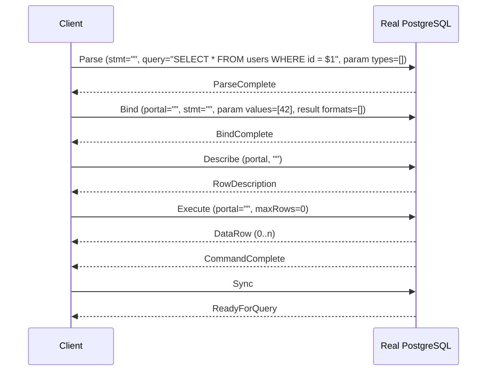
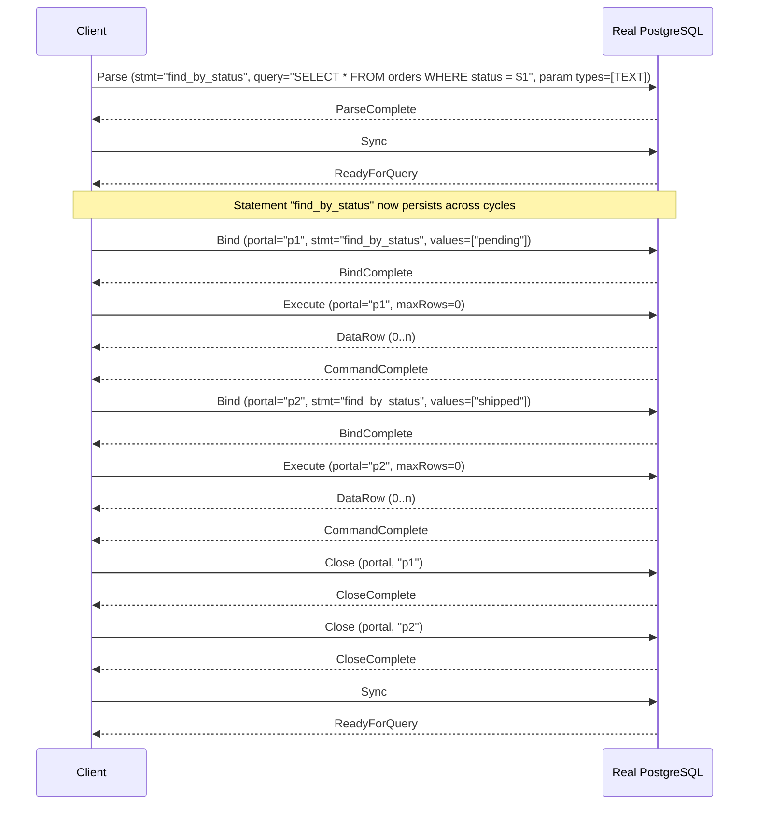

# Extended Query Protocol Support

## Status

**Draft.**

**No implementation exists yet.** This document is a design proposal only.
Nothing described below — no connection-state model, no policy-evaluation
change, no masking change — has been implemented. As of this document,
SentinelDB continues to reject every Extended Query Protocol message
(`Parse`/`Bind`/`Describe`/`Execute`/`Close`/`Flush`/`Sync`) with a `FATAL`
`ErrorResponse` and closes the connection
(`internal/firewall/gate.go`'s `rejectExtendedProtocol`,
`ErrUnsupportedProtocol`). Nothing in this document changes that today.

## Context

**What SentinelDB supports today.** SentinelDB is a PostgreSQL wire-protocol
gateway that parses and evaluates exactly one query-execution path: the
Simple Query Protocol's single `Query` (`'Q'`) frontend message
(`internal/protocol/decoder.go`, `internal/firewall/gate.go`). Every other
frontend message that could carry or execute SQL — `Parse`, `Bind`,
`Describe`, `Execute`, `Close`, `Flush`, `Sync` — is recognized only well
enough to be rejected outright
(`internal/firewall/gate.go:213`, `isExtendedProtocolMessage`), because
letting any of them through unevaluated would bypass the firewall policy
entirely (see `docs/postgresql-protocol.md`'s "Rejected frontend messages:
Extended Query Protocol" section, and `docs/threat-model.md`'s "Unprotected
paths").

**Why rejecting Extended Query limits compatibility.** Nearly every modern
PostgreSQL driver and ORM defaults to the Extended Query Protocol for
parameterized queries, because it is the only wire-level mechanism that
supports typed, positional bind parameters without client-side SQL string
interpolation. `pgx` (Go), `psycopg` (Python, prepared-statement mode),
`node-postgres`'s parameterized `query()` calls, JDBC's `PreparedStatement`,
and Npgsql (.NET) all use `Parse`/`Bind`/`Execute` for any query with `$1`,
`$2`, ... placeholders. A gateway that hard-rejects this leaves only
drivers/usages that are explicitly configured for simple-protocol
execution — a real, currently-documented compatibility gap
(`README.md`'s "V1 limitations", `docs/postgresql-protocol.md`'s "Practical
impact").

**Why this affects protocol state, policy evaluation, and masking — not
just "a few new message tags."** The Simple Query Protocol is stateless
across messages: one `Query` message is a complete, self-contained request
containing its own SQL text, and the response (`RowDescription` + zero or
more `DataRow` + `CommandComplete` + `ReadyForQuery`) is fully determined by
that one message. Everything SentinelDB does today — `firewall.Gate`'s
per-message `Policy.Evaluate` call, `masking.Transformer`'s per-result-set
`RowDescription`/`DataRow` tracking — assumes this one-message-in,
one-response-out shape.

Extended Query breaks that assumption in three separate ways that compound:

1. **SQL text and execution are different messages, separated in time and
   potentially by other, unrelated messages.** `Parse` carries SQL text but
   does not execute anything; `Execute` executes but carries no SQL text at
   all — only a portal name. A gateway that evaluates policy per-message
   the way `firewall.Gate.handle` does today would either have nothing to
   evaluate (`Execute`) or would need to remember a decision made
   message(s) earlier and apply it to a later, textually-unrelated message
   (`Execute`) referencing state (a portal) that itself refers to other
   state (a prepared statement) that may have been created in a *previous*
   Sync cycle, or even a previous logical "request" the driver considers
   done.
2. **State outlives a single request/response cycle and is named,
   reusable, and replaceable.** Prepared statements and portals are
   explicit, named (or unnamed-and-implicitly-replaced) server-side
   objects that persist until explicitly closed, replaced, or the
   connection ends. SentinelDB must track this state per connection for as
   long as the client does, not just for the duration of one message
   exchange — a fundamentally different lifetime model than anything
   `internal/protocol`, `internal/firewall`, or `internal/masking` handles
   today.
3. **Error recovery is a multi-message protocol contract, not a
   single-message fail-closed response.** Today, when `firewall.Gate`
   blocks a `Query`, it writes one synthetic `ErrorResponse` +
   `ReadyForQuery` pair and the cycle is over — the *next* message the
   client sends is a fresh, independent `Query`. In Extended Query, if
   SentinelDB blocks a `Parse` locally (never forwarding it to the real
   server), the client is protocol-entitled to keep sending `Bind`,
   `Describe`, `Execute`, and more, *without waiting for a response to
   each*, until it sends `Sync` — exactly mirroring what a real PostgreSQL
   backend does after any error mid-cycle (see
   [Local rejection state machine](#local-rejection-state-machine)).
   SentinelDB must reproduce this exact recovery contract while never
   letting the *real* upstream PostgreSQL connection see messages
   referencing objects (a blocked `Parse`'s statement, a `Bind` built on
   it) it was never told about.

None of this is addressed by recognizing seven more message tags — it
requires a per-connection state machine, a policy-evaluation timing
decision, and a masking-metadata correlation strategy that do not exist in
the codebase today.

## Goals

- Support normal Extended Query flows (`Parse`/`Bind`/`Describe`/`Execute`/
  `Close`/`Flush`/`Sync`) without weakening SentinelDB's existing
  fail-closed behavior in any dimension already covered for Simple Query.
- Preserve existing Simple Query behavior exactly as documented today —
  this is strictly additive.
- Inspect the SQL text carried by `Parse` messages against the same
  firewall policy (native or Wasm) that `Query` messages already go
  through, so Extended Query cannot be used to bypass the firewall.
- Track prepared statements and portals per connection, correctly modeling
  named vs. unnamed lifetime and replacement semantics.
- Preserve PostgreSQL-compatible error and transaction semantics,
  specifically the "discard until `Sync`" recovery contract and accurate
  `ReadyForQuery` transaction-status reporting.
- Support result masking (`masking.Transformer`) safely across the
  Extended Query flow, including cases where result format (text/binary)
  is decided by `Bind` rather than being implicit as it is in Simple Query.
- Provide an implementation plan decomposed into small, independently
  reviewable, individually buildable/testable PRs (see
  [Implementation decomposition](#implementation-decomposition)) rather
  than one large change.

## Non-goals

Explicitly out of scope for this design and the milestone it recommends:

- TLS termination.
- `COPY` protocol support (Extended Query's interaction with `COPY` is
  analyzed only to confirm the existing rejection boundary holds — see
  [COPY behavior](#copy-behavior) — no COPY implementation is proposed).
- A real SQL AST parser or SQL-aware semantic analysis. Policy evaluation
  remains `internal/sqlmatch`-based substring matching, exactly as
  documented as a limitation today (`docs/threat-model.md`'s "Known bypass
  limitations").
- Catalog-backed column lineage (resolving `SELECT expr AS alias` back to
  a real source column) — the existing alias-based masking limitation is
  unchanged by this design (see [Response masking implications](#response-masking-implications)).
- Any redesign of the Wasm host/guest ABI (`internal/wasmproto`) beyond
  what is strictly required to pass a policy decision through the
  existing `evaluate_query` operation; no new Wasm operations, no protocol
  version bump, are proposed here.
- Wasm module instance pooling (already flagged as a *performance*
  recommendation in `docs/audit-v0.1.md`'s V2 recommendations —
  independent of this design and not required by it).
- Zero-copy rewrites of `internal/protocol` parsing/rebuilding.
- Authentication redesign, RBAC, or any authorization model beyond what
  the real PostgreSQL server already enforces.
- Kubernetes or any orchestrated-deployment work.
- Any claim that SentinelDB becomes production-ready as a result of this
  work. Extended Query support, once implemented, remains subject to the
  same "experimental, not a production security boundary" status as
  everything else (`SECURITY.md`, `docs/threat-model.md`).

## Existing SentinelDB architecture

This section describes **only what exists in the codebase today** — no
planned behavior is described here as current.

- **Frontend messages are decoded** by `internal/protocol.Decoder`, one
  instance per direction per connection (`NewClientDecoder`,
  `NewServerDecoder` in `internal/protocol/decoder.go`). The client-side
  decoder starts in `phaseStartup` (expects `StartupMessage`/`SSLRequest`/
  `GSSENCRequest`/`CancelRequest`), then moves to `phaseNormal`
  (tag+length framing for every subsequent message). `Decoder.Write` is
  fed directly by `firewall.Gate.Run`'s and `masking.Transformer.Run`'s own
  read loops (`internal/firewall/gate.go:110-127`,
  `internal/masking/transformer.go:92-109`) — there is no separate
  passthrough/observer component in the current design.
- **Policy decisions occur** in `firewall.Gate.handle`
  (`internal/firewall/gate.go:146-207`), called once per fully-decoded
  frontend message. Today, the *only* message type that reaches
  `Policy.Evaluate` is `Query` (`'Q'`); every other frontend message
  either bypasses policy evaluation entirely and is forwarded unchanged
  (e.g. `Terminate`, `PasswordMessage`), is handled specially without
  evaluation (`SSLRequest`/`GSSENCRequest`, answered `'N'` directly), or is
  outright rejected without evaluation
  (`isExtendedProtocolMessage`/`rejectExtendedProtocol`,
  `internal/firewall/gate.go:176-178, 209-233`).
- **Backend responses are transformed** by `masking.Transformer.handle`
  (`internal/masking/transformer.go:111-141`), called once per fully
  decoded backend message from the real PostgreSQL server. It tracks
  exactly one active result set's column layout at a time
  (`t.fields`/`t.maskColIdx`, cleared on `CommandComplete`,
  `ErrorResponse`, or `ReadyForQuery` via `clearResultSet`,
  `internal/masking/transformer.go:239-242`) — there is no notion today of
  multiple concurrently-open, independently-addressable result sets
  (portals), because Simple Query never has more than one pending result
  set at a time.
- **Transaction state is tracked** by a single shared
  `*protocol.TxState` per connection (`internal/protocol/txstate.go`),
  constructed once in `cmd/gateway/main.go:handleConn` (line ~292) and
  passed to both `firewall.Gate` (`gate.SetTxState`, read via
  `readyForQueryStatus`, `internal/firewall/gate.go:98-103`) and
  `masking.Transformer` (constructor parameter, updated on every real
  backend `ReadyForQuery`, `internal/masking/transformer.go:132-135`).
  This is direction-agnostic infrastructure and needs no structural change
  for Extended Query — only more call sites feeding it (see
  [Local rejection state machine](#local-rejection-state-machine)).
- **Serialized client writes are enforced** by a single
  `*protocol.SerializedWriter` per connection
  (`internal/protocol/writer.go`), constructed once in `handleConn` (line
  ~286) and used as the sole write path to the client by both `Gate`
  (synthetic `ErrorResponse`/`ReadyForQuery`, the `'N'` SSL-rejection byte)
  and `Transformer` (forwarded/masked backend bytes). Any Extended Query
  work that needs to write synthetic messages to the client (a blocked
  `Parse`'s `ErrorResponse`, for example) must go through this same
  `clientWriter` — no new writer should be introduced.
- **Unsupported Extended Query messages are currently rejected** as
  follows: `Gate.handle` checks `isExtendedProtocolMessage(m.Type)` for
  every frontend message; if true (`Parse`/`Bind`/`Describe`/`Execute`/
  `Close`/`Flush`/`Sync`), `rejectExtendedProtocol` writes a single
  `ErrorResponse` (SQLSTATE `0A000`, "feature not supported") to the
  client via `g.respond` and sets `g.err = ErrUnsupportedProtocol`
  (`internal/firewall/gate.go:223-233`). `Gate.Run` then returns that
  error; `cmd/gateway/main.go:handleConn`'s goroutine sees
  `firewall.IsFailClosed(runErr)` is true and force-closes the upstream
  `target` connection immediately (rather than waiting for a half-close to
  be noticed), which in turn unblocks `masking.Transformer.Run`'s blocked
  read on the other goroutine (`cmd/gateway/main.go:handleConn`, the two
  `go func()` blocks around lines 325-357 in the pre-audit numbering /
  equivalent block in current `main.go`). **No partial Extended Query
  message is ever forwarded to the real server today** — rejection always
  happens before the first byte of the offending message reaches
  `target`.

Also directly relevant:

- `internal/wasm.Runtime`/`internal/wasm.Policy`/`internal/wasm.Masker`
  wrap the single loaded `plugins/firewall/v2.wasm` module via the
  versioned `internal/wasmproto.Envelope`/`Result` JSON contract. Today,
  `wasm.Policy.Evaluate` is only ever called with `m.Query` from a `Query`
  message (`internal/wasm/policy.go:40-66`). Reusing this exact call path
  for `Parse`'s SQL text requires no Wasm-side change — `Parse`'s query
  string is just another string to hand to `evaluate_query` — but the
  *host*-side call site changes (see [Policy evaluation design](#policy-evaluation-design)).
- `docs/architecture.md`'s "Fail-closed boundaries" table and
  `docs/postgresql-protocol.md`'s "Rejected frontend messages: Extended
  Query Protocol" section are the current, accurate descriptions of
  today's rejection behavior and are the baseline this design must not
  regress.
- `docs/audit-v0.1.md` (the just-completed V0.1 internal audit) confirms
  the current rejection path has no known correctness or fail-open gaps;
  this design must preserve every invariant that audit confirmed for the
  paths that remain unchanged (Simple Query, SSL/GSS rejection, malformed
  message handling).

## PostgreSQL Extended Query model

This section restates the protocol model as documented in the official
PostgreSQL documentation
([Protocol Overview](https://www.postgresql.org/docs/current/protocol-overview.html),
[Protocol Flow](https://www.postgresql.org/docs/current/protocol-flow.html),
[Message Formats](https://www.postgresql.org/docs/current/protocol-message-formats.html)),
in plain technical language, as the shared reference point for the rest of
this document.

**Prepared statements.** A `Parse` message compiles a SQL string (which may
contain `$1`, `$2`, ... parameter placeholders) into a *prepared statement*
on the server, identified by a name supplied in the same message. Parsing
happens once; the resulting statement can be executed multiple times
(via different portals) with different parameter values, without
re-sending or re-parsing the SQL text.

**Portals.** A `Bind` message instantiates a prepared statement into a
*portal*: it supplies concrete parameter values (and format codes) for the
statement's placeholders and the desired result-column format codes,
producing a portal identified by its own (separate) name. A portal is
essentially "a prepared statement plus a specific set of parameter values,
ready to execute." `Execute` runs a named portal, optionally limited to a
maximum row count per call.

**Named versus unnamed objects.** Both statements and portals may be
*unnamed* (empty string `""` as the name). An unnamed statement or portal
is anonymous, scoped to short-term use, and is silently replaced/destroyed
the next time the client issues a new `Parse`/`Bind` with an empty name —
no `Close` is needed or expected for unnamed objects. A *named* statement
or portal persists until an explicit `Close` message, or the connection
ends; issuing `Parse`/`Bind` with a name that is already in use as a named
object (without first `Close`-ing it) is a protocol error from the real
server. This asymmetry (unnamed = implicitly replaced; named = must be
explicitly closed, and reuse-without-close errors) is a core piece of state
SentinelDB's own tracking must model correctly (see
[Proposed connection state](#proposed-connection-state)).

**Parse versus Bind versus Execute.** `Parse` is the *only* message that
carries SQL text; it does not execute anything and returns no rows.
`Parse` may optionally declare explicit parameter type OIDs (a count and a
list); a declared count of zero means "let the server infer every
parameter's type from context" — the real server resolves this during
parsing and reports the final types via `ParameterDescription` (in
response to a later `Describe` of the statement). `Bind` supplies the
actual parameter *values* (and their wire format: text or binary) for a
specific execution and requests the result-column wire format(s) it wants
back; it carries no SQL text at all — only two names (the source statement,
the destination portal) plus parameter/result format/value arrays.
`Execute` carries neither SQL text nor parameter values — only a portal
name and an optional maximum-row-count limit. This is why a `Bind` or
`Execute` message alone gives SentinelDB nothing new to run a text-based
policy match against; any policy decision tied to SQL content must be made
when `Parse` is seen, and remembered (see
[Policy evaluation design](#policy-evaluation-design)).

**Describe (statement vs. portal).** `Describe` takes a type byte (`'S'`
for statement, `'P'` for portal) and a name. `Describe` of a *statement*
returns `ParameterDescription` (the parameter type OIDs, resolved if they
weren't explicit in `Parse`) followed by `RowDescription` (or `NoData` if
the statement returns no rows) — and, per the protocol documentation, the
format codes in that `RowDescription` are always reported as text, because
no `Bind` (which is what actually chooses result format) has necessarily
happened yet. `Describe` of a *portal* returns only `RowDescription` (or
`NoData`) — and *this* `RowDescription`'s format codes correctly reflect
the result-format-codes that the `Bind` which created that portal actually
requested. This distinction matters a great deal for masking correctness
(see [Response masking implications](#response-masking-implications)):
`RowDescription` from a statement-level `Describe` cannot be used to learn
the *actual wire format* of a later `Execute`'s `DataRow`s — only
portal-level `Describe`, or independent tracking of the creating `Bind`'s
result-format-codes, can.

**Close.** `Close` (type byte `'S'` or `'P'`, plus a name) explicitly
destroys a named statement or portal, freeing the corresponding server-side
resources; it responds with `CloseComplete`. Closing a statement that
still has open portals referencing it is permitted by the protocol (the
portals remain usable); SentinelDB's own bookkeeping must not assume
closing a statement implies closing its portals, or vice versa.

**Sync as a recovery boundary.** `Sync` has two jobs: it closes an
implicitly-started transaction if one was opened only for the extended
message sequence (transactional semantics unaffected if the client is
already inside an explicit `BEGIN`), and it is *the* resynchronization
point after an error. Per the protocol documentation: if any message in an
extended-query sequence causes an error, the backend emits `ErrorResponse`
and then **silently discards every subsequent frontend message without
processing or acknowledging it**, until it receives `Sync` — at which
point it emits `ReadyForQuery` and resumes normal processing. Well-behaved
clients are expected to rely on exactly this: after sending a batch of
`Parse`/`Bind`/`Describe`/`Execute` messages, keep sending without waiting
for each individual response, and treat receipt of the (eventual)
`ReadyForQuery` as "the whole batch is done, whether or not something
failed partway through." This is the exact contract SentinelDB must
reproduce when it, rather than the real server, is the one that detects a
problem (a blocked query) partway through a batch — see
[Local rejection state machine](#local-rejection-state-machine).

**Flush.** `Flush` asks the backend to deliver any response data it has
buffered so far, without the side effects of `Sync` (no implicit
transaction closure, no `ReadyForQuery`). It exists purely so a client
using pipelining can force early delivery of, e.g., a `RowDescription`
without ending its whole batch. `Flush` has no corresponding
acknowledgement message of its own.

**PortalSuspended.** If `Execute` specifies a maximum row count greater
than zero and the portal has more rows available than that limit, the
server sends the rows up to the limit, then `PortalSuspended` instead of
`CommandComplete` — the portal remains open, positioned where it left off,
and a later `Execute` on the same portal continues fetching from that
point. A limit of zero means "no limit, return everything," which always
ends in `CommandComplete` (or `EmptyQueryResponse` for an empty query
string, only reachable via `Parse` with an empty statement).

**Pipelining and response correlation.** Because request and response are
decoupled (nothing requires waiting for one message's response before
sending the next), a client may have several `Parse`/`Bind`/`Execute`
triples in flight before seeing any acknowledgement. The protocol
guarantees responses arrive **in the same order the corresponding
requests were sent** — there is no explicit request/response ID to
correlate by; correlation is purely positional/FIFO. This is why any
component (including SentinelDB) that needs to track "which pending
operation does this acknowledgement belong to" must maintain an ordered
queue of pending operations, not a keyed lookup by name alone (a name can
be reused/replaced while an older operation on the same name is still
in flight in a pipelined sequence) — see
[Proposed connection state](#proposed-connection-state).

### Sequence diagram 1: basic unnamed Parse/Bind/Execute/Sync flow

### Sequence diagram 2: named prepared statement reused with multiple portals

## Frontend message table

| Message | Tag | Important fields | Validation rules | State read | State change requested | Forwarded immediately? | Policy action | Failure behavior |
|---|---|---|---|---|---|---|---|---|
| `Parse` | `P` | statement name, query string, parameter type OID count + list | Name not currently in use as an *open, uncommitted* named statement from an earlier `Parse` in the same pipeline still awaiting `ParseComplete`; if named and already a *committed* (backend-acknowledged) statement exists under that name, this is a real-server error, not one SentinelDB should preempt (see below) | Statement registry (existence check for named-statement conflict, best-effort/advisory only — see [Proposed connection state](#proposed-connection-state)) | Registers a *pending* statement entry (uncommitted) with the SQL text, declared parameter type OIDs, and a placeholder for the policy decision | **No** — held until the policy decision is available | `Policy.Evaluate` on the query string, exactly as `Query` messages are evaluated today | If blocked: synthesize `ErrorResponse`, enter [discard-until-`Sync`](#local-rejection-state-machine), do not forward. If allowed: forward raw bytes, mark pending statement "forwarded, awaiting `ParseComplete`" |
| `Bind` | `B` | portal name, source statement name, parameter format codes, parameter values, result format codes | Referenced statement name must resolve to a *committed* (backend-acknowledged) or currently-pending-but-not-yet-blocked statement known to SentinelDB; portal name replacement rules for unnamed portals | Statement registry (lookup by name) | Registers a *pending* portal entry referencing the statement, storing result-format-codes and (only as much parameter metadata as needed, never full parameter values — see [Policy evaluation design](#policy-evaluation-design)) | **Only if the referenced statement is known-allowed and already forwarded/committed or validly pending** — otherwise treated as referencing a blocked/unknown object and discarded, not forwarded | None (no SQL text present) — parameter *values* are explicitly not logged or evaluated in the initial milestone | If the referenced statement was blocked or is unknown: synthesize `ErrorResponse` (only if not already in discard mode — see state machine), enter/remain in discard-until-`Sync`. Otherwise forward and mark pending |
| `Describe` | `D` | type byte (`'S'`/`'P'`), name | Referenced statement/portal must be known (committed or validly pending) | Statement or portal registry (lookup by name) | None on its own; correlates with the next `ParameterDescription`/`RowDescription`/`NoData` to update SentinelDB's cached shape metadata for that statement/portal (see [Response masking implications](#response-masking-implications)) | Forwarded if the referenced object is known and not blocked; otherwise discarded like `Bind` | None | If unknown/blocked: synthesize `ErrorResponse` if not already discarding, enter discard mode |
| `Execute` | `E` | portal name, maximum row count | Referenced portal must be known (committed or validly pending); no SQL text is present to validate | Portal registry (lookup by name), portal's suspension/exhaustion status | Marks the portal's execution as pending (backend response correlation, esp. for `PortalSuspended` continuation) | Forwarded only if the referenced portal is known-allowed; otherwise discarded | None (no SQL text) | If unknown/blocked portal: synthesize `ErrorResponse` if not already discarding, enter discard mode |
| `Close` | `C` | type byte (`'S'`/`'P'`), name | Referenced statement/portal name should exist in SentinelDB's registry for correct bookkeeping, but per protocol, closing a nonexistent name is *not* an error at the real server (it is a no-op there) | Statement or portal registry | Marks the entry pending removal (removed on `CloseComplete`, not immediately — see [Proposed connection state](#proposed-connection-state)) | Forwarded unconditionally (closing is always safe to pass through; the real server tolerates closing a nonexistent name) | None | Backend `CloseComplete` removes the pending-removal entry; no local failure path distinct from a generic decode/ordering error |
| `Flush` | `H` | none | None | None | None | Forwarded unconditionally *if not currently in discard-until-`Sync` mode*; silently absorbed (not forwarded) while discarding, matching the "no messages processed until `Sync`" contract | None | None (no acknowledgement message exists for `Flush`) |
| `Sync` | `S` | none | None | Discard-until-`Sync` flag (this message clears it) | Ends the current extended-query cycle: closes any implicit transaction, resets discard mode, clears local per-cycle bookkeeping (committed-object registries persist; only *pending, unforwarded* entries created after a block are discarded) | **Always forwarded to the real server**, whether or not anything was blocked earlier in the cycle (see [Local rejection state machine](#local-rejection-state-machine) for why) | None (already evaluated whatever preceded it) | Real server's own `ReadyForQuery` is relayed to the client unchanged; this is the sole source of truth for post-cycle transaction status |
| `Terminate` | `X` | none | None | None | Immediately ends the connection from the client's side | Forwarded immediately regardless of discard-mode state, then the connection is closed on both sides without waiting for further backend traffic | None | N/A — this is the terminal state for the connection |

## Backend message table

| Message | Tag | Acknowledges | Correlation | State committed? | Needed by response transformer? | Failure behavior for unexpected ordering |
|---|---|---|---|---|---|---|
| `ParseComplete` | `1` | `Parse` | Head of the pending-operation queue (FIFO, see [Proposed connection state](#proposed-connection-state)) must be a pending `Parse` | **Yes** — this is the point the statement moves from "pending" to "committed" in SentinelDB's registry | No (no row data involved) | If the queue head isn't a pending `Parse`: protocol desynchronization — fail closed, close both connections (matches today's "no synthetic message may use incorrect state" invariant) |
| `BindComplete` | `2` | `Bind` | Head of the pending-operation queue must be a pending `Bind` | **Yes** — portal moves from "pending" to "committed" | No | Same fail-closed handling as above |
| `CloseComplete` | `3` | `Close` | Head of the pending-operation queue must be a pending `Close` | **Yes** — statement/portal entry is actually removed from the registry now, not when `Close` was sent | No | Same fail-closed handling as above |
| `ParameterDescription` | `t` | `Describe` (statement) | Head of the pending-operation queue must be a pending `Describe` of type `'S'` | Updates cached parameter type OIDs for that statement | No (not row data) | Same fail-closed handling |
| `RowDescription` | `T` | `Describe` (statement or portal), or precedes `DataRow`s during `Execute` in rarer cases per protocol nuance | Head of the pending-operation queue (a pending `Describe`) *or* is understood as describing the portal currently executing | **Yes, for masking purposes** — updates the cached column-name/type list (and, if from a portal-level `Describe`, the actual per-column wire format) used to decide which columns to mask | **Yes** — this is the primary metadata source for `masking.Transformer`'s per-portal column tracking | If received with no corresponding pending `Describe` and no portal currently executing: fail closed (unexpected ordering) |
| `NoData` | `n` | `Describe` (statement or portal) whose result has no columns | Head of the pending-operation queue must be a pending `Describe` | Yes — records "no columns" for that statement/portal, distinct from "unknown" | Yes — tells the transformer this portal will never need masking | Same fail-closed handling |
| `DataRow` | `D` | `Execute` (the currently-executing portal) | Correlated to whichever portal is currently marked "executing" (there is at most one at a time per connection, since PostgreSQL processes a connection's messages serially even under pipelining) | N/A (not a state-committing message on its own) | **Yes** — this is exactly what `masking.Transformer` already masks; the column/format metadata used comes from the executing portal's cached shape (§ [Response masking implications](#response-masking-implications)) | If no portal is marked executing: fail closed |
| `CommandComplete` | `C` | `Execute` that ran to completion | Marks the currently-executing portal as no longer executing | N/A | Yes — triggers the same `clearResultSet`-equivalent behavior, scoped to that portal | If no portal is marked executing: fail closed |
| `EmptyQueryResponse` | `I` | `Execute` of a portal from an empty-string `Parse` | Marks the currently-executing portal as no longer executing | N/A | No | Same fail-closed handling |
| `PortalSuspended` | `s` | `Execute` that hit its row-count limit with more rows available | Marks the portal "suspended" (not exhausted); a later `Execute` on the same portal resumes | Yes — portal's suspension state | Yes — the transformer must expect more `DataRow`s for this same portal on a later `Execute`, without re-receiving `RowDescription` | If no portal is marked executing: fail closed |
| `ErrorResponse` | `E` | Any pending operation | Whatever operation the real server was processing when it failed | Triggers the *real* server's own discard-until-`Sync` mode on the SentinelDB↔PostgreSQL leg — SentinelDB must track this independently of its own client-facing discard state (see [Local rejection state machine](#local-rejection-state-machine)) | Yes — clears whatever result-set tracking was active, same as today's `clearResultSet` | N/A — this message itself signals an error, it does not represent unexpected ordering |
| `ReadyForQuery` | `Z` | `Sync` | The cycle boundary | Updates the shared `*protocol.TxState`, exactly as today (`internal/masking/transformer.go:132-135`); clears all per-cycle pending-operation tracking | Yes — same as today, this is the resync signal relayed to the client | N/A — this is itself the resync point |

## Proposed connection state

A per-connection Extended Query state model is needed, conceptually
distinct from (and additional to) the existing `protocol.TxState`.
Evaluated structures:

- **Prepared statement registry** — keyed by statement name (`""` for the
  unnamed slot, which always has capacity for exactly one entry, replaced
  on every new unnamed `Parse` rather than requiring an explicit `Close`).
  Per entry: statement name, original SQL text, declared parameter type
  OIDs (as sent in `Parse`, before resolution), policy decision metadata
  (verdict, reason, evaluation duration — mirroring what `firewall.Gate`
  already logs for `Query`, never the parameter values), and a creation
  status of one of: `pending` (forwarded, awaiting `ParseComplete`),
  `committed` (acknowledged by the real server), or `blocked` (evaluated
  locally and never forwarded). Replacement semantics for the unnamed
  statement: a new unnamed `Parse` immediately invalidates any *committed*
  unnamed statement's committed portals are **not** automatically
  invalidated by this — per protocol, replacing the unnamed statement does
  not retroactively affect portals already bound from the old one, only
  future `Bind`s naming the unnamed statement resolve to the new one. Named
  statements are never silently replaced; a `Parse` naming an
  already-committed named statement is a real-server error SentinelDB
  should not attempt to preempt (see below).
- **Portal registry** — keyed by portal name (same `""`-slot semantics as
  the unnamed statement). Per entry: portal name, the statement name it
  was bound from (a pointer/reference, not a copy, so statement-level
  policy metadata stays a single source of truth), parameter format codes,
  **not** the parameter values themselves (see below), result format
  codes, creation status (`pending`/`committed`/`blocked`, same meaning as
  for statements), and execution status (`not started` / `executing` /
  `suspended` / `exhausted`).
- **Pending-operation queue** — an ordered (FIFO) list of "operation kind +
  target name" entries for every frontend message forwarded to the real
  server whose backend acknowledgement has not yet arrived. This is what
  makes pipelining correlation possible: `ParseComplete`, `BindComplete`,
  `CloseComplete`, `ParameterDescription`, `RowDescription`, and `NoData`
  are all correlated by *popping the queue head*, not by re-parsing the
  acknowledgement message for a name (most of these acknowledgements carry
  no name at all — correlation is positional by design in the real
  protocol, and SentinelDB must respect that rather than inventing a
  keyed lookup that the wire format doesn't support).
- **Extended-cycle error state** ("discard-until-`Sync`") — a single
  per-connection boolean (or small enum, see the state diagram in
  [Local rejection state machine](#local-rejection-state-machine)), set
  when SentinelDB itself blocks/rejects something locally, cleared only on
  `Sync`. While set, subsequent frontend messages (other than `Sync` and
  `Terminate`) are not forwarded, not evaluated, and do not themselves
  generate a second `ErrorResponse` (only the first blocking event does —
  mirroring the real server's own single-`ErrorResponse`-then-silence
  behavior).
- **Current transaction status** — unchanged, reuses the existing
  `*protocol.TxState` (§ [Existing SentinelDB architecture](#existing-sentineldb-architecture)).
- **Active `RowDescription`/result metadata** — extended from today's
  single `t.fields`/`t.maskColIdx` pair (which assumes one active result
  set) to per-portal shape metadata: column names/types (from whichever
  `Describe` was last observed for that portal or its underlying
  statement) plus the actual per-column wire format (from the *creating*
  `Bind`'s result-format-codes, which is authoritative over a
  statement-level `Describe`'s always-text report — see
  [Response masking implications](#response-masking-implications)).
- **Protocol mode and COPY rejection state** — the existing fail-closed
  handling of `CopyInResponse`/`CopyOutResponse`/`CopyBothResponse` in
  `masking.Transformer.handle` (`internal/masking/transformer.go:124-128`)
  is direction- and mode-agnostic already (it triggers on the backend
  message type, not on which frontend protocol requested it) and needs no
  structural change — see [COPY behavior](#copy-behavior).

**State should not be committed when the frontend message arrives.**
Analysis: a `Parse`, `Bind`, or `Close` that SentinelDB decides to forward
is *not yet* guaranteed to succeed at the real server — the real server
could still reject it (e.g. a genuine SQL syntax error in an
allowed-by-policy `Parse`, or a named-statement-already-exists conflict
SentinelDB chose not to preempt). If SentinelDB committed registry state
optimistically at forward-time and the real server then errors, the
registry would describe objects that don't actually exist upstream,
corrupting all subsequent correlation. Therefore: **registry entries are
created in a `pending` state when the frontend message is forwarded, and
only promoted to `committed` when the corresponding backend
acknowledgement (`ParseComplete`/`BindComplete`/`CloseComplete`) is
popped off the pending-operation queue in the correct position.** If an
`ErrorResponse` arrives instead of the expected acknowledgement, the
pending entry is discarded (never committed), matching what really
happened upstream.

**Pipelining implication.** Because multiple operations can be pending
(forwarded, unacknowledged) simultaneously, the pending-operation queue
must support multiple in-flight entries, and a later message referencing
an object that is only `pending` (not yet `committed`) must still be
treated as *provisionally valid* for forwarding purposes (the client is
allowed to pipeline `Parse` → `Bind` → `Execute` for the same object
without waiting for `ParseComplete` first) — SentinelDB tracks this as
"referenced object exists in `pending` or `committed` state, i.e. not
`blocked` and not entirely unknown," and defers the final correctness
judgment to the real server's own acknowledgement stream, which SentinelDB
relays transparently in this case.

## Policy evaluation design

**When policy evaluation occurs:** exactly once, at `Parse` time, against
the SQL template string exactly as sent (before parameter substitution) —
using the same `Policy.Evaluate` call path `Query` messages already use
today (`internal/firewall/policy.go`, `internal/wasm/policy.go`). This
decision is cached on the statement's registry entry and is **not**
re-evaluated on subsequent `Bind`/`Execute` of portals built from that
statement, nor on repeated executions of the same named statement across
multiple `Sync` cycles.

**Rationale for "SQL template only" (not template+parameter metadata, not
template+parameter values), for this initial milestone:**

- `Bind` carries parameter *values*, not SQL — evaluating them would
  require SentinelDB to understand each parameter's *type* (from
  `ParameterDescription`, itself possibly not yet resolved if the client
  never issued a statement-level `Describe`) and *format* (text or binary,
  per-parameter, from `Bind`'s own format-code array) well enough to
  safely decode and meaningfully compare a value — a materially larger
  scope than the current `internal/sqlmatch` substring approach, and one
  that risks false confidence (a value-aware check that *looks* more
  precise but still can't reason about how the value is actually used in
  the query, e.g. whether it lands inside a string literal, an identifier,
  or a numeric context).
- Evaluating "template + parameter metadata" (types only, no values) adds
  complexity without adding real protection: the existing policy is
  phrase-based, not type-based, so parameter *types* alone don't change
  any `MatchAny` outcome.
- Committing to SQL-template-only evaluation is also what keeps this
  milestone's policy behavior a **strict, well-understood superset** of
  today's Simple Query behavior: identical matching logic
  (`internal/sqlmatch.MatchAny`), identical bypass limitations already
  documented in `docs/threat-model.md` (comments/string-literal matches,
  no real SQL awareness) — no new, undocumented bypass surface is
  introduced, and no new, undocumented over-blocking surface either.

**This is an explicit, documented limitation, not an oversight:** a
malicious statement that is *itself* benign-looking SQL but whose blocked
behavior only manifests through parameter values (which is not how the
existing keyword-based policy is designed to catch anything anyway, since
it has never inspected values) is out of scope, exactly as it is out of
scope for Simple Query today. A future milestone could revisit
value-aware or type-aware evaluation; it is listed under
[Open questions](#open-questions) and is explicitly **not** committed to
here.

**Bind parameter values are never logged, never included in metric labels,
and never passed to `Policy.Evaluate`.** This mirrors the existing
sensitive-logging policy for `Query` text
(`docs/threat-model.md`'s "Sensitive logging policy") and is a hard
invariant, not a tuning knob.

### The critical scenario: `Parse` blocked, then `Bind`/`Execute`/`Sync` continue

This is deliberately analyzed in full, not hand-waved:

1. Client sends `Parse` (named or unnamed) with SQL matching a blocked
   phrase.
2. `firewall.Gate`'s Extended-Query handling (the proposed successor to
   today's blanket `isExtendedProtocolMessage` rejection) evaluates the
   query text via `Policy.Evaluate`, gets `Block`.
3. SentinelDB writes a synthetic `ErrorResponse` to the client via the
   shared `clientWriter` (same mechanism as today's blocked `Query`
   handling), **does not forward the `Parse` message to the real
   PostgreSQL server at all**, marks the statement registry entry
   `blocked` (not `pending`, not `committed`), and sets the connection's
   discard-until-`Sync` flag.
4. The client — per the PostgreSQL protocol's own documented recovery
   contract, which real drivers already implement for *real* server-side
   errors — is expected to keep sending `Bind`, `Describe`, `Execute` (and
   possibly further `Parse`s) referencing this now-`blocked` statement (or
   anything downstream of it) without waiting for individual responses,
   until it sends `Sync`.
5. **PostgreSQL itself never received the blocked `Parse`.** If SentinelDB
   were to forward a later `Bind` referencing that statement name, the
   real server would either error on an unknown statement name (if the
   name was never used before) or — worse — silently succeed against an
   *unrelated, pre-existing* statement that happens to share the name,
   which would be a serious correctness/security bug (executing
   parameters against the wrong prepared statement). Therefore: **every
   frontend message after the block, up to and not including the client's
   `Sync`, must be silently discarded by SentinelDB — not evaluated, not
   forwarded, not given an individual error response** (only the first
   blocking event generates an `ErrorResponse`; this exactly matches how a
   real backend behaves after an error mid-cycle — it emits exactly one
   `ErrorResponse` and then silence until `Sync`).
6. When the client's `Sync` eventually arrives, SentinelDB forwards it to
   the real PostgreSQL server — **always**, whether or not anything was
   actually forwarded to the real server during this cycle (see the
   `Sync` row in the [Frontend message table](#frontend-message-table),
   and the rationale in
   [Local rejection state machine](#local-rejection-state-machine)) — and
   relays the real server's resulting `ReadyForQuery` to the client
   unchanged. This is the mechanism by which the upstream connection never
   becomes desynchronized: SentinelDB never sends the real server anything
   it doesn't already have complete, valid context for, and it always
   gives the real server exactly the same number of `Sync` messages the
   client sent, so the real server's own transaction/cycle bookkeeping
   stays perfectly aligned with the client's.
7. **Mixed/pipelined case:** if some *earlier* operations in the same cycle
   were legitimately forwarded (allowed `Parse`/`Bind`/`Execute` for
   statement/portal "A") before the block occurred (on statement/portal
   "B"), those earlier operations' real backend responses continue to be
   relayed to the client normally, interleaved in their original order,
   completely independently of "B"'s local block — the discard-until-
   `Sync` state only suppresses *forwarding of further frontend messages*,
   it does not touch already-in-flight backend responses for
   already-forwarded operations. The final `Sync` (forwarded, as above)
   correctly closes out "A"'s legitimately-open cycle at the real server,
   and the real server's single resulting `ReadyForQuery` still correctly
   represents "the whole client-visible cycle, including the locally
   aborted part, is now resynchronized."

## Local rejection state machine

Explicit answers:

- **Does SentinelDB enter discard-until-`Sync`?** Yes, immediately upon
  writing any locally-generated `ErrorResponse` during an Extended Query
  cycle (a blocked `Parse`, or a `Bind`/`Describe`/`Execute` referencing an
  unknown or `blocked` statement/portal).
- **Which subsequent frontend messages are ignored?** All of `Parse`,
  `Bind`, `Describe`, `Execute`, `Close`, `Flush` — evaluated against
  nothing, forwarded to nowhere, and generating no further response —
  until `Sync` is received. `Terminate` is the sole exception (always
  honored immediately, see below).
- **Is `Sync` forwarded to PostgreSQL, or handled locally?** **Always
  forwarded to PostgreSQL**, regardless of whether anything was legitimately
  forwarded earlier in the cycle. Rationale: PostgreSQL treats a `Sync`
  with no pending work as a valid, well-defined no-op cycle boundary
  (closes any implicit transaction, if one was even opened; emits
  `ReadyForQuery` reflecting current — possibly unchanged — transaction
  status). This lets the real server remain the single source of truth for
  transaction status after every cycle, including cycles where SentinelDB
  blocked everything locally, and avoids SentinelDB needing to
  independently (and riskily) guess whether an implicit transaction should
  be considered closed.
- **How is `ReadyForQuery` produced?** By relaying the real server's own
  `ReadyForQuery`, received in response to the forwarded `Sync` — not
  synthesized locally. (This differs from today's Simple Query blocked-path,
  which *does* synthesize `ReadyForQuery` locally, because Simple Query has
  no `Sync`/server-round-trip step to piggyback on; Extended Query's design
  can and should prefer the real server's answer when a round trip is
  happening anyway.)
- **Which tracked transaction status is used?** None needs to be
  guessed — see above; the real server's answer is authoritative. The
  shared `*protocol.TxState` is still updated from this real
  `ReadyForQuery`, exactly as today, so it remains correct for any *future*
  Simple Query blocked-path use later in the same connection.
- **How is the upstream connection kept synchronized?** By construction:
  SentinelDB never forwards a frontend message referencing an object the
  real server doesn't know about, and always forwards exactly the `Sync`
  messages the client sent, in the same order. The real server's
  perspective of the session is therefore always a strict (possibly
  smaller) subset of the client's perspective, never a divergent one.
- **How are pipelined messages handled?** The pending-operation queue
  (§ [Proposed connection state](#proposed-connection-state)) continues to
  track already-forwarded, not-yet-acknowledged operations from *before*
  the block independently of the discard flag; messages arriving *after*
  the block are never added to that queue (they're discarded, not
  forwarded, so there is nothing to correlate).
- **What happens if `Terminate` arrives before `Sync`?** `Terminate` is
  always honored immediately, in discard mode or not: forwarded to the
  real server if a connection exists, and the SentinelDB connection is
  closed without waiting for `Sync` or any further backend traffic — this
  matches `Terminate`'s existing protocol meaning (the client is ending
  the session unconditionally) and requires no special-casing beyond "the
  discard-until-`Sync` flag does not suppress `Terminate` forwarding."

### State diagram

```mermaid
stateDiagram-v2
    [*] --> Normal
    Normal --> Normal: Parse/Bind/Describe/Execute/Close/Flush (allowed, forwarded)
    Normal --> DiscardUntilSync: Parse blocked by policy\n(synthetic ErrorResponse written)
    Normal --> DiscardUntilSync: Bind/Describe/Execute references\nan unknown or blocked object\n(synthetic ErrorResponse written)
    DiscardUntilSync --> DiscardUntilSync: Parse/Bind/Describe/Execute/Close/Flush\n(silently discarded, no response)
    DiscardUntilSync --> Normal: Sync\n(forwarded to real server;\nreal ReadyForQuery relayed to client)
    Normal --> Normal: Sync\n(forwarded to real server;\nreal ReadyForQuery relayed to client)
    Normal --> Closed: Terminate\n(forwarded if connected; connection closed)
    DiscardUntilSync --> Closed: Terminate\n(forwarded if connected; connection closed)
    Normal --> Closed: Decoder parse failure\n(fail-closed, matches today's ErrDecodeFailed)
    DiscardUntilSync --> Closed: Decoder parse failure\n(fail-closed, matches today's ErrDecodeFailed)
    Closed --> [*]
```

## Response masking implications

- **`RowDescription` result format codes mean something different in
  Extended Query than in Simple Query.** In Simple Query, every column is
  always text format (`FormatCode == 0`), so `masking.Transformer`'s
  existing binary-format fail-closed check
  (`internal/masking/transformer.go:200-207`) essentially never triggers
  in practice today. In Extended Query, `Bind`'s result-format-codes
  choose the actual wire format per column for that specific portal — a
  statement-level `Describe`'s `RowDescription` always reports text
  regardless of what any later `Bind` will request, so **it cannot be
  used, on its own, to determine the real wire format of a subsequent
  `Execute`'s `DataRow`s.** The authoritative source of per-column wire
  format for a given portal is that portal's *creating* `Bind` message's
  result-format-codes array (0 codes = all text; 1 code = applies to all
  columns; N codes = one per column, matching the same encoding rule
  `Bind`'s parameter-format-codes already uses) — this must be tracked on
  the portal registry entry (§ [Proposed connection state](#proposed-connection-state))
  independently of whatever `RowDescription` was last seen.
- **Column names/types still come from `Describe`** (statement- or
  portal-level) or, if the client never issues one, are unknown. If a
  portal's shape (column names) is unknown when its `Execute` arrives and
  masking is enabled, SentinelDB cannot know whether any `DataRow` column
  needs masking — see the proposed safe rule below.
- **Target masked columns requested in binary format:** exactly like
  today's existing (Simple-Query-scoped) rule, a column identified by name
  as a masking target whose actual wire format (per the rule above) is
  binary must fail closed rather than attempt to mask binary bytes as
  UTF-8 text — this generalizes `internal/masking/transformer.go`'s
  existing `FormatCode != 0` check without changing its meaning.
- **`DataRow` reconstruction** reuses the existing
  `protocol.DataRow`/`DataCell`/`WithCell`/`Build` machinery
  (`internal/protocol/datarow.go`) unchanged — masking a cell and
  rebuilding a row is a per-message operation with no Extended-Query-
  specific shape; only the *decision of which columns to mask* changes
  (per-portal, not per-connection-global).
- **Multiple portals:** unlike today's single `t.fields`/`t.maskColIdx`
  pair (valid because Simple Query never has more than one open result set
  at a time), Extended Query can have several portals open simultaneously
  (bound but not yet executed, or suspended awaiting resumption). Shape
  metadata must be keyed per portal, not held as a single connection-wide
  value.
- **Multiple result sets:** the existing `clearResultSet` behavior
  (triggered on `CommandComplete`/`ErrorResponse`/`ReadyForQuery`) becomes
  per-portal — closing out portal "A"'s result set must not disturb portal
  "B"'s still-open shape metadata.
- **`PortalSuspended` followed by another `Execute`:** the masking decision
  (which columns, what format) must persist across the suspension — it was
  decided once at `Bind` time (result format) and `Describe`/`Bind` time
  (shape), not re-derived per `Execute` call. A resumed `Execute`'s
  `DataRow`s are masked using the same cached per-portal metadata as the
  first `Execute` call that started this portal.
- **Statement or portal `Describe` before execution:** the resulting
  `RowDescription` is itself never rewritten (exactly as today,
  `internal/masking/transformer.go:143-167`) — masking only ever changes
  `DataRow` cell values, never column metadata — but it does update
  SentinelDB's cached shape for that statement/portal, per above.
- **Alias-based masking limitation is unchanged.** `SELECT email AS e` still
  produces a `RowDescription` naming the column `e`, which does not
  case-insensitively match a configured `masking.columns` entry of
  `email` — this is exactly the same limitation already documented in
  `docs/threat-model.md`'s "Known bypass limitations," unaffected by
  Extended Query support (Extended Query does not change how column names
  are chosen; it only changes when/how SentinelDB learns them).
- **UTF-8 assumption is unchanged.** Text-format cell values are still
  treated as UTF-8 (`docs/postgresql-protocol.md`'s "Binary format
  limitation"); this design does not introduce or resolve any encoding
  handling beyond what exists today.

**Proposed safe initial rule:**

1. If a portal's per-column wire format (from its creating `Bind`) marks a
   *configured masking target column* as binary, **fail closed** for that
   portal's `Execute` (mirrors today's exact rule, generalized to
   per-portal). Non-target columns in binary format are left unchanged
   (not masked, not rejected) — masking is opt-in per configured column
   name, exactly as today; a binary non-target column carries no masking
   obligation.
2. If a portal's column *names* are unknown (no `Describe` — statement- or
   portal-level — was ever observed for it or its underlying statement)
   **and masking is enabled** (`masking.enabled: true` in `config.yaml`),
   **fail closed** for that portal's `Execute` rather than forward
   `DataRow`s SentinelDB cannot evaluate for masking. This is a
   deliberately conservative default: some real drivers always issue a
   `Describe` (many need `RowDescription` for their own client-side result
   decoding, independent of SentinelDB's needs), so this case is expected
   to be rare in practice, but it must never silently pass through
   unmasked data when masking is configured on. If `masking.enabled:
   false`, this case does not apply (no masking is ever attempted, exactly
   as today), so no additional failure mode is introduced for
   masking-disabled deployments.
3. SentinelDB must **never** silently treat a binary-format value as UTF-8
   text for masking purposes, under any circumstance, named or unnamed
   statement/portal, first `Execute` or resumed-after-`PortalSuspended`
   `Execute` alike.

## COPY behavior

SentinelDB currently does not support `COPY` in any form
(`docs/postgresql-protocol.md`'s "COPY limitation";
`masking.Transformer.handle`'s fail-closed handling of
`CopyInResponse`/`CopyOutResponse`/`CopyBothResponse`,
`internal/masking/transformer.go:124-128`).

`COPY` can be initiated via Extended Query: a `COPY ... FROM STDIN`/`COPY
... TO STDOUT` statement can be `Parse`d and `Execute`d like any other
statement; the real server responds to that `Execute` with
`CopyInResponse`/`CopyOutResponse`/`CopyBothResponse` (not `RowDescription`
+ `DataRow`), exactly as it would for the equivalent Simple Query `Query`
message. **This means the existing backend-message-triggered fail-closed
check already generalizes correctly without modification**: because
`masking.Transformer.handle`'s `COPY`-response check keys off the
*backend* message type (which is identical regardless of which frontend
protocol requested it), a `COPY` reached via `Parse`/`Bind`/`Execute` hits
the exact same fail-closed path a `COPY` reached via Simple Query `Query`
does today. No new detection logic is required to preserve the existing
no-`COPY` boundary through Extended Query — this is confirmed by
inspection of the existing code, not merely assumed.

No `COPY` implementation is proposed for this milestone, in Extended Query
or otherwise.

## Failure and fail-closed invariants

- Malformed messages never pass through after inspection fails — the
  existing `protocol.Decoder`'s `phasePassthrough` behavior (fail once,
  stop parsing, let the caller close the connection) is unchanged and
  applies identically to Extended Query message framing.
- Unknown or impossible message ordering (an acknowledgement that doesn't
  match the pending-operation queue's head, a `DataRow` with no portal
  marked executing, etc.) terminates the connection rather than guessing —
  this is a new invariant this design introduces, mirroring the audit's
  existing "no synthetic PostgreSQL message may use incorrect transaction
  state" principle extended to Extended Query's richer state.
- SQL belonging to an unknown prepared statement is never guessed —
  a `Bind`/`Describe`/`Execute` referencing a name absent from the
  registry (not `pending`, not `committed`, not `blocked`) is treated
  identically to a reference to a `blocked` object: synthesize
  `ErrorResponse`, enter discard-until-`Sync`.
- `Execute` for an unknown portal is never allowed silently — same rule as
  above, applied to the portal registry.
- Unexpected backend acknowledgements never corrupt local state — an
  acknowledgement that doesn't match the expected head of the
  pending-operation queue is treated as a fatal desynchronization (fail
  closed, close the connection) rather than applied speculatively.
- Policy errors (Wasm evaluation failure, invalid verdict) block rather
  than allow — reuses the exact existing `wasm.Policy.failClosed` behavior
  (`internal/wasm/policy.go:68-76`) for `Parse`'s SQL text, unchanged.
- Masking errors do not leak original target values — reuses the exact
  existing `masking.Transformer.failClosed` behavior
  (`internal/masking/transformer.go:257-270`), generalized to be per-portal
  rather than per-connection-global.
- Sensitive `Bind` values are never written to logs or metric labels —
  a hard invariant stated in [Policy evaluation design](#policy-evaluation-design)
  and repeated here because it is security-critical, not merely a style
  preference.
- Synthetic PostgreSQL messages (the local `ErrorResponse` for a blocked
  `Parse`, or for a reference to an unknown/blocked object) use the
  tracked transaction state correctly — in the Extended Query design, this
  is simplified relative to Simple Query's synthesis, because the
  eventual `ReadyForQuery` is always the *real* server's own answer (see
  [Local rejection state machine](#local-rejection-state-machine)), not a
  locally-guessed one.
- Client and upstream streams must never become desynchronized — the
  entire design of "never forward a frontend message referencing an object
  the real server doesn't already know about, always forward `Sync`"
  exists specifically to guarantee this.

## Compatibility scope

**Required for the first implementation:**

- Unnamed prepared statements and unnamed portals (the common case for
  one-shot parameterized queries, e.g. `node-postgres`'s default
  parameterized `query()`).
- Named prepared statements, reused across multiple `Sync` cycles.
- Named and unnamed portals bound from the same statement (multiple
  portals per statement).
- Repeated execution of the same named statement with different parameter
  values (the primary reason ORMs use prepared statements at all).
- Text-format parameters and text-format results (the default for most
  drivers unless binary is explicitly requested).
- `Describe` of both statements and portals.
- `Close` of both statements and portals.
- Basic pipelining: multiple `Parse`/`Bind`/`Execute` triples in flight
  before a `Sync`, including a mix of allowed and blocked operations in
  the same pipeline.
- Mixing Simple Query and Extended Query on the same connection over time
  (e.g. a client that uses `Query` for some statements and
  `Parse`/`Bind`/`Execute` for others) — this requires no special handling
  beyond both paths sharing the same `*protocol.TxState` and
  `*protocol.SerializedWriter`, which is already the existing architecture.

**Explicitly deferred (not required for the first implementation, tracked
for later):**

- Binary-format parameters (`Bind` parameter format code `1`) — parsing and
  forwarding them is not inherently harder, but since this milestone does
  not evaluate parameter values at all (§ [Policy evaluation design](#policy-evaluation-design)),
  there is no policy-evaluation reason to prioritize binary parameter
  support in the first milestone; it can be added once the state-machine
  foundation exists.
- Binary-format results for *non-masked* columns — forwarding these
  unchanged (not attempting to mask, not rejecting) is straightforward and
  low-risk, but is deferred to keep the first milestone's surface area
  minimal; binary-format results for masking-*target* columns are handled
  by the fail-closed rule above from day one (this is a safety rule, not a
  deferred feature).
- High-throughput pipelining performance characteristics (the design
  supports pipelining correctness-wise from the first milestone; no
  performance tuning or benchmarking of deep pipelines is in scope yet).
- Portal suspension/resumption (`PortalSuspended` + a later `Execute`) is
  functionally required (many drivers use row-count-limited `Execute` for
  cursor-like fetching) but is called out separately here because it is
  more state-machine-intensive than the base flow and may land in a later
  PR within the same milestone (see
  [Implementation decomposition](#implementation-decomposition)).

**Must be rejected fail-closed (not silently allowed, not silently
ignored):**

- Any prepared statement/portal reference to a name SentinelDB has no
  record of (never seen, or previously closed).
- Any masking-target column returned in binary format.
- Any `DataRow` for a portal whose shape is unknown while masking is
  enabled.
- `COPY` reached via Extended Query (unchanged from today's Simple-Query-
  reached `COPY` rejection).
- Any backend acknowledgement that doesn't match the expected pending-
  operation queue position.

## Implementation decomposition

Each stage below must keep the repository buildable, must preserve
existing Simple Query behavior unchanged, must ship with its own focused
tests, and must not bundle unrelated refactors — consistent with
`CONTRIBUTING.md`'s existing "Scope discipline" guidance.

1. **Protocol message parsing and test fixtures.** Add wire-format parsing
   for `Parse`/`Bind`/`Describe`/`Execute`/`Close`/`ParameterDescription`/
   `NoData`/`PortalSuspended` bodies to `internal/protocol` (parallel to
   the existing `RowDescription`/`DataRow` parsers), with the same
   never-panics-on-untrusted-input discipline and fuzz-test coverage
   pattern established in `docs/audit-v0.1.md`. No behavior change yet —
   `firewall.Gate` still rejects these messages exactly as today; only
   parsing capability is added and unit-tested in isolation.
2. **Connection state model.** Introduce the prepared-statement registry,
   portal registry, and pending-operation queue as a standalone,
   independently unit-tested type (no wiring into `Gate`/`Transformer`
   yet) — state-machine tests only, using the parsed message types from
   stage 1.
3. **Pending-operation correlation.** Wire the state model's
   pending-operation queue up to real (or test-double) backend
   acknowledgement messages, proving the FIFO correlation and
   commit-on-acknowledgement rule end-to-end, still without any live
   `Gate`/`Transformer` behavior change.
4. **`Parse` policy evaluation.** `firewall.Gate` starts evaluating
   `Parse` messages' SQL text via the existing `Policy.Evaluate` path and
   forwarding/blocking accordingly, while every *other* Extended Query
   message type remains rejected exactly as today (a deliberately narrow,
   independently reviewable slice).
5. **Local rejection and `Sync` recovery.** Implement the full
   discard-until-`Sync` state machine (§
   [Local rejection state machine](#local-rejection-state-machine)) for
   the case established in stage 4 (a blocked `Parse`), including the
   always-forward-`Sync` rule and relaying the real `ReadyForQuery`.
6. **`Bind`/`Execute` forwarding.** Extend `Gate` to forward
   `Bind`/`Describe`/`Execute`/`Close`/`Flush` for known, non-blocked
   statements/portals, using the registries from stages 2-3, with the
   full unknown/blocked-reference fail-closed handling from
   [Failure and fail-closed invariants](#failure-and-fail-closed-invariants).
7. **Response masking integration.** Extend `masking.Transformer` to track
   per-portal shape/format metadata (§ [Proposed connection state](#proposed-connection-state))
   and apply the safe masking rule from
   [Response masking implications](#response-masking-implications),
   including the binary-format-target and unknown-shape fail-closed cases.
8. **Real-driver E2E tests.** Add Docker-Compose-based E2E coverage (in
   the spirit of the existing `scripts/e2e-demo.ps1`) exercising at least
   one real driver's default Extended Query behavior (e.g. `pgx` or
   `node-postgres`) against the full stack, not just synthetic wire-level
   test fixtures.
9. **Documentation and compatibility matrix.** Update
   `docs/postgresql-protocol.md`, `docs/architecture.md`,
   `docs/threat-model.md`, and `README.md`'s protocol table to describe
   the now-implemented behavior precisely, replacing "rejected" with the
   actual supported/deferred/rejected breakdown from
   [Compatibility scope](#compatibility-scope) — only once the
   corresponding code has actually shipped and been tested, per this
   repository's existing "docs describe reality, not aspiration"
   discipline (`docs/postgresql-protocol.md`'s own opening line).
10. **Final audit and release preparation.** A dedicated audit pass (in
    the style of `docs/audit-v0.1.md`) specifically covering the new
    Extended Query state machine's correctness, race-safety, and
    fail-closed guarantees, before any release notes claim Extended Query
    support.

## Test matrix

| Category | Scenario | Notes |
|---|---|---|
| Unit | Parse/Bind/Describe/Execute/Close/ParameterDescription/NoData/PortalSuspended wire parsing (valid, truncated, oversized) | Mirrors existing `ParseDataRow`/`ParseRowDescription` test style |
| Unit | Statement/portal registry: named creation, unnamed replacement, named-name-already-exists (not preempted locally), Close removal | |
| Unit | Pending-operation queue: FIFO correlation, out-of-order acknowledgement detection | |
| State-machine | Unnamed Parse/Bind/Execute/Sync (happy path) | Sequence diagram 1 |
| State-machine | Named prepared statement reuse across multiple Sync cycles, multiple portals | Sequence diagram 2 |
| State-machine | Statement replacement (new unnamed Parse while old unnamed portal still open) | |
| State-machine | Portal replacement (new unnamed Bind while old unnamed portal still open) | |
| State-machine | Close statement (portals remain usable) | |
| State-machine | Close portal (statement remains usable) | |
| State-machine | Describe statement (ParameterDescription + RowDescription/NoData) | |
| State-machine | Describe portal (RowDescription/NoData only, format-code-accurate) | |
| State-machine | Zero parameters | |
| State-machine | Multiple parameters | |
| State-machine | NULL parameters | |
| State-machine | Mixed parameter format codes (0 codes / 1 code / N codes) | |
| State-machine | Binary target result column → fail closed | |
| State-machine | Portal suspension and resume (PortalSuspended → later Execute) | |
| State-machine | Blocked Parse → discard-until-Sync | The critical scenario, § Policy evaluation design |
| State-machine | Bind after blocked Parse (discarded, no forwarding) | |
| State-machine | Pipelined blocked and allowed operations in the same cycle | |
| Malformed-input | Truncated Parse/Bind/Describe/Execute bodies | Never panics |
| Malformed-input | Oversized parameter counts/lengths | Fail closed, matches existing `maxMessageLength`/`maxCellValueSize` discipline |
| Fuzz invariant | Parse/Bind/Describe/Execute body parsers never panic on arbitrary bytes | Same bounded-fuzz pattern as `docs/audit-v0.1.md`'s `FuzzParseDataRow` et al. |
| Integration | Real PostgreSQL Parse error (genuine SQL error, allowed by policy) → real ErrorResponse relayed, Sync recovery | |
| Integration | Real PostgreSQL Bind error (e.g. wrong parameter count) → real ErrorResponse relayed, Sync recovery | |
| Integration | Real PostgreSQL Execute error (e.g. constraint violation) → real ErrorResponse relayed, Sync recovery | |
| Integration | Sync recovery after a real (not locally-blocked) error | Confirms today's real-error-passthrough path still works under Extended Query framing |
| Integration | Flush without Sync (early result delivery mid-pipeline) | |
| Integration | Unknown statement / unknown portal referenced | Fail closed |
| Integration | Transaction status I/T/E correctly reflected in ReadyForQuery after a mixed cycle | |
| Integration | Connection termination (Terminate) during an active extended cycle, before Sync | |
| Integration | Simple Query `Query` message issued immediately after a completed Extended Query cycle on the same connection | Confirms no cross-contamination between the two paths |
| E2E (real driver) | `pgx` (or equivalent) default parameterized-query flow end-to-end through the full Docker Compose stack | Stage 8 |
| E2E (real driver) | A masked column (`email`) round-tripped through a real driver's Extended Query flow, text and (if in scope) binary result format | |
| Concurrency | Multiple concurrent connections each running independent Extended Query cycles | No shared-state leakage between connections |
| Race | `go test -race` across all new/modified packages | CI's existing `go-race` job, extended to new packages |
| Shutdown | Graceful shutdown (SIGTERM) with an Extended Query cycle in flight (mid-pipeline, pre-Sync) | Must not hang; must not corrupt the upstream connection for other in-flight connections |
| Sensitive-log scan | Full log output across the above scenarios grepped for parameter values, statement/portal names, and query text (beyond what's already permitted for `Parse`) | Mirrors `docs/audit-v0.1.md`'s existing log-scan verification step |

## Observability changes

**Metrics/labels that must not be used**, per the audit brief's own
existing discipline (`docs/audit-v0.1.md`'s security audit findings) and
this design's own invariants:

- SQL text (from `Parse`) as a metric label.
- Parameter values (from `Bind`) as a metric label, ever.
- Client-supplied statement names as a metric label (cardinality risk: an
  adversarial or buggy client could mint unbounded distinct names).
- Client-supplied portal names as a metric label (same cardinality risk).
- Free-form error strings as a metric label (existing `sentineldb_*`
  counters already avoid this — no regression should be introduced here).

**Existing metrics that remain meaningful unchanged:**
`sentineldb_connections_total`, `sentineldb_blocked_queries_total` (a
blocked `Parse` is conceptually the same kind of event as a blocked
`Query` and can increment the same counter), `sentineldb_masked_cells_total`,
`sentineldb_masking_errors_total`, `sentineldb_masking_plugin_duration_seconds`
(masking a `DataRow` cell costs the same regardless of which frontend
protocol produced it).

**Candidate new metrics (bounded cardinality only):**

- A counter for Extended-Query-specific fail-closed events, broken down
  only by a small, fixed set of reasons (e.g. `unknown_statement`,
  `unknown_portal`, `binary_target_column`, `unexpected_ack_order`) — never
  by the object's name.
- A gauge or histogram for the number of open (uncommitted or committed
  but not yet closed) prepared statements/portals per connection, to give
  operators visibility into potential registry-exhaustion abuse (see
  [Security analysis](#security-analysis)) — bucketed/summary only, not
  per-connection-labeled (connection identity is already not exposed as a
  metric label anywhere in the current metrics surface).

No new metric proposed here is required for the first implementation
milestone; this section is a menu for later stages, not a commitment.

## Security analysis

New attack surfaces introduced by Extended Query support, and why the
recommended design does not leave them unaddressed even though this
milestone does not implement explicit numeric limits:

- **Prepared statement registry exhaustion.** A client could `Parse` an
  unbounded number of distinct named statements, growing SentinelDB's
  per-connection registry (and the real server's own memory) without
  bound. *Recommendation (not implemented here):* a configurable maximum
  number of open named statements per connection, rejected fail-closed
  (a real `ErrorResponse`, not a silent drop) once exceeded.
- **Portal registry exhaustion.** Same shape of risk as above, for
  portals; same style of recommended limit.
- **Oversized `Bind` parameters.** A parameter value could be arbitrarily
  large. *Recommendation:* reuse the existing `maxMessageLength`
  (1 MiB, `internal/protocol/decoder.go`) framing limit, which already
  bounds any single message including `Bind` — no new limit is strictly
  required, but this should be explicitly tested for `Bind` specifically,
  not just assumed inherited.
- **Malicious format-code arrays.** `Bind`'s parameter/result format-code
  arrays can, per protocol, be length 0, 1, or N — a malformed count
  (e.g. claiming N format codes but supplying fewer bytes, or a count
  wildly inconsistent with the declared parameter count) must be rejected
  by the parser (stage 1) as a malformed message, never guessed at or
  clamped silently.
- **State desynchronization attempts.** A client deliberately sending
  `Bind`/`Execute`/`Close` referencing names it knows are invalid, trying
  to probe SentinelDB's error behavior for information disclosure or a
  crash. Addressed by the fail-closed invariants
  (§ [Failure and fail-closed invariants](#failure-and-fail-closed-invariants)):
  every such reference is uniformly rejected without leaking whether the
  name was "never existed" vs. "was blocked" vs. "was closed" in a way
  that differs from real PostgreSQL's own error responses for the
  equivalent cases.
- **Pipelined denial of service.** A client pipelining a very large number
  of `Parse`/`Bind`/`Execute` triples before ever sending `Sync`, each
  requiring a Wasm `evaluate_query` call for its `Parse`. *Recommendation:*
  a configurable cap on pending (unacknowledged) operations per
  connection, independent of and in addition to any statement/portal
  registry cap, since a client could pipeline many operations against a
  *small* number of statements/portals (e.g. repeated `Bind`+`Execute` of
  one named statement) and still generate unbounded outstanding work.
- **Sensitive parameter logging.** Already addressed as a hard invariant
  (§ [Policy evaluation design](#policy-evaluation-design),
  [Failure and fail-closed invariants](#failure-and-fail-closed-invariants)) —
  called out here again because logging is exactly the kind of thing an
  incremental, well-intentioned debugging change could accidentally
  reintroduce later; any PR touching Extended Query logging should be
  reviewed against this explicitly.
- **Binary-format masking bypass.** A client could attempt to request a
  masking-target column in binary format specifically to see whether
  SentinelDB forwards it unmasked. Addressed by the explicit fail-closed
  rule in [Response masking implications](#response-masking-implications) —
  this must never be allowed to silently succeed.
- **Repeated suspended portals.** A client could `Execute` a portal with a
  tiny row-count limit repeatedly, forcing many small round trips and
  `PortalSuspended` cycles — a resource-consumption pattern, not a
  correctness bug, but worth noting as a variant of the general
  "no rate limiting" limitation already documented
  (`docs/threat-model.md`'s "Denial-of-service risks").
- **Unexpected message ordering.** Already covered structurally — any
  backend acknowledgement not matching the pending-operation queue's
  expected head is a fail-closed connection termination, not a
  best-effort recovery attempt, precisely because "best-effort recovery"
  from a desynchronized state is what would risk corrupting future
  correlation silently.

Explicit numeric limits (registry sizes, pending-operation caps) are
**recommended, not implemented, by this design** — they are configuration
and enforcement work appropriately scoped to a later implementation stage
(see [Implementation decomposition](#implementation-decomposition)), not a
design decision that needs to be finalized before implementation begins.

## Alternatives considered

1. **Continue rejecting Extended Query (status quo).** Zero implementation
   risk, zero new attack surface, but leaves the documented compatibility
   gap unresolved indefinitely — most modern drivers/ORMs simply cannot be
   used with SentinelDB in their default configuration. This is the
   current state, not a rejected alternative; it remains available at any
   time by simply not proceeding with this design.
2. **Transparently pass Extended Query through without inspection.**
   Rejected outright. This would mean any client could execute arbitrary
   SQL via `Parse`/`Bind`/`Execute` with zero firewall policy applied,
   completely defeating the purpose of a firewall gateway — precisely the
   bypass the existing `isExtendedProtocolMessage` rejection was built to
   prevent (`internal/firewall/gate.go`'s own doc comment already states
   this rationale explicitly). A gateway whose entire reason for existing
   is query inspection cannot adopt "don't inspect it" as a compatibility
   strategy without abandoning its stated purpose; this is unacceptable
   for a fail-closed security gateway regardless of the compatibility
   benefit.
3. **Support only Parse-time policy checks (evaluate `Parse`, but forward
   `Bind`/`Execute`/etc. without any object-existence tracking).** Rejected
   as insufficiently safe: without a registry, SentinelDB cannot tell a
   `Bind` referencing a *blocked* statement's name from one referencing a
   *legitimate* statement that merely reused the same name after a
   `Close` — it would have to either forward everything after a block
   (risking exactly the "wrong prepared statement" correctness bug
   described in [Policy evaluation design](#policy-evaluation-design)) or
   block everything indiscriminately after any `Parse` at all (destroying
   compatibility, arguably worse than today's blanket rejection since it
   would fail unpredictably deep into a session rather than immediately
   and clearly). Object tracking is not optional scope creep — it is the
   minimum needed to make Parse-time-only evaluation safe.
4. **Implement a complete connection-aware Extended Query state engine**
   (statement/portal registries, pending-operation correlation, discard-
   until-Sync recovery, per-portal masking metadata) — **this is the
   recommended alternative**, detailed throughout this document. It is the
   only option that both closes the compatibility gap and preserves every
   fail-closed invariant this project has established as its core value
   proposition (`docs/threat-model.md`, `docs/audit-v0.1.md`).
5. **Use an existing PostgreSQL proxy/protocol library** (e.g. adopting a
   third-party Go PostgreSQL wire-protocol/proxy library instead of
   extending `internal/protocol`) — considered and rejected for this
   project: SentinelDB's entire value is in owning and precisely
   controlling the fail-closed decision points at the protocol level
   (`docs/architecture.md`'s "Fail-closed boundaries" table is exhaustive
   and specific to this codebase's own components); adopting a
   general-purpose third-party proxy library would either require
   forking/patching it to inject SentinelDB-specific policy/masking hooks
   at exactly the right points (likely as much work as extending
   `internal/protocol` directly, with an added external-dependency
   maintenance burden the project has otherwise avoided — `go.mod`
   currently has exactly three direct dependencies), or would mean trusting
   a third party's parsing/state-machine correctness for a
   security-critical gateway without the same level of direct code
   ownership and audit history this project has built up
   (`docs/audit-v0.1.md`). Alternative 4, building on the existing
   `internal/protocol`/`internal/firewall`/`internal/masking` foundation,
   is preferred.

## Open questions

Honestly unresolved, not disguised as settled:

- **Should the first milestone support binary-format parameters at all**,
  or should `Bind` messages specifying any binary parameter format code be
  rejected fail-closed until a later milestone? This design leans toward
  deferring binary parameter support (§ [Compatibility scope](#compatibility-scope))
  but does not commit to whether "defer" means "silently forward anyway"
  (since parameter values aren't policy-evaluated regardless of format) or
  "explicitly reject fail-closed until implemented" (more conservative,
  but narrows first-milestone compatibility further). This needs a
  decision before stage 6 of the implementation plan.
- **Should SentinelDB ever proactively issue its own `Describe`** (not
  requested by the client) to learn a portal's shape when the client
  itself never asks, purely to make masking possible instead of failing
  closed on "unknown shape"? This design recommends fail-closed instead
  (§ [Response masking implications](#response-masking-implications)) as
  the simpler, lower-risk initial rule, but a proactive-`Describe` approach
  was considered and is not fully ruled out for a later milestone if the
  fail-closed rate for real-world drivers/ORMs turns out to be
  unacceptably high in practice. This trade-off (compatibility vs. added
  gateway-injected-message complexity and its own correlation risk) is
  unresolved.
- **What are the concrete numeric limits** for prepared statement
  registry size, portal registry size, and pending-operation queue depth
  (§ [Security analysis](#security-analysis))? This design recommends that
  such limits exist and be configurable, but does not propose specific
  default values, nor whether they belong in `config.yaml` (following the
  existing `firewall`/`wasm`/`logging`/`masking` top-level key pattern) or
  as compiled-in constants like today's `maxMessageLength`.
- **Should a named-statement name conflict (client `Parse`s an
  already-committed named statement without `Close`-ing it first) be
  detected and rejected locally by SentinelDB**, ahead of forwarding, or
  should SentinelDB always forward and let the real server's own error
  response be relayed? This design currently leans toward "let the real
  server decide" (simpler, no risk of SentinelDB's bookkeeping disagreeing
  with the real server's actual state) but this has not been fully
  stress-tested against the pipelining model (a `Parse` for a name that
  is only `pending`, not yet `committed`, complicates a purely
  server-side-authoritative approach).
- **How should the eventual compatibility matrix (stage 9) be tested
  against real ORMs**, not just drivers? ORM-level behavior (query
  batching, connection pooling interactions, automatic prepared-statement
  caching/eviction policies) may exercise Extended Query patterns this
  design has not specifically enumerated. The list of "real driver E2E
  tests" in [Test matrix](#test-matrix) is a starting point, not
  guaranteed to be exhaustive.
- **Should blocked-`Parse` events be counted toward
  `sentineldb_blocked_queries_total`**, or should a new, separate counter
  be introduced to keep Simple-Query and Extended-Query blocking
  observable independently? [Observability changes](#observability-changes)
  suggests reusing the existing counter but this is a judgment call, not a
  settled decision.

## Decision and recommendation

**Recommended architecture:** alternative 4 from
[Alternatives considered](#alternatives-considered) — a connection-aware
Extended Query state engine built directly on and alongside
`internal/protocol`, `internal/firewall`, and `internal/masking`, following
the design detailed throughout this document: `Parse`-time-only,
SQL-template-only policy evaluation; a per-connection prepared-statement
and portal registry with pending/committed/blocked lifecycle and
FIFO pending-operation correlation; a discard-until-`Sync` local rejection
state machine that always forwards `Sync` to the real server and relays its
real `ReadyForQuery`; and per-portal masking shape/format tracking with a
conservative fail-closed default for binary-format targets and
unknown-shape portals.

**Recommended staged implementation order:** exactly the ten stages in
[Implementation decomposition](#implementation-decomposition), in that
order — each stage keeps the repository buildable and Simple Query
behavior unchanged, and later stages depend on the state/correlation
foundation earlier stages establish.

**What the first implementation milestone should support** (concretely,
combining [Compatibility scope](#compatibility-scope)'s "required" list
with the implementation stages through stage 7): unnamed and named
prepared statements and portals, repeated execution of named statements,
`Describe`/`Close` of both object kinds, basic pipelining including a mix
of allowed and blocked operations, text-format parameters and results, and
safe masking with fail-closed handling for binary-format target columns
and unknown-shape portals.

**What must still be rejected** after the first milestone ships: binary
-format parameters (pending the open question above), binary-format
result columns for masking-target columns (permanently, by design, not a
temporary gap), any statement/portal reference SentinelDB cannot account
for in its registry, and `COPY` in any form (unchanged, permanent).

**What evidence is required before removing the "experimental" limitation**
for Extended Query specifically (not the project's overall experimental
status, which is a separate, broader claim governed by `SECURITY.md` and
`docs/threat-model.md`): a completed implementation of stages 1-9 with all
tests in [Test matrix](#test-matrix) passing, including real-driver E2E
coverage against at least one commonly-used Go and one commonly-used
non-Go PostgreSQL driver; a dedicated stage-10 audit (in the rigor and
format of `docs/audit-v0.1.md`) specifically covering the new state
machine's correctness, concurrency-safety (`-race` clean), and fail-closed
guarantees under adversarial/malformed input, including the fuzz coverage
called for in stage 1 and the [Test matrix](#test-matrix); and updated,
verified-accurate documentation (stage 9) — `docs/postgresql-protocol.md`,
`docs/architecture.md`, `docs/threat-model.md`, and `README.md`'s protocol
table — describing exactly what shipped, with no claim broader than what
was actually implemented and tested.
