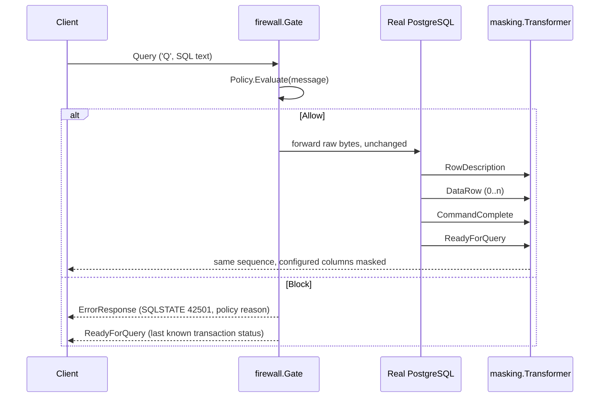

# PostgreSQL wire protocol support

This document describes exactly what SentinelDB parses, forwards, masks,
and rejects at the PostgreSQL wire-protocol level. It is a precise
description of `internal/protocol`, `internal/firewall`, and
`internal/masking` — not an aspirational one. If something isn't listed
here as supported, assume it fails closed.

## Supported frontend (client → server) messages

Parsed by `internal/protocol.Decoder` (client decoder) and evaluated by
`firewall.Gate`:

| Message | Tag | Handling |
|---|---|---|
| `StartupMessage` | *(no tag; length-prefixed)* | Parsed for protocol version and startup parameters, forwarded unchanged. |
| `SSLRequest` | *(no tag; code `80877103`)* | **Never forwarded.** Gate responds `'N'` directly. |
| `GSSENCRequest` | *(no tag; code `80877104`)* | **Never forwarded.** Gate responds `'N'` directly. |
| `CancelRequest` | *(no tag; code `80877102`)* | Recognized and logged; carried on its own short-lived connection per the PostgreSQL protocol, which is not proxied further. |
| `Query` (`'Q'`) | `Q` | The **only** query-execution path evaluated by the firewall `Policy` and forwarded if allowed. |
| `Terminate` (`'X'`) | `X` | Forwarded unchanged (not policy-evaluated; it carries no SQL). |
| `PasswordMessage` (`'p'`) | `p` | Forwarded unchanged (part of the plaintext authentication handshake; see [SSLRequest rejection](#sslrequest--gssencrequest-rejection)). |
| `FunctionCall` (`'F'`) | `F` | Recognized/named by the decoder but not policy-evaluated; forwarded unchanged like any other non-`Query` message. |
| `CopyData`/`CopyDone`/`CopyFail` | `d`/`c`/`f` | Recognized by the decoder for naming/logging purposes; see [COPY limitation](#copy-limitation) — in practice unreachable because the response-side `CopyInResponse`/`CopyOutResponse`/`CopyBothResponse` that would start a COPY subprotocol is fail-closed. |

## Rejected frontend messages: Extended Query Protocol

`Parse` (`'P'`), `Bind` (`'B'`), `Execute` (`'E'`), `Describe` (`'D'`),
`Close` (`'C'`), `Sync` (`'S'`), and `Flush` (`'H'`) are all explicitly
**rejected**, not silently forwarded:

- The gateway writes an `ErrorResponse` (SQLSTATE `0A000`, "feature not
  supported") to the client.
- The connection is then closed (`firewall.ErrUnsupportedProtocol`).

This is deliberate: these messages can carry arbitrary SQL (in `Parse`)
or execute previously-parsed statements (`Bind`/`Execute`) without ever
appearing as a `Query` message. Forwarding them unevaluated would let a
client bypass the firewall policy entirely. Implementing the full
protocol correctly — including the "skip to next `Sync`" resynchronization
semantics required after an error mid-extended-protocol, connection-scoped
prepared-statement/portal tracking, and masking across the Extended Query
flow — is out of scope for V1; see
[docs/design/0001-extended-query.md](design/0001-extended-query.md) for
the full design and the [README roadmap](../README.md#roadmap).

**Practical impact:** clients/drivers that default to prepared-statement
execution (e.g. `pgx`, `psycopg`'s prepared-statement mode) must be
configured to use simple-protocol execution, or every query will fail
with the error above.

### Typed parsing (no behavior change)

`internal/protocol.Decoder` now typed-parses the body of each of these
seven message types (`internal/protocol/extended.go`:
`ParseFrontendParse`, `ParseFrontendBind`, `ParseFrontendDescribe`,
`ParseFrontendExecute`, `ParseFrontendClose`, `ParseFrontendFlush`,
`ParseFrontendSync`) into typed structs (`ParseMessage`, `BindMessage`,
`DescribeMessage`, `ExecuteMessage`, `CloseMessage`) exposed on
`protocol.Message`'s `Parse`/`Bind`/`Describe`/`Execute`/`Close` fields.
This is **parsing only** — it exists so later implementation stages (see
the design document linked above) don't have to add wire-format parsing
at the same time as protocol-state, forwarding, and policy changes.

**This does not change runtime behavior.** `firewall.Gate` still checks
`isExtendedProtocolMessage` before any policy decision and rejects every
Extended Query message exactly as described above, whether or not it
parsed successfully. A message that now parses cleanly is **not**
thereby allowed through — the typed struct is simply attached to the
`Message` value that `Gate` immediately rejects.

**Malformed input fails closed the same way oversized/corrupt messages
already did:** if a `Parse`/`Bind`/`Describe`/`Execute`/`Close`/`Flush`/
`Sync` message's body fails wire-format validation (bad boundaries,
missing NUL terminators, a declared count/length that doesn't match the
actual payload, an out-of-range format code, a `Bind` parameter
format-code count that is neither `0`, `1`, nor equal to the parameter
count, etc.), the decoder does not emit a message at all — it calls the
same `onError`/fail-closed path used for any other undecodable message
(`Decoder.fail`, surfaced to callers as `firewall.ErrDecodeFailed`, see
[Fragmentation handling](#fragmentation-handling)). Errors returned by
these parsers (`protocol.ExtendedParseError`) never include the raw
payload, parameter values, or SQL text — only the message type and a
fixed validation-failure category.

**Two fields deliberately match PostgreSQL's real server behavior rather
than a naive reading of the wire format:**

- `Bind`'s parameter format-code count is validated against the
  documented PostgreSQL rule (`backend/tcop/postgres.c`,
  `exec_bind_message`): `0` (all parameters default to text), `1` (one
  code applies to every parameter, valid even when there are zero
  parameters), or exactly equal to the parameter count are all accepted;
  any other value is rejected (`CategoryInvalidFormatCount`).
- `Execute`'s maximum-row-count field is read as a full signed `Int32`
  and never rejected for being negative — PostgreSQL's own backend
  (`backend/tcop/pquery.c`, `PortalRun`) treats any `count <= 0`,
  negative or zero, as `FETCH_ALL`. `ExecuteMessage.MaxRows` preserves
  the wire value exactly as sent.

### Connection-local state model (no runtime wiring)

`internal/protocol/extended_state.go` adds a standalone, connection-local
state model (`protocol.State`) that tracks prepared-statement and portal
*generations*, a FIFO pending-operation queue for future backend-
acknowledgement correlation, and `Sync`-delimited cycle identities, per
the design document's "Object generations" and "Explicit pipeline-cycle
identities" sections linked above.

**This is a pure data structure, not a running component.** It performs no
I/O, starts no goroutines, does no logging, and is **not constructed or
called anywhere in `cmd/gateway`, `firewall.Gate`, or
`masking.Transformer`**. It exists purely so the connection-state
machinery a later stage needs (pending-operation correlation, `Parse`
policy evaluation, local rejection/`Sync` recovery — see the design
document's "Implementation decomposition") can be built and tested in
isolation, without touching anything that affects a live connection today.

**Extended Query is still rejected fail-closed at runtime, exactly as
before.** Nothing described in this section changes `firewall.Gate`'s
behavior: `isExtendedProtocolMessage` still rejects every `Parse`/`Bind`/
`Describe`/`Execute`/`Close`/`Flush`/`Sync` message before any policy
decision, unconditionally. Building `protocol.State` does not change
anything described elsewhere in this document — it remains a groundwork
data structure for a future stage, not a currently supported feature.

**`Close` may capture a still-pending target.** `CreateCloseStatement`/
`CreateClosePortal` resolve their target the same committed-or-pending way
`Describe`/`Bind`/`Execute` do, not committed-only — this correctly
supports a pipelined `Parse`/`Bind` immediately followed by a `Close` for
the same name, sent before the real server's `ParseComplete`/`BindComplete`
has been observed. The captured generation is an immutable snapshot; a
later name-mapping change never retargets an already-created `Close`.

**Every value `protocol.State` returns is an independent deep copy.**
`Resolve*`/`Committed*`/`Statement`/`Portal`/`PendingOperations`, and every
`Create*`/`ApplyParseComplete`/`ApplyBindComplete` return value, is copied
out of the internally owned map/queue entry — including slice fields
(`ParamOIDs`, `ParamFormats`, `ParamNulls`, `ResultFormats`). Mutating a
returned value can never corrupt `State`'s internal data; the only way to
change `State` is through its own methods.

### Backend-response correlator (no runtime wiring)

`internal/protocol/extended_correlation.go` adds a standalone
`protocol.BackendCorrelator` that accepts decoded backend `protocol.Message`
values, identifies the current pending Extended Query operation from
`protocol.State`'s FIFO queue, validates the backend response shape
(`ParseComplete`/`BindComplete`/`CloseComplete`/`NoData`/
`EmptyQueryResponse`/`PortalSuspended` empty bodies, `ReadyForQuery`'s status
byte, `ParameterDescription`'s OID list, `CommandComplete`'s tag framing,
`ErrorResponse`'s field framing), and applies the correct transition to
`State`. Like `protocol.State` itself, it is a pure, connection-local
component: no I/O, no goroutines, no logging, no retained raw frames, SQL,
or Bind parameter values — every method call is synchronous and every
returned `CorrelationResult` is a bounded, safe value (message type,
disposition flags, operation/cycle IDs, and operation snapshots — never raw
bytes, SQL text, names, or server error/command-tag strings).

**A real backend `ErrorResponse` abandons later same-cycle pending
operations.** Per the documented protocol contract, once PostgreSQL emits an
`ErrorResponse`, it silently discards every later frontend command in that
same `Sync`-delimited cycle until the matching `Sync`. `State.ApplyErrorResponseAndAbandonCycle`
models this atomically: it fails the genuinely-erroring head operation,
removes every later same-cycle pending operation (stopping before that
cycle's own `Sync`, which is always preserved), leaves every other cycle
untouched, and returns independent snapshots of both the failed and the
abandoned operations.

**Skipped unnamed replacements are rolled back, because PostgreSQL never
processed them.** An unnamed `Parse`/`Bind` that gets abandoned this way
was never processed by the real server — unlike a normal `ErrorResponse`
for that exact operation, which means the server *did* process it and
already destroyed the previous unnamed object. `State` therefore records an
immutable rollback snapshot of the previous unnamed statement/portal
generation at unnamed-`Parse`/`Bind`-creation time, and restores it when
(and only when) the newer replacement is itself abandoned as
server-skipped — correctly unwinding multiple speculative unnamed
replacements in reverse (LIFO) order. A generation that is still a live
rollback target is kept alive through cleanup even when nothing else
references it, and the restore is always defensive (it never restores a
target that has since been legitimately destroyed by some other event,
such as `ReadyForQuery('I')` transaction-boundary portal invalidation —
falling back to "empty" is always safe, a dangling pointer never is).

**`Sync -> ErrorResponse -> ReadyForQuery` is a valid sequence, not a
failure.** PostgreSQL can emit an `ErrorResponse` while processing `Sync`
itself; per the protocol documentation this does **not** begin
discard-until-`Sync` (the message being processed is already `Sync`), and
PostgreSQL still emits exactly one `ReadyForQuery` for that `Sync`. The
correlator recognizes a structurally valid `ErrorResponse` received while
`Sync` is the pending head as valid: it neither pops nor completes the
`Sync`, abandons nothing, and mutates no statement/portal/cycle/transaction
state — it returns an intermediate result identifying the still-pending
`Sync`, and the following `ReadyForQuery` completes that same `Sync`
normally. A second `ErrorResponse` for the same still-pending `Sync` is
rejected as impossible backend ordering, without mutation.

**`CorrelationResult` never carries client-supplied names.**
`FailedOperation` and `AbandonedOperations` use a dedicated
`CorrelatedOperation` snapshot type (operation ID, cycle, kind, and target
generation ID only) rather than `State`'s own `PendingOperation`, which
carries the statement/portal name the client supplied. Every value
returned this way is an independent copy — mutating a returned
`CorrelatedOperation` or its containing slice can never affect `State` or
a later correlation result.

**Asynchronous backend messages (`NoticeResponse`/`ParameterStatus`/
`NotificationResponse`) are structurally validated, never retained.** The
correlator checks each message's wire framing (field framing for
`NoticeResponse`, exactly two NUL-terminated strings for
`ParameterStatus`, a process ID followed by two NUL-terminated strings for
`NotificationResponse`) and rejects malformed bodies without touching any
pending operation or `Describe` substate — but the field/string/PID
*values* themselves are never read into a Go string, returned, or stored;
only their framing (NUL-terminator positions) is inspected.

**None of this is wired into runtime networking or client output.**
`BackendCorrelator` is not constructed or called anywhere in
`cmd/gateway`, `firewall.Gate`, or `masking.Transformer`. Extended Query
is still rejected fail-closed at runtime, exactly as described above —
this component exists purely so the correlation logic a later stage needs
can be built and tested in isolation.

### Response sequencer (no runtime wiring)

`internal/protocol/extended_sequence.go` adds a standalone
`protocol.ResponseSequencer` that combines three inputs into a single,
correctly-ordered stream of client-output actions: response-plan events
registered by frontend processing (`AddForwardedOperation`), decoded
backend messages (`HandleBackendMessage`, which uses a `BackendCorrelator`
internally), and locally generated synthetic `ErrorResponse` frames
(`AddSyntheticError`, for a future policy-rejection path that never
reaches the real server). Like `protocol.State` and
`protocol.BackendCorrelator`, it is a pure, connection-local component: no
socket I/O, no goroutines, no logging. Every `OutputAction` it returns
carries only safe metadata (an action kind, message type, cycle/operation
identifiers, and an independent copy of the exact bytes to relay) — never
a client-supplied statement/portal name.

**Registration-before-forwarding is a caller contract, not something the
sequencer enforces by watching the network.** A caller must call the
matching `State.Create*` method, then `AddForwardedOperation` with the
returned snapshot, and only afterward actually write the original
frontend bytes upstream. `Sync` is registered the same way as any other
operation (`Flush` and `Terminate` have no backend acknowledgement and
never get a plan unit at all). Any backend message that arrives without a
matching, correctly-ordered plan registration is rejected fail-closed
(`ErrPlanMismatch`, `ErrNoPendingOperation`) without touching `State`.

**A queued synthetic error only ever emits once it reaches the plan
head.** If the plan is empty, `AddSyntheticError` emits its frame
immediately ("blocked-first"). If a forwarded operation is still ahead of
it, the synthetic waits — the sequencer drains every synthetic unit newly
exposed at the head immediately after any real backend message completes
or fails the operation in front of it, so a client always sees completed
real work before a synthetic rejection that was queued behind it.

**A real backend `ErrorResponse` takes precedence over an already-queued
synthetic for the same cycle.** Once the real server reports a real
failure, every operation it abandoned in that cycle (per
`BackendCorrelator`/`State`'s existing same-cycle abandonment) is removed
from the plan without producing output, and any synthetic error still
queued for that same cycle is suppressed — it is never emitted, since the
real failure already accounts for that cycle's error to the client. An
abandoned operation whose plan registration hasn't arrived yet is
tombstoned so a later, contract-violating `AddForwardedOperation` call for
it is rejected rather than silently treated as live; a duplicate
`AddSyntheticError` for an already-blocked cycle (whether blocked by our
own earlier synthetic or by a real failure) is silently suppressed, one
documented rule for both cases.

**`Sync -> ErrorResponse -> ReadyForQuery` passes straight through.**
Matching `BackendCorrelator`'s own handling of this valid PostgreSQL
sequence, the sequencer relays the `ErrorResponse` frame without popping
the `Sync` plan unit or touching any cycle bookkeeping; the following
`ReadyForQuery` completes that same `Sync` normally.

**Asynchronous backend messages never touch the plan.**
`NoticeResponse`/`ParameterStatus`/`NotificationResponse` are relayed
(after `BackendCorrelator`'s own structural validation) regardless of
what the current plan head is, and never affect its readiness.

**An `ErrorResponse` with no pending `State` operation at all is treated
as a connection-level backend failure.** The sequencer relays the frame
and then reports that the connection must be terminated
(`ActionTerminateConnection`) — no plan/`State` interaction is attempted,
and the sequencer permanently stops accepting further calls
(`ErrSequencerTerminal`) afterward.

**Bounded by construction.** `SequencerLimits` caps the plan queue depth,
a single synthetic frame's size, the number of abandoned-operation
tombstones retained, and the number of concurrently tracked cycles — all
must be positive. Limit failures reject the call without any partial
mutation. All per-cycle bookkeeping (block state, tombstones) is released
the moment that cycle's matching `ReadyForQuery` is processed, regardless
of how many other cycles remain outstanding.

**Abandoned-operation tombstone capacity is a correctness limit, not a
best-effort cache.** When a real backend `ErrorResponse` abandons later
same-cycle operations, every abandoned operation that has no
already-registered plan unit to remove directly *requires* a tombstone
(otherwise a later, contract-violating `AddForwardedOperation` call for
that same operation ID could be wrongly accepted as live). The sequencer
computes the complete set of newly required tombstones *before* mutating
anything and only ever applies the transition atomically: if the full set
fits within `SequencerLimits.MaxAbandonedTombstones`, every tombstone is
recorded, the abandoned plan units are removed, and same-cycle synthetic
units are suppressed, all at once; if it does not fit, **zero** mutation
is applied for that failure — live tombstones are never silently evicted
and a partial tombstone set is never recorded. Instead, the real
`ErrorResponse` is relayed exactly once, `ActionTerminateConnection` is
returned immediately after it, and the sequencer transitions permanently
to its terminal state (`ErrSequencerTerminal` for every subsequent
`AddForwardedOperation`/`AddSyntheticError`/`HandleBackendMessage` call).
This is a resource-exhaustion fail-closed connection termination, exactly
like the "no pending operation at all" connection-level `ErrorResponse`
case above — retaining incomplete abandonment-tracking state and
continuing as if the sequencer were still fully correct is never an
option.

**None of this is wired into runtime networking or client output.**
`ResponseSequencer` is not constructed or called anywhere in
`cmd/gateway`, `firewall.Gate`, or `masking.Transformer`. Extended Query
is still rejected fail-closed at runtime, exactly as described above —
this component exists purely so the response-ordering logic a later stage
needs can be built and tested in isolation.

### Standalone event-driven runtime loop (no runtime wiring)

`internal/gateway/extended_runtime.go` adds a standalone,
connection-local `gateway.ExtendedRuntime` that combines frontend
operation requests, locally generated synthetic `ErrorResponse` events,
and decoded backend-frame events into a single ordered stream of client
writes, using the `protocol.ResponseSequencer` described above
internally. It lives in a new `internal/gateway` package — deliberately
*not* inside `internal/protocol`, which every Extended Query component so
far has kept free of I/O and goroutines by design — following the same
dependency direction already used by `internal/firewall` and
`internal/masking` (both depend on `internal/protocol`, never the
reverse).

Unlike the earlier Extended Query components, `ExtendedRuntime` *does*
use goroutines, channels, and real `net.Conn`-shaped I/O
(`io.ReadCloser`/`io.WriteCloser`).

**`ExtendedRuntime` exclusively owns `protocol.State` while running.**
`protocol.State` is designed for serial access by a single goroutine.
`NewExtendedRuntime` accepts a freshly constructed `*protocol.State`
purely for dependency injection — from the moment `Run` starts, the
event-loop goroutine is `State`'s sole owner and sole mutator, and no
public method ever exposes the underlying `*State`. Frontend producers
never call `State.Create*`/`Apply*`/lookup methods themselves; instead
they submit a `FrontendOperationRequest` (statement/portal names, query
text, parameter OIDs/format codes/null flags/result formats — **never**
Bind parameter *values*) via `RegisterFrontendOperation`, which copies
every slice field before it crosses the channel boundary. The event loop
calls the matching `State.Create*` method and registers the result with
`ResponseSequencer` in the *same* turn, returning an immutable
`FrontendRegistration` snapshot only once both steps — plus processing of
any output actions they immediately produced — have fully succeeded. A
future frontend caller may forward the original frontend frame upstream
only after that success.

**State/sequencer divergence fails the connection closed.** Creating a
`State` operation and registering it with the sequencer are two separate
steps; if `State.Create*` itself fails (e.g. an unknown statement name),
that is guaranteed mutation-free and is returned as an ordinary rejection
— the runtime stays healthy. But if `State.Create*` *succeeds* and the
following `ResponseSequencer.AddForwardedOperation` call fails (e.g. plan
capacity exhausted), `State` has already mutated while the sequencer's
plan does not reflect it — an unrecoverable divergence. The runtime never
attempts a speculative rollback; it returns `ErrFrontendRegistrationDiverged`,
permanently terminates, and closes both connections. No caller is ever
told it can safely retry or forward a frame after this.

**Accepted frontend submissions always resolve definitively.** Caller
context cancellation can only abort a `RegisterFrontendOperation` /
`SubmitSyntheticError` call *before* the request is enqueued into the
runtime-owned channel. Once enqueued, ownership transfers to the runtime
and the caller is guaranteed one of exactly two outcomes: the event
loop's own acknowledgement, or runtime termination — never an ambiguous
`ctx.Err()` for an event that may already be in flight or already
processed.

**Truncated backend messages at end-of-input fail closed, not clean.**
`protocol.Decoder.Finalize()` reports whether any buffered-but-incomplete
bytes remain (a partial header, a frame with a truncated body, or a
complete frame followed by a partial next one) without exposing their
content. The backend reader calls it whenever the upstream read returns
EOF: a truncated remainder is treated as a backend protocol failure
(never both a decode failure and a clean stop for the same read-ending),
even when the sequencer has no other pending work — a real PostgreSQL
frame cannot be recovered from mid-message.

One backend-reader goroutine decodes bytes from the upstream connection
into `protocol.Message` values and feeds them, and its own read/decode/
truncation failures, through a bounded channel; one event-loop goroutine
— the **only** component that ever touches `State`, calls
`ResponseSequencer`, or writes to the client — drains that channel and a
second, separate bounded channel of frontend events. The backend reader
applies real backpressure: a full backend event channel blocks further
reads from the real upstream socket rather than dropping frames. The
runtime owns shutdown of both connections itself — closing them is what
unblocks an in-progress blocked `Read`/`Write` call, since context
cancellation alone cannot interrupt an arbitrary `io.Reader`/`io.Writer`.

**This is still not part of the live gateway.** `ExtendedRuntime` is not
constructed or called anywhere in `cmd/gateway`, `firewall.Gate`, or
`masking.Transformer` — it has no call site outside its own tests.
Extended Query is still rejected fail-closed at runtime, exactly as
described above; this component exists purely so the event-driven
execution shell a later integration stage needs (wiring `firewall.Gate`
as the frontend producer, connecting the real upstream socket) can be
built and tested in isolation first.

## SSLRequest / GSSENCRequest rejection

SentinelDB always answers `SSLRequest` and `GSSENCRequest` with a single
`'N'` byte ("encryption refused") and never forwards them to the real
server. This is a deliberate design constraint, not a missing feature:
the gateway needs to see plaintext PostgreSQL traffic to evaluate
queries and mask results, so it refuses encryption negotiation up front
rather than terminating/re-originating TLS. After receiving `'N'`, a
compliant client falls back to a plaintext `StartupMessage`, which the
decoder is already waiting for (`Decoder.consumeStartup` returns to
`phaseStartup` after emitting the SSL/GSS rejection).

This means **all traffic through SentinelDB is plaintext**, including
authentication (`PasswordMessage`). See
[docs/threat-model.md](threat-model.md) for the implications.

## Simple Query flow

The only query-execution path SentinelDB evaluates:

The blocked path never reaches the real server at all — the `Query`
message's raw bytes are simply not written to `target`.

## RowDescription parsing

`protocol.ParseRowDescription` decodes the backend `'T'` message body
(field count, then for each field: null-terminated name, `TableOID`
(4B), `Attribute` (2B), `DataTypeOID` (4B), `DataTypeSize` (2B),
`TypeModifier` (4B), `FormatCode` (2B)) into a `[]RowField`. The
`Transformer` stores this per-result-set field list and, for each field
whose name case-insensitively matches a configured masking column
(`masking.Config.ShouldMask`), records its index for masking on the
following `DataRow` messages. `RowDescription` itself is **never
rewritten** — only column *values*, in the subsequent `DataRow`
messages, are ever changed.

Parsing is defensive: truncated bodies, missing null terminators, or a
field count that doesn't consume exactly the message body all produce
an explicit error (never a panic), which the `Transformer` turns into a
fail-closed connection close.

## DataRow parsing and rebuilding

`protocol.ParseDataRow` decodes the backend `'D'` message body (field
count, then for each field: a 4-byte length — `-1` means SQL `NULL` —
followed by that many raw bytes) into a `[]DataCell`. If the parsed cell
count doesn't match the last `RowDescription`'s field count, the
`Transformer` fails closed rather than mask against a stale/wrong
schema.

For each column configured for masking, the `Transformer`:

1. Skips `NULL` cells entirely (the plugin is never invoked for them).
2. Rejects (fail-closed) any masked column whose `FormatCode != 0` — see
   [Binary format limitation](#binary-format-limitation).
3. Calls the Wasm plugin's `mask_value` operation with the cell's raw
   bytes interpreted as a UTF-8 string (see
   [plugin-api.md](plugin-api.md)).
4. If the plugin reports the value changed, replaces that cell via
   `DataRow.WithCell` (which returns a new `DataRow`, leaving the
   original untouched, and always preserves the cell count).

If **any** cell in the row was changed, the whole row is re-serialized
via `DataRow.Build()` — which recomputes each cell's length prefix and
the overall message length from the current cell contents — and that
rebuilt row is sent to the client instead of the original bytes. If
**no** cell changed (nothing configured to mask matched, or the plugin
reported `changed=false` for every value, e.g. non-email-shaped input)
the original raw bytes are forwarded unmodified, avoiding unnecessary
re-serialization.

## ReadyForQuery transaction state

The backend `'Z'` (`ReadyForQuery`) message carries a single status
byte: `'I'` (idle), `'T'` (in a transaction), or `'E'` (failed
transaction, waiting for `ROLLBACK`). The `Transformer` observes every
real `ReadyForQuery` from the server and stores its status byte in a
shared `*protocol.TxState`. When `firewall.Gate` synthesizes its own
`ReadyForQuery` after blocking a query, it reads that same `TxState`
instead of hardcoding `'I'` — so blocking a query in the middle of a
multi-statement transaction correctly reports "still in a transaction",
not "idle", preserving the client's ability to detect it needs to abort
that transaction rather than assuming it can proceed as if nothing
happened.

## COPY limitation

SentinelDB V1 does not support the `COPY` protocol in either direction.
When the `Transformer` sees a backend `CopyInResponse`, `CopyOutResponse`,
or `CopyBothResponse` message — the messages that would initiate a COPY
data stream — it fails closed immediately rather than attempting to
parse or mask the `CopyData` stream that would follow. `CopyData` frames
do not follow the `RowDescription`/`DataRow` framing that the masking
logic understands, so allowing COPY through unmasked (or attempting to
mask it incorrectly) is not an acceptable trade-off in this version.

## Fragmentation handling

TCP delivers a byte stream, not message boundaries; a single `Read()`
may return a partial message, multiple messages, or a message split
across several `Read()` calls. `protocol.Decoder` handles this
statefully: `Write()` appends whatever bytes just arrived to an internal
buffer, then repeatedly tries to consume one complete message from the
front of that buffer (`consumeStartup`/`consumeNormal`, both of which
check `len(buf)` against the declared length before slicing). If a full
message isn't available yet, `Write()` simply returns and waits for the
next call to supply the rest — no message is ever emitted from a partial
read, and no bytes are ever double-processed or dropped across calls.

This is why `Gate.Run` and `Transformer.Run` both read into a 32 KiB
scratch buffer in a loop and feed *whatever was read* to the decoder,
rather than assuming a `Read()` call returns exactly one message.

## Binary format limitation

PostgreSQL's wire protocol allows each result column to be returned in
either text format (`FormatCode == 0`) or binary format (`FormatCode ==
1`), signaled per-column in `RowDescription`. SentinelDB V1's masking
only understands the text format: `DataCell.Value` is treated as UTF-8
text when masking is applied. If a column configured for masking is
returned with `FormatCode != 0` (binary), the `Transformer` fails closed
(`"maskelenecek sutun %q ikili (binary) formatta, V1 bunu desteklemiyor"`)
rather than attempt to interpret binary bytes as text and risk silently
corrupting the value or failing to mask it correctly. Simple Query
Protocol results are text format by default for standard clients like
`psql`/libpq, so this limitation is mainly relevant to clients that
explicitly request binary result formatting.
