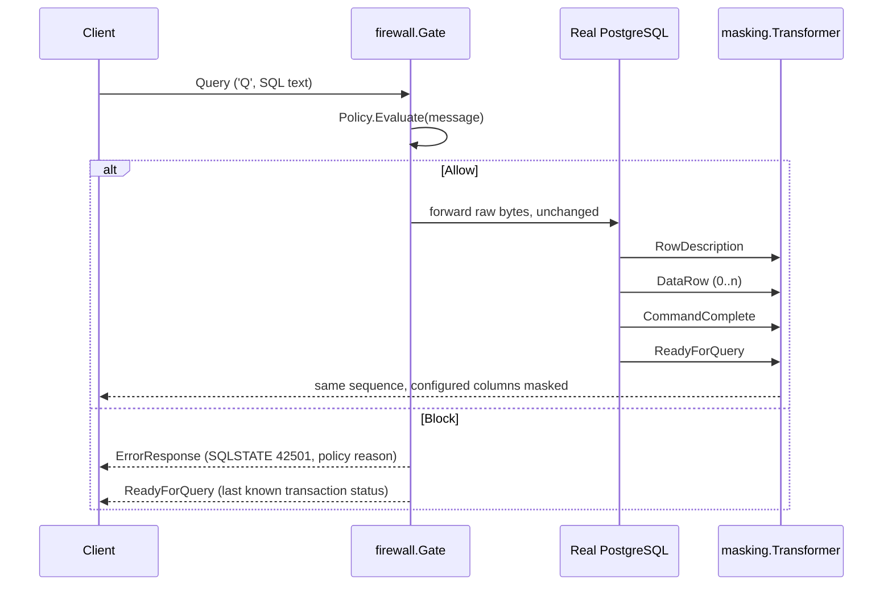

# PostgreSQL wire protocol support

This document describes exactly what SentinelDB parses, forwards, masks,
and rejects at the PostgreSQL wire-protocol level. It is a precise
description of `internal/protocol`, `internal/firewall`, and
`internal/masking` — not an aspirational one. If something isn't listed
here as supported, assume it fails closed.

## Supported frontend (client → server) messages

Parsed by `internal/protocol.Decoder` (client decoder) and evaluated by
`firewall.Gate`:

| Message | Tag | Handling |
|---|---|---|
| `StartupMessage` | *(no tag; length-prefixed)* | Parsed for protocol version and startup parameters, forwarded unchanged. |
| `SSLRequest` | *(no tag; code `80877103`)* | **Never forwarded.** Gate responds `'N'` directly. |
| `GSSENCRequest` | *(no tag; code `80877104`)* | **Never forwarded.** Gate responds `'N'` directly. |
| `CancelRequest` | *(no tag; code `80877102`)* | Recognized and logged; carried on its own short-lived connection per the PostgreSQL protocol, which is not proxied further. |
| `Query` (`'Q'`) | `Q` | The **only** query-execution path evaluated by the firewall `Policy` and forwarded if allowed. |
| `Terminate` (`'X'`) | `X` | Forwarded unchanged (not policy-evaluated; it carries no SQL). |
| `PasswordMessage` (`'p'`) | `p` | Forwarded unchanged (part of the plaintext authentication handshake; see [SSLRequest rejection](#sslrequest--gssencrequest-rejection)). |
| `FunctionCall` (`'F'`) | `F` | Recognized/named by the decoder but not policy-evaluated; forwarded unchanged like any other non-`Query` message. |
| `CopyData`/`CopyDone`/`CopyFail` | `d`/`c`/`f` | Recognized by the decoder for naming/logging purposes; see [COPY limitation](#copy-limitation) — in practice unreachable because the response-side `CopyInResponse`/`CopyOutResponse`/`CopyBothResponse` that would start a COPY subprotocol is fail-closed. |

## Rejected frontend messages: Extended Query Protocol

`Parse` (`'P'`), `Bind` (`'B'`), `Execute` (`'E'`), `Describe` (`'D'`),
`Close` (`'C'`), `Sync` (`'S'`), and `Flush` (`'H'`) are all explicitly
**rejected**, not silently forwarded:

- The gateway writes an `ErrorResponse` (SQLSTATE `0A000`, "feature not
  supported") to the client.
- The connection is then closed (`firewall.ErrUnsupportedProtocol`).

This is deliberate: these messages can carry arbitrary SQL (in `Parse`)
or execute previously-parsed statements (`Bind`/`Execute`) without ever
appearing as a `Query` message. Forwarding them unevaluated would let a
client bypass the firewall policy entirely. Implementing the full
protocol correctly — including the "skip to next `Sync`" resynchronization
semantics required after an error mid-extended-protocol, connection-scoped
prepared-statement/portal tracking, and masking across the Extended Query
flow — is out of scope for V1; see
[docs/design/0001-extended-query.md](design/0001-extended-query.md) for
the full design and the [README roadmap](../README.md#roadmap).

**Practical impact:** clients/drivers that default to prepared-statement
execution (e.g. `pgx`, `psycopg`'s prepared-statement mode) must be
configured to use simple-protocol execution, or every query will fail
with the error above.

### Typed parsing (no behavior change)

`internal/protocol.Decoder` now typed-parses the body of each of these
seven message types (`internal/protocol/extended.go`:
`ParseFrontendParse`, `ParseFrontendBind`, `ParseFrontendDescribe`,
`ParseFrontendExecute`, `ParseFrontendClose`, `ParseFrontendFlush`,
`ParseFrontendSync`) into typed structs (`ParseMessage`, `BindMessage`,
`DescribeMessage`, `ExecuteMessage`, `CloseMessage`) exposed on
`protocol.Message`'s `Parse`/`Bind`/`Describe`/`Execute`/`Close` fields.
This is **parsing only** — it exists so later implementation stages (see
the design document linked above) don't have to add wire-format parsing
at the same time as protocol-state, forwarding, and policy changes.

**This does not change runtime behavior.** `firewall.Gate` still checks
`isExtendedProtocolMessage` before any policy decision and rejects every
Extended Query message exactly as described above, whether or not it
parsed successfully. A message that now parses cleanly is **not**
thereby allowed through — the typed struct is simply attached to the
`Message` value that `Gate` immediately rejects.

**Malformed input fails closed the same way oversized/corrupt messages
already did:** if a `Parse`/`Bind`/`Describe`/`Execute`/`Close`/`Flush`/
`Sync` message's body fails wire-format validation (bad boundaries,
missing NUL terminators, a declared count/length that doesn't match the
actual payload, an out-of-range format code, a `Bind` parameter
format-code count that is neither `0`, `1`, nor equal to the parameter
count, etc.), the decoder does not emit a message at all — it calls the
same `onError`/fail-closed path used for any other undecodable message
(`Decoder.fail`, surfaced to callers as `firewall.ErrDecodeFailed`, see
[Fragmentation handling](#fragmentation-handling)). Errors returned by
these parsers (`protocol.ExtendedParseError`) never include the raw
payload, parameter values, or SQL text — only the message type and a
fixed validation-failure category.

**Two fields deliberately match PostgreSQL's real server behavior rather
than a naive reading of the wire format:**

- `Bind`'s parameter format-code count is validated against the
  documented PostgreSQL rule (`backend/tcop/postgres.c`,
  `exec_bind_message`): `0` (all parameters default to text), `1` (one
  code applies to every parameter, valid even when there are zero
  parameters), or exactly equal to the parameter count are all accepted;
  any other value is rejected (`CategoryInvalidFormatCount`).
- `Execute`'s maximum-row-count field is read as a full signed `Int32`
  and never rejected for being negative — PostgreSQL's own backend
  (`backend/tcop/pquery.c`, `PortalRun`) treats any `count <= 0`,
  negative or zero, as `FETCH_ALL`. `ExecuteMessage.MaxRows` preserves
  the wire value exactly as sent.

### Connection-local state model (no runtime wiring)

`internal/protocol/extended_state.go` adds a standalone, connection-local
state model (`protocol.State`) that tracks prepared-statement and portal
*generations*, a FIFO pending-operation queue for future backend-
acknowledgement correlation, and `Sync`-delimited cycle identities, per
the design document's "Object generations" and "Explicit pipeline-cycle
identities" sections linked above.

**This is a pure data structure, not a running component.** It performs no
I/O, starts no goroutines, does no logging, and is **not constructed or
called anywhere in `cmd/gateway`, `firewall.Gate`, or
`masking.Transformer`**. It exists purely so the connection-state
machinery a later stage needs (pending-operation correlation, `Parse`
policy evaluation, local rejection/`Sync` recovery — see the design
document's "Implementation decomposition") can be built and tested in
isolation, without touching anything that affects a live connection today.

**Extended Query is still rejected fail-closed at runtime, exactly as
before.** Nothing described in this section changes `firewall.Gate`'s
behavior: `isExtendedProtocolMessage` still rejects every `Parse`/`Bind`/
`Describe`/`Execute`/`Close`/`Flush`/`Sync` message before any policy
decision, unconditionally. Building `protocol.State` does not change
anything described elsewhere in this document — it remains a groundwork
data structure for a future stage, not a currently supported feature.

**`Close` may capture a still-pending target.** `CreateCloseStatement`/
`CreateClosePortal` resolve their target the same committed-or-pending way
`Describe`/`Bind`/`Execute` do, not committed-only — this correctly
supports a pipelined `Parse`/`Bind` immediately followed by a `Close` for
the same name, sent before the real server's `ParseComplete`/`BindComplete`
has been observed. The captured generation is an immutable snapshot; a
later name-mapping change never retargets an already-created `Close`.

**Every value `protocol.State` returns is an independent deep copy.**
`Resolve*`/`Committed*`/`Statement`/`Portal`/`PendingOperations`, and every
`Create*`/`ApplyParseComplete`/`ApplyBindComplete` return value, is copied
out of the internally owned map/queue entry — including slice fields
(`ParamOIDs`, `ParamFormats`, `ParamNulls`, `ResultFormats`). Mutating a
returned value can never corrupt `State`'s internal data; the only way to
change `State` is through its own methods.

### Backend-response correlator (no runtime wiring)

`internal/protocol/extended_correlation.go` adds a standalone
`protocol.BackendCorrelator` that accepts decoded backend `protocol.Message`
values, identifies the current pending Extended Query operation from
`protocol.State`'s FIFO queue, validates the backend response shape
(`ParseComplete`/`BindComplete`/`CloseComplete`/`NoData`/
`EmptyQueryResponse`/`PortalSuspended` empty bodies, `ReadyForQuery`'s status
byte, `ParameterDescription`'s OID list, `CommandComplete`'s tag framing,
`ErrorResponse`'s field framing), and applies the correct transition to
`State`. Like `protocol.State` itself, it is a pure, connection-local
component: no I/O, no goroutines, no logging, no retained raw frames, SQL,
or Bind parameter values — every method call is synchronous and every
returned `CorrelationResult` is a bounded, safe value (message type,
disposition flags, operation/cycle IDs, and operation snapshots — never raw
bytes, SQL text, names, or server error/command-tag strings).

**A real backend `ErrorResponse` abandons later same-cycle pending
operations.** Per the documented protocol contract, once PostgreSQL emits an
`ErrorResponse`, it silently discards every later frontend command in that
same `Sync`-delimited cycle until the matching `Sync`. `State.ApplyErrorResponseAndAbandonCycle`
models this atomically: it fails the genuinely-erroring head operation,
removes every later same-cycle pending operation (stopping before that
cycle's own `Sync`, which is always preserved), leaves every other cycle
untouched, and returns independent snapshots of both the failed and the
abandoned operations.

**Skipped unnamed replacements are rolled back, because PostgreSQL never
processed them.** An unnamed `Parse`/`Bind` that gets abandoned this way
was never processed by the real server — unlike a normal `ErrorResponse`
for that exact operation, which means the server *did* process it and
already destroyed the previous unnamed object. `State` therefore records an
immutable rollback snapshot of the previous unnamed statement/portal
generation at unnamed-`Parse`/`Bind`-creation time, and restores it when
(and only when) the newer replacement is itself abandoned as
server-skipped — correctly unwinding multiple speculative unnamed
replacements in reverse (LIFO) order. A generation that is still a live
rollback target is kept alive through cleanup even when nothing else
references it, and the restore is always defensive (it never restores a
target that has since been legitimately destroyed by some other event,
such as `ReadyForQuery('I')` transaction-boundary portal invalidation —
falling back to "empty" is always safe, a dangling pointer never is).

**None of this is wired into runtime networking or client output.**
`BackendCorrelator` is not constructed or called anywhere in
`cmd/gateway`, `firewall.Gate`, or `masking.Transformer`. Extended Query
is still rejected fail-closed at runtime, exactly as described above —
this component exists purely so the correlation logic a later stage needs
can be built and tested in isolation.

## SSLRequest / GSSENCRequest rejection

SentinelDB always answers `SSLRequest` and `GSSENCRequest` with a single
`'N'` byte ("encryption refused") and never forwards them to the real
server. This is a deliberate design constraint, not a missing feature:
the gateway needs to see plaintext PostgreSQL traffic to evaluate
queries and mask results, so it refuses encryption negotiation up front
rather than terminating/re-originating TLS. After receiving `'N'`, a
compliant client falls back to a plaintext `StartupMessage`, which the
decoder is already waiting for (`Decoder.consumeStartup` returns to
`phaseStartup` after emitting the SSL/GSS rejection).

This means **all traffic through SentinelDB is plaintext**, including
authentication (`PasswordMessage`). See
[docs/threat-model.md](threat-model.md) for the implications.

## Simple Query flow

The only query-execution path SentinelDB evaluates:

The blocked path never reaches the real server at all — the `Query`
message's raw bytes are simply not written to `target`.

## RowDescription parsing

`protocol.ParseRowDescription` decodes the backend `'T'` message body
(field count, then for each field: null-terminated name, `TableOID`
(4B), `Attribute` (2B), `DataTypeOID` (4B), `DataTypeSize` (2B),
`TypeModifier` (4B), `FormatCode` (2B)) into a `[]RowField`. The
`Transformer` stores this per-result-set field list and, for each field
whose name case-insensitively matches a configured masking column
(`masking.Config.ShouldMask`), records its index for masking on the
following `DataRow` messages. `RowDescription` itself is **never
rewritten** — only column *values*, in the subsequent `DataRow`
messages, are ever changed.

Parsing is defensive: truncated bodies, missing null terminators, or a
field count that doesn't consume exactly the message body all produce
an explicit error (never a panic), which the `Transformer` turns into a
fail-closed connection close.

## DataRow parsing and rebuilding

`protocol.ParseDataRow` decodes the backend `'D'` message body (field
count, then for each field: a 4-byte length — `-1` means SQL `NULL` —
followed by that many raw bytes) into a `[]DataCell`. If the parsed cell
count doesn't match the last `RowDescription`'s field count, the
`Transformer` fails closed rather than mask against a stale/wrong
schema.

For each column configured for masking, the `Transformer`:

1. Skips `NULL` cells entirely (the plugin is never invoked for them).
2. Rejects (fail-closed) any masked column whose `FormatCode != 0` — see
   [Binary format limitation](#binary-format-limitation).
3. Calls the Wasm plugin's `mask_value` operation with the cell's raw
   bytes interpreted as a UTF-8 string (see
   [plugin-api.md](plugin-api.md)).
4. If the plugin reports the value changed, replaces that cell via
   `DataRow.WithCell` (which returns a new `DataRow`, leaving the
   original untouched, and always preserves the cell count).

If **any** cell in the row was changed, the whole row is re-serialized
via `DataRow.Build()` — which recomputes each cell's length prefix and
the overall message length from the current cell contents — and that
rebuilt row is sent to the client instead of the original bytes. If
**no** cell changed (nothing configured to mask matched, or the plugin
reported `changed=false` for every value, e.g. non-email-shaped input)
the original raw bytes are forwarded unmodified, avoiding unnecessary
re-serialization.

## ReadyForQuery transaction state

The backend `'Z'` (`ReadyForQuery`) message carries a single status
byte: `'I'` (idle), `'T'` (in a transaction), or `'E'` (failed
transaction, waiting for `ROLLBACK`). The `Transformer` observes every
real `ReadyForQuery` from the server and stores its status byte in a
shared `*protocol.TxState`. When `firewall.Gate` synthesizes its own
`ReadyForQuery` after blocking a query, it reads that same `TxState`
instead of hardcoding `'I'` — so blocking a query in the middle of a
multi-statement transaction correctly reports "still in a transaction",
not "idle", preserving the client's ability to detect it needs to abort
that transaction rather than assuming it can proceed as if nothing
happened.

## COPY limitation

SentinelDB V1 does not support the `COPY` protocol in either direction.
When the `Transformer` sees a backend `CopyInResponse`, `CopyOutResponse`,
or `CopyBothResponse` message — the messages that would initiate a COPY
data stream — it fails closed immediately rather than attempting to
parse or mask the `CopyData` stream that would follow. `CopyData` frames
do not follow the `RowDescription`/`DataRow` framing that the masking
logic understands, so allowing COPY through unmasked (or attempting to
mask it incorrectly) is not an acceptable trade-off in this version.

## Fragmentation handling

TCP delivers a byte stream, not message boundaries; a single `Read()`
may return a partial message, multiple messages, or a message split
across several `Read()` calls. `protocol.Decoder` handles this
statefully: `Write()` appends whatever bytes just arrived to an internal
buffer, then repeatedly tries to consume one complete message from the
front of that buffer (`consumeStartup`/`consumeNormal`, both of which
check `len(buf)` against the declared length before slicing). If a full
message isn't available yet, `Write()` simply returns and waits for the
next call to supply the rest — no message is ever emitted from a partial
read, and no bytes are ever double-processed or dropped across calls.

This is why `Gate.Run` and `Transformer.Run` both read into a 32 KiB
scratch buffer in a loop and feed *whatever was read* to the decoder,
rather than assuming a `Read()` call returns exactly one message.

## Binary format limitation

PostgreSQL's wire protocol allows each result column to be returned in
either text format (`FormatCode == 0`) or binary format (`FormatCode ==
1`), signaled per-column in `RowDescription`. SentinelDB V1's masking
only understands the text format: `DataCell.Value` is treated as UTF-8
text when masking is applied. If a column configured for masking is
returned with `FormatCode != 0` (binary), the `Transformer` fails closed
(`"maskelenecek sutun %q ikili (binary) formatta, V1 bunu desteklemiyor"`)
rather than attempt to interpret binary bytes as text and risk silently
corrupting the value or failing to mask it correctly. Simple Query
Protocol results are text format by default for standard clients like
`psql`/libpq, so this limitation is mainly relevant to clients that
explicitly request binary result formatting.
