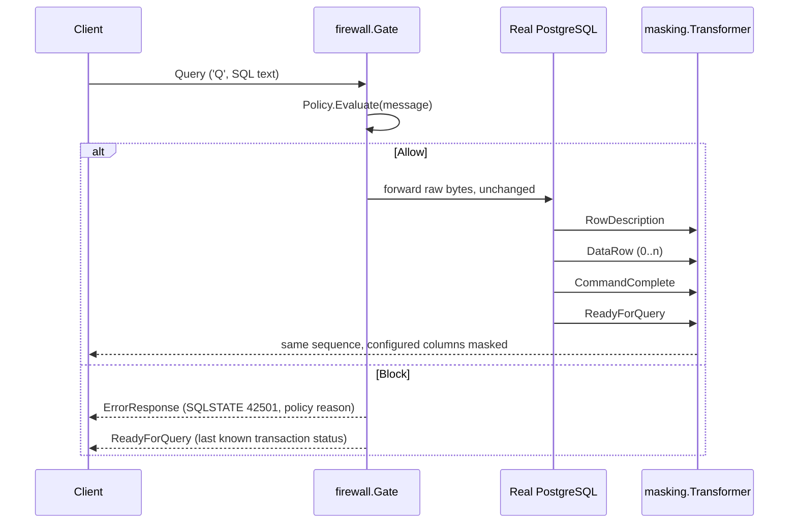

# PostgreSQL wire protocol support

This document describes exactly what SentinelDB parses, forwards, masks,
and rejects at the PostgreSQL wire-protocol level. It is a precise
description of `internal/protocol`, `internal/firewall`, and
`internal/masking` — not an aspirational one. If something isn't listed
here as supported, assume it fails closed.

## Supported frontend (client → server) messages

Parsed by `internal/protocol.Decoder` (client decoder) and evaluated by
`firewall.Gate`:

| Message | Tag | Handling |
|---|---|---|
| `StartupMessage` | *(no tag; length-prefixed)* | Parsed for protocol version and startup parameters, forwarded unchanged. |
| `SSLRequest` | *(no tag; code `80877103`)* | **Never forwarded.** Gate responds `'N'` directly. |
| `GSSENCRequest` | *(no tag; code `80877104`)* | **Never forwarded.** Gate responds `'N'` directly. |
| `CancelRequest` | *(no tag; code `80877102`)* | Recognized and logged; carried on its own short-lived connection per the PostgreSQL protocol, which is not proxied further. |
| `Query` (`'Q'`) | `Q` | The **only** query-execution path evaluated by the firewall `Policy` and forwarded if allowed. |
| `Terminate` (`'X'`) | `X` | Forwarded unchanged (not policy-evaluated; it carries no SQL). |
| `PasswordMessage` (`'p'`) | `p` | Forwarded unchanged (part of the plaintext authentication handshake; see [SSLRequest rejection](#sslrequest--gssencrequest-rejection)). |
| `FunctionCall` (`'F'`) | `F` | Recognized/named by the decoder but not policy-evaluated; forwarded unchanged like any other non-`Query` message. |
| `CopyData`/`CopyDone`/`CopyFail` | `d`/`c`/`f` | Recognized by the decoder for naming/logging purposes; see [COPY limitation](#copy-limitation) — in practice unreachable because the response-side `CopyInResponse`/`CopyOutResponse`/`CopyBothResponse` that would start a COPY subprotocol is fail-closed. |

## Rejected frontend messages: Extended Query Protocol (default)

This section describes the **default** behavior
(`protocol.extended_query_enabled: false` in `config.yaml`, which is also
the value if the `protocol:` section is omitted entirely). For the
opt-in Extended Query Protocol path, see "Opt-in Extended Query gateway
wiring" below.

`Parse` (`'P'`), `Bind` (`'B'`), `Execute` (`'E'`), `Describe` (`'D'`),
`Close` (`'C'`), `Sync` (`'S'`), and `Flush` (`'H'`) are all explicitly
**rejected**, not silently forwarded:

- The gateway writes an `ErrorResponse` (SQLSTATE `0A000`, "feature not
  supported") to the client.
- The connection is then closed (`firewall.ErrUnsupportedProtocol`).

This is deliberate: these messages can carry arbitrary SQL (in `Parse`)
or execute previously-parsed statements (`Bind`/`Execute`) without ever
appearing as a `Query` message. Forwarding them unevaluated would let a
client bypass the firewall policy entirely. An opt-in implementation now
exists (Parse-time policy evaluation, connection-scoped prepared-
statement/portal tracking, "skip to next `Sync`" resynchronization, and
masking across the Extended Query flow) — see "Opt-in Extended Query
gateway wiring" below and
[docs/design/0001-extended-query.md](design/0001-extended-query.md) for
the full design. Mixed Simple/Extended Query routing on one connection,
TLS, and `COPY` remain unimplemented even with the flag enabled.

**Practical impact when the flag is left at its default (`false`):**
clients/drivers that default to prepared-statement execution (e.g.
`pgx`, `psycopg`'s prepared-statement mode) must either be configured to
use simple-protocol execution, or the gateway must be configured with
`protocol.extended_query_enabled: true`, or every query will fail with
the error above.

### Typed parsing (no behavior change)

`internal/protocol.Decoder` now typed-parses the body of each of these
seven message types (`internal/protocol/extended.go`:
`ParseFrontendParse`, `ParseFrontendBind`, `ParseFrontendDescribe`,
`ParseFrontendExecute`, `ParseFrontendClose`, `ParseFrontendFlush`,
`ParseFrontendSync`) into typed structs (`ParseMessage`, `BindMessage`,
`DescribeMessage`, `ExecuteMessage`, `CloseMessage`) exposed on
`protocol.Message`'s `Parse`/`Bind`/`Describe`/`Execute`/`Close` fields.
This is **parsing only** — it exists so later implementation stages (see
the design document linked above) don't have to add wire-format parsing
at the same time as protocol-state, forwarding, and policy changes.

**This does not change runtime behavior.** `firewall.Gate` still checks
`isExtendedProtocolMessage` before any policy decision and rejects every
Extended Query message exactly as described above, whether or not it
parsed successfully. A message that now parses cleanly is **not**
thereby allowed through — the typed struct is simply attached to the
`Message` value that `Gate` immediately rejects.

**Malformed input fails closed the same way oversized/corrupt messages
already did:** if a `Parse`/`Bind`/`Describe`/`Execute`/`Close`/`Flush`/
`Sync` message's body fails wire-format validation (bad boundaries,
missing NUL terminators, a declared count/length that doesn't match the
actual payload, an out-of-range format code, a `Bind` parameter
format-code count that is neither `0`, `1`, nor equal to the parameter
count, etc.), the decoder does not emit a message at all — it calls the
same `onError`/fail-closed path used for any other undecodable message
(`Decoder.fail`, surfaced to callers as `firewall.ErrDecodeFailed`, see
[Fragmentation handling](#fragmentation-handling)). Errors returned by
these parsers (`protocol.ExtendedParseError`) never include the raw
payload, parameter values, or SQL text — only the message type and a
fixed validation-failure category.

**Two fields deliberately match PostgreSQL's real server behavior rather
than a naive reading of the wire format:**

- `Bind`'s parameter format-code count is validated against the
  documented PostgreSQL rule (`backend/tcop/postgres.c`,
  `exec_bind_message`): `0` (all parameters default to text), `1` (one
  code applies to every parameter, valid even when there are zero
  parameters), or exactly equal to the parameter count are all accepted;
  any other value is rejected (`CategoryInvalidFormatCount`).
- `Execute`'s maximum-row-count field is read as a full signed `Int32`
  and never rejected for being negative — PostgreSQL's own backend
  (`backend/tcop/pquery.c`, `PortalRun`) treats any `count <= 0`,
  negative or zero, as `FETCH_ALL`. `ExecuteMessage.MaxRows` preserves
  the wire value exactly as sent.

### Connection-local state model

`internal/protocol/extended_state.go` adds a standalone, connection-local
state model (`protocol.State`) that tracks prepared-statement and portal
*generations*, a FIFO pending-operation queue for future backend-
acknowledgement correlation, and `Sync`-delimited cycle identities, per
the design document's "Object generations" and "Explicit pipeline-cycle
identities" sections linked above.

**This is a pure data structure, not a running component.** It performs no
I/O, starts no goroutines, and does no logging. `cmd/gateway/main.go`'s
`runExtendedConnection` constructs one fresh `protocol.State` per
connection when `protocol.extended_query_enabled: true` and hands it to
`ExtendedRuntime`, which becomes its sole owner; `firewall.Gate.Run`/
`masking.Transformer` (the default, unchanged Simple Query path) never
construct or touch it.

**Extended Query is rejected fail-closed on the default path, exactly as
before.** Nothing described in this section changes `firewall.Gate.Run`'s
behavior: `isExtendedProtocolMessage` still rejects every `Parse`/`Bind`/
`Describe`/`Execute`/`Close`/`Flush`/`Sync` message before any policy
decision, unconditionally, whenever `protocol.extended_query_enabled` is
`false` (the default).

**`Close` may capture a still-pending target.** `CreateCloseStatement`/
`CreateClosePortal` resolve their target the same committed-or-pending way
`Describe`/`Bind`/`Execute` do, not committed-only — this correctly
supports a pipelined `Parse`/`Bind` immediately followed by a `Close` for
the same name, sent before the real server's `ParseComplete`/`BindComplete`
has been observed. The captured generation is an immutable snapshot; a
later name-mapping change never retargets an already-created `Close`.

**Every value `protocol.State` returns is an independent deep copy.**
`Resolve*`/`Committed*`/`Statement`/`Portal`/`PendingOperations`, and every
`Create*`/`ApplyParseComplete`/`ApplyBindComplete` return value, is copied
out of the internally owned map/queue entry — including slice fields
(`ParamOIDs`, `ParamFormats`, `ParamNulls`, `ResultFormats`). Mutating a
returned value can never corrupt `State`'s internal data; the only way to
change `State` is through its own methods.

### Backend-response correlator

`internal/protocol/extended_correlation.go` adds a standalone
`protocol.BackendCorrelator` that accepts decoded backend `protocol.Message`
values, identifies the current pending Extended Query operation from
`protocol.State`'s FIFO queue, validates the backend response shape
(`ParseComplete`/`BindComplete`/`CloseComplete`/`NoData`/
`EmptyQueryResponse`/`PortalSuspended` empty bodies, `ReadyForQuery`'s status
byte, `ParameterDescription`'s OID list, `CommandComplete`'s tag framing,
`ErrorResponse`'s field framing), and applies the correct transition to
`State`. Like `protocol.State` itself, it is a pure, connection-local
component: no I/O, no goroutines, no logging, no retained raw frames, SQL,
or Bind parameter values — every method call is synchronous and every
returned `CorrelationResult` is a bounded, safe value (message type,
disposition flags, operation/cycle IDs, and operation snapshots — never raw
bytes, SQL text, names, or server error/command-tag strings).

**A real backend `ErrorResponse` abandons later same-cycle pending
operations.** Per the documented protocol contract, once PostgreSQL emits an
`ErrorResponse`, it silently discards every later frontend command in that
same `Sync`-delimited cycle until the matching `Sync`. `State.ApplyErrorResponseAndAbandonCycle`
models this atomically: it fails the genuinely-erroring head operation,
removes every later same-cycle pending operation (stopping before that
cycle's own `Sync`, which is always preserved), leaves every other cycle
untouched, and returns independent snapshots of both the failed and the
abandoned operations.

**Skipped unnamed replacements are rolled back, because PostgreSQL never
processed them.** An unnamed `Parse`/`Bind` that gets abandoned this way
was never processed by the real server — unlike a normal `ErrorResponse`
for that exact operation, which means the server *did* process it and
already destroyed the previous unnamed object. `State` therefore records an
immutable rollback snapshot of the previous unnamed statement/portal
generation at unnamed-`Parse`/`Bind`-creation time, and restores it when
(and only when) the newer replacement is itself abandoned as
server-skipped — correctly unwinding multiple speculative unnamed
replacements in reverse (LIFO) order. A generation that is still a live
rollback target is kept alive through cleanup even when nothing else
references it, and the restore is always defensive (it never restores a
target that has since been legitimately destroyed by some other event,
such as `ReadyForQuery('I')` transaction-boundary portal invalidation —
falling back to "empty" is always safe, a dangling pointer never is).

**`Sync -> ErrorResponse -> ReadyForQuery` is a valid sequence, not a
failure.** PostgreSQL can emit an `ErrorResponse` while processing `Sync`
itself; per the protocol documentation this does **not** begin
discard-until-`Sync` (the message being processed is already `Sync`), and
PostgreSQL still emits exactly one `ReadyForQuery` for that `Sync`. The
correlator recognizes a structurally valid `ErrorResponse` received while
`Sync` is the pending head as valid: it neither pops nor completes the
`Sync`, abandons nothing, and mutates no statement/portal/cycle/transaction
state — it returns an intermediate result identifying the still-pending
`Sync`, and the following `ReadyForQuery` completes that same `Sync`
normally. A second `ErrorResponse` for the same still-pending `Sync` is
rejected as impossible backend ordering, without mutation.

**`CorrelationResult` never carries client-supplied names.**
`FailedOperation` and `AbandonedOperations` use a dedicated
`CorrelatedOperation` snapshot type (operation ID, cycle, kind, and target
generation ID only) rather than `State`'s own `PendingOperation`, which
carries the statement/portal name the client supplied. Every value
returned this way is an independent copy — mutating a returned
`CorrelatedOperation` or its containing slice can never affect `State` or
a later correlation result.

**Asynchronous backend messages (`NoticeResponse`/`ParameterStatus`/
`NotificationResponse`) are structurally validated, never retained.** The
correlator checks each message's wire framing (field framing for
`NoticeResponse`, exactly two NUL-terminated strings for
`ParameterStatus`, a process ID followed by two NUL-terminated strings for
`NotificationResponse`) and rejects malformed bodies without touching any
pending operation or `Describe` substate — but the field/string/PID
*values* themselves are never read into a Go string, returned, or stored;
only their framing (NUL-terminator positions) is inspected.

**Used internally by `ExtendedRuntime` on the opt-in path only.**
`BackendCorrelator` is constructed and driven by `ExtendedRuntime`'s
event loop, which `cmd/gateway/main.go`'s `runExtendedConnection`
constructs only when `protocol.extended_query_enabled: true`. The default
Simple Query path (`firewall.Gate.Run`/`masking.Transformer`) never
constructs or calls it, and continues to reject Extended Query fail-closed
exactly as described above.

### Response sequencer

`internal/protocol/extended_sequence.go` adds a standalone
`protocol.ResponseSequencer` that combines three inputs into a single,
correctly-ordered stream of client-output actions: response-plan events
registered by frontend processing (`AddForwardedOperation`), decoded
backend messages (`HandleBackendMessage`, which uses a `BackendCorrelator`
internally), and locally generated synthetic `ErrorResponse` frames
(`AddSyntheticError`, for a future policy-rejection path that never
reaches the real server). Like `protocol.State` and
`protocol.BackendCorrelator`, it is a pure, connection-local component: no
socket I/O, no goroutines, no logging. Every `OutputAction` it returns
carries only safe metadata (an action kind, message type, cycle/operation
identifiers, and an independent copy of the exact bytes to relay) — never
a client-supplied statement/portal name.

**Registration-before-forwarding is a caller contract, not something the
sequencer enforces by watching the network.** A caller must call the
matching `State.Create*` method, then `AddForwardedOperation` with the
returned snapshot, and only afterward actually write the original
frontend bytes upstream. `Sync` is registered the same way as any other
operation (`Flush` and `Terminate` have no backend acknowledgement and
never get a plan unit at all). Any backend message that arrives without a
matching, correctly-ordered plan registration is rejected fail-closed
(`ErrPlanMismatch`, `ErrNoPendingOperation`) without touching `State`.

**A queued synthetic error only ever emits once it reaches the plan
head.** If the plan is empty, `AddSyntheticError` emits its frame
immediately ("blocked-first"). If a forwarded operation is still ahead of
it, the synthetic waits — the sequencer drains every synthetic unit newly
exposed at the head immediately after any real backend message completes
or fails the operation in front of it, so a client always sees completed
real work before a synthetic rejection that was queued behind it.

**A real backend `ErrorResponse` takes precedence over an already-queued
synthetic for the same cycle.** Once the real server reports a real
failure, every operation it abandoned in that cycle (per
`BackendCorrelator`/`State`'s existing same-cycle abandonment) is removed
from the plan without producing output, and any synthetic error still
queued for that same cycle is suppressed — it is never emitted, since the
real failure already accounts for that cycle's error to the client. An
abandoned operation whose plan registration hasn't arrived yet is
tombstoned so a later, contract-violating `AddForwardedOperation` call for
it is rejected rather than silently treated as live; a duplicate
`AddSyntheticError` for an already-blocked cycle (whether blocked by our
own earlier synthetic or by a real failure) is silently suppressed, one
documented rule for both cases.

**`Sync -> ErrorResponse -> ReadyForQuery` passes straight through.**
Matching `BackendCorrelator`'s own handling of this valid PostgreSQL
sequence, the sequencer relays the `ErrorResponse` frame without popping
the `Sync` plan unit or touching any cycle bookkeeping; the following
`ReadyForQuery` completes that same `Sync` normally.

**Asynchronous backend messages never touch the plan.**
`NoticeResponse`/`ParameterStatus`/`NotificationResponse` are relayed
(after `BackendCorrelator`'s own structural validation) regardless of
what the current plan head is, and never affect its readiness.

**An `ErrorResponse` with no pending `State` operation at all is treated
as a connection-level backend failure.** The sequencer relays the frame
and then reports that the connection must be terminated
(`ActionTerminateConnection`) — no plan/`State` interaction is attempted,
and the sequencer permanently stops accepting further calls
(`ErrSequencerTerminal`) afterward.

**Bounded by construction.** `SequencerLimits` caps the plan queue depth,
a single synthetic frame's size, the number of abandoned-operation
tombstones retained, and the number of concurrently tracked cycles — all
must be positive. Limit failures reject the call without any partial
mutation. All per-cycle bookkeeping (block state, tombstones) is released
the moment that cycle's matching `ReadyForQuery` is processed, regardless
of how many other cycles remain outstanding.

**Abandoned-operation tombstone capacity is a correctness limit, not a
best-effort cache.** When a real backend `ErrorResponse` abandons later
same-cycle operations, every abandoned operation that has no
already-registered plan unit to remove directly *requires* a tombstone
(otherwise a later, contract-violating `AddForwardedOperation` call for
that same operation ID could be wrongly accepted as live). The sequencer
computes the complete set of newly required tombstones *before* mutating
anything and only ever applies the transition atomically: if the full set
fits within `SequencerLimits.MaxAbandonedTombstones`, every tombstone is
recorded, the abandoned plan units are removed, and same-cycle synthetic
units are suppressed, all at once; if it does not fit, **zero** mutation
is applied for that failure — live tombstones are never silently evicted
and a partial tombstone set is never recorded. Instead, the real
`ErrorResponse` is relayed exactly once, `ActionTerminateConnection` is
returned immediately after it, and the sequencer transitions permanently
to its terminal state (`ErrSequencerTerminal` for every subsequent
`AddForwardedOperation`/`AddSyntheticError`/`HandleBackendMessage` call).
This is a resource-exhaustion fail-closed connection termination, exactly
like the "no pending operation at all" connection-level `ErrorResponse`
case above — retaining incomplete abandonment-tracking state and
continuing as if the sequencer were still fully correct is never an
option.

**Used internally by `ExtendedRuntime` on the opt-in path only.**
`ResponseSequencer` is constructed and driven by `ExtendedRuntime`, which
`cmd/gateway/main.go`'s `runExtendedConnection` constructs only when
`protocol.extended_query_enabled: true`. The default Simple Query path
(`firewall.Gate.Run`/`masking.Transformer`) never constructs or calls it,
and continues to reject Extended Query fail-closed exactly as described
above.

### Standalone event-driven runtime loop

`internal/gateway/extended_runtime.go` adds a standalone,
connection-local `gateway.ExtendedRuntime` that combines frontend
operation requests, locally generated synthetic `ErrorResponse` events,
and decoded backend-frame events into a single ordered stream of client
writes, using the `protocol.ResponseSequencer` described above
internally. It lives in a new `internal/gateway` package — deliberately
*not* inside `internal/protocol`, which every Extended Query component so
far has kept free of I/O and goroutines by design — following the same
dependency direction already used by `internal/firewall` and
`internal/masking` (both depend on `internal/protocol`, never the
reverse).

Unlike the earlier Extended Query components, `ExtendedRuntime` *does*
use goroutines, channels, and real `net.Conn`-shaped I/O
(`io.ReadCloser`/`io.WriteCloser`).

**`ExtendedRuntime` exclusively owns `protocol.State` while running.**
`protocol.State` is designed for serial access by a single goroutine.
`NewExtendedRuntime` accepts a freshly constructed `*protocol.State`
purely for dependency injection — from the moment `Run` starts, the
event-loop goroutine is `State`'s sole owner and sole mutator, and no
public method ever exposes the underlying `*State`. Frontend producers
never call `State.Create*`/`Apply*`/lookup methods themselves; instead
they submit a `FrontendOperationRequest` (statement/portal names, query
text, parameter OIDs/format codes/null flags/result formats — **never**
Bind parameter *values*) via `RegisterFrontendOperation`, which copies
every slice field before it crosses the channel boundary. The event loop
calls the matching `State.Create*` method and registers the result with
`ResponseSequencer` in the *same* turn, returning an immutable
`FrontendRegistration` snapshot only once both steps — plus processing of
any output actions they immediately produced — have fully succeeded. A
future frontend caller may forward the original frontend frame upstream
only after that success.

**`FrontendRegistration` never exposes a client-supplied name.**
`protocol.PendingOperation` (the value `State.Create*` actually returns)
carries `TargetName` — the statement/portal name the client supplied.
`FrontendRegistration.Operation` is `protocol.CorrelatedOperation`
instead — the same sanitized snapshot type `BackendCorrelator` already
uses for `CorrelationResult` — carrying only `ID`/`Cycle`/`Kind`/
`TargetGeneration`. The runtime's own `sanitizeOperation` helper is the
single conversion point; `protocol.PendingOperation` itself is never
returned from any public runtime method.

**State/sequencer divergence fails the connection closed.** Creating a
`State` operation and registering it with the sequencer are two separate
steps; if `State.Create*` itself fails (e.g. an unknown statement name),
that is guaranteed mutation-free and is returned as an ordinary rejection
— the runtime stays healthy. But if `State.Create*` *succeeds* and the
following `ResponseSequencer.AddForwardedOperation` call fails (e.g. plan
capacity exhausted), `State` has already mutated while the sequencer's
plan does not reflect it — an unrecoverable divergence. The runtime never
attempts a speculative rollback; it returns `ErrFrontendRegistrationDiverged`,
permanently terminates, and closes both connections. No caller is ever
told it can safely retry or forward a frame after this.

**Accepted frontend submissions always resolve definitively.** Caller
context cancellation can only abort a `RegisterFrontendOperation` /
`SubmitSyntheticError` call *before* the request is enqueued into the
runtime-owned channel — checked explicitly immediately before the enqueue
attempt, so an already-canceled caller context can never win a race
against a channel send that happens to be immediately ready (Go's
`select` picks pseudo-randomly among ready cases, which previously made
this possible). Once enqueued, ownership transfers to the runtime and the
caller is guaranteed one of exactly two outcomes: the event loop's own
acknowledgement, or runtime termination — never an ambiguous `ctx.Err()`
for an event that may already be in flight or already processed.

**Truncated backend messages at end-of-input fail closed, not clean.**
`protocol.Decoder.Finalize()` reports whether any buffered-but-incomplete
bytes remain (a partial header, a frame with a truncated body, or a
complete frame followed by a partial next one) without exposing their
content. The backend reader calls it whenever the upstream read returns
EOF: a truncated remainder is treated as a backend protocol failure
(never both a decode failure and a clean stop for the same read-ending),
even when the sequencer has no other pending work — a real PostgreSQL
frame cannot be recovered from mid-message.

One backend-reader goroutine decodes bytes from the upstream connection
into `protocol.Message` values and feeds them, and its own read/decode/
truncation failures, through a bounded channel; one event-loop goroutine
— the **only** component that ever touches `State`, calls
`ResponseSequencer`, or writes to the client — drains that channel and a
second, separate bounded channel of frontend events. The backend reader
applies real backpressure: a full backend event channel blocks further
reads from the real upstream socket rather than dropping frames.

**A separate shutdown watcher, not the event loop itself, closes the
owned connections.** The event loop can be blocked deep inside a single
`client.Write` call while processing a `ResponseSequencer` output
action — a plain blocking `io.Writer.Write`, which observes no context at
all. If `Run` waited for the event loop to return before closing
anything, a parent-context cancellation arriving while the loop is stuck
in that `Write` would deadlock: nothing would ever reach the code that
closes the connections to unblock it. `Run` instead starts a third,
independently joined goroutine — the shutdown watcher — *before* calling
the event loop. It does nothing but wait for the internal (parent-derived)
context to end and then close both connections; it never writes client
bytes and never touches `State` or `ResponseSequencer`. Because it runs
concurrently, it can unblock a stuck `Write`/backend `Read` regardless of
what the event loop is currently doing.

**The primary returned error reflects who actually initiated shutdown,**
not just whatever error happened to surface last. A single
compare-and-swap flag records whether the parent context or an internal
condition (a sequencer termination action, a genuine backend protocol
failure, an independent write error, …) closed the connections first —
determined by checking the *parent* context's own `Err()`, not the
internal derived one, so the runtime's own housekeeping cancellation is
never confused with a real caller cancellation. If the parent context
was the initiator, `Run` returns `context.Canceled`/
`context.DeadlineExceeded` even though the event loop's own return value
in that case is typically just a symptom of the forced close (e.g.
`ErrClientWriteFailed` from a `Write` that only failed because the
watcher closed the connection to unblock it). If an internal condition
initiated shutdown first, that error remains primary — causality is never
determined by inspecting an OS error string.

**Stage 8: this is now part of the LIVE gateway, opt-in.**
`cmd/gateway/main.go`'s `runExtendedConnection` constructs and calls
`ExtendedRuntime` (via `NewExtendedRuntimeWithMasking` when
`masking.enabled` is true, otherwise `NewExtendedRuntime`) whenever
`protocol.extended_query_enabled: true` is set in `config.yaml`. When the
flag is false (the default), `firewall.Gate.Run` — via
`runSimpleConnection` — remains the live entry point and still rejects
Extended Query fail-closed exactly as described above, byte-for-byte
identical to the pre-stage-8 behavior. See "Opt-in Extended Query gateway
wiring" below for the live connection lifecycle.

### Opt-in Extended Query frontend bridge

`internal/firewall/extended_frontend.go` adds a second, opt-in entry point,
`Gate.RunExtended(ctx, client, frontend)`, alongside the existing
`Gate.Run(client)` — and a new `firewall.ExtendedFrontend` type that owns
Parse-time policy evaluation, local rejection, and client-facing
discard-until-`Sync` for a single connection. `Gate.Run` itself is
**completely unchanged** — same signature, same behavior, same
fail-closed Extended Query rejection; `RunExtended` is a parallel method
that only runs when a caller explicitly constructs an `ExtendedFrontend`
and calls it. `cmd/gateway/main.go`'s `runExtendedConnection` does this
when `protocol.extended_query_enabled: true`.

**Steady-state only.** `RunExtended` reads with
`protocol.NewSteadyStateFrontendFrameDecoder`, which — unlike
`protocol.NewClientDecoder` — skips the startup/authentication phase
entirely and starts directly in normal (tag+length) framing mode. The
startup/authentication phase is handled separately, before
`RunExtended` is ever called, by `internal/gateway.RunStartupHandoff` —
see "Opt-in Extended Query gateway wiring" below.

**Framing and typed body parsing are now two separate steps (hardening
revision).** `NewSteadyStateFrontendFrameDecoder` validates ONLY normal
tag+length frame boundaries — it never calls any of the
`ParseFrontendParse`/`Bind`/`Describe`/`Execute`/`Close`/`Flush`/`Sync`
typed body parsers, unlike `protocol.NewClientDecoder`/`NewServerDecoder`
(both unchanged). The emitted `protocol.Message` carries only safe framing
metadata (`Direction`/`Type`/`Name`/`Length`/an independently copied
`Raw`) — `Query`/`Parse`/`Bind`/`Describe`/`Execute`/`Close` are never
populated. `ExtendedFrontend` now calls the matching typed parser itself,
**after** deciding whether the message should even be inspected. This
separation exists because a single-pass decoder that always parses the
body cannot distinguish "recoverably malformed" from "connection-ending
corrupt": the earlier design's `Decoder.fail` path treated both
identically (permanent passthrough), so a client-supplied, completely
framed but semantically invalid `Bind` sent while the bridge was already
discarding a blocked cycle used to become an unrecoverable decoder error
instead of the silent drop PostgreSQL's discard-until-`Sync` protocol
requires.

**Discard is decided before any body is parsed.** For every steady-state
message, `ExtendedFrontend.handle` inspects `Type` first. `Sync` and
`Terminate` are always validated and processed regardless of discard
state. Every other Extended Query type (`Parse`/`Bind`/`Describe`/
`Execute`/`Close`/`Flush`) is dropped **before** its typed body parser is
ever invoked if the bridge is currently discarding — this holds even when
the dropped frame's body is deliberately malformed: it produces no second
synthetic error, no `State`/`ResponseSequencer` call, no upstream write,
and critically, no decoder failure. Only once a message is determined to
need real processing does `ExtendedFrontend` extract its payload
(`frontendPayload`, tag+length stripped from the already-validated `Raw`)
and call the matching typed parser. A parser failure at that point (a
message that reaches real processing but is itself malformed) still
produces the existing "one synthetic `ErrorResponse` + enter discard"
outcome — for `Parse`/`Bind`/`Describe`/`Execute`/`Close`/`Flush`. `Sync`
and `Terminate` are different: both are the protocol's synchronization/
termination points, so a malformed one is **not** treated as recoverable —
it fails the standalone runtime closed instead (fixed
`ErrExtendedFrontendMalformedFrame`), never clears discard, and is never
forwarded.

**Parse-time policy evaluation, exactly like `Query`.** For every `Parse`
message, `ExtendedFrontend` builds a `protocol.Message{Type: MsgParse,
Query: <parsed SQL>}` (no `Raw` bytes) and calls `Policy.Evaluate` exactly
once — the same call `Gate.handle` already makes for `Query`. Both
built-in policies (`firewall.DenyKeywords` and the Wasm-backed
`wasm.Policy`) now match `MsgParse` using the identical SQL-matching rule
they already apply to `MsgQuery`; `Query` behavior itself is unchanged.
`Bind`/`Describe`/`Execute`/`Close`/`Flush`/`Sync`/`Terminate` carry no new
SQL template and are never policy-evaluated.

**Registration always precedes the upstream write.** `ExtendedRuntime`
gained a full duplex `BackendTransport` (read **and** write; previously
read-only) and a new event-loop-only entry point,
`RegisterAndForwardFrontendOperation`, that performs, in one event-loop
turn: frame validation → `State.Create*` → `ResponseSequencer`
registration → the upstream write of the original frontend frame — success
is reported only once all four have completed. `ExtendedFrontend` never
writes to the client, never writes upstream itself, and never touches
`State`/`ResponseSequencer` directly; `ExtendedRuntime`'s event loop
remains the sole writer of both the client and backend connections, and
the sole `State`/`ResponseSequencer` owner, exactly as before. A backend
write failure *after* successful registration is fail-closed and
terminal, just like the existing client-write-failure case — never a
silent retry, never a "safe to forward" signal after the fact.

**Local rejection and discard-until-`Sync` are now live for this path.**
When a `Parse` is policy-blocked, a message body fails validation, or a
referenced statement/portal is unknown, `ExtendedFrontend` builds one
fixed, safe `ErrorResponse` and submits it through the runtime's new
`SubmitSyntheticErrorForCurrentCycle` — which reads `State.CurrentCycle()`
itself so the frontend-side caller never has to (and cannot) guess a cycle
ID. On acceptance, `ExtendedFrontend` immediately begins discarding
`Parse`/`Bind`/`Describe`/`Execute`/`Close`/`Flush` for that cycle:
discarded messages are dropped before any parsing/policy/registration
step, creating **no** `State` operation and **no** `ResponseSequencer` plan
unit. `Sync` and `Terminate` are always honored, discard or not. A real
`Sync` closes the blocked cycle and is registered/forwarded exactly like
any other operation — discard clears the instant that forwarding
succeeds, not when the real `ReadyForQuery` eventually arrives, so a
pipelined next cycle is never blocked on it. No synthetic
`ReadyForQuery` is ever fabricated.

**`Flush`/`Terminate` create no response-plan unit.** Two new runtime
methods, `ForwardFlush` and `ForwardTerminate`, write only the original
frame upstream — neither creates a `State` operation nor a
`ResponseSequencer` plan unit, since neither has a corresponding backend
acknowledgement. A successful client-initiated `Terminate` transitions
`ExtendedRuntime` to permanent shutdown and closes both connections; no
client response is fabricated for it.

**Truncated frontend frames at EOF fail closed (hardening revision).**
`RunExtended` now calls `Decoder.Finalize` when `client.Read` returns
`io.EOF`, exactly like the existing backend-reader/`ExtendedRuntime`
truncation check. If any bytes remain buffered but unresolved, this is
**not** reported as a clean close — it is a connection cut off mid-frame,
which PostgreSQL framing cannot safely recover from. `RunExtended` reports
a fixed frontend protocol failure and the standalone runtime terminates
fail-closed; no partial bytes are ever forwarded and no synthetic
`ReadyForQuery` is fabricated. A genuinely empty buffer at EOF (or one
containing only complete, fully processed frames) remains a clean close.

**Frontend closure now independently initiates transport shutdown
(hardening revision).** The runtime's `NotifyFrontendClosed` method no
longer routes through the same bounded event channel the (possibly
blocked) event loop drains. A dedicated, capacity-one shutdown-request
channel is watched by the existing shutdown-watcher goroutine alongside
parent-context cancellation — whichever becomes ready first wins. This
means a frontend EOF, read failure, or unrecoverable framing failure can
close the owned backend and client transports, and thereby unblock the
event loop, **even while the event loop is genuinely blocked deep inside a
backend or client `Write` call**, which the previous single-channel design
could not guarantee. `NotifyFrontendClosed` blocks until the runtime has
fully stopped and returns the *same* definitive result `Run` itself
produces — `RunExtended` inspects that result rather than discarding it.
Causality is preserved exactly as it already was for parent-context
cancellation versus internal failures: whichever cause linearizes first
(an internal failure, a frontend closure, or parent-context cancellation)
remains the primary reported error, even if the connection closure it
triggers produces a later, secondary write-failure symptom from the event
loop's own blocked `Write`.

**Frontend errors are fixed, safe categories with no appended detail
(hardening revision).** `RunExtended` now returns bare sentinels —
`ErrExtendedFrontendDecodeFailed`, `ErrExtendedFrontendReadFailed`,
`ErrExtendedFrontendUnsupportedMessage`, `ErrExtendedFrontendMalformedFrame`
— never wrapped with the underlying decoder/parser error's own text (no
declared lengths, tags, or parser detail). The previous revision's
`fmt.Errorf("%w: %v", ..., err)` wrapping of decoder/parser errors has
been removed for this reason.

**Mixed Simple/Extended Query routing remains unsupported.** If a `Query`
(Simple Query) message, a COPY frontend message, or any other
unrecognized steady-state message reaches `RunExtended`, `ExtendedFrontend`
fails closed and terminates the standalone runtime without forwarding
it — an opt-in connection is Extended-Query-only for its entire lifetime,
even in stage 8's live wiring. Mixed Simple/Extended Query routing on one
connection requires a later, explicitly scoped stage. Extended Query
response masking (see the next section) is implemented, opt-in, and
independent of this mixed-routing gap.

### Opt-in Extended Query response masking

`gateway.NewExtendedRuntimeWithMasking` adds a second, opt-in constructor
alongside the existing `NewExtendedRuntime` — same struct, same event
loop, same single-writer/single-reader ownership guarantees, with masking
metadata attached only when explicitly requested. `NewExtendedRuntime`
itself is **completely unchanged** and continues to produce a
masking-disabled runtime. `cmd/gateway/main.go`'s `runExtendedConnection`
calls `NewExtendedRuntimeWithMasking` when both
`protocol.extended_query_enabled: true` and `masking.enabled: true`;
otherwise it calls the unchanged, masking-disabled `NewExtendedRuntime`.

**Two layers, not one.** `masking.Transformer` (the live Simple Query
path) was **not** given Extended Query awareness directly — its
I/O-owning `Decoder`, single connection-global result shape, and
sole-writer design do not fit `ExtendedRuntime`'s event-loop/per-
generation ownership model. Instead, `internal/masking/row_mask.go`
extracts the existing per-`DataRow` masking behavior into an I/O-free,
goroutine-free core (`MaskDataRow`/`RowMaskPlan`/`MaskTarget`) that both
`Transformer` and the new Extended path now share — `Transformer`'s
public API, wire behavior, and hook-invocation counts are byte-for-byte
unchanged; only its internals were refactored to call the shared core.
`internal/masking/extended.go` adds a second, connection-local
`ExtendedTracker`, owned and called only by `ExtendedRuntime`'s single
event-loop goroutine, that caches per-generation shape/plan metadata
instead of one connection-global result shape.

**Shape metadata is keyed by `GenerationID`, never by name.**
`protocol.CorrelationResult` and `protocol.OutputAction` both gained a
`TargetGeneration protocol.GenerationID` field, captured from the exact
pending-operation snapshot at correlation time (`BackendCorrelator`) and
copied through unchanged by `ResponseSequencer` — asynchronous/
connection-level/synthetic actions always carry `NoGeneration`. This lets
`ExtendedRuntime`'s event loop identify which statement or portal
generation a Describe result or `DataRow` belongs to using only a
numeric identifier, with the same non-disclosure guarantee every other
Extended Query type already has (no statement/portal name ever crosses
this boundary).

**Statement Describe and portal Describe are cached separately, and
mean different things.** A statement `Describe`'s `RowDescription`
supplies column names for masking-target matching, but its format codes
are placeholders and are **discarded**, never treated as a later
`Execute`'s actual wire format. A portal `Describe`'s `RowDescription`
format codes **are** the actual result formats for that portal, and are
validated for consistency against the portal's own `Bind` result-format-
codes (`masking.ExpandResultFormats`) before anything is cached — an
inconsistency fails closed. `NoData` (statement- or portal-level) caches
a **known-NoData** shape, distinct from *unknown* (no Describe observed
at all): both make `DataRow` masking obligations well-defined, but only
unknown shape can locally reject an `Execute`. `RowDescription`/`NoData`
themselves are always relayed to the client byte-for-byte unchanged —
masking only ever rewrites `DataRow` cell values.

**Bind result-format expansion follows the wire protocol exactly.**
`masking.ExpandResultFormats` implements PostgreSQL's own rule: zero
result-format codes means every column is text; one code applies to
every column; exactly N codes (for N result columns) apply positionally;
any other count, or any code other than 0/1, is rejected. `Execute`'s
effective mask plan is always derived by combining the resolved shape
(portal-specific if observed, else the underlying statement's) with this
expansion of the portal's own `Bind.ResultFormats` — never from a
statement Describe's placeholder format codes.

**Execute masking preflight runs before any mutation, exactly like the
existing local-rejection cases.** `ExtendedRuntime.handleFrontendRegisterAndForward`
now performs, for `Execute` only, when masking is enabled: resolve the
target portal (read-only) → resolve its effective mask plan → reject
*before* `State.CreateExecute` if the shape is unknown, a masking-target
column is binary, format metadata is inconsistent, or shape capacity
would be exceeded. A rejection here produces the fixed, recoverable
`gateway.ErrExtendedMaskingPreflightRejected`; `ExtendedFrontend` treats
it exactly like every other local-rejection category — one synthetic
`ErrorResponse`, discard-until-`Sync`, real `Sync` always still forwarded,
no fabricated `ReadyForQuery`. `Execute` is never policy-evaluated. If
preflight succeeds, the ordering is strict: preflight → `State.
CreateExecute` → `ResponseSequencer` registration → effective plan commit
→ upstream write → success acknowledgement — identical in spirit to the
existing registration-before-forwarding contract.

**`DataRow` masking happens inside `processActions`, the same single
choke point that already writes every client-bound byte.** For an
`ActionEmitBackendFrame` whose `MessageType` is `DataRow` and
`OperationKind` is `Execute`, the event loop looks up the portal
generation's committed plan and calls the shared `MaskDataRow` core with
the runtime's own cancellable context (`Run`'s `ctx`, which parent
cancellation, frontend closure, and runtime shutdown all cancel) —
`Masker` is called only here, only one at a time, never from a
background goroutine. A missing plan, malformed `DataRow`, field-count
mismatch, or `Masker` error never writes the offending frame; instead it
writes exactly one fixed FATAL `ErrorResponse`
(`gateway.ErrExtendedMaskingFailed`) and terminates both connections
fail-closed — this is a terminal backend-response safety failure, never
routed through `ResponseSequencer` as a local synthetic rejection.
`PortalSuspended` never clears a portal's committed plan, so a resumed
`Execute` of the same portal reuses it unchanged.

**Lifecycle cleanup is generation-based, checked after every event.**
After each frontend/backend event the event loop successfully processes,
it reconciles `ExtendedTracker` against `State`: any statement/portal
generation `State` no longer recognizes (removed, or marked failed) has
its cached shape/plan retired. Because `GenerationID`s are never reused
or inherited — a replacement unnamed `Parse`/`Bind` always allocates a
fresh one — a stale shape can never be silently reused by a later
operation; this reconciliation only reclaims memory promptly rather than
gating correctness.

**`internal/masking.ExtendedLimits` bounds all retained shape/plan
metadata** (statement shapes, portal shapes, fields per shape, total
retained fields) with positive, explicit limits and no best-effort
partial recording or background eviction — capacity exhaustion before
`Execute`'s `State` mutation is a recoverable local rejection; capacity
exhaustion while processing a real backend Describe is terminal
fail-closed, exactly like a malformed backend message.

## Opt-in Extended Query gateway wiring

`cmd/gateway/main.go` dispatches every accepted connection to one of two
fully independent functions based on `cfg.Protocol.ExtendedQueryEnabled`
(`config.yaml`'s `protocol.extended_query_enabled`, default `false`):
`runSimpleConnection` (the unchanged, pre-stage-8 `firewall.Gate.Run`/
`masking.Transformer.Run` path) or `runExtendedConnection` (new, opt-in).
There is no per-message or per-connection fallback between the two —
the flag is read once, at the start of each connection.

**Startup/authentication handoff.** `runExtendedConnection` first calls
`internal/gateway.RunStartupHandoff(ctx, client, target, limits)`, a
dedicated function that owns both the client and backend transports
*exclusively* until it returns. It performs no policy evaluation, no
masking, and constructs no `protocol.State`/`ExtendedRuntime` — it only:

- answers `SSLRequest`/`GSSENCRequest` with `'N'` (looping to handle
  repeated probes) without ever forwarding them, exactly like
  `firewall.Gate.Run`;
- forwards a `CancelRequest` to the backend exactly once and returns
  immediately (`StartupResult.CancelOnly = true`), constructing no
  runtime — a cancellation connection never becomes an Extended Query
  session; the secret key is relayed byte-for-byte, whatever its length
  (see "Protocol 3.0 and 3.2 compatibility" below) — it is never
  inspected, compared, or logged;
- forwards `StartupMessage` once, then relays the full authentication
  sub-protocol (`AuthenticationOk`/`Cleartext`/`MD5`/`SASL`/
  `SASLContinue`/`SASLFinal`, `PasswordMessage` responses, backend
  `ErrorResponse`/`NoticeResponse`) without inspecting or retaining any
  credential bytes; unsupported authentication codes fail closed;
- relays backend startup messages (`ParameterStatus`, `BackendKeyData`,
  `NoticeResponse`, `NegotiateProtocolVersion`) and validates/relays the
  first real `ReadyForQuery` (only status `'I'`, since a freshly
  constructed `protocol.State` always starts idle), then returns
  successfully.

**Protocol 3.0 and 3.2 compatibility.** `StartupMessage`'s major version
must be `3`; the minor version is not validated or restricted — the real
backend negotiates it, optionally via `NegotiateProtocolVersion`, which
the handoff relays unchanged in either authentication phase. This matters
because PostgreSQL 18 introduced protocol 3.2, which changed
`BackendKeyData`'s and `CancelRequest`'s secret key from a fixed 4 bytes
to a variable-length field (4–256 bytes inclusive, extending to the end
of the message) — PostgreSQL 18 currently sends 32-byte keys. The handoff
accepts and relays both shapes transparently: it validates only that the
total key length falls in the documented `[4, 256]` range, and never
branches on the negotiated startup version to decide which shape to
expect. `BackendKeyData`/`CancelRequest` PID and secret-key bytes are
never retained, compared, or logged — only their combined length is
checked.

All reads use `io.ReadFull` exclusively — never a buffered/read-ahead
reader — so the handoff consumes exactly the bytes each step declares
and leaves any subsequent bytes (already sitting in the OS socket buffer
if the client or backend coalesced writes) completely untouched for the
next owner to read; there is no private prefetch buffer that could lose
or duplicate bytes across the ownership boundary. Ownership never
overlaps: the handoff is the sole reader/writer of both transports until
it returns, and only then does `ExtendedRuntime`/`ExtendedFrontend`
begin reading.

**Runtime construction and startup, after a successful, non-cancel
handoff.** `runExtendedConnection` constructs a fresh `protocol.State`,
then an `ExtendedRuntime` (via `NewExtendedRuntimeWithMasking` if
`masking.enabled`, otherwise the unchanged `NewExtendedRuntime`) and an
`ExtendedFrontend`, starts `ExtendedRuntime.Run` in its own goroutine,
and calls `rt.WaitStarted(ctx)` to deterministically confirm the event
loop is actually ready — without polling — before ever calling
`firewall.Gate{}.RunExtended(ctx, client, frontend)`. If `WaitStarted`
fails (runtime stopped or context canceled before starting),
`RunExtended` is never called and the already-started `Run` goroutine is
still joined before returning. After `RunExtended` returns,
`runExtendedConnection` joins the runtime goroutine before returning
itself — no goroutine is ever left running past the function's return.

**Policy and masking hooks reuse existing metrics, exactly once each.**
`extendedOnDecide` increments `sentineldb_blocked_queries_total` on a
Parse-time policy block, mirroring the Simple Query path's
`logGateDecision`. `extendedMaskingHooks`' `OnMaskAttempt` observes
`sentineldb_masking_plugin_duration_seconds` and increments
`sentineldb_masked_cells_total` on a successful change, but deliberately
does **not** increment `sentineldb_masking_errors_total` itself (to avoid
double-counting against a terminal masking failure) — that counter is
incremented exactly once, from `rt.Run`'s own returned error
(`errors.Is(err, gateway.ErrExtendedMaskingFailed)`), in
`logExtendedRuntimeOutcome`. No SQL text, statement/portal name, Bind
parameter value, or DataRow cell value is ever logged by any of these
hooks — only fixed, safe classification strings and (for masking errors)
the target column name.

**No fallback to Simple Query after handoff.** Once
`ExtendedRuntime`/`ExtendedFrontend` own a connection, that connection
remains Extended-Query-only for its entire remaining lifetime — there is
no per-message mode switch and no code path that re-invokes
`firewall.Gate.Run`/`masking.Transformer.Run` on the same connection.

**Live gateway limitations even with the flag enabled:** mixed Simple/
Extended Query routing on one connection, TLS, and `COPY` remain
unimplemented (see "Mixed Simple/Extended Query routing remains
unsupported" above, and the [COPY limitation](#copy-limitation) section
below) — enabling the flag only adds Extended Query Protocol support; it
does not change any of SentinelDB's other documented limitations.

## SSLRequest / GSSENCRequest rejection

SentinelDB always answers `SSLRequest` and `GSSENCRequest` with a single
`'N'` byte ("encryption refused") and never forwards them to the real
server. This is a deliberate design constraint, not a missing feature:
the gateway needs to see plaintext PostgreSQL traffic to evaluate
queries and mask results, so it refuses encryption negotiation up front
rather than terminating/re-originating TLS. After receiving `'N'`, a
compliant client falls back to a plaintext `StartupMessage`, which the
decoder is already waiting for (`Decoder.consumeStartup` returns to
`phaseStartup` after emitting the SSL/GSS rejection).

This means **all traffic through SentinelDB is plaintext**, including
authentication (`PasswordMessage`). See
[docs/threat-model.md](threat-model.md) for the implications.

## Simple Query flow

The only query-execution path SentinelDB evaluates:

The blocked path never reaches the real server at all — the `Query`
message's raw bytes are simply not written to `target`.

## RowDescription parsing

`protocol.ParseRowDescription` decodes the backend `'T'` message body
(field count, then for each field: null-terminated name, `TableOID`
(4B), `Attribute` (2B), `DataTypeOID` (4B), `DataTypeSize` (2B),
`TypeModifier` (4B), `FormatCode` (2B)) into a `[]RowField`. The
`Transformer` stores this per-result-set field list and, for each field
whose name case-insensitively matches a configured masking column
(`masking.Config.ShouldMask`), records its index for masking on the
following `DataRow` messages. `RowDescription` itself is **never
rewritten** — only column *values*, in the subsequent `DataRow`
messages, are ever changed.

Parsing is defensive: truncated bodies, missing null terminators, or a
field count that doesn't consume exactly the message body all produce
an explicit error (never a panic), which the `Transformer` turns into a
fail-closed connection close.

## DataRow parsing and rebuilding

`protocol.ParseDataRow` decodes the backend `'D'` message body (field
count, then for each field: a 4-byte length — `-1` means SQL `NULL` —
followed by that many raw bytes) into a `[]DataCell`. If the parsed cell
count doesn't match the last `RowDescription`'s field count, the
`Transformer` fails closed rather than mask against a stale/wrong
schema.

For each column configured for masking, the `Transformer`:

1. Skips `NULL` cells entirely (the plugin is never invoked for them).
2. Rejects (fail-closed) any masked column whose `FormatCode != 0` — see
   [Binary format limitation](#binary-format-limitation).
3. Calls the Wasm plugin's `mask_value` operation with the cell's raw
   bytes interpreted as a UTF-8 string (see
   [plugin-api.md](plugin-api.md)).
4. If the plugin reports the value changed, replaces that cell via
   `DataRow.WithCell` (which returns a new `DataRow`, leaving the
   original untouched, and always preserves the cell count).

If **any** cell in the row was changed, the whole row is re-serialized
via `DataRow.Build()` — which recomputes each cell's length prefix and
the overall message length from the current cell contents — and that
rebuilt row is sent to the client instead of the original bytes. If
**no** cell changed (nothing configured to mask matched, or the plugin
reported `changed=false` for every value, e.g. non-email-shaped input)
the original raw bytes are forwarded unmodified, avoiding unnecessary
re-serialization.

## ReadyForQuery transaction state

The backend `'Z'` (`ReadyForQuery`) message carries a single status
byte: `'I'` (idle), `'T'` (in a transaction), or `'E'` (failed
transaction, waiting for `ROLLBACK`). The `Transformer` observes every
real `ReadyForQuery` from the server and stores its status byte in a
shared `*protocol.TxState`. When `firewall.Gate` synthesizes its own
`ReadyForQuery` after blocking a query, it reads that same `TxState`
instead of hardcoding `'I'` — so blocking a query in the middle of a
multi-statement transaction correctly reports "still in a transaction",
not "idle", preserving the client's ability to detect it needs to abort
that transaction rather than assuming it can proceed as if nothing
happened.

## COPY limitation

SentinelDB V1 does not support the `COPY` protocol in either direction.
When the `Transformer` sees a backend `CopyInResponse`, `CopyOutResponse`,
or `CopyBothResponse` message — the messages that would initiate a COPY
data stream — it fails closed immediately rather than attempting to
parse or mask the `CopyData` stream that would follow. `CopyData` frames
do not follow the `RowDescription`/`DataRow` framing that the masking
logic understands, so allowing COPY through unmasked (or attempting to
mask it incorrectly) is not an acceptable trade-off in this version.

## Fragmentation handling

TCP delivers a byte stream, not message boundaries; a single `Read()`
may return a partial message, multiple messages, or a message split
across several `Read()` calls. `protocol.Decoder` handles this
statefully: `Write()` appends whatever bytes just arrived to an internal
buffer, then repeatedly tries to consume one complete message from the
front of that buffer (`consumeStartup`/`consumeNormal`, both of which
check `len(buf)` against the declared length before slicing). If a full
message isn't available yet, `Write()` simply returns and waits for the
next call to supply the rest — no message is ever emitted from a partial
read, and no bytes are ever double-processed or dropped across calls.

This is why `Gate.Run` and `Transformer.Run` both read into a 32 KiB
scratch buffer in a loop and feed *whatever was read* to the decoder,
rather than assuming a `Read()` call returns exactly one message.

## Binary format limitation

PostgreSQL's wire protocol allows each result column to be returned in
either text format (`FormatCode == 0`) or binary format (`FormatCode ==
1`), signaled per-column in `RowDescription`. SentinelDB V1's masking
only understands the text format: `DataCell.Value` is treated as UTF-8
text when masking is applied. If a column configured for masking is
returned with `FormatCode != 0` (binary), the `Transformer` fails closed
(`"maskelenecek sutun %q ikili (binary) formatta, V1 bunu desteklemiyor"`)
rather than attempt to interpret binary bytes as text and risk silently
corrupting the value or failing to mask it correctly. Simple Query
Protocol results are text format by default for standard clients like
`psql`/libpq, so this limitation is mainly relevant to clients that
explicitly request binary result formatting.

## pgx v5 driver compatibility

`integration/pgxcompat` is SentinelDB's first dedicated real-driver
compatibility stage: it runs the real, unmodified, stable
`github.com/jackc/pgx/v5` driver — pinned in its own nested Go module
(`integration/pgxcompat/go.mod`), isolated from the production gateway's
dependencies (`cmd/gateway` never imports pgx) — against real PostgreSQL
16 and PostgreSQL 18 servers through the opt-in Extended Query gateway
(`protocol.extended_query_enabled: true`). Run it locally with
[scripts/driver-compat.ps1](../scripts/driver-compat.ps1) (`-PostgresVersion 16` or
`-PostgresVersion 18`) against the dedicated
[deploy/driver-compat](../deploy/driver-compat) Compose stack, or see it run
in CI's `driver-compat` matrix job.

**This is compatibility evidence for one driver, not a security audit or
a general driver-compatibility guarantee.** psycopg, JDBC, Npgsql,
Prisma, other Node.js drivers, and ORMs built on any of them remain
untested. TLS, `COPY`, and production readiness remain unsupported
regardless of driver, exactly as described throughout this document.

### What is exercised

- Plaintext startup and PostgreSQL SCRAM authentication through
  `internal/gateway.RunStartupHandoff`, requesting the latest protocol
  version pgx supports (3.0 or 3.2) while accepting 3.0 as the minimum.
- pgx's *default* Extended Query execution mode
  (`QueryExecModeCacheStatement`) — automatic server-side statement
  preparation/caching — run repeatedly on one connection, unmodified.
- An explicit named prepared statement, executed multiple times and
  closed through pgx's protocol-level `Deallocate` (a real `Close`
  message, not a textual `DEALLOCATE` statement).
- Text-format response masking of the configured `email` column,
  including `NULL` and non-masked columns, verified against the real
  (unmasked) stored value via a direct, non-gateway connection.
- A binary-format request against a masked column (see [Text-format
  masking currently required for masking targets](#text-format-masking-currently-required-for-masking-targets)
  below).
- Parse-time policy rejection (the configured blocked phrase) and
  discard-until-`Sync` recovery on the same connection, without
  reconnecting.
- Transaction control (`BEGIN`/`COMMIT`/`ROLLBACK`) sent as ordinary
  Extended Query statements (see [pgx's `Ping` and `Tx` API are
  incompatible with Extended-only mode](#pgxs-ping-and-tx-api-are-incompatible-with-extended-only-mode)
  below for why not via pgx's `Tx` convenience wrapper).
- pgx's normal batch API (`pgx.Batch`/`SendBatch`), proving in-order
  results and that a genuine mid-batch backend error (division by zero,
  not a Parse-time policy block) is handled per normal PostgreSQL Sync
  semantics — later same-cycle pipelined operations are abandoned, and
  the connection recovers afterward.
- A real `CancelRequest`, sent through pgx's public
  `(*pgconn.PgConn).CancelRequest` using the `BackendKeyData` credentials
  SentinelDB relayed during startup, against both PostgreSQL 16's legacy
  4-byte cancellation key and PostgreSQL 18's protocol 3.2
  variable-length key — verified by polling `pg_stat_activity` on a
  direct connection (never a fixed sleep) and asserting `SQLSTATE 57014`.
- The documented Extended-only connection-wide boundary: a pgx connection
  explicitly configured for Simple Query Protocol is rejected fail-closed
  and terminated by the Extended-only gateway (see [Mixed Simple/Extended
  Query routing remains
  unsupported](#opt-in-extended-query-frontend-bridge) above) — this test
  documents the boundary, it is not a request to support it.

None of this suite's tests print, log, or assert on a password, full DSN,
SQL text containing a marker, Bind parameter value, raw or masked email
value, backend PID, cancellation secret key, or server `ErrorResponse`
field content — see `integration/pgxcompat/helpers_test.go` and
`scripts/driver-compat.ps1`'s own log privacy scan.

### Text-format masking currently required for masking targets

Requesting a configured masking-target column (`email`) in **binary**
result format does not silently succeed and does not silently disable
masking. `ExtendedRuntime`'s Execute-time masking preflight
(`internal/masking.ErrExtendedBinaryTarget`,
`gateway.ErrExtendedMaskingPreflightRejected`) detects the binary format
request before the statement ever executes and rejects it — the raw
value is never returned. On the Extended Query path specifically, this
preflight rejection is the same *recoverable*, connection-local local
rejection category (`SQLSTATE 42501`, discard-until-`Sync`) used for a
Parse-time policy block, **not** a hard, connection-terminating failure —
unlike the Simple Query path's `Transformer`, which does fail closed by
terminating the connection for a binary-format masked column (see
[Binary format limitation](#binary-format-limitation) above). This suite
treats the rejection itself as the load-bearing assertion (the raw value
is never returned) and does not continue using that specific connection
afterward, rather than asserting a specific recovery behavior beyond what
is documented here. Masking configured target columns therefore
currently requires text result format on both protocol paths; binary
requests against those columns remain fail-closed on both.

### pgx's `Ping` and `Tx` API are currently incompatible with Extended-only mode

This suite discovered — and documents rather than works around — a
**current** compatibility limitation between two pieces of pinned pgx
v5.10.0's own public API and SentinelDB's Extended-only gateway mode.
This is a fact about pgx v5.10.0's implementation and SentinelDB's
current, deliberately Extended-only gateway mode today, not a
statement about either project's future behavior:

- **`(*pgx.Conn).Ping`** delegates, in pgx v5.10.0, to
  `pgconn.PgConn.Ping`, which itself calls `Exec(ctx, "-- ping")` — and
  that issues a raw Simple Query message. There is no Extended Query
  option at that layer in this pgx version, and no pgx configuration
  available today changes it.
- **pgx's convenience `Tx` API** (`(*pgx.Conn).Begin`,
  `(pgx.Tx).Commit`, `(pgx.Tx).Rollback`, and pseudo-nested-transaction
  savepoints), in pgx v5.10.0, issues `begin`/`commit`/`rollback`/
  `savepoint ...` via `(*pgx.Conn).Exec` with **zero** bind arguments.
  pgx v5.10.0's own `Exec` forces the Simple Query Protocol whenever it
  is called with no arguments, regardless of `QueryExecMode` — a general
  behavior of pgx's `Exec` in this version, not specific to transaction
  control.

SentinelDB's Extended-only gateway correctly (and, per its current
design, necessarily) rejects any Simple Query message fail-closed and
terminates the connection — the same documented boundary
[`TestSimpleQueryRejectedOnExtendedOnlyGateway`](#pgx-v5-driver-compatibility)
exercises directly. This means `Ping` cannot currently succeed against
an Extended-only connection, and pgx's `Tx` wrapper cannot currently
begin a transaction against one either, with this pinned pgx version and
this SentinelDB mode. Ordinary parameterized and prepared Extended Query
operations are unaffected and work normally — this limitation is
specific to `Ping`, zero-argument `Exec` calls, and the convenience `Tx`
API. Neither is a SentinelDB bug to work around today: mixed Simple/
Extended Query routing on one connection is out of scope for this branch
(see [Mixed Simple/Extended Query routing remains
unsupported](#opt-in-extended-query-frontend-bridge) above), so
SentinelDB does not start accepting Simple Query on an Extended-only
connection merely to accommodate these two pgx behaviors. A future pgx
release could change how `Ping`/`Exec`/`Tx` are implemented, and a future
SentinelDB stage could add mixed-routing support — either would change
this compatibility picture, but no such future support is claimed or
implemented in this branch.

`integration/pgxcompat` therefore proves connectivity via a trivial
Extended Query `SELECT` instead of `Ping` everywhere except
`TestConnectionStartupAuthAndProtocolNegotiation`, which exercises `Ping`
directly and asserts it currently fails against this pinned pgx version
(and that the connection remains otherwise provably healthy
beforehand). Transaction control is proven by sending `BEGIN`/`COMMIT`/
`ROLLBACK` as ordinary Extended Query statements through pgx's `Query`/
`Exec`, not through `(*pgx.Conn).Begin`. Applications using pgx v5.10.0
against an Extended-only SentinelDB gateway today need the same
workaround: avoid `Ping` and pgx's `Tx` API, and issue transaction
control as explicit statements instead.
