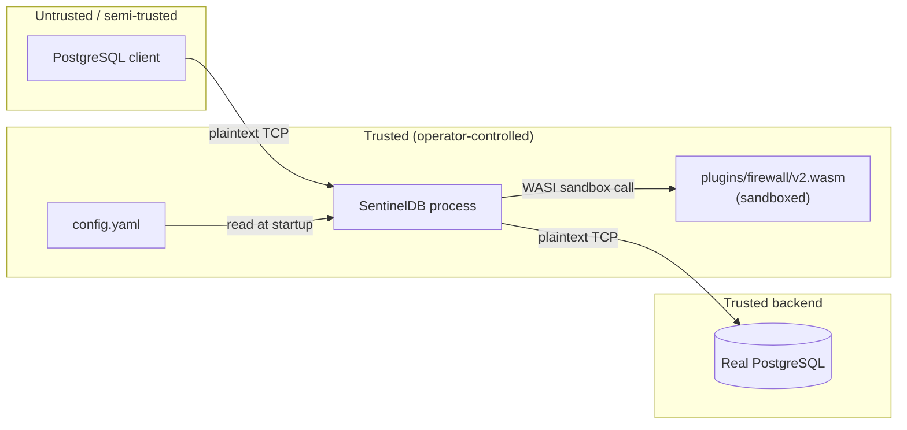

# Threat model

This document describes what SentinelDB V1 protects against, what it
does not, and the assumptions its design relies on. Read this before
deciding whether SentinelDB is appropriate for any use beyond local
experimentation. See also [SECURITY.md](../SECURITY.md) and
[architecture.md](architecture.md#fail-closed-boundaries).

**Bottom line, stated up front:
[SentinelDB V1 is not a production security boundary](#v1-is-not-a-production-security-boundary).**

## Assets

What SentinelDB's design is trying to protect:

- **PII in query results** — specifically, values in columns explicitly
  configured under `masking.columns` (in the shipped config, `email`).
- **Database integrity** — protection against a defined set of
  destructive statement shapes (`DROP TABLE`, `DROP DATABASE`,
  `DELETE FROM`, `TRUNCATE` by default) reaching the real database.
- **Observability of gateway behavior** — accurate metrics/logs of what
  was allowed, blocked, and masked, without those logs themselves
  leaking the sensitive values being protected.

What it does **not** try to protect, even in principle, in V1:

- Confidentiality of traffic on the wire (no encryption — see
  [plaintext development limitation](#plaintext-development-limitation)).
- Data not explicitly listed in `masking.columns`.
- Availability under adversarial load (no rate limiting, no connection
  quotas — see [denial-of-service risks](#denial-of-service-risks)).
- Any statement shape not covered by the configured blocked-phrase list.

## Trust boundaries

- The **client** is the primary untrusted party: SentinelDB's firewall
  and masking logic exist specifically because a client should not be
  fully trusted with direct, unfiltered database access.
- The **SentinelDB process itself, its config file, and the operator
  who deploys it** are trusted. There is no separate authentication or
  authorization layer between "can reach the gateway's listen port" and
  "can send it PostgreSQL protocol messages" — network-level access
  control is entirely the operator's responsibility (in the demo stack,
  this is `127.0.0.1`-only port binding).
- The **Wasm plugin** runs inside a wazero/WASI sandbox with a bounded
  execution timeout and bounded stdout/stderr — see
  [plugin isolation](#plugin-isolation) — but it is still a component
  the operator chose to load (`wasm.plugin_path`), not an
  externally-supplied, adversarial input in the demo/default
  configuration.
- The **real PostgreSQL backend** is trusted; SentinelDB does not
  protect against a compromised or malicious backend.

## Attacker assumptions

SentinelDB V1's design assumes an attacker who:

- Can connect to the gateway's listen port as a PostgreSQL client
  (i.e., has network reachability and valid-looking startup parameters)
  but does not otherwise control the gateway process, its host, or its
  configuration file.
- May attempt to craft SQL text intended to evade the blocked-phrase
  matcher (see [known bypass limitations](#known-bypass-limitations)).
- May attempt to exhaust resources (connections, plugin calls) — see
  [denial-of-service risks](#denial-of-service-risks).
- Does **not** have the ability to modify `config.yaml`, replace
  `plugins/firewall/v2.wasm`, or otherwise tamper with the gateway's own
  deployment; that level of access is equivalent to having already
  compromised the trusted side of the boundary, which is out of scope.
- Does **not** have a network position that lets them intercept
  plaintext traffic between components without already being "on path"
  in a way the operator's network topology is responsible for (see
  [plaintext development limitation](#plaintext-development-limitation)).

## Protected paths

- A `Query` message whose SQL text (after case/whitespace normalization)
  contains a configured blocked phrase is **blocked before reaching
  PostgreSQL** (`firewall.Gate` + `wasm.Policy`) — the phrase never
  reaches the real database.
- A result column whose name exactly matches (case-insensitive) a
  configured masking column has its **text-format** value rewritten
  in-flight before the row reaches the client
  (`masking.Transformer` + `wasm.Masker`).
- Any parse failure, plugin failure, or explicitly out-of-scope protocol
  path (Extended Query, COPY, binary-format masked column) **closes the
  connection** rather than forwarding data that wasn't successfully
  evaluated/masked — see
  [architecture.md's fail-closed boundaries](architecture.md#fail-closed-boundaries).
- Query text and cell values are excluded from logs and error messages
  by default (see [sensitive logging policy](#sensitive-logging-policy)).

## Unprotected paths

- **Any column not listed in `masking.columns`.** There is no automatic
  PII discovery; an operator who forgets to list a sensitive column gets
  no protection for it, and no warning.
- **Any statement shape not matching a configured blocked phrase.**
  There is no allowlisting, no privilege-aware analysis, no
  understanding of what a statement actually does beyond substring
  matching.
- **Extended Query Protocol.** Rejected outright rather than evaluated —
  a client using it gets a hard error, not a silent bypass, but it also
  means SentinelDB provides zero protection for any workload that
  requires prepared statements.
- **Authentication and authorization.** SentinelDB does not authenticate
  clients or enforce PostgreSQL role/permission semantics; it relies
  entirely on the real PostgreSQL server's own auth (forwarded
  plaintext, per the SSL/GSS rejection) for that.
- **Data returned via mechanisms other than `DataRow`** — e.g. error
  message text, `NOTICE` payloads, function/procedure side effects.

## Plaintext development limitation

SentinelDB rejects `SSLRequest`/`GSSENCRequest` unconditionally (see
[postgresql-protocol.md](postgresql-protocol.md#sslrequest--gssencrequest-rejection)),
so **all traffic between the client and SentinelDB, and between
SentinelDB and the real PostgreSQL server, is plaintext** — including
authentication (`PasswordMessage`) and any PII in results, whether
masked or not. This is intentional in V1 (the gateway needs to see
plaintext to do its job, and TLS termination is out of scope for this
version — see the [README roadmap](../README.md#roadmap)), but it means
SentinelDB provides **no confidentiality on the wire whatsoever**. Any
network position capable of observing that traffic (a shared host, a
compromised network segment, a misconfigured cloud security group) sees
everything, including values that were successfully masked toward the
client but still crossed the SentinelDB↔PostgreSQL leg in the clear as
their original, unmasked values.

**Do not run SentinelDB across any network segment you don't fully
trust.** The Docker Compose demo mitigates this by binding every
published host port to `127.0.0.1` only (see
[docs/operations.md](operations.md)), but that is a deployment-level
mitigation, not something the gateway itself enforces.

## Plugin isolation

The firewall/masking Wasm plugin runs under wazero's WASI Preview 1
sandbox with several bounds enforced by the host (see
[plugin-api.md](plugin-api.md#timeout--output-limits-summary)):
a 2-second wall-clock timeout per call, an 8 KiB stdout cap and 4 KiB
stderr cap enforced while the module writes (not truncated after the
fact), and strict schema validation of its JSON response (unknown
fields and trailing data both rejected). A plugin that hangs, loops, or
produces oversized/malformed output causes that call to fail — which the
host then treats as a fail-closed condition (block the query / close the
connection), not a crash of the gateway process itself.

This isolation protects against a **buggy or resource-exhausting**
plugin. It is not a hardened multi-tenant sandbox evaluated against a
**maliciously crafted** `.wasm` binary — in the current design, the
plugin path is operator-configured (`wasm.plugin_path`) and the plugin
is trusted to the same degree as the rest of the deployment's
configuration, not treated as adversarial input from an untrusted third
party.

## Sensitive logging policy

By default (`config.yaml`'s `logging.log_full_queries: false`):

- `DataRow` message contents (cell values) are **never** logged, under
  any configuration — see `logMessage` in `cmd/gateway/main.go`, which
  explicitly skips `DataRow`/`CopyData`.
- Full SQL query text is not logged; only the verdict, message type,
  evaluation duration, and connection ID are (`logGateDecision`).
- Masking failures log the column name and error, **never** the
  original or masked cell value (`OnMaskAttempt` hook in
  `cmd/gateway/main.go`).
- Wasm runtime errors never include the plugin's raw stdout/stderr, the
  request query, or cell values — only operation name, byte counts, and
  timeout/cancellation state (`internal/wasm/runtime.go`).

Setting `logging.log_full_queries: true` logs full SQL query text (which
may contain PII, e.g. `WHERE email = '...'`) and is intended for local
development/debugging only — it should not be enabled anywhere logs are
retained, shipped off-host, or accessible to anyone who shouldn't see
the underlying data.

## Denial-of-service risks

- **No connection-rate limiting or per-client quotas.** Any client that
  can reach the listen port can open TCP connections up to whatever the
  host OS allows; each spawns a new goroutine pair
  (`gate.Run`/`transformer.Run`) and, per query, a fresh Wasm module
  instance.
- **Per-call Wasm timeout (2s) bounds a single hung plugin call**, but
  does not bound the aggregate cost of many concurrent legitimate-looking
  calls.
- **No query complexity or rate limiting** beyond the blocked-phrase
  check itself — an allowed but expensive query is forwarded to
  PostgreSQL exactly as a direct connection would send it; SentinelDB
  adds no protection against resource-exhausting queries.
- **1 MiB per-message size cap** (`maxMessageLength` in
  `internal/protocol`) and **64 KiB masked-value cap**
  (`maxMaskedValueSize` in `internal/wasm`) bound single-message/value
  memory use, but do not bound total connection or request volume.

None of this is a hardened answer to DoS; treat SentinelDB as being at
least as exposed to volumetric abuse as a direct PostgreSQL connection
would be, plus the additional (bounded, but nonzero) per-query Wasm
call overhead.

## Known bypass limitations

- **Blocked-phrase matching is plain substring matching, not SQL
  parsing** (`internal/sqlmatch.MatchAny`, shared by both the native
  fallback and the Wasm plugin). It normalizes case and collapses
  whitespace, but has no understanding of SQL syntax, comments, string
  literals, or identifiers. This means:
  - False positives: a blocked phrase appearing inside a string literal
    or comment is still blocked, even though it isn't actually being
    executed as that statement.
  - False negatives (bypasses): SQL comments, alternate whitespace,
    encoding tricks, or splitting a keyword across quoted identifiers
    (e.g. `DR"" OP TABLE`-style tricks, or relying on `Normalize`'s
    simple whitespace collapsing) can defeat the matcher. A determined
    client with SQL knowledge should be assumed capable of constructing
    a blocked statement that the matcher does not catch.
- **Masking matches exact column names only**, case-insensitively, with
  no schema discovery, no type inference, and no value-shape detection
  beyond the plugin's own `looksLikeEmail` check. A column not named
  exactly as configured (e.g. `user_email` when only `email` is
  configured, or `Email` vs. `email` in a case the matcher *does* catch
  since it's case-insensitive) will not be masked unless explicitly
  added to `masking.columns`. Renaming a column, aliasing it in a query
  (`SELECT email AS e FROM ...`), or computing it from an expression
  changes the `RowDescription` name and can defeat the match.
- **No protection for anything returned outside `DataRow`.** Values
  embedded in `ErrorResponse`/`NoticeResponse` text, or side effects of
  functions/procedures, are not inspected.

## V1 is not a production security boundary

To restate plainly: SentinelDB V1 has not had a third-party security
audit, has not been load-tested, has no high-availability story, ships
as a plaintext tool by design, enforces its firewall via text matching
rather than real SQL parsing, and masks only explicitly configured
columns by exact name. **Do not deploy it in front of a production
database, and do not treat it as your only or primary control against
data exfiltration or destructive queries.** It is a working prototype
for demonstrating the approach (Wasm-sandboxed policy/masking logic in
a wire-protocol proxy), not a hardened compliance control — see
[SECURITY.md](../SECURITY.md).
